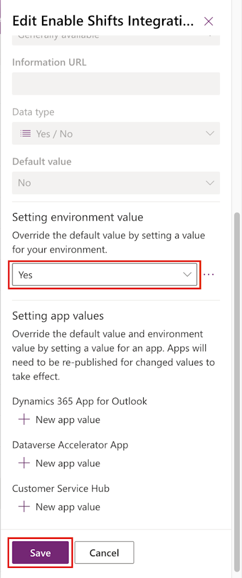

Complete the following steps to enable Shifts integration with Store Operations Assist.

1. Open [Power Apps](https://make.powerapps.com/?azure-portal=true) in a web browser and then sign in by using the admin tenant.

1. From the command bar, select the environment. Make sure that you select the **MCRIAD** environment.

   > [!div class="mx-imgBorder"]
   > 

1. Select **Solutions** in the left navigation pane. In the search area, search for **Default** and then select **Default Solution**.

   > [!div class="mx-imgBorder"]
   > 

1. Under **Objects** in the left pane, open **Settings > Settings definitions**, and then on the right side of the page, search for **Enable Shifts Integration**.

   > [!div class="mx-imgBorder"]
   > 

1. Open **Enable Shifts Integration**, and then scroll down and select **Add existing value**.

   > [!div class="mx-imgBorder"]
   > 

1. Under the **Setting environment value** section, from the **Override the default value** dropdown menu, select **Yes**. Select **Save**.

   > [!div class="mx-imgBorder"]
   > 
