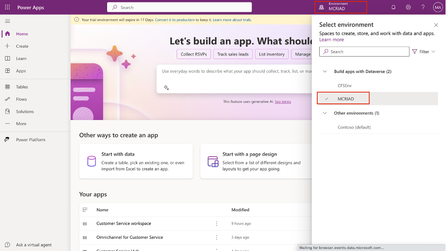

Complete the following steps to turn on the integration flows:

1. Open [Power Apps](https://make.powerapps.com/?azure-portal=true) in a web browser and then sign in by using the admin tenant.

1. From the command bar, select the environment. Make sure that you select the **MCRIAD** environment.

   > [!div class="mx-imgBorder"]
   > 

1. Select **Flows** in the left navigation pane. Search for and select **Fetch Shifts via Connector** under **Cloud flows**. 

   > [!div class="mx-imgBorder"]
   > 

1. Select **Turn on** from the upper ribbon to turn on the flow.

   > [!div class="mx-imgBorder"]
   > 

1. Repeat the steps for the **Invoke Shifts Integration flow**. Select **Flows** in the left navigation pane. Search for and select **Invoke Shifts Integration flow** under **Cloud flows**.

   > [!div class="mx-imgBorder"]
   > 

1. Select **Turn on** from the upper ribbon to turn on the flow.

   > [!div class="mx-imgBorder"]
   > 

1. Select **Run** from the upper ribbon to run the flow.

   > [!div class="mx-imgBorder"]
   > 

1. Select **Run flow** from the pane.

   > [!div class="mx-imgBorder"]
   > 

1. Select Apps from the left navigation and then select the play button near the **Store Operations Assist** admin app.

   > [!div class="mx-imgBorder"]
   > 

1. Select **App setup** from the lower-left menu option.

   > [!div class="mx-imgBorder"]
   > 

1. Under the **Shifts** area on the left pane, select **Shift times**.

   > [!div class="mx-imgBorder"]
   > 

After the flow runs, it starts fetching the shifts information and saving them in Store Operations Assist. The information is based on the mapping that you created by using the Excel template as part of the setup steps that you previously completed.

After the flow runs successfully, the shift timings of the departments display under the **Shift times** menu option in Store Operations Assist.

