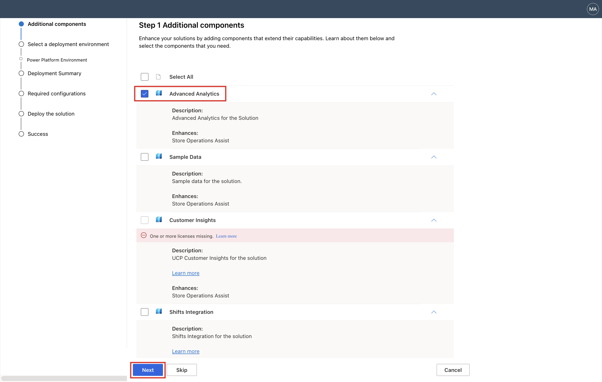
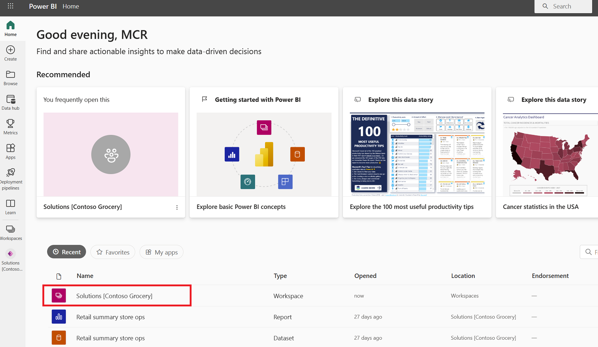
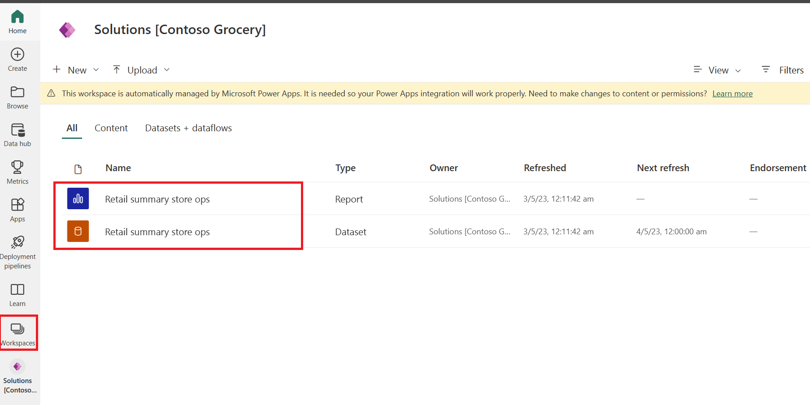

The Retail Insights dashboard, which is built on Power BI, is an optional deployment component that forms part of the advanced analytics capability for Store Operations Assist. 

In this exercise, you assume the role of Oscar, the IT administrator for Contoso Retail, and verify the deployment of the Retail Insights dashboard.

## Prerequisites

- To enable Retail Insights dashboard capability, select the **Advanced Analytics** component during or after the deployment of Store Operations Assist from the Microsoft Cloud Solution Center.

  > [!div class="mx-imgBorder"]
  > 

  > [!IMPORTANT]
  > You deployed the Retail Insights dashboard as part of the Advanced Analytics capability when you deployed Store Operations Assist in the **Set up training environment** module. 

- You need to have a Power BI Pro or Premium license to access the analytics dashboard. 

## Task: Verify the deployment of the Retail Insights dashboard

To verify the Retail Insights dashboard deployment, follow these steps:

1. Go to [Power BI](https://msit.powerbi.com/home?experience=power-bi&azure-portal=true) in an InPrivate or Incognito session by using the administrator account that you're using for this exercise.

1. Select **Workspaces** on the left navigation pane and then select **Solutions[env name]**, the managed workspace that you created during the deployment.

   > [!div class="mx-imgBorder"]
   > 

   The data set and the Power BI report that deployed as part of the Advanced Analytics deployment are available in the selected managed workspace.

   > [!div class="mx-imgBorder"]
   > 
