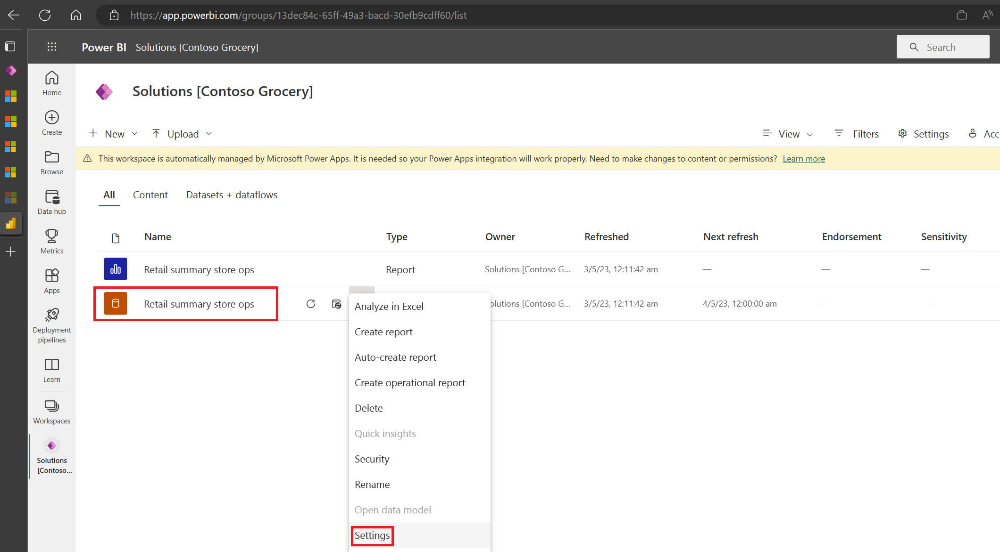
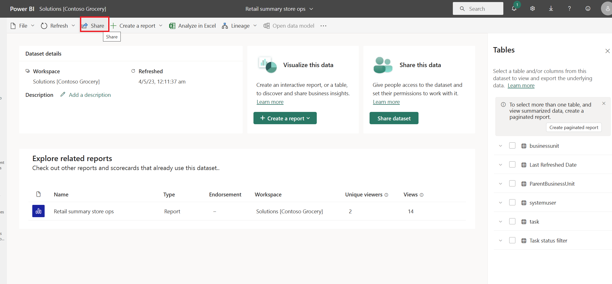

After deploying the Power BI package, you continue to play the role of Oscar, the IT administrator for Contoso Retail, and set up the dashboard. 

## Task: Set up the data source path

To enable the data to be ingested into the Retail Insights dashboard and be made available to the Store Operations Assist, perform the following steps:

1. Go to [Power BI](https://powerbi.microsoft.com/?azure-portal=true) in an InPrivate or Incognito browser session by using the credentials for this exercise.

1. Select the ellipsis (**...**) next to the data set and then go to **Settings**.

   > [!div class="mx-imgBorder"]
   > 

1. Go to **Data source credentials** and then select **Edit Credentials**.

1. Check for the correct **extensionDataSourcePath**, which should be set to `https://contosoretailgrocery.crm.dynamics.com/`, for example. Select **Sign in** with the same Power BI licensed user credentials.

1. Select the managed workspace, and then after successful sign-in, select the **Refresh** button to refresh the data set.

## Task: Schedule the refresh frequency for the Retail Insights dashboard

To set up a scheduled refresh to ensure that the data is refreshed regularly across all reports in the Retail Insights dashboard, perform the following steps:

1. Select the ellipsis (**...**) menu next to the data set and then select **Settings**.

1. Expand **Refresh** and then turn **On** the configuration flag. Set the Refresh frequency and then select the appropriate time zone and time.

   > [!NOTE]
   > With a Power BI Premium license, you can refresh the data set eight times; hence, you can set up eight time slots.

1. Add the required users' email addresses to get refresh failure notifications and then select **Apply** to finish the setup.

## Task: Set up security roles for reports

To ensure that users can access the reports and view data based on their roles, perform the following steps:

1. Select the ellipsis (**...**) menu next to the data set and then select **Security**.

1. Add all required users to the Manager role according to the access granted in Dataverse and then select **Save**.

   > [!NOTE]
   > Add the manager user account that you're using for this exercise.

## Task: Set up report access

To set up the report access for users to access the Retail Insights dashboard, perform the following steps:

1. Select **Share** next to the data set.

   > [!div class="mx-imgBorder"]
   > 

1. Add all individual users and then select **Send**.

   > [!NOTE]
   > Add the user account of the store manager/district manager to view the Retail Insights report.
