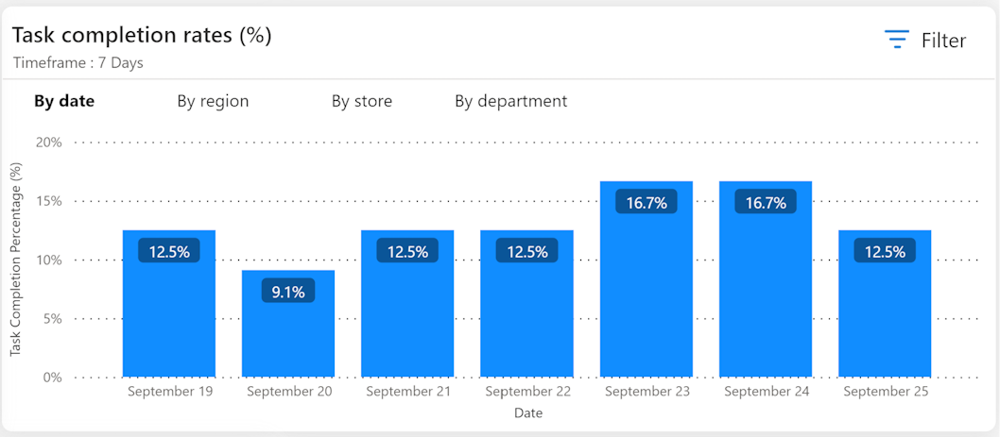

In this exercise, you play the role of Monica, the store manager. You review the dashboard that brings data across tasks and get a view of the stores or departments that are doing well. You can also plan for stores or departments that require extra focus. 

To access the advanced Power BI reports, on the left navigation pane, select **Advanced Analytics > Retail Insights**. The Retail Insights dashboard displays some key sections for your review.

   > [!NOTE]
   > The results displayed in these charts are representational and may not match your results in this exercise.

## Store operations tab

The Store operations tab provides a view of all task executions across your organization. You can view tasks specific to status and priority for your respective business units. The Store operations tab has five key sections:

### Today's highlights

   > [!div class="mx-imgBorder"]
   > 

This section provides the status of tasks such as: 

- Tasks that are open as of today
- Tasks that are due today (where the completion date is today) 
- Tasks that are completed today 
- Tasks pending review (on the user) 

Each of the tile is clickable and takes you to the specific view, for example, the tile for 'Due today' takes you to the Open Tasks page with the list of tasks where due date is today.

### Task status

  > [!div class="mx-imgBorder"]
  > 

The upper half of the task status report displays the status of tasks as of today/this week/this month, compared with the same period in the past. You can select the period through filter options. If you select 'Today', the report compares with yesterday’s data, and if you select 'This week', it compares with last week’s data.

The lower half of the task status report shows the number of tasks categorized as 'Open,' 'Completed', and 'Canceled'. Each of these categories is further divided to analyze whether the action was completed before or after the due date.

### Outlier detection

  > [!div class="mx-imgBorder"]
  > 

This report is based on the Anomaly detection feature of Power BI. The Outlier detection report provides insights into the task count across different departments over a specific time period, while also identifying any anomalies in the data. The report enables intuitive actions and further analysis based on the highlighted anomalies. The task count and respective anomaly detection can be performed 'By started' date, 'By Completed' date, or 'By time taken' for task completion. The Outlier Detection report helps identify any unusual patterns, deviations, or outliers in the task count data by applying different perspectives.

### Task type

> [!div class="mx-imgBorder"]
> 

The task type report contains a breakup of the task based on the type that is, Planned, ad-hoc or related tasks. You can filter to select Store, Department, Status (of task), Priority (of task), 'From' and, 'To' date range (considering scheduled start dates). 

### Task completion rate % by date/region/store/department 

The task completion rate report provides a comparative view of task completions across your organization. This report shows completion percentage of tasks that is, percentage of number of tasks completed (based on actual end date / number of tasks due). 

> [!div class="mx-imgBorder"]
> 

### Task count drilldown

The Task count drilldown report provides a visual representation of data related to the total count of tasks, allowing you to analyze and explore it across various variables such as Priority, Type, Owner, Owning Business Unit, and Status. 

Depending on your selection, the report automatically consolidates the data and allows you to drill down further into any of the variables in any desired order. Using the various variables, you can intuitively use any value to drill down for further data.

> [!div class="mx-imgBorder"]
> 

This report is useful for conducting further exploration and performing root cause analysis of task count, time taken and so on.

### Q&A 

The Q&A report lets you explore data using natural language queries. You can type your question in everyday language in the designated Q&A question box. The report intelligently understands the words you use and determines where and which dataset to search for the answer. Q&A also assists you in crafting your question by offering autocompletion, restatement suggestions, and other textual and visual aids.

For example, if you want to see the break up by task count, type the words 'task count' and Q&A auto recommends the types of grouping that can be done based on the system data.

> [!div class="mx-imgBorder"]
> 

### Task cancellation rate % by date/region/store/department

Cancellation rate report provides a comparative view of task cancellations done manually vs automatically canceled tasks, across your organization. 

Automatic canceled % gives percentage cancellation of tasks done automatically that is, percentage of (number of tasks automatically cancelled/number of tasks completed or canceled).

Manual canceled % gives percentage cancellation of tasks done manually that is, percentage of (number of tasks manually cancelled/number of tasks completed or canceled). 

> [!div class="mx-imgBorder"]
> 

## Survey response summary tab

In Retail Insights, you can view all the responses given for specific tasks in an intuitive Power BI report, 'Survey Response Summary'. The responses are aggregated across a specific task and at the question level.

> [!div class="mx-imgBorder"]
> 

Store managers and district managers are able to view the responses aggregated based on their respective security access. For example, the store manager for Store A can view the response of a particular task across the store associates at their store level. The district manager who manages Store A, Store B, and Store C can see the response aggregated across all the stores or across each store depending on their filter selection.

In order to view the aggregated response, you need to filter this report based on 'Plan' and 'Task setup' to view the response specific to the task. You can directly select the Task Setup or you can select it after filtering plan.

> [!NOTE]
> Only one plan and one task setup against that plan can be selected at a time to ensure a cohesive view across aggregation.

## Measure execution time for planned tasks

Store Operations Assist now empowers you to capture the duration of task execution for planned tasks created using the forms, inventory spot count, and product pricing update templates. You can use the newly integrated dashboard within Retail Insights to monitor both the average and cumulative time required to finalize tasks. Using the available filters, you can conveniently choose specific timeframes, task configurations, and other parameters to access comprehensive reporting on task completion times.

> [!IMPORTANT]
> For more information on how to use the Retail Insights dashboard, see [Retail Insights dashboard documentation](/industry/retail/use-store-operations-assist-retail-insights).