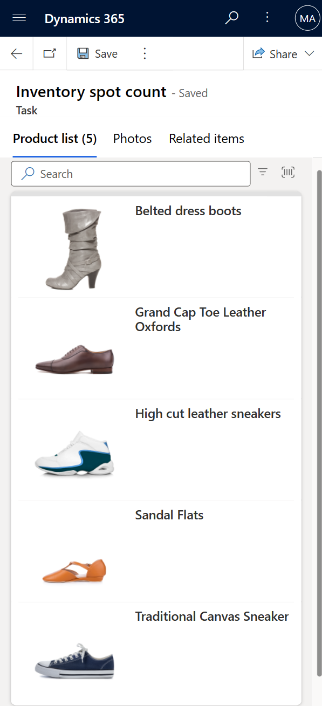
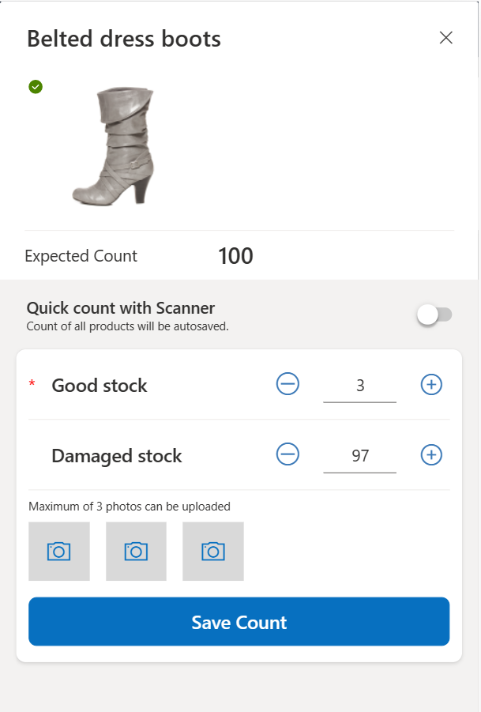
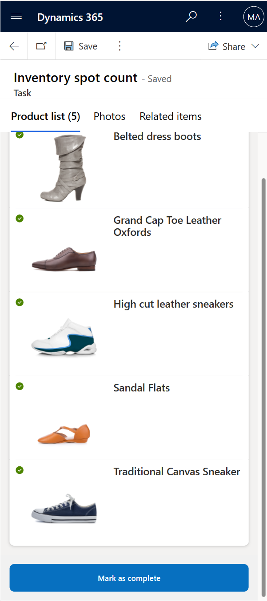

In this exercise, you'll assume the role of Riley and perform a spot count check on footwear products by using the Inventory spot count task. You observe how the data exports to the sample **Replenishment** file and to the **Inventory Spot count** file when the stock is less than five in quantity for an item.

1. Select the **Inventory spot count** task.

1. Select the **Belted dress boots** product from the product list.

   > [!div class="mx-imgBorder"]
   > 

1. The value in the **Expected Count** field is fetched from the file (which is from an ERP system). Provide the following input values, select **Save count**, and then select **X** in the upper-right corner of the product to move on to count the next product.

   - **Good stock** - 3 (Provide a value less than five so that a replenishment order request sends to an external system.)

   - **Damaged stock** - 97

   - Select the camera icon to capture a picture from the device's camera or to upload it from the photo gallery in the device.

   > [!div class="mx-imgBorder"]
   > 

1. Repeat the step for all other footwear products that are listed in the Inventory spot count checklist.

1. Select **Mark as complete** to complete the task.

   > [!div class="mx-imgBorder"]
   > 

1. Go to the browser tab where Teams is already open. If you don't have it open, then go to [Microsoft Teams](https://teams.microsoft.com/?azure-portal=true) on another browser tab.

1. Open the **Files** section and then select **Documents > Outbound** folder within the **Contoso Store 101 Managers** team.

   > [!div class="mx-imgBorder"]
   > 

1. Open the Excel files to check if the submitted task details are added to the respective file.

   - The details that are filled out in the Inventory spot count task are saved in the **ContosoInventorySpotCount** file. 

   - The products where the **Good stock** value has been updated with a number less than five in the Inventory stock count task are saved in the **ContosoProductReplenishment** file. 
