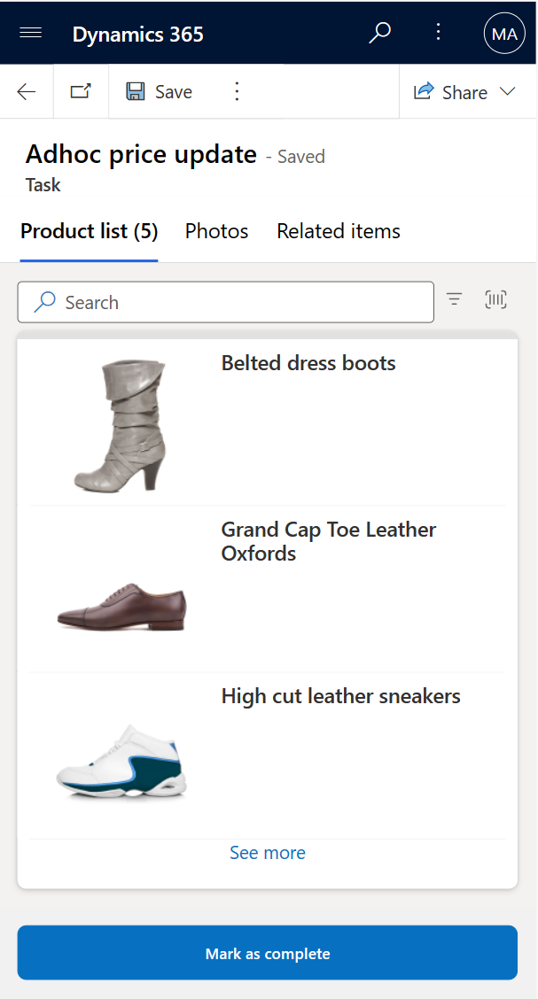
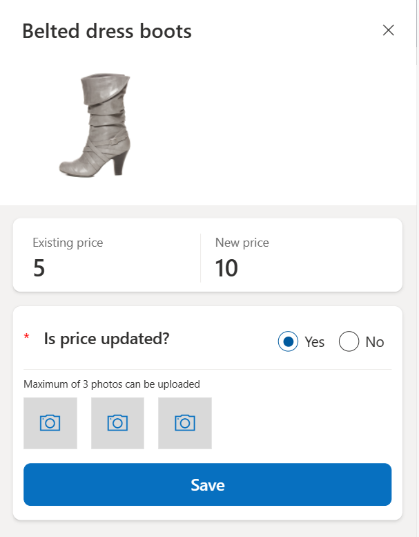
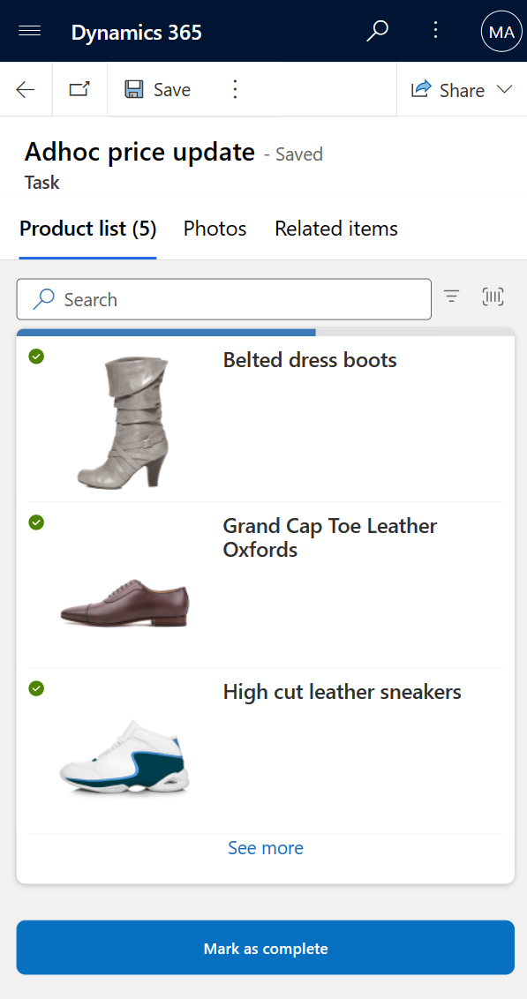
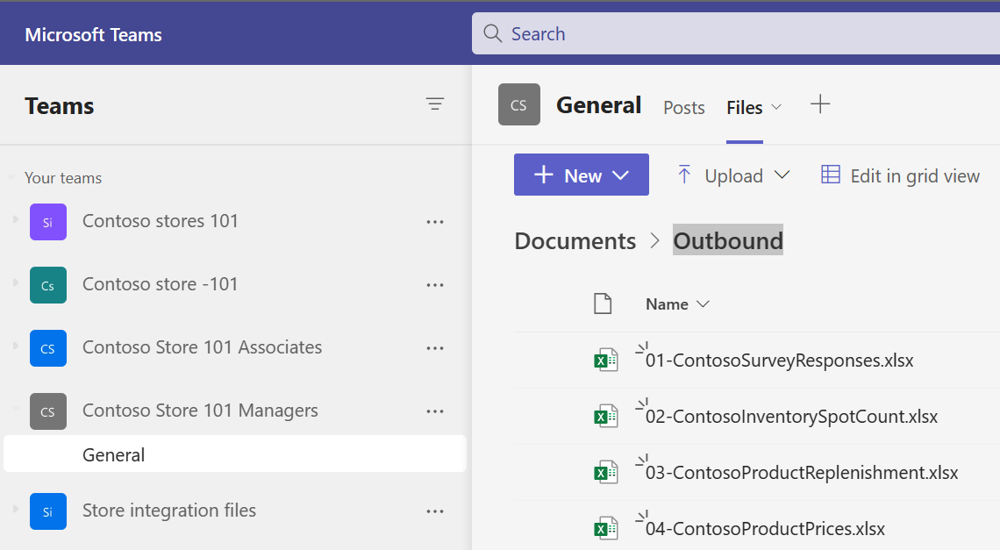

In this exercise, you'll assume the role of Riley and update the new price on the shelf and record the results in the product price update task.

1. Select the **Product price update** task.

1. Select the **Belted dress boots** product from the product list.

   > [!div class="mx-imgBorder"]
   > 

1. The values in the **Existing price** and **New Price** fields are fetched from the file (which is from an ERP system). Select **Yes** to the **Is price updated?** question and then select **Save**. Select the **X** in the upper-right corner of the product to move on to the next product. Select the camera icon to capture a picture from the device's camera or to upload it from the photo gallery in the device.

   > [!div class="mx-imgBorder"]
   > 

1. Repeat the previous step for all other footwear products that are listed in the task.

1. Select **Mark as complete** to complete the task.

   > [!div class="mx-imgBorder"]
   > 

1. Go to the browser tab where Teams is already open. If you don't already have it open, then go to [Microsoft Teams](https://teams.microsoft.com/?azure-portal=true) on another browser tab page.

1. Open the **Files** section, select **Documents > Outbound** folder within the **Contoso Store 101 Managers** team.

   > [!div class="mx-imgBorder"]
   > 

The details that are filled in the **Store Opening Checklist** task are saved in the **ContosoProductPrices** file. You can integrate the data in this file with any other application.
