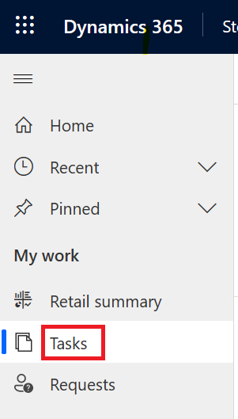
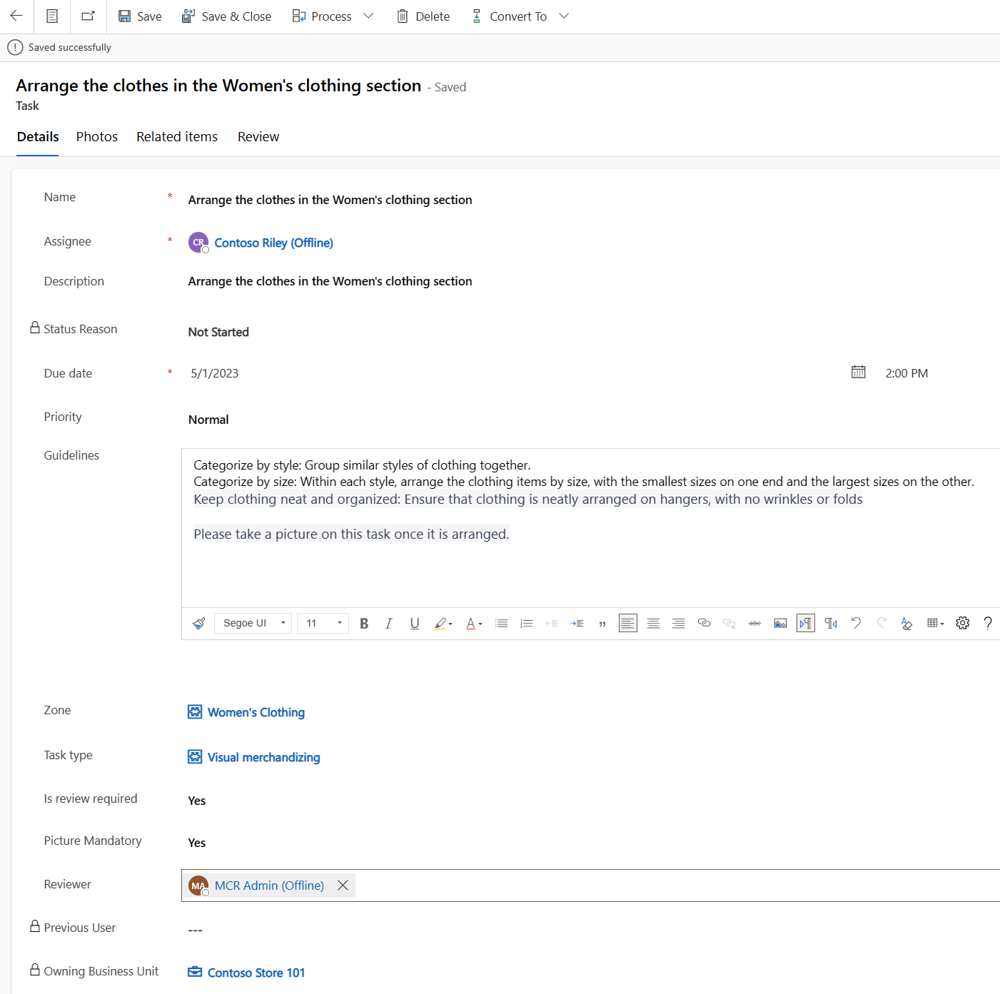
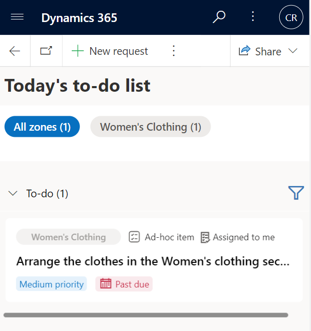
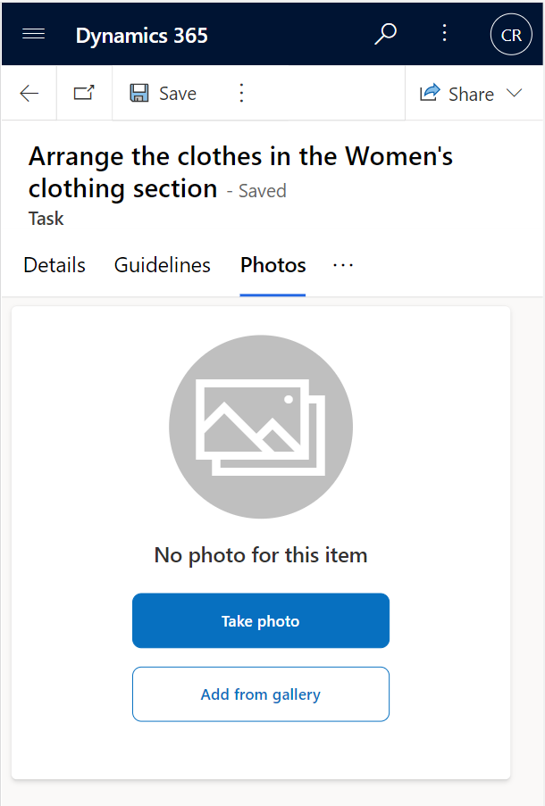
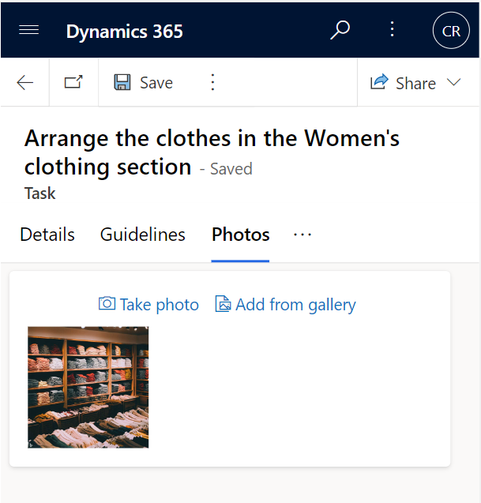
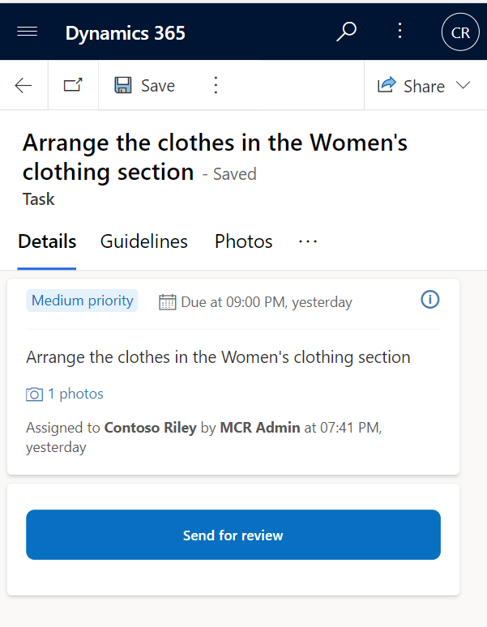
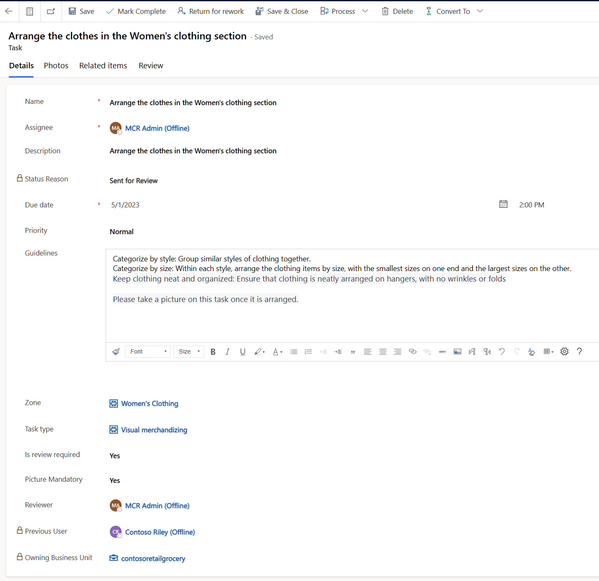

In this exercise, you'll assume the role of Monica, the store manager. You'll create an ad hoc task to arrange the clothes in the Women's section, and assign it to Riley, a store associate. After Riley completes the task, you'll review it and mark it as completed.

1. Go to **Store Operations Assist**.

1. Select **Tasks** on the left pane.

   > [!div class="mx-imgBorder"]
   > 

1. Select **New Task** on the command bar.

1. Provide the following details:

   - **Name** - Arrange the clothes in the Women's clothing section

   - **Assignee** - Your frontline worker user

   - **Description** - Arrange the clothes in the Women's clothing section

   - **Due Date** - Today's date

   - **Time** - 2:00 PM

   - **Priority** - Normal

   - **Guidelines**- Enter the following details in this field:

     - **Categorize by style** - Group similar styles of clothing together.

     - **Categorize by size** - Within each style, arrange the clothing items by size, with the smallest sizes on one end and the largest sizes on the other.

     - **Keep clothing neat and organized** - Ensure that clothing is neatly arranged on hangers, with no wrinkles or folds.

     - Please take a picture of this task after it's arranged.

   - **Zone** - Women's clothing

   - **Task type** - Visual merchandising

   - **Is review required** - Yes

   - **Picture Mandatory** - Yes

   - **Reviewer** - Your store manager user

      > [!div class="mx-imgBorder"]
      > 

1. Select **Save** on the command bar.

1. Open Store Operations Assist Mobile with the store associate user credentials.

1. The assigned task will show in the to-do list. Select the **Ad-hoc item** button.

   > [!div class="mx-imgBorder"]
   > 

1. Select the **Photos** tab and then select **Add from the gallery**. 

   > [!NOTE]
   > If you're in an instructor-led training, upload the image that your instructor has provided.

   > [!div class="mx-imgBorder"]
   > 

1. Upload the photo from your local drive and then select the **Details** tab.

   > [!div class="mx-imgBorder"]
   > 

1. Select **Send for review** to reassign this task to the reviewer.

   > [!div class="mx-imgBorder"]
   > 

1. Go to Store Operations Assist Mobile and open the task that was sent for review.

1. You can view the uploaded photos on the **Photos** tab and then provide reviews in the **Review** tab. Select **Mark Complete** on the command bar to complete the task.

   > [!div class="mx-imgBorder"]
   > 

