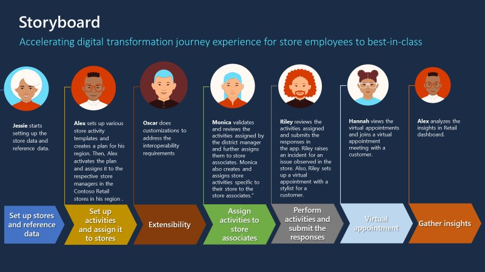

Store associates can use Store Operations Assist Mobile to be more productive in managing their daily tasks. With the mobile app, the store manager/HQ district manager and the store associates can interact seamlessly.

By using Store Operations Assist Mobile, store associates can use a single device that's connected to the line-of-business systems, and they can perform the following tasks: 

- Identify prioritized in-store actions.

- Access task guidelines (hyperlinks, documents, pictures, and so on).  

- Raise requests for urgent actions.

- Assist customers with their shopping experience.

## Personas and scenarios

In this module, you'll assume multiple personas and perform the following exercises:

- Create an ad-hoc task to arrange the clothes in the women's section and then assign it to a store associate. After the store associate completes the task, you review the task and mark it as completed.

- Deploy Microsoft Power Apps mobile app on your mobile or set up the mobile browser emulator. As part of the store associate's daily activities, you:

  - View the to-do list.

  - View and perform the assigned tasks.

  - Create ad-hoc tasks.

  - View customer details and insights to provide product recommendations.

  - Create a virtual appointment for a customer.

  - Complete an ad-hoc task that your manager has assigned and then return it for review.

- Join a virtual Microsoft Teams meeting to provide style recommendations for a customer.

> [!div class="mx-imgBorder"]
> 
