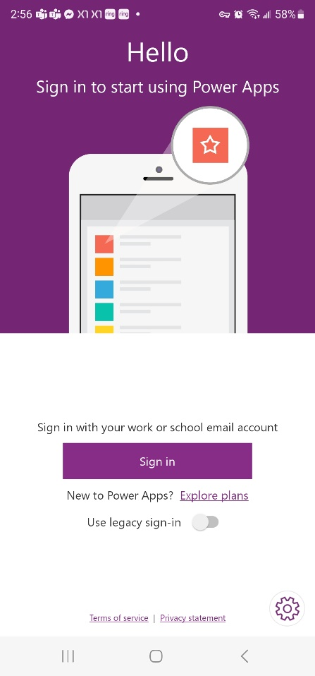
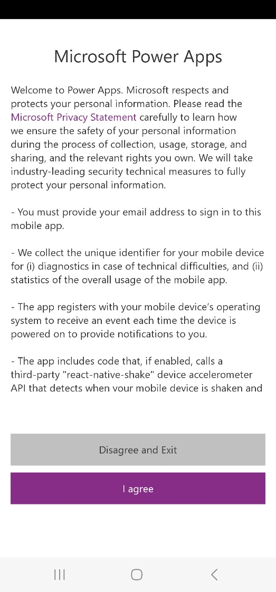
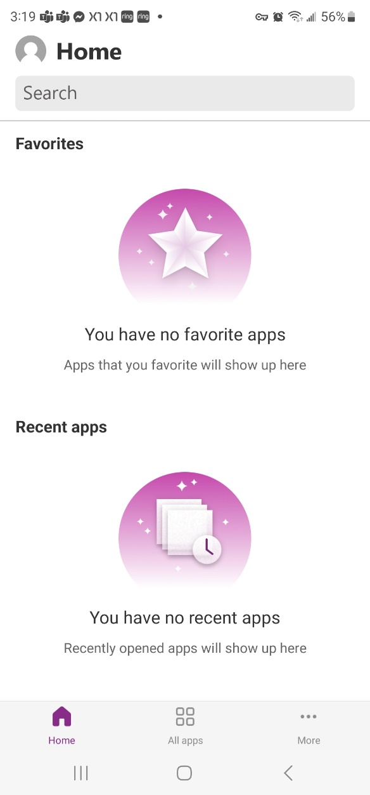
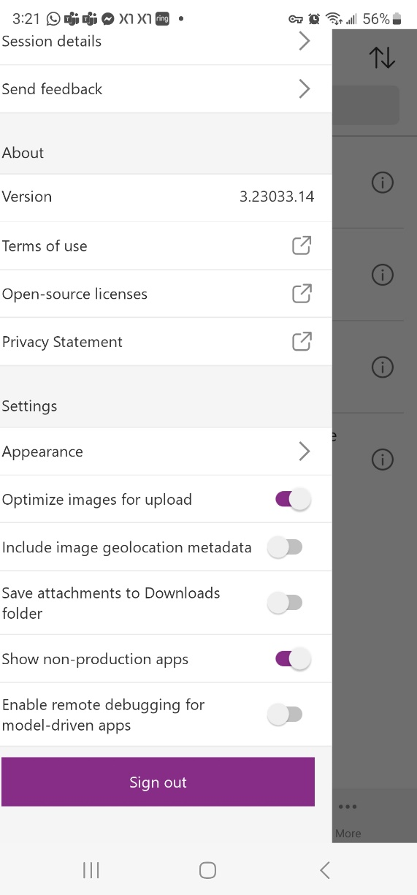
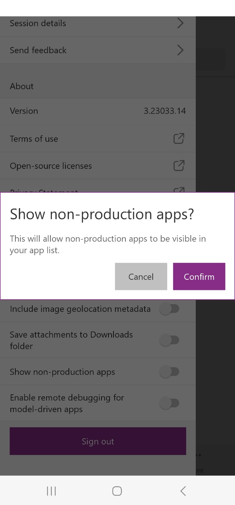
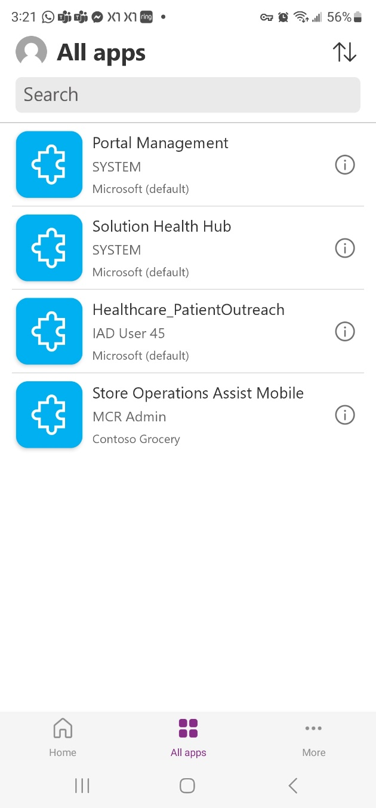

In this exercise, you'll assume the persona of Riley, the store operations associate, and set up the Store Operations Assist mobile app to view and perform various tasks. As part of this exercise, you'll deploy and set up the Store Operations Assist mobile app. You can skip this exercise and proceed with the next exercise if you prefer to use the mobile browser emulator.

1. Install Microsoft Power Apps mobile app from your app store on your iOS or Android mobile device.

1. Open Microsoft **Power Apps** on your mobile device.

1. Select **Sign in**.

   > [!div class="mx-imgBorder"]
   > 

1. Select **I agree** on Microsoft Power Apps agreement form.

   > [!div class="mx-imgBorder"]
   > 

1. Enter the frontline worker's email address and then select **Next**.

1. Enter the **Password** and then select **Sign in**.

1. Select the person icon in the upper corner of your mobile app screen.

   > [!div class="mx-imgBorder"]
   > 

1. Scroll down the menu and turn on the **Show non-production apps** option.

   > [!div class="mx-imgBorder"]
   > 

1. Select **Confirm**.

   > [!div class="mx-imgBorder"]
   > 

1. Select **All apps**.

   > [!div class="mx-imgBorder"]
   > 

1. Select the **Store Operations Assist Mobile**.
