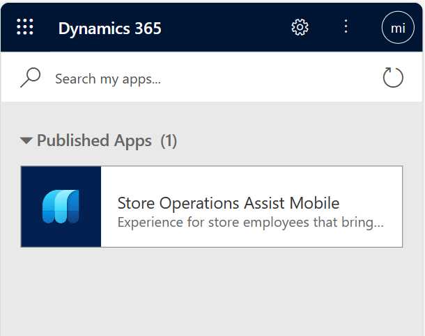
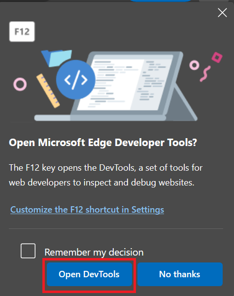
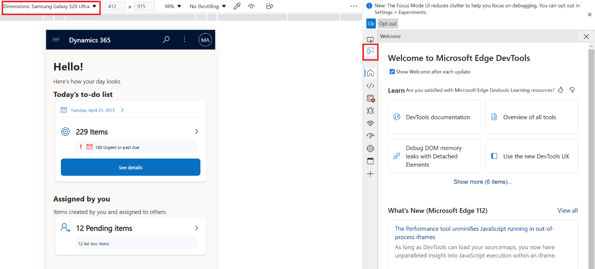
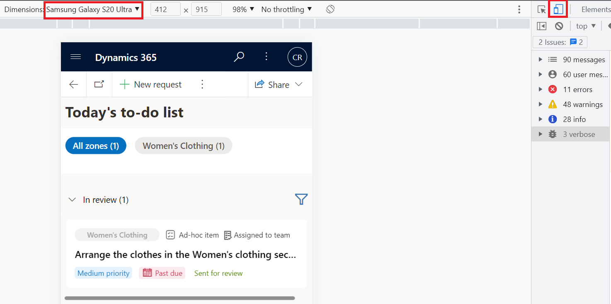

In this exercise, you'll assume the role of Riley and set up the mobile browser emulator to experience Store Operations Assist Mobile as an app on a browser.

> [!NOTE]
> You can skip this exercise if you've already set up the app, as mentioned in the previous exercise.

1. Go to your Microsoft Power Platform environment (such as `https://your environment name.crm.dynamics.com/`).

1. Sign in with your frontline worker user credentials.

   > [!NOTE]
   > If you're in an instructor-led training, then use the credentials that are supplied in the training for your user.)

1. Select the **Store Operations Assist Mobile** app.

   > [!div class="mx-imgBorder"]
   > 

1. Press the **F12** key on your keyboard.

1. In the Microsoft Edge browser, if it's the first time that you're opening DevTools, a pop-up window appears in the upper-right edge of your browser. Skip this step if you're using a Chrome browser. Select the **Open DevTools** button.

   > [!div class="mx-imgBorder"]
   > 

1. In the Microsoft Edge browser, select the **Toggle device** icon and then select a mobile device in the **Dimensions** (such as Samsung Galaxy S20 Ultra). Skip this step if you're using a Chrome browser.

   > [!div class="mx-imgBorder"]
   > 

1. If you're using a Chrome browser, press the **F12** key on your keyboard, select the **Toggle device toolbar** icon, and then select a mobile device in the **Dimensions** (such as Samsung Galaxy S20 Ultra).

   > [!div class="mx-imgBorder"]
   > 
