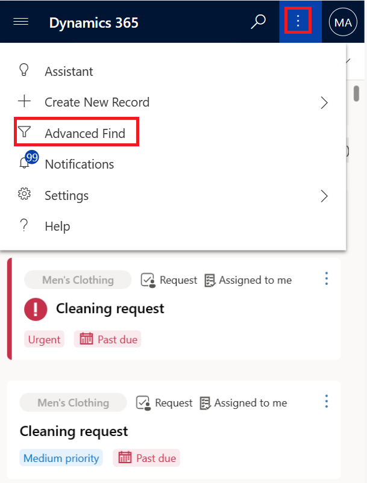
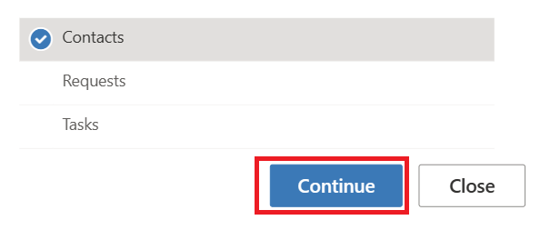
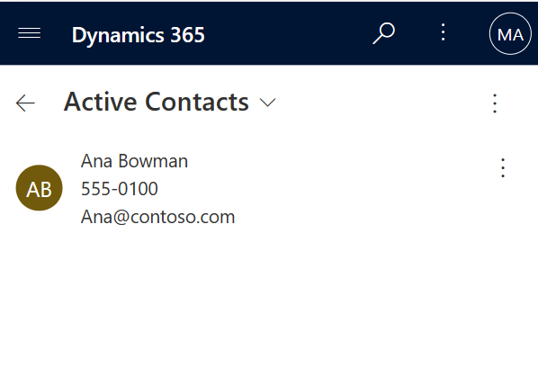
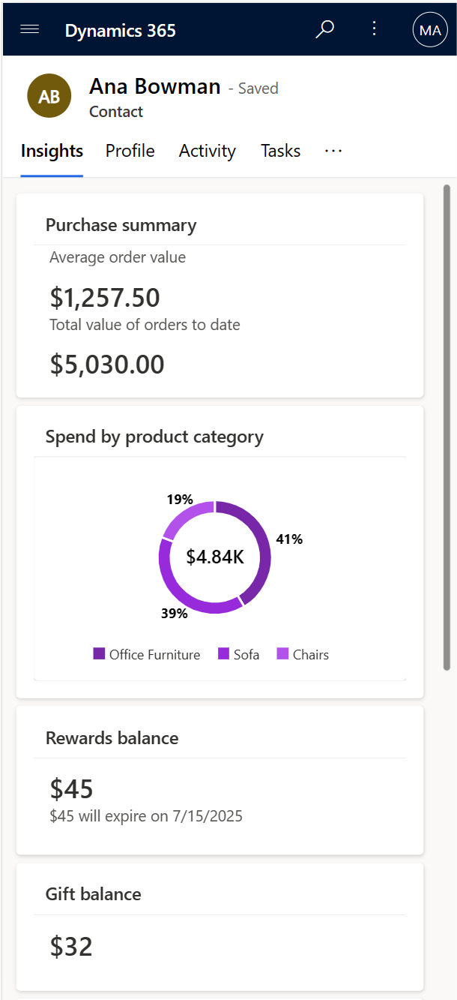
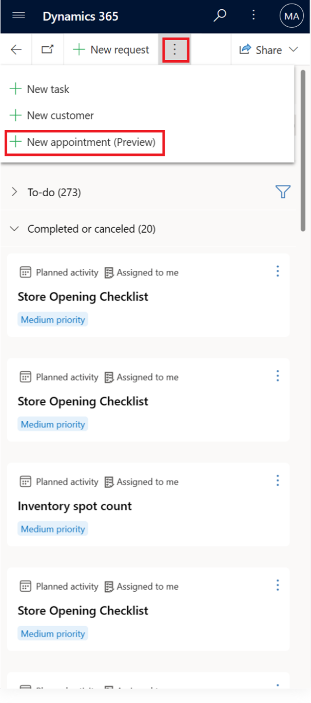
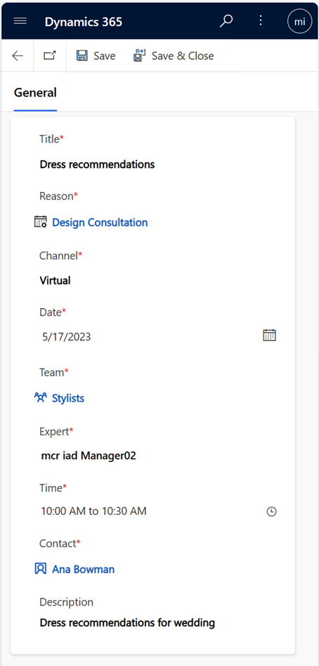
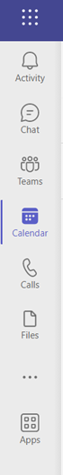

You can view a customer baseball card profile and details by searching the customer name, email address, or contact number in Store Operations Assist Mobile. Then, you can create a virtual appointment or an in-store appointment by using Store Operations Assist Mobile, provided that the store manager has previously defined the appointment types. In this exercise, you view a customer baseball card and then create a virtual appointment for that customer. 

## Task: View a customer baseball card profile

In this task, you assume the role of Riley and view the profile details for a customer named Ana.

1. Select the vertical ellipsis on the upper command bar and then select **Advanced Find**.

      > [!div class="mx-imgBorder"]
      > 

1. Select **Contacts** and then select the **Continue** button.

   > [!div class="mx-imgBorder"]
   > 

1. Select **Ana**.

   > [!div class="mx-imgBorder"]
   > 

1. You can view various insights and profile details of the customer. These insights help you provide product recommendations to your loyal customers.

   > [!div class="mx-imgBorder"]
   > 

## Task: Create a virtual appointment

In this task, you assume the role of Riley. You create a virtual appointment for your customer Ana to have a personalized dress consultation with a stylist.

1.	On the upper command bar, select the vertical ellipsis and then select **New appointment (Preview)**.

      > [!div class="mx-imgBorder"]
      > 

2. Provide the following values:
   - **Title** - Dress recommendations
   - **Reason** - Design Consultation
   - **Channel** - Virtual
   - **Date** - Provide a date
   - **Team** - Contoso Stores
   - **Expert** - Select the user from the lookup
   - **Time** - Any open time
   - **Customer** - Ana Bowman
   - **Description** - Dress recommendations for wedding

    > [!div class="mx-imgBorder"]
    > 

3. Select **Save**.

4.	Open a new tab page in your browser, go to [Microsoft Teams](https://teams.microsoft.com), and sign in with the manager’s credentials (Virtual Stylist).

5.	Select the **Calendar** icon on the left navigation pane.

    > [!div class="mx-imgBorder"]
    > 

6. Go to the appointment date and review the appointment with Ana Bowman. The user can join the virtual appointment during the scheduled time.
