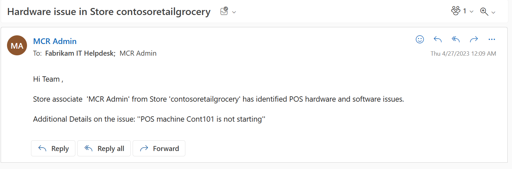

In this exercise, you assume the persona of Riley, where you view the to-do list and complete the store opening checklist task that's assigned to you. During this process, you also create a related service request to seek approval from the manager to rearrange the Men’s Clothing section in accordance with the new store layout. 

1. Select **See details** to view the list of assigned tasks.

   > [!div class="mx-imgBorder"]
   > 

1. Select the **Store Opening Checklist** task.

1. Provide the following values:

   - **Are the POS hardware and software working properly** - Select **No**, which causes the conditional branching questions to populate on the screen.

   - **Issue description** - Provide any description, such as **POS machine Cont101 isn't starting**.

   - **Select any additional user to whom this issue needs to be reported** - Select the frontline worker username from the list.

   - **Cash present in the cash register** - Provide any numeric value, such as **95.32**.

   - **Date displayed on the calendar** - Select today's date from the calendar.

   - **Which of the following areas requires additional cleaning** - Select multiple answers, such as **Men's Clothing** and **Women's Clothing**.

   - **Rate the cleanliness in the store** - Select two stars. Based on the condition provided in template, when less than two stars are provided, an automated task to clean the floor is displayed. The user can change the description of the task, user assignment, and due date and time on that task. 
   - **Is the store layout compliant as per the image displayed** - Select **Yes** and then select the camera icon on this question to practice using the picture-taking capability of the app.

   > [!div class="mx-imgBorder"]
   > 

1. To create an approval request for rearranging the store and to link it to this task, select the vertical ellipsis next to **Save** and then select **Create related request**.

   > [!div class="mx-imgBorder"]
   > 

1. Provide the values as follows and then select **Save & Close**.

   - **Name** - Approval required to re-arrange the Men’s clothing section as per the new layout

   - **Description** - Approval required to re-arrange the Men’s clothing section as per the new layout

   - **Due Date** - Today's date

   - **Priority** - Medium

   - **Assignee** - Monica Rodriguez

   - **Zone** - Men's Clothing

   > [!div class="mx-imgBorder"]
   > 

1. At the end of the **Store Opening Checklist** survey, select **Mark as complete**.

   > [!div class="mx-imgBorder"]
   > 

1. Open a new tab page in your browser and then go to [Microsoft Office Outlook Mail](https://outlook.office.com/?azure-portal=true). Notice that an email about the POS hardware issue has been sent to the IT help desk team and to your own username.

   > [!div class="mx-imgBorder"]
   > 

1. Go to the browser tab where Teams is already open. If you don't have Teams open, then go to [Microsoft Teams](https://teams.microsoft.com/?azure-portal=true) on another browser tab.

1. Open the **Files** section by selecting **Documents > Outbound** folder within the **Contoso Store 101 Managers** team.

   > [!div class="mx-imgBorder"]
   > 

The details that have been filled in the **Store Opening Checklist** task are saved in the **ContosoSurveyResponses** Microsoft Excel file. You can integrate the data in this file with any other application.
