In this exercise, you assume the persona of Alex, create a plan, and assign tasks to each template that you created.

## Task: Create a plan

To create a plan, follow these steps:

1. On the left navigation pane, select **Plans**.

1. Select **New** on the command bar.

1. Provide the following values:

   - **Plan name** - Enter **Contoso Tasks** as the name of the plan.

   - **Start date** - Enter today's date as the start date for the plan.

   - **End date** - Enter the end of this year as the end date of the plan.

   - **Task creation range** - Enter the number of days for which the tasks are created after the plan is activated. 

   > [!IMPORTANT]
   > Assume that the start and end date of the plan are March 29 and December 31 and that the task creation range is set as **5**. Then, when the plan is activated, tasks that fall between March 29 and April 3 are created and assigned to the stores in the plan. Tasks after April 3 are created on April 3 for the next five days. The default value is **1**. Don't change the default value for this exercise.

   > [!div class="mx-imgBorder"]
   > [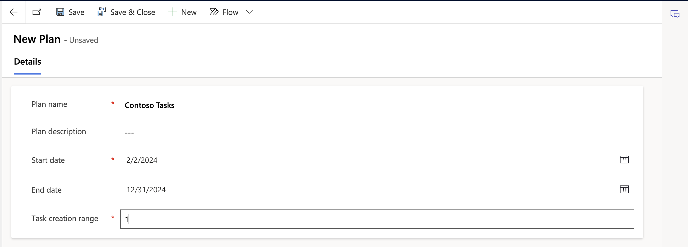](../media/tasks.png#lightbox)

1. Select **Save**.

## Task: Set up tasks for the form template

In this task, you create a task setup for the form template that you created in the **Create a form template** task.

1. Go to the **Task setups** tab on the plan that you created in the previous task.

1. Select **New Task setup**.

1. Provide the values as shown in the following table.

   | Property | Value |
   |----------|-------|
   | **Task Name** | Enter **Store Opening Checklist** as the name of the task. |
   | **Template** | Select the published form template from the lookup. Select **Store Opening Checklist**. |
   | **Assign to** | Select **Manager**. If you select **Team**, then it's assigned to **Team**.|
   | **Priority** | Set the priority for the task, such as high, normal, or low. Select the priority as **Normal**. |
   | **Zone** | Provide the store section where you want the store associate to complete this task. Because you expect this task to be performed across the store, you can leave this value blank. |
   | **Recurrence type** | Provide the recurrence period of the task when it would be available to the store associate for completion. The recurrence can be every weekday (Monday to Friday), every N day, weekly, or monthly. Select **Daily**. |
   | **Daily Recurrence** | This field is visible when **Recurrence type** is set to **Daily**. Select **Every**. |
   | **Every N Days** | This field is visible when **Daily Recurrence** is set to **Every**. Select **1**. |
   | **Start** | The valid start date of the task setup. Enter **today's date**. |
   | **End** | The valid end date of the task setup. Select **December 30** of the current year from the calendar. |
   | **Scheduled Time** | Select the time when the task needs to be scheduled. Enter **08:00 AM**. |
   | **Duration** | Select **30 minutes** as the duration to complete this task. |
   | **Task Type** | Enter the type of task as **Survey**. |
   | **Review Required** | Select **No** to indicate that the task can be directly marked as completed and doesn't need to be sent to the originator for review. |
   | **Require to add picture** (default = **No**; options are **Yes/No**) | Specify if the store associate must attach pictures for the task. Select **No**. |

   > [!div class="mx-imgBorder"]
   > [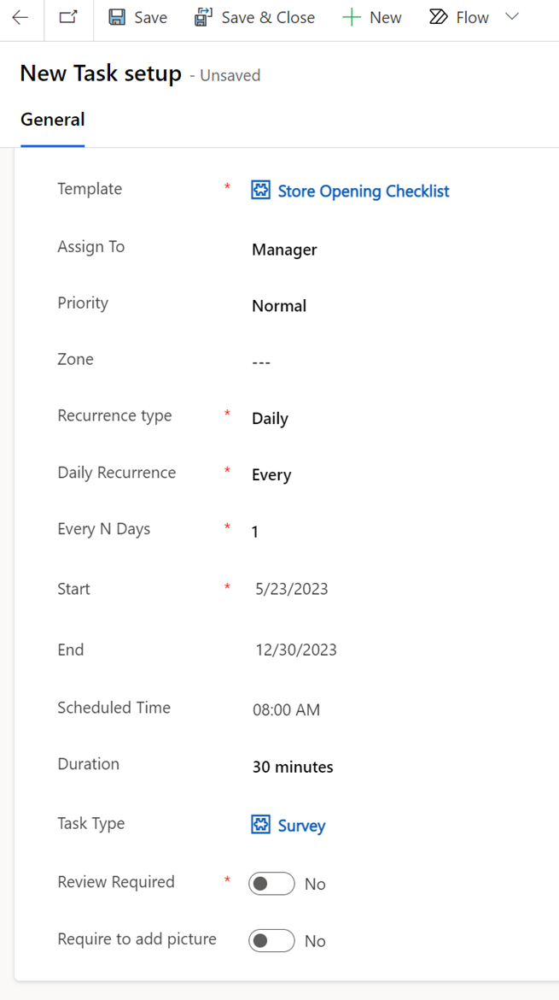](../media/checklist.png#lightbox)

1. Select **Save**.

## Task: Set up tasks for the inventory spot count template

In this task, you assume the persona of Alex and create a task setup for the inventory spot count template that you created in the **Create an inventory spot count template** task.

1. Go to the **Task setups** tab on the plan that you created in the previous task.

1. Select **New Task setup**.

1. Provide the values as shown in the following table.

   | Property | Value |
   |----------|-------|
   | **Task Name** | Enter **Inventory spot count** as the name of the task. |
   | **Template** | Select the published product check template from the lookup. Enter **Inventory spot count**. |
   | **Assign To** | Select **Manager**. If you select **Team**, then it's assigned to **Team**.|
   | **Priority** | Set the priority for the task, such as high, normal, or low. Select **Normal**. |
   | **Zone** | Specify the store section where you want the store associate to complete this task. Because you expect this task to be performed across the store, you can leave this value blank. |
   | **Recurrence type** | Specify the recurrence period of the task when it's available to the associate for completion. The recurrence can be every weekday (Monday to Friday), every N day, weekly, or monthly. Select **Daily**. |
   | **Daily Recurrence** | This field is visible when **Recurrence type** is set to **Daily**. Select **Every**. |
   | **Every N Days** | This field is visible when **Daily Recurrence** is set to **Every**. Select **1**. |
   | **Start** | Select the valid start date of the task setup. Select **today's date**. |
   | **End** | Select the valid end date of the task setup. Select **December 30** of the current year from the calendar. |
   | **Scheduled Time** | Select the time when the task needs to be scheduled. Enter **08:00 AM**. |
   | **Duration** | Select **30 minutes** as the duration to complete this task. |
   | **Task Type** | Select **Inventory spot count** as the type of task. |
   | **Review Required** | Select **No** to indicate that the task can be directly marked as completed and doesn't need to be sent to the originator for review. |
   | **Require to add picture** (default = **No**; options are **Yes/No**) | Specify if the store associate must attach pictures for the task. Select **No**. |

   > [!div class="mx-imgBorder"]
   > [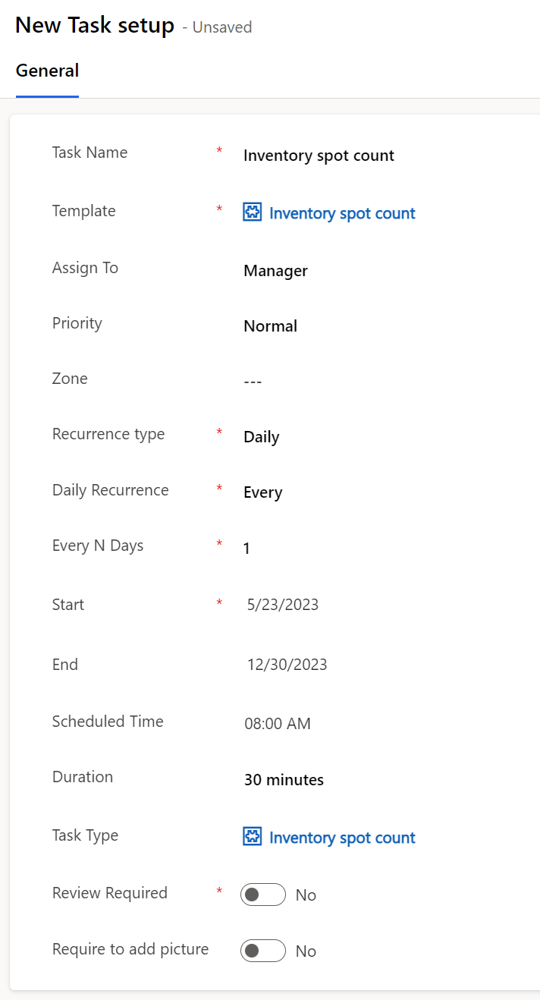](../media/inventory.png#lightbox)

1. Select **Save** on the command bar.

   After you've selected **Save**, the **Associated products** tab is enabled.

   > [!div class="mx-imgBorder"]
   > [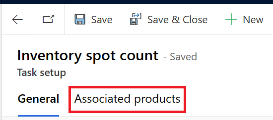](../media/associated.png#lightbox)

1. Select the **New Associated products** button in the **Dynamic Association** section.

   > [!div class="mx-imgBorder"]
   > [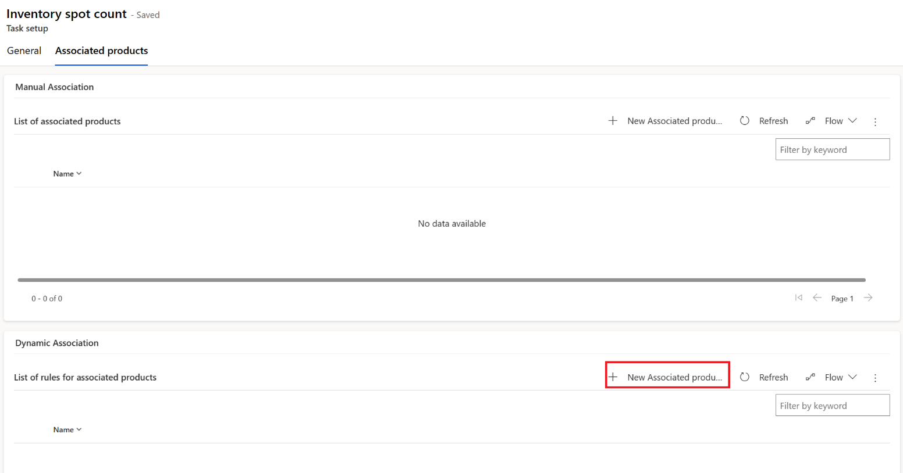](../media/new-associated.png#lightbox)

1. Enter **Footwear products** as the name and then select **Add > Add row** to add new selection criteria.

   > [!div class="mx-imgBorder"]
   > [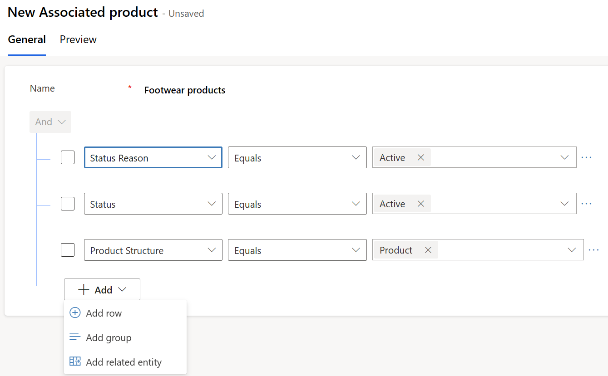](../media/add-row.png#lightbox)

1. Select **Product category** as the criteria and the value as **Footwear**.

   > [!div class="mx-imgBorder"]
   > [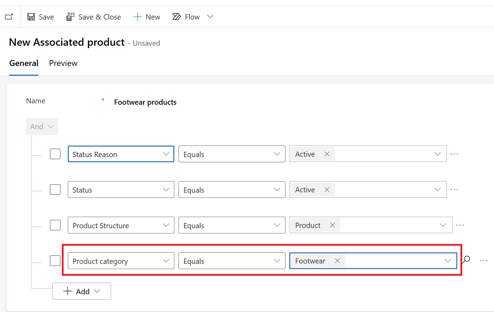](../media/category.png#lightbox)

1. Select **Save & Close** on the upper command bar of the **Associated products** tab.

1. Select **Save & Close** on the upper command bar of the **Task setup** form.

## Task: Set up tasks for the product price update template

In this task, you assume the persona of Alex and create a task setup for the product price update template that you created in the **Create a product price template** task.

1. Go to the **Task setups** tab on the plan that you created in the previous task.

1. Select **New Task setup**.

1. Enter values as shown in the following table.

   | Property | Value |
   |----------|-------|
   | **Task Name** | Enter **Product price update** as the name of the task. |
   | **Template** | Select the published product check template from the lookup. Enter **Product price update**. |
   | **Assign To** | Select **Manager**. If you select **Team**, then it gets assigned to **Team**.|
   | **Priority** | Set the priority for the task, such as high, normal, or low. Select **Normal**. |
   | **Zone** | Specify the store section where you want the store associate to complete this task. Because you expect this task to be performed across the store, you can leave this value blank. |
   | **Recurrence type** | Specify the recurrence period of the task when it's available to the associate for completion. The recurrence can be every weekday (Monday to Friday), every N day, weekly, or monthly. Select **Daily**. |
   | **Daily Recurrence** | This field is visible when **Recurrence type** is set to **Daily**. Select **Every**. |
   | **Every N Days** | This field is visible when **Daily Recurrence** is set to **Every**. Select **1**. |
   | **Start** | Select the valid start date of the task setup. Select **today's date**. |
   | **End** | Select the valid end date of the task setup. Select **December 30** of the current year from the calendar. |
   | **Scheduled Time** | Select the time when the task needs to be scheduled. Enter **08:00 AM**. |
   | **Duration** | Select **30 minutes** as the duration to complete this task. |
   | **Task Type** | Select **Product price update** as the type of task. |
   | **Review Required** | Select **No**. |
   | **Require to add picture** (default = **No**; options are **Yes/No**) | Specify if the store associate must attach pictures for the task. Select **No**. |

   > [!div class="mx-imgBorder"]
   > [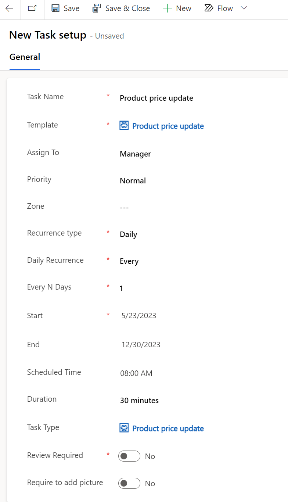](../media/product-price-update.png#lightbox)

1. Select **Save** on the command bar.

   After you've selected **Save**, the **Associated products** tab is enabled.

   > [!div class="mx-imgBorder"]
   > [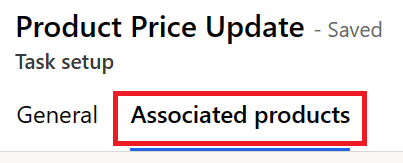](../media/product-price-associated.png#lightbox)

1. Select the **New Associated products** button in the **Dynamic Association** section.

   > [!div class="mx-imgBorder"]
   > [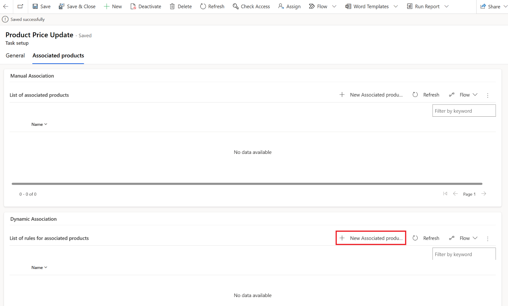](../media/new-associated-product.png#lightbox)

1. Enter **Footwear products** as the name and then select **Add > Add row** to add new selection criteria.

   > [!div class="mx-imgBorder"]
   > 

1. Select **Product category** as the criteria field and the value as **Footwear**.

   > [!div class="mx-imgBorder"]
   > 

1. Select **Save & Close** on the upper command bar of the **Associated products** tab.

1. Select **Save & Close** on the upper command bar of the **Task setup** form.

## Task: Assign stores to target groups and territories

In this task, you assume the persona of Alex and select and associate the Contoso Stores target group and Redmond territory to the plan so that the recurring tasks are created for all Contoso stores in the Redmond area.

1. Select the **Assigned stores** tab.

1. Select **Add Existing Target group** in the **Target Groups** section.

   > [!div class="mx-imgBorder"]
   > [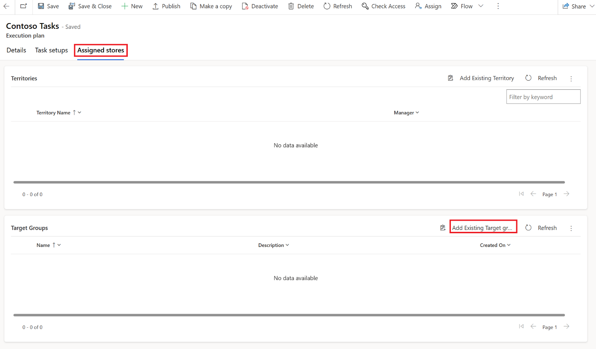](../media/add-target-group.png#lightbox)

1. Use the search box in the **Lookup Records** dialog to view the records in the dropdown list. Select the **Contoso Stores** target group and then select **Add**.

   > [!div class="mx-imgBorder"]
   > [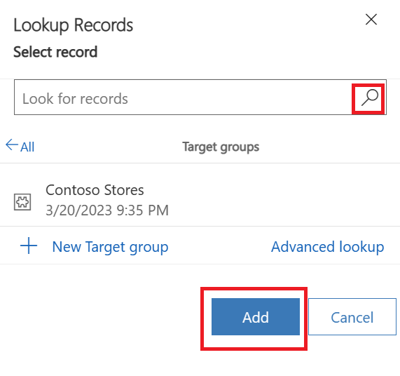](../media/new-target-group.png#lightbox)

1. Select **Add Existing Territory** in the **Territories** section.

   > [!div class="mx-imgBorder"]
   > [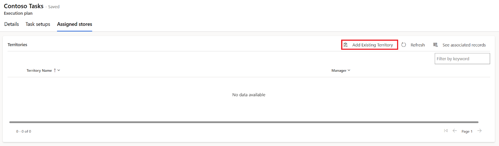](../media/add-existing.png#lightbox)

1. Select and add **Redmond** in the **Territories** pane in the right corner of the screen.

   > [!div class="mx-imgBorder"]
   > [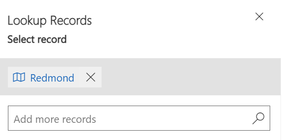](../media/add-redmond-territory.png#lightbox)

> [!IMPORTANT]
> Now the plan is ready. However, the exercise to publish the plan is the last exercise in this learning path. The reason is to ensure that the extensibility requirements to fetch the product prices from ERP, including the flows that have been developed to extract the responses that retail store associates have made, are available before you publish the plan.
