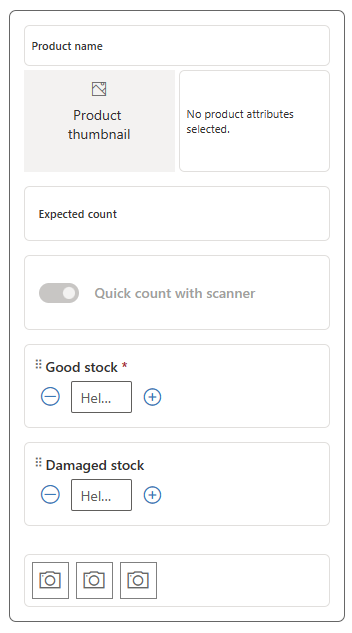

In this exercise, you assume the persona of Alex Serra, regional manager, and create a form template, an inventory spot count template, and a product price update template. 

## Task: Create a form template

In this task, you create a form template for store associates to access all relevant and vital information in one place. The following screenshot shows an example of the store template design.

   > [!div class="mx-imgBorder"]
   > 

1. Change the navigation area on the lower left of the screen to **Action center**.

   > [!div class="mx-imgBorder"]
   > 

1. On the left navigation pane, select **Templates**.

1. Select **New** on the command bar to create a new template.

1. Enter **Store Opening Checklist** as the name and then select **Save**.

   > [!div class="mx-imgBorder"]
   > 

1. Select the **Designer** tab.

   > [!div class="mx-imgBorder"]
   > 

1. Copy the following values to the respective fields:

   - **Description** - Please follow the guidelines to enable a delightful shopping experience for the customers.

   - **Guidelines**:

      Clean and Hygienic

        - Shopping floor swept and cleaned
        - Backstage area swept and cleaned
        - Lounges and changing area swept and cleaned

      Clutter Free and Welcoming

      - All areas must be easy to navigate
      - Wet floor signs removed
      - Equipment stowed away neatly
      - No stacks of stock placed on the shopping floor

      Safety Compliance

      - Hand sanitizers installed in billing area
      - "Maintain social distance" signage put up
      - Restricted material stowed away neatly

1. Select **Add question** and then select **Yes or no response**.

   > [!div class="mx-imgBorder"]
   > 

1. On the **Properties** pane in the right corner of the screen, enter the following values:

   - **Question** - Are the POS hardware and software working properly?

   - **Response required** - Turn on the toggle to enable **Yes**

1. Select **Close (X)** to close the **Properties** pane and save the question.

1. Select the branching icon below the question that you created.

   > [!div class="mx-imgBorder"]
   > 

1. Select the condition response as **No** and then select the plus (**+**) sign to add a new text field to display when the response for the question is selected as **No**.

   > [!div class="mx-imgBorder"]
   > 

1. On the new text field, enter the following details:

   - **Question** - Provide details

   - **Helper text** - Provide the details of the issues observed on the POS hardware/software

   - **Response required** - Yes

1. Select **Close (X)** to close the **Properties** pane and save the question.

1. Select the plus (**+**) sign and select a **User picker** question beneath the main question. Enter the following details on the **Properties** pane:

   **Question** - Select any other user to whom this issue needs to be reported.

   > [!div class="mx-imgBorder"]
   > 

1. Select the plus (**+**) sign beneath the first question to create a **Numeric field** question.

   > [!div class="mx-imgBorder"]
   > 

1. Provide the following values on the properties:

   - **Question** - Cash present in the cash register

   - **Helper Text** - Enter how much cash is present in the cash register

   > [!div class="mx-imgBorder"]
   > 

1. Select **Close (X)** to close the **Properties** pane and save the question.

1. Select the plus (**+**) sign beneath the previous question to create a **Date picker** question.

   > [!div class="mx-imgBorder"]
   > 

1. Provide the following values in the **Properties** pane:

   - **Question** - Date displayed on the calendar

   - **Helper Text** - Enter the date displayed on the calendar

   > [!div class="mx-imgBorder"]
   > 

1. Select **Close (X)** to close the **Properties** pane and save the question.

1. Select the plus (**+**) sign beneath the previous question to create a **Rating** question.

   > [!div class="mx-imgBorder"]
   > 

1. Provide the following value on the **Properties** pane:

   **Question** - Rate the cleanliness of the store.

1. Select **Close (X)** to close the **Properties** pane and save the question.

1. Select the branching icon below the question that you've created. 

   > [!div class="mx-imgBorder"]
   > 

1. Select the condition response as **Less than 3** and then select **Action icon > Add Task** to add a new task object, which is displayed when the response for the preceding question is less than three stars. 

   > [!div class="mx-imgBorder"]
   > 

1. Enter **Clean the floor** as the task name on the **Properties** pane for the conditional task. This task is automatically created if the mentioned condition is met. 

1. Select **Close (X)** to close the **Properties** pane and save the question.

1. Select the plus (**+**) sign beneath the Rating question block to create a **Multiple-choice response** question.

   > [!div class="mx-imgBorder"]
   > 

1. Provide the following values on the **Properties** pane:

   - **Question** - Which of the following areas requires additional cleaning?

   - **Dropdown Options**:

     - Men's Clothing
     - Women's Clothing
     - Kids Clothing
     - Accessories

   > [!div class="mx-imgBorder"]
   > 

1. Select **Close (X)** to close the **Properties** pane and save the question.

1. Select the plus (**+**) sign beneath the previous question to create a **Yes or no response** question.

   > [!div class="mx-imgBorder"]
   > 

1. Provide the following values on the **Properties** pane:

   - **Question** - Is the store layout compliant as per the image displayed?

   - Select **Add attachments** on the **Properties** pane to upload the following image: [super-store-layout](https://github.com/MicrosoftDocs/mslearn-developer-tools-power-platform/blob/master/retail-cloud/super-store-layout.png).

   - **Require photo upload as part of the response** - Yes

   > [!div class="mx-imgBorder"]
   > 

1. Select **Close (X)** to close the **Properties** pane and save the question.

1. On the upper command bar, select **Save** and then select **Publish** to finalize the form template.

1. Select **Yes** on the confirmation dialog.

## Task: Create an inventory spot count template

In this task, you create an inventory spot count template for footwear products. The following screenshot shows an example of the inventory spot count template. 

   > [!div class="mx-imgBorder"]
   > 

1. Select **New** on the command bar to create a new template.

1. Enter **Inventory spot count** as the name, select **Inventory spot count** as the **Type**, and then select **Save**.

   > [!div class="mx-imgBorder"]
   > 

1. On the **Designer** tab, select **Count**. On the **Properties** pane on the right, change the **Question** field entry to **Good stock**. Select **Close (X)** to close the Properties pane and save the question.

   > [!div class="mx-imgBorder"]
   > 

1. Select **Add question** and then select **Numeric field**.

   > [!div class="mx-imgBorder"]
   > 

1. On the **Properties** pane on the right, change the **Question** field entry to **Damaged stock**. Select **Close (X)** to close the Properties pane and save the question.

   > [!div class="mx-imgBorder"]
   > 

1. On the upper command bar, select **Save** and then select **Publish** to finalize the template.

1. Select **Yes** on the confirmation dialog.

## Task: Create a product price update template

In this task, you create a product price update template for capturing new price updates. The following screenshot shows an example of the product price update template.

   > [!div class="mx-imgBorder"]
   > 

1. Select **New** on the command bar to create a new template.

1. Enter **Product price update** as the name, select **Product price update** for the **Type**, and then select **Save**.

   > [!div class="mx-imgBorder"]
   > 

1. On the **Designer** tab, on the upper command bar, select **Save** and then select **Publish** to finalize the template.

1. Select **Yes** on the confirmation dialog.
