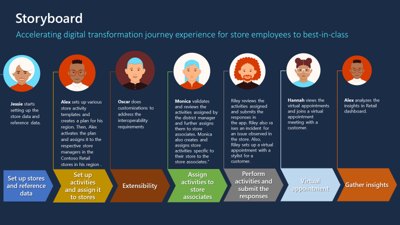

This module focuses on how store managers/ HQ district managers of Contoso Retail create retail tasks and assign them to store associates by using Store Operations Assist.

## Templates

Templates are reusable objects that you can use to create more than one planned task across different time periods. For example, you can create a template for a visual merchandising setup for a polo t-shirt section, create a planned task by using the same template, and then assign it to Store A. If you want to implement the same visual merchandising setup for Store B, you can reuse the existing template and create another planned task.

Store Operations Assist offers the following template types for you to create different retail task types:

- Form: Form templates allow you to share task guidelines in the form of rich text, including hyperlinks, images, PDF attachments, and photos, as part of planned tasks such as promotion setup and store layout changes.

- Inventory spot count: You can use an inventory spot count template for capturing a spot count for a list of products in a store.

- Product price update: You can use a product price update template for capturing new price updates in the store.

- Blank: A blank template is a lighter version of the form template. You can use this template type for everyday in-store tasks, where the associate doesn’t need detailed guidelines or to answer task-specific questions. 

## Plans

A plan provides flexibility for you to assign the same set of tasks to a target group or assign a set of different tasks of the same event to a target group. The district operations manager and store manager can create plans and the associated tasks setup within these plans.

## Task setups

The headquarters or district manager or the store manager can define one or more task setups in Store Operations Assist by using templates. The tasks are part of a plan, have a recurrence, and are associated with target groups or stores where you want the store associate to complete these tasks.

## Retail story

Using Store Operations Assist, Contoso Retail can: 

- Identify prioritized, in-store actions.

- Create templates, plans and task setups for in-store actions.

- Assign tasks with guidelines (hyperlinks, documents, pictures, and so on).  

- Review tasks and provide feedback to store associates.

## Personas and scenarios

You assume the role of Alex Serra, regional manager for Contoso stores and Fabrikam stores in the Redmond region and perform the following exercises:

- **Create templates** : You create a form template, an inventory spot count template, and a product price update template. 

  > [!NOTE]
  > In this module's exercises, you won't be creating a blank template.

- **Create plans** : You create plans and tasks setup to assign recurring activities to Contoso stores in the Redmond region.

> [!div class="mx-imgBorder"]
> 

