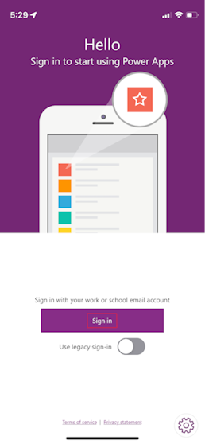
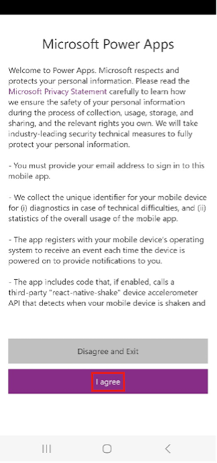

To download and install the Microsoft Power Apps mobile app on your mobile device so that you can run the Store Operations Assist Teams on your mobile, follow these steps:

1. Open the **Microsoft Power Apps** mobile app from your app store on your iOS or Android mobile device.

1. Open **Power Apps** on your mobile device.

1. Select **Sign in**.

   > [!div class="mx-imgBorder"]
   > 

1. Select **I agree** on the Microsoft Power Apps agreement form.

   > [!div class="mx-imgBorder"]
   > 

1. Enter **Monica Rodriguez's** email address and then select **Next**.

1. Enter the **Password** and then select **Sign in**.

