In this exercise, you assume the role of Monica Rodriguez, the store manager at Contoso Store 101. You complete the planned tasks assigned to you and also create and assign an ad-hoc store task to Riley Flores, the store associate.

## Task - Complete planned tasks assigned to you

Perform the following steps to complete all the tasks assigned to you. 

1. Open Microsoft Teams on your mobile device.

1. Sign in using the credentials of Monica Rodriguez. 

1. Select **Store Operations Assist Teams** that is pinned to your Team’s navigation bar. 

     > [!div class="mx-imgBorder"]
     > 
 
1. In the To-do section, select **See Details** under the open items.

    > [!div class="mx-imgBorder"]
    > [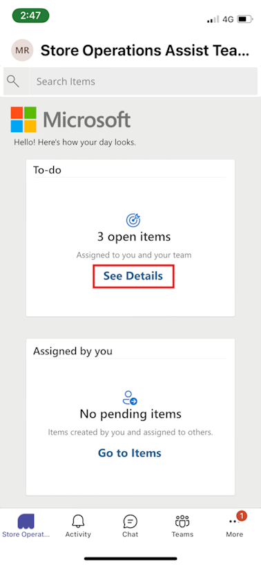](../media/see-details-open-items.png#lightbox)
 
1. Select the radio button near the **Inventory spot count** task.

    > [!div class="mx-imgBorder"]
    > [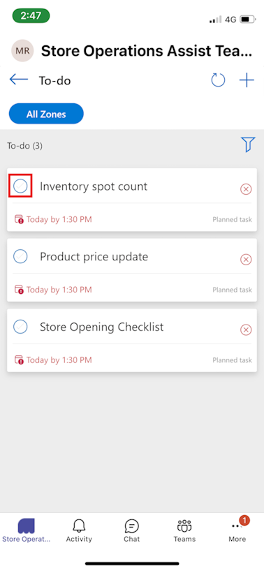](../media/select-task-one.png#lightbox)
 
1. On the pop-up, select **Go to Task Details**. The task opens in **Power apps > Store Operations Assist**. Select each product one by one.

    > [!div class="mx-imgBorder"]
    > [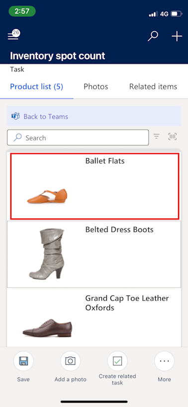](../media/task-one-product-detail.png#lightbox)

1. Update the stock count and select **Save Count**.

    > [!div class="mx-imgBorder"]
    > [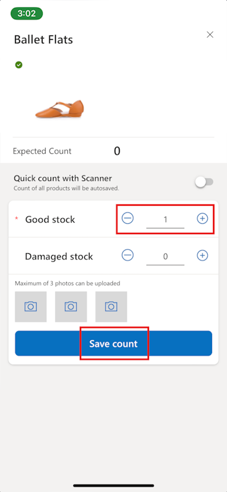](../media/save-count.png#lightbox)

1. After the stock count is complete, select **Mark as complete**.
  
1. You're redirected back to your To-do list. Repeat the same steps for the **Product price update** task.

1. Select each product one by one, update the price, and select **Save**. 

    > [!div class="mx-imgBorder"]
    > [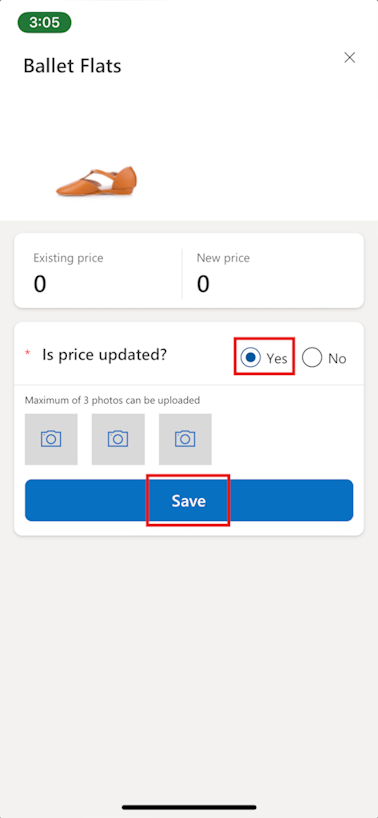](../media/save-price.png#lightbox)

1. After prices of all the products are updated, select **Mark as Complete**.
  
1. Next, select the radio button near the **Store Opening Checklist** task.

    > [!div class="mx-imgBorder"]
    > [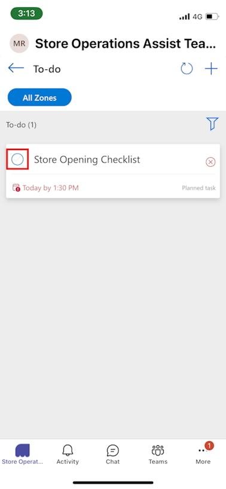](../media/select-task-three.png#lightbox)
 
1. Select **Go to Task Details**. 

    > [!div class="mx-imgBorder"]
    > [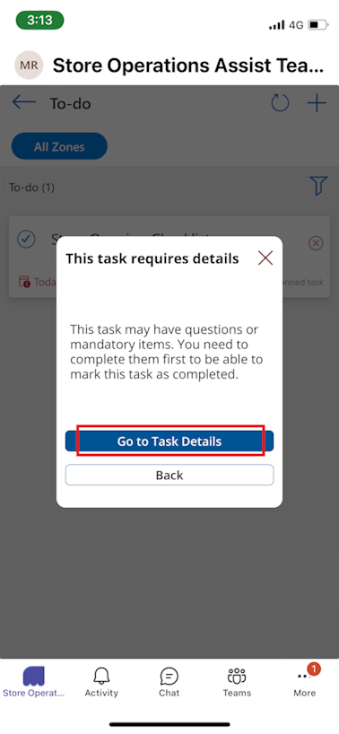](../media/task-three-detail.png#lightbox)

1. You see the instructions and the survey questions associated with the task. Answer the questions appropriately and select **Mark as complete**.

    > [!div class="mx-imgBorder"]
    > [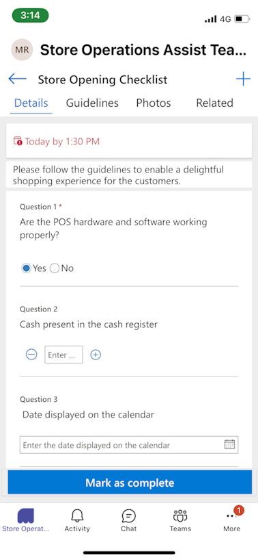](../media/task-three-question.png#lightbox)
   
1. On the To-do page, select the back arrow to return to the home page. You can see that the three tasks are marked as complete. Select the **Back to Teams** arrow to return to the home page.

   > [!NOTE]
   > In the **Task details** view of the Store Operations Assist Teams, you need to select the **Back to Teams** arrow in the upper left part of the screen to return to the **To-do** list view within Teams. Selecting the **Back** button on your mobile device doesn't return you to the **To-do** list view within Teams; it only returns you to the homepage of Store Operations Assist Mobile on Power Apps.

## Task - Create and assign an ad-hoc task to a store associate

Complete the following steps to create a new ad-hoc task for the store associate:

1. Open [Microsoft Teams](https://teams.microsoft.com/?azure-portal=true) on your mobile device.

1. Sign in by using the credentials of **Monica Rodriguez**.

1. Select the **Store Operations Assist Teams** app pinned to your Team's navigation bar.

1. In the **Assigned by you** section, select **Go to Items**. Select the add item (**+**) button from the command bar.

1. Select **+ New Task**.

   > [!div class="mx-imgBorder"]
   > [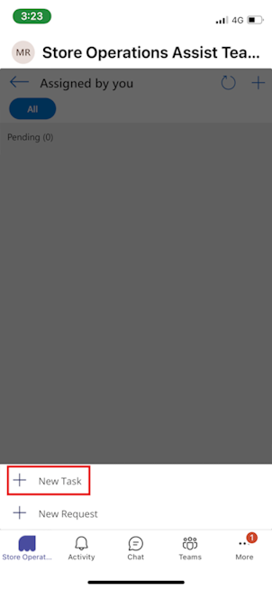](../media/new-task.png#lightbox)

1. Provide the following values:

    - **Title** - List out-of-stock products
    - **In-store location** - Back Aisle
    - **Select assignee** - MCR IAD FLW
    - **Date** - Enter today's date
    - **Time** - 8:00 PM
    - **Priority** - High
    - **Task type** - Inventory spot count

1. Select the check mark (**✓**) from the command bar to save the task.

   > [!div class="mx-imgBorder"]
   > [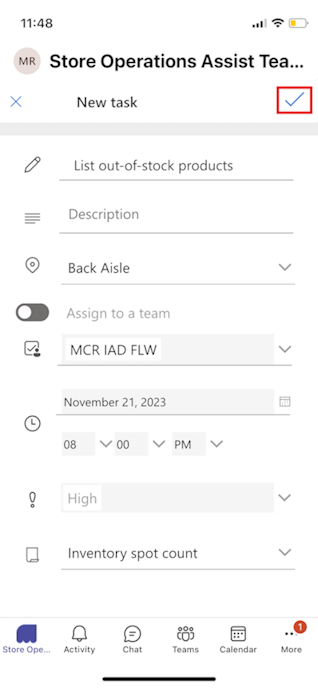](../media/check.png#lightbox)

1. You can see the new task listed on the **Assigned by you** page. Select the **Back to Teams** arrow to return to the home page.

   > [!div class="mx-imgBorder"]
   > [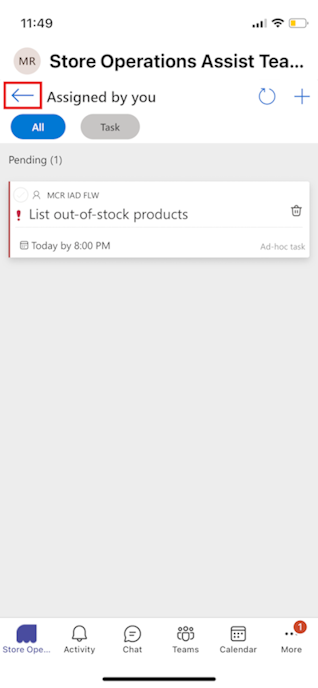](../media/back.png#lightbox)

   > [!NOTE]
   > In the **Task details** view of the Store Operations Assist Teams, you need to select the **Back to Teams** arrow in the upper left part of the screen to return to the **To-do** list view within Teams. Selecting the **Back** button on your mobile device doesn't return you to the **To-do** list view within Teams; it only returns you to the homepage of Store Operations Assist Mobile on Power Apps.

