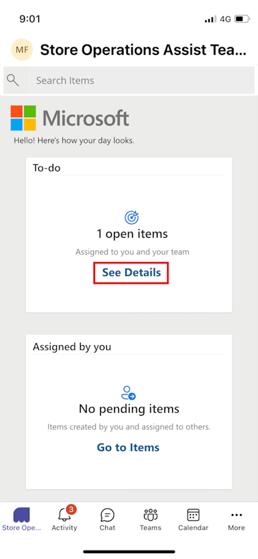
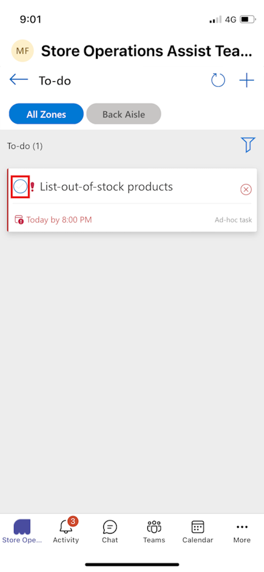
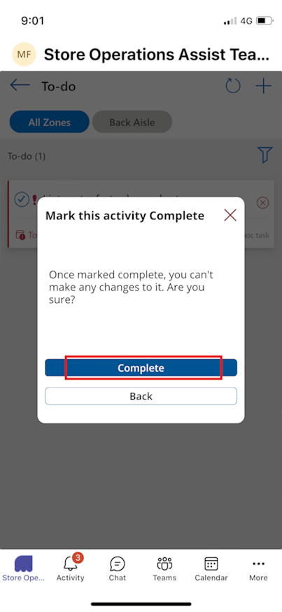
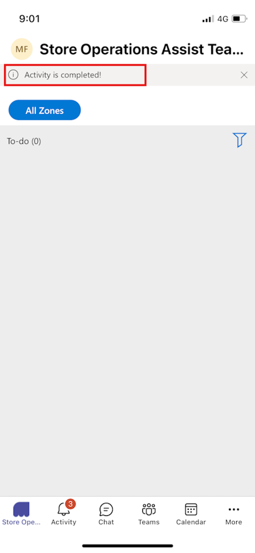

In this exercise, you view and complete the ad-hoc task assigned to you under the **To-do** list and then mark them as complete.

As Riley, you use the MCR IAD FLW user account in your mobile device to complete the following steps:

1. Open the **Microsoft Power Apps** mobile app. Sign out as **Monica Rodriguez** and then sign in by using the **MCR IAD FLW** user credentials.

1. Now open [Microsoft Teams](https://teams.microsoft.com/?azure-portal=true) on your mobile device.

1. Sign out as **Monica Rodriguez** and then sign in by using the **MCR IAD FLW** user credentials.

1. Select the **Store Operations Assist Teams** app.

1. In the **To-do** section, select **See Details**.

   > [!div class="mx-imgBorder"]
   > 

1. You can see a new ad-hoc task listed in the **To-do** list page. Select the option button near the **List out-of-stock products** task.

   > [!div class="mx-imgBorder"]
   > 

1. In the **Mark this activity Complete** prompt, select **Complete**.

   > [!div class="mx-imgBorder"]
   > 

1. You receive the **Activity is completed** notification.

   > [!div class="mx-imgBorder"]
   > 
