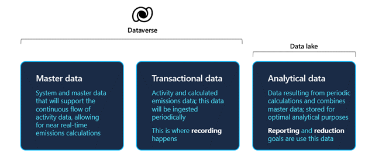
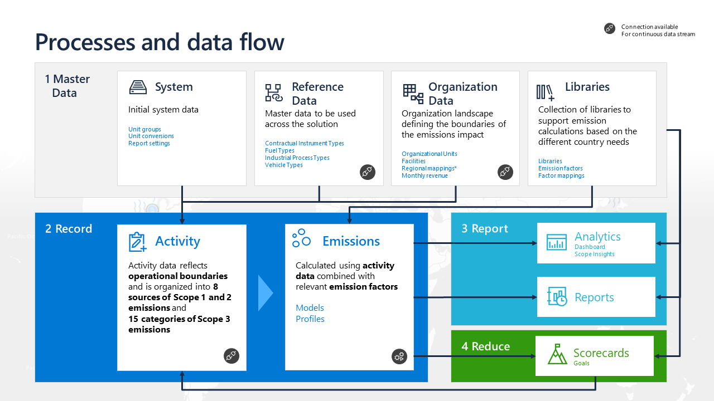
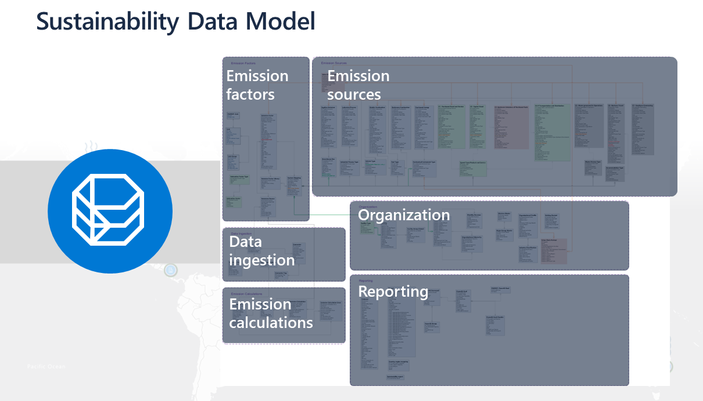

## Data types

Three types of data are supported in the solution through Dataverse and a data lake, as shown in the following diagram.  

> [!div class="mx-imgBorder"]
> 

- **Master data** - System or master data that will support the continuous flow of activity data and that supports near real-time emissions calculations.

- **Transactional data** - Activity data that includes everything that can produce emissions. You can calculate with transactional data that's ingested periodically. 

    All supporting (or master) data and transactional data are stored in Dataverse.

- **Analytical data** - Is used to feed all insights and scorecards. The analytical data is stored in managed data lakes. Customers can't access the managed data lake.

## Process and data flow

The following diagram shows the four steps of the data flow process: 

1. Set up master data

1. Record

1. Report
 
1. Reduce

> [!div class="mx-imgBorder"]
> 

Watch the following video for a demonstration of the data flow. 

> [!VIDEO https://www.microsoft.com/videoplayer/embed/RE54E8T]

### Set up master data

The **Master data** section allows you to collect data to help establish a baseline. It also helps you to better understand the environmental footprint of your organization and value chain across Scopes 1, 2, and 3. 

- In the **System**, you can preload unit groups and unit conversions by using the most common forms of carbon accounting. However, this step isn’t necessarily complete, especially if you need to do a special conversion based on what you foresee in the data. 

- **Reference data** includes contextual, supplemental information that goes into an emissions calculation or helps provide context for calculation outputs. Examples of reference data include facilities, locations, industry, equation definitions, and activity metadata.
If you want to calculate mobile combustion emissions, you’ll need to know fuel types and vehicle types. The solution has some standard definitions based on the Greenhouse Gas Protocol (GHG), but organizations might have their own. You can import reference data under **Data Connections** by creating a connection. 

- With **Organization data**, the organization can define its company information and facilities. Additionally, the organization can define its mappings and revenue to calculate the concept that you call carbon intensity, based on revenue units. You can use connectors in this step.

- The **Libraries** contain emission factors and factor mappings, the latter being unique to Sustainability Manager. The solution comes preloaded with some common libraries, but you can also import your own. 
>
> [!IMPORTANT]
> When you have conversations with a customer or partner who's getting started with Sustainability Manager, you’ll want to go through the information in this **Master data** section first and in the same sequence. Make sure that all steps in this section are completed, and in this sequence, because it will help provide the highest rate of success.
    
### Record

The **Record** section allows you to automate data collection, break down data silos, and calculate emissions more accurately across organization scopes.

Activity data represents the operational boundaries, including everything that contributes to an organization’s emissions. This data will be different for every organization, depending on what they do as part of their business. All activities will have three scopes, but the types of activities will be different. For example, some activities will have industrial processes, while others will be more intense on Scopes 1 and 2 or some categories of Scope 3. 

Sustainability Manager provides connectors for all activities.

You can calculate the emissions by combining activity data with relevant emission factors that use profiles and models. 
The emission calculations are dependent on all pieces of reference data and activities that have been defined as transactional data.

### Report

The **Report** section allows you to visualize your impact, track your performance against goals, gain actionable insights, and streamline reporting. 

When you’ve calculated emissions, the results and insights will be generated through analytics and out-of-the-box reports. 

### Reduce

The **Reduce** section allows you to set goals, act to reduce your emissions footprint, and transform your business through Sustainability Manager.

Again, the sequence is critical. The master data feeds into activities and calculations to inform meaningful analytics and reports. The data will populate scorecards that you can use to help track your reduction progress. You don’t need to refresh or push data to the analytics; the data will automatically refresh. 

Under the data flow process is the Microsoft Cloud for Sustainability data model, which centralizes organization data from various sources. It streamlines data ingestion, integration, emission calculations, and reporting. These groups of data are related and dependent on one another.

## Data model by functional area

You can group the Microsoft Cloud for Sustainability data model into six functional areas of the product, as shown in the following diagram. 

> [!div class="mx-imgBorder"]
> 

| Functional area       | Description                                                                                                                                                                                                                                                                |
|-----------------------|----------------------------------------------------------------------------------------------------------------------------------------------------------------------------------------------------------------------------------------------------------------------------|
| Data ingestion        | Use connections and Power Query dataflow for ingesting data.                                                                                                                                                                                                         |
| Organization          | Define organization logical structure that defines organization divisions, departments, and physical locations.                                                                                                                                                                |
| Emission factors      | Define emission libraries, identifying how much greenhouse gas is released for each unit of a given emission factor. Define available unit types and conversion factor back to base unit, such as units of distance, and conversion factors such as 1 mile equals 1609.34 meters. |
| Emission sources      | By using elastic data stores and virtual entities, the system will store data from your various emission sources, which allows Microsoft Cloud for Sustainability to track factors such as energy purchased and fuel consumption.                                                            |
| Emission calculations | Define the models that are used to calculate emissions for activity data. Use calculation profiles to calculate the emissions from your emissions sources.                                                                                                                          |
| Reporting             | Use calculated emissions to report on emissions, analyze emission sources to identify trends in carbon emission production, and create goals to reduce your organization's carbon emissions.                                                                            |

To review the Microsoft Cloud for Sustainability data model entity relationship diagram, see [Microsoft Cloud for Sustainability data model](/industry/sustainability/datamodel-intro#entity-relationship-diagram).

