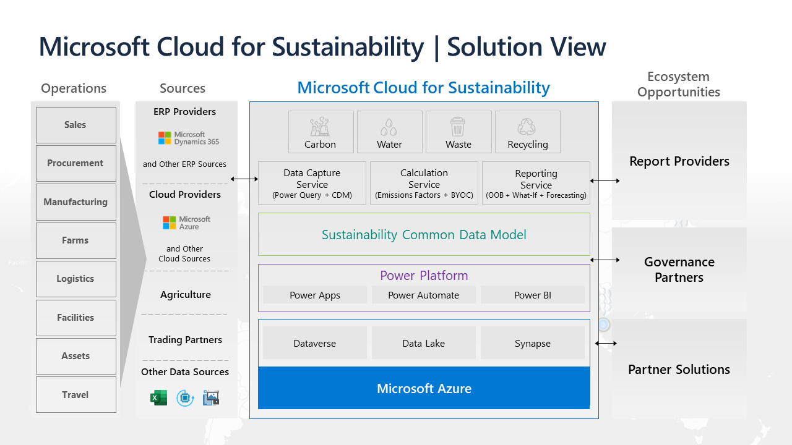

Microsoft Sustainability Manager is unique and is built on Microsoft Azure, the world’s most trusted cloud. 

Microsoft Cloud for Sustainability contains the model-driven Microsoft Sustainability Manager application from Microsoft Power Platform. It also includes Microsoft Power BI dashboards known as **Emissions Impact dashboards**. The Microsoft Cloud for Sustainability data model is the foundation on which the application is built. In addition to the data model, the user interface includes views, forms, charts, dashboards, and business workflows. 

Microsoft Dataverse provides the database structure, namely the entities, attributes, relationships, metadata, and constraints. It's a common management platform for security, role-based access control (RBAC), and operating systems, and this ecosystem defines the environment boundaries. Dataverse provides an abstracted, underlying storage engine, such as SQL, elastic, or a combination. 

The data model is a standalone core model, and you can use it to pre-shape data for ingestion. The consistent, homogeneous schema is optimized for Cloud for Sustainability processing. 

Microsoft Sustainability Manager solution is extensible by the growing partner ecosystem. Partners can implement the following components:

- Rich and robust digital solutions to support reporting, governance, and emissions reduction initiatives with other analytics, digital twins, and AI-driven automation. 

- Data connectors to automate data ingestion.

This extensibility translates to incredible opportunities for delivering solutions and services on top of Microsoft Sustainability Manager, thus extending the ecosystem to reporting providers, governance, and vertical partner opportunities.

> [!div class="mx-imgBorder"]
> 

