In this exercise, you'll ingest Scope 3 Category 2 data to Sustainability Manager and define EEIO spend-based carbon emission calculations. This exercise builds on the knowledge that you learned in the [Set up a sustainability solution using Microsoft Sustainability Manager](/training/paths/create-sustainability-solution/?azure-portal=true) content and serves as an introduction to EEIO spend-based calculations.

> [!IMPORTANT]
> Ensure that you've completed the previous exercise to create reference data. The data import process requires all reference data to exist, and the process is case-sensitive. Additionally, make sure that the reference data that was added has the exact case formatting as is found in the exercise. Failure to do so will result in errors during the data import process.

> [!IMPORTANT]
> To download the sample Microsoft Excel files that you'll ingest into Microsoft Sustainability Manager, go to [sample data](https://github.com/MicrosoftDocs/mslearn-developer-tools-power-platform/blob/master/sustainability-cloud/Scope%203%20Sample%20Files.zip). In the **GitHub** page that appears, select the **Download** button. Extract the three Excel files to a folder on your local computer for use in this exercise.  

## Task: Ingest data

In this task, Devon will import Scope 3 capital goods, an Excel spreadsheet that Remy has provided. This step brings in the coffee roasting machines and office equipment that was purchased for the Houston and Fulshear facilities and then it adds them to the Scope 3 Category 4, capital goods activity data.

 

---

:::row:::
   :::column span="1":::
      > [!div class="is-text-right"]
      > :::image border="false" type="content" source="../media/remy.png" alt-text="Artwork showing a fictitious person named Remy Morris.":::  Remy Morris
   :::column-end:::
   :::column span="3":::
      > [!div class="is-text-left"]
      > Hi Devon, I've gathered capital goods data from the facilities and prepared a Scope 3 Category 2 activity data spreadsheet for 2022. Could you please ingest this data into Sustainability Manager? Thank you!
   :::column-end:::
   :::column span="2":::
   :::column-end:::
:::row-end:::
:::row:::
   :::column span="2":::
   :::column-end:::
   :::column span="3":::
      > [!div class="is-text-right"]
      > Yes, Remy, I'll start ingesting that data!
   :::column-end:::
   :::column span="1":::
      > [!div class="is-text-left"]
      > :::image border="false" type="content" source="../media/devon.png" alt-text="Artwork showing a fictitious person named Devon Torres.":::  Devon Torres
   :::column-end:::
:::row-end:::

 

---

1. Open Sustainability Manager.

1. In the lower-left corner, change the area navigation to **Data**.

1. Go to **Data connections** on the left side of the page. On the **Connections** view, select **+ New**.

1. Complete the following steps on the **New data connection** wizard:

    1. Select **Activity data** for data type.

    1. Select **2. Capital goods** from the **Activity data** dropdown list.

    1. Select **Next** when you're finished.

       > [!div class="mx-imgBorder"]
       > [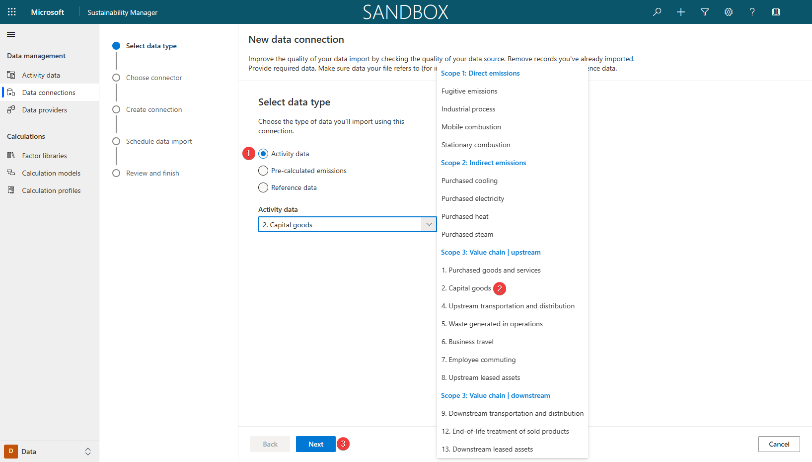](../media/new-connection.png#lightbox)

1. On the **Choose connector** page, select **Excel** and then select **Next**.

1. A new dialog will open for Microsoft Power Query. On the Power Query dialog, select **Upload file** and then select **Browse**.

   > [!NOTE]
   > You can also choose to import an existing file that's located in OneDrive. For simplicity of this exercise, you'll use the **Upload file** functionality. If you notice an error that prevents you from uploading the file, open a browser instance and then initiate OneDrive by going to https://portal.office.com/onedrive.

   > [!div class="mx-imgBorder"]
   > [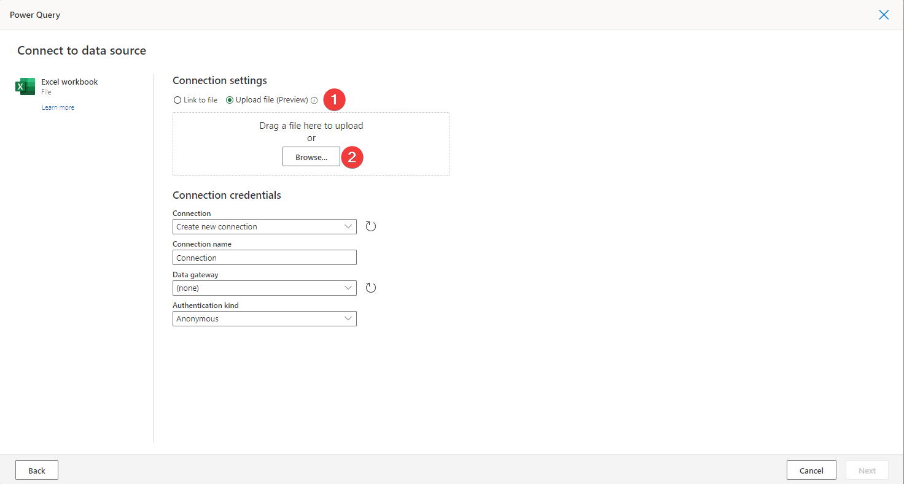](../media/excel.png#lightbox)

1. On the file selection window, browse to the location of the downloaded Excel files. Select the **Scope 3 Capital Goods.xlsx** file and then select **Open**.

1. After the file has successfully uploaded, select **Sign-in** to create a new connection credential.

1. A Microsoft Office 365 sign-in dialog will appear. Select your user account.

1. After the sign-in process is complete, the new connection will be selected automatically. Select **Next**.

1. On the **Choose data** page of the Power Query wizard, select the **All capital goods** sheet and then select **Transform data**.

   > [!div class="mx-imgBorder"]
   > [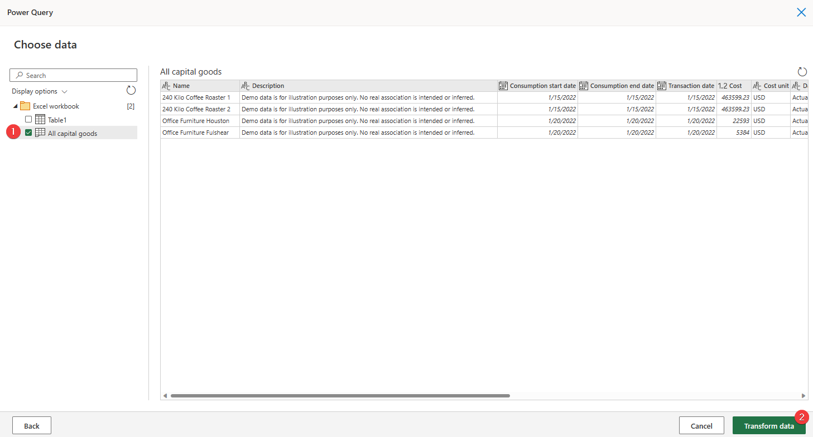](../media/choose.png#lightbox)

On the **Transform data** page of the Power Query wizard, you can perform transformations on various data and columns. These transformations will allow you to adjust data types, update column mappings, and perform advanced transformations within Microsoft Power Platform dataflows or Microsoft Power BI datasets. In this scenario, you have already formatted the spreadsheet to match the Microsoft Cloud for Sustainability data model.

1. Select **Create** to start the data import process.

1. The **New data connection** wizard will show the **Schedule data import** page, where you can complete the following actions:

    - Turn on the **Import data automatically** toggle, which will give you the option of setting a schedule to have the data imported automatically. This option would be beneficial if the connector is used in a scenario where the data changes frequently, such as a web API or FTP server.

    - Turn on the **Replace previously imported data** toggle, which will remove all previously imported data and will bring in the full dataset that was retrieved. This option would be beneficial if the data source provides data from the last import and always includes a full set of data.

1. Turn on **Replace previously imported data** and then select **Next**.

   > [!div class="mx-imgBorder"]
   > [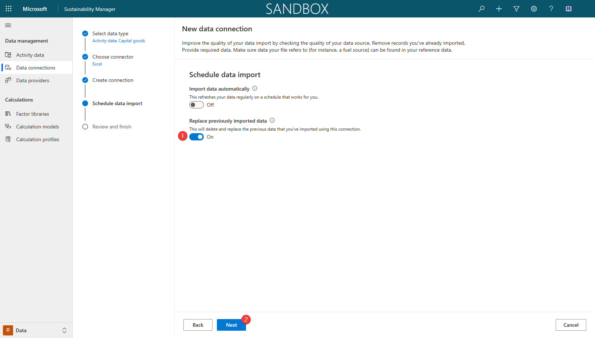](../media/replace.png#lightbox)

1. On the **Review and finish** page, enter a name for the new connection, such as **Contoso Texas Scope 3 Capital Goods** and then select **Connect**.

   > [!div class="mx-imgBorder"]
   > [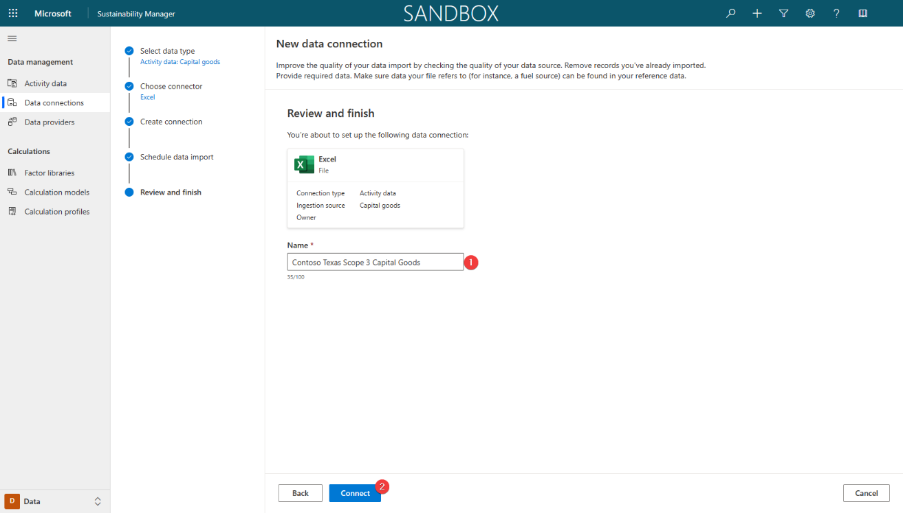](../media/finish.png#lightbox)

   The "Creating connection..." message should appear in the lower part of the screen.

1. After the connection has been created, select **Done**.

1. Select **Refresh** to view the updated status, which should show as **Complete**.

1. Go to **Activity data** on the left side of the page.

1. Find the **2. Capital goods** option from the **Scope 3: Value chain | upstream** section and then select **View** to view the data for all capital goods that have been purchased and imported.

1. Select the arrow next to the **Organizational Unit** column and select **Filter by**.

1. Select **Contoso Texas** from the **Filter By** dialog.

   > [!div class="mx-imgBorder"]
   > [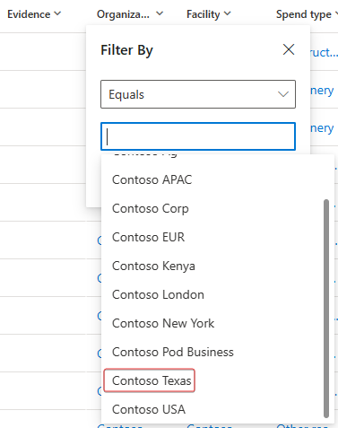](../media/filter.png#lightbox)

1. Select **Apply** to apply the filter to the column.

   The view will refresh, and the activity data records that were imported during this exercise will display.

   > [!div class="mx-imgBorder"]
   > [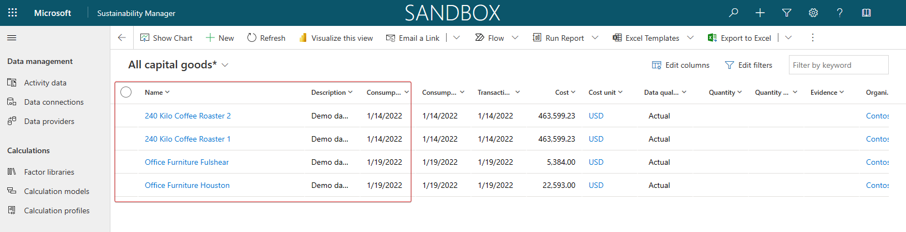](../media/records.png#lightbox)

Acting as the persona of Devon, the sustainability specialist of Contoso, Texas, you've completed the data import of Scope 3 Category 2 capital goods. It's a crucial step to realize the goal of recording, reporting, and reducing carbon emissions. Next, you'll review the calculation model for this data.

## Task: Review calculation models

In this task, Devon will review the calculation models that are included in Sustainability Manager to calculate carbon emissions for the capital goods that have been purchased. In this case, Devon will review the purchased equipment from Fabrikam Inc.

 

---

:::row:::
   :::column span="1":::
      > [!div class="is-text-right"]
      > :::image border="false" type="content" source="../media/remy.png" alt-text="Artwork showing a fictitious person named Remy Morris.":::  Remy Morris
   :::column-end:::
   :::column span="3":::
      > [!div class="is-text-left"]
      > Hi Devon, the ingested data looks great. We didn't receive the emissions data from our suppliers, so we need to perform an Average spend-based calculation.
   :::column-end:::
   :::column span="2":::
   :::column-end:::
:::row-end:::
:::row:::
   :::column span="2":::
   :::column-end:::
   :::column span="3":::
      > [!div class="is-text-right"]
      > Thank you for the information, Remy. It's best practice to review our existing calculation models to see if an existing one matches our needs. I'll review them now.
   :::column-end:::
   :::column span="1":::
      > [!div class="is-text-left"]
      > :::image border="false" type="content" source="../media/devon.png" alt-text="Artwork showing a fictitious person named Devon Torres.":::  Devon Torres
   :::column-end:::
:::row-end:::

 

---

1. Go to **Calculation models** on the left side of the page.

1. Review the list of calculation models and determine if an existing model nearly matches Contoso's calculation needs. Because the equipment is being purchased and used in the United States, you can identify an existing capital goods calculation model that uses the latest **EPA 2022 - Supply chain GHG emission factors - v1.1** factor library for EEIO factors based on spend type.

1. Select the **Capital Goods** calculation model.

   > [!NOTE]
   > You might need to scroll through the list to find your selection.

1. Review the calculation model actions. Select the **Spend-based calculation** report action to review the data that's been used for the carbon emission calculation.

   > [!div class="mx-imgBorder"]
   > [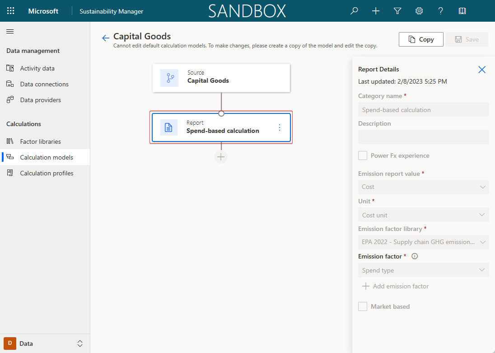](../media/spend.png#lightbox)

The emission report value and unit that's used in the calculation should appear, including the emission factor library and emission factor.

You can use the **Report** action to calculate and report carbon emissions to the **Emissions** table. The system will calculate emissions by using the selected emission factor from the dropdown menu or a factor mapping that determines the appropriate emission factor. In this exercise, the action will use the spend type field to identify the factor mapping and emission factor to use in the calculation.

Next, the system will convert the activity data quantity and quantity unit to the same unit type as the emission factor. Then, it will multiply the converted value against each gas that's listed in the emission factor to determine the volume of gases that are produced.

To determine the CO2e (carbon dioxide equivalency), the volume of gases produced is multiplied against their Global Warming Potential (GWP) factor, which is stored in the **Greenhouse Gases** table in Microsoft Dataverse, and then they're added together.

The **Report** action stores the values of gases produced, CO2e, and other identifying information about the activity data row in the **Emissions** table.

Acting as Devon, you've successfully reviewed the included calculation models and have used the Capital Goods calculation model. Sustainability Manager comes equipped with multiple calculation models. Occasionally, these included models might not match your unique needs, so you'll need to create new models to provide custom calculations. Be sure to review the included models to view other types of complex calculation models.

## Task: Create a calculation profile

In this task, Riley Ramirez will create a calculation profile by using an existing calculation model called Capital Goods.

 

---

:::row:::
   :::column span="1":::
      > [!div class="is-text-right"]
      > :::image border="false" type="content" source="../media/devon.png" alt-text="Artwork showing a fictitious person named Devon Torres.":::  Devon Torres
   :::column-end:::
   :::column span="3":::
      > [!div class="is-text-left"]
      > Hi Riley, could you please create a calculation profile for category 2 Capital goods with the Capital Goods calculation model and filter the activity data to only Contoso Texas data? Thank you!
   :::column-end:::
   :::column span="2":::
   :::column-end:::
:::row-end:::
:::row:::
   :::column span="2":::
   :::column-end:::
   :::column span="3":::
      > [!div class="is-text-right"]
      > Sure thing, Devon, I'll let you know when the profile is ready!
   :::column-end:::
   :::column span="1":::
      > [!div class="is-text-left"]
      > :::image border="false" type="content" source="../media/riley.png" alt-text="Artwork showing a fictitious person named Riley.":::  Riley Ramirez
   :::column-end:::
:::row-end:::

 

---

1. Go to **Calculation profiles** on the left side of the page.

1. Select **+ New Calculation profile** to create a new calculation profile.

1. Populate the following information on the **New calculation profile** wizard:

   - **Calculation profile name** - Use to identify the calculation profile in the list. Enter **Scope 3 Contoso Texas Capital Goods**.

   - **Emission source** - Use to identify which activity data type should be used in the calculation. Enter **2. Capital goods**.

   - **Activity data to include in calculation** - Use to filter activity data to a specific subset of the activity data type. Enter **Organizational unit equals Contoso Texas**.

   - **Calculation model** - Use to identify the calculation model to be used. Select **Capital goods** from the dropdown list.

   - **Schedule** - Select the **Automatically run this calculation when data is refreshed** checkbox to automatically trigger calculations when the matching activity data is refreshed.

1. To create the filter, complete the following steps:

   1. Select **Add > Add row**.

   1. From the **Select a field** dropdown menu, select **Organizational unit**.

   1. From the **Value** dropdown menu, select **Contoso Texas (Organizational unit)**.
      
      > [!div class="mx-imgBorder"]
      > [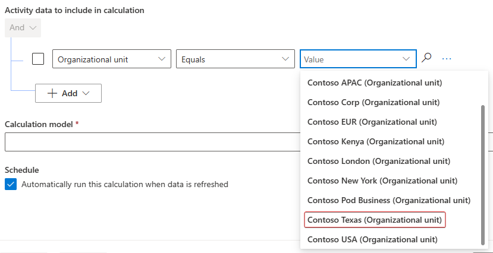](../media/texas.png#lightbox)

   1. Select **Next**.

       > [!NOTE]
       > Select the calculation model from the dropdown list.

       > [!div class="mx-imgBorder"]
       > [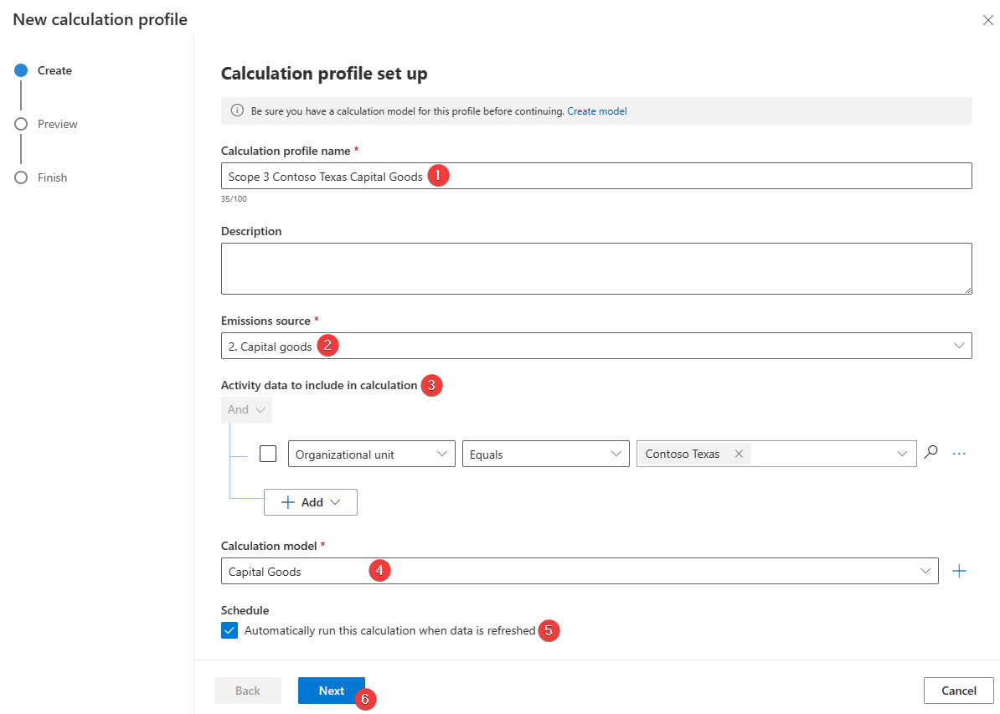](../media/profile.png#lightbox)

      On the preview page of the New calculation profile wizard, the emissions are calculated for the first row of data that matches the **Activity data to include** filter. For more information, see [Exercise - Run calculations](/training/modules/sustainability-emissions-calculation/exercise-calculations).

   1. Select **Save** to save your calculation profile.

      > [!div class="mx-imgBorder"]
      > [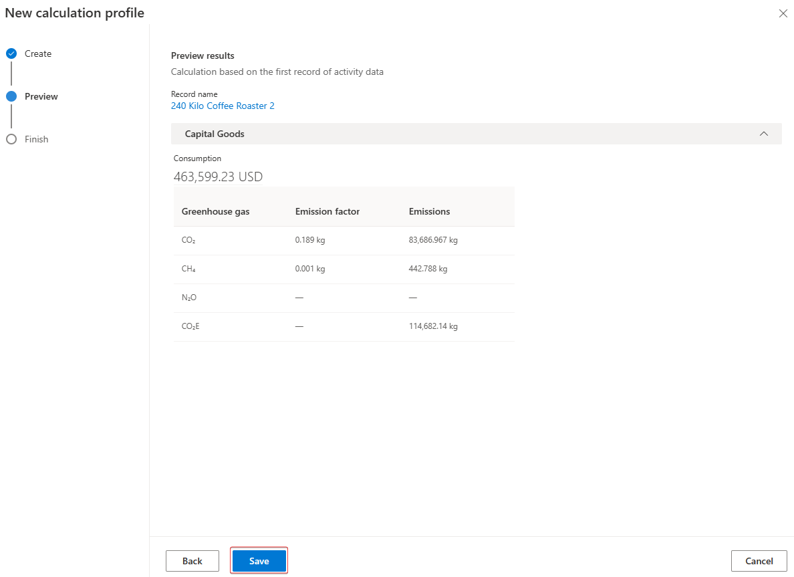](../media/save.png#lightbox)

Acting as Riley's persona, you've successfully created a calculation profile. Calculation profiles are the mechanisms by which calculation jobs are queued. You can set your calculation profiles to run automatically when matching activity data is added or updated, as you selected in this scenario, or you can run them manually.

## Task: Perform a calculation and review the results

In this task, Devon will run the newly created calculation profile for the purchase of capital goods. This task will create a calculation job that iterates over each activity data row that matches the **Calculation Profile** filter criteria. It also uses the calculation model that you previously identified to calculate the carbon emissions for each row. The results will be shown in the **Emissions** table, which Devon can review after the calculations are complete.

 

---

:::row:::
   :::column span="1":::
      > [!div class="is-text-right"]
      > :::image border="false" type="content" source="../media/riley.png" alt-text="Artwork showing a fictitious person named Riley.":::  Riley Ramirez
   :::column-end:::
   :::column span="3":::
      > [!div class="is-text-left"]
      > Hi Devon, I've created a new calculation profile named Scope 3 Contoso Texas Capital Goods for you.
   :::column-end:::
   :::column span="2":::
   :::column-end:::
:::row-end:::
:::row:::
   :::column span="2":::
   :::column-end:::
   :::column span="3":::
      > [!div class="is-text-right"]
      > Thank you, Riley! I'll run that profile to create a calculation job that iterates over each activity data row and calculates the carbon emissions for each row.
   :::column-end:::
   :::column span="1":::
      > [!div class="is-text-left"]
      > :::image border="false" type="content" source="../media/devon.png" alt-text="Artwork showing a fictitious person named Devon Torres.":::  Devon Torres
   :::column-end:::
:::row-end:::

 

---

1. Follow these steps to run the calculation profile for Scope 3 Contoso Texas Capital Goods:

    1. Select **Scope 3 Contoso Texas Capital Goods** in the list.

    1. Select **Run calculation** on the command bar.

   > [!div class="mx-imgBorder"]
   > [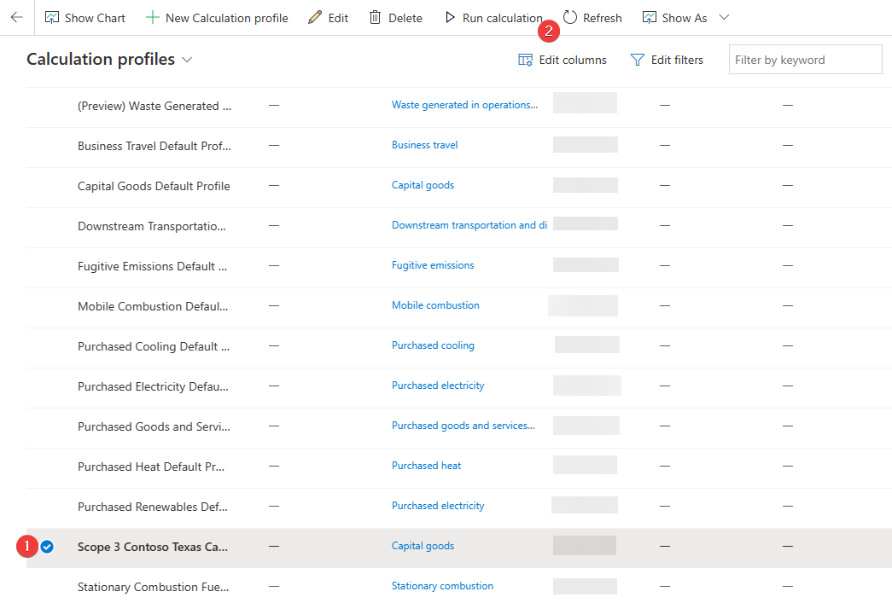](../media/run.png#lightbox)

1. After a few minutes (approximately three), the calculation job should be complete. Select **Refresh** to check the status of the calculation job. The calculation profile should now have a status of **Succeeded**.

1. In the lower-left corner of the page, change the **Area** to **Analytics**.

1. Go to **All emissions** on the left side of the page. The view should show all emissions that have been calculated or directly imported.

1. Select the arrow next to the **Organizational Unit** column and then select **Filter by**.

1. Select **Contoso Texas** from the **Filter By** dialog.

1. Select **Apply** to apply the filter to the column.

   The view will refresh, and the calculated emissions data for each activity data record that was imported in the previous tasks will display. Scroll right to view the CO2e carbon emission values.

   > [!div class="mx-imgBorder"]
   > [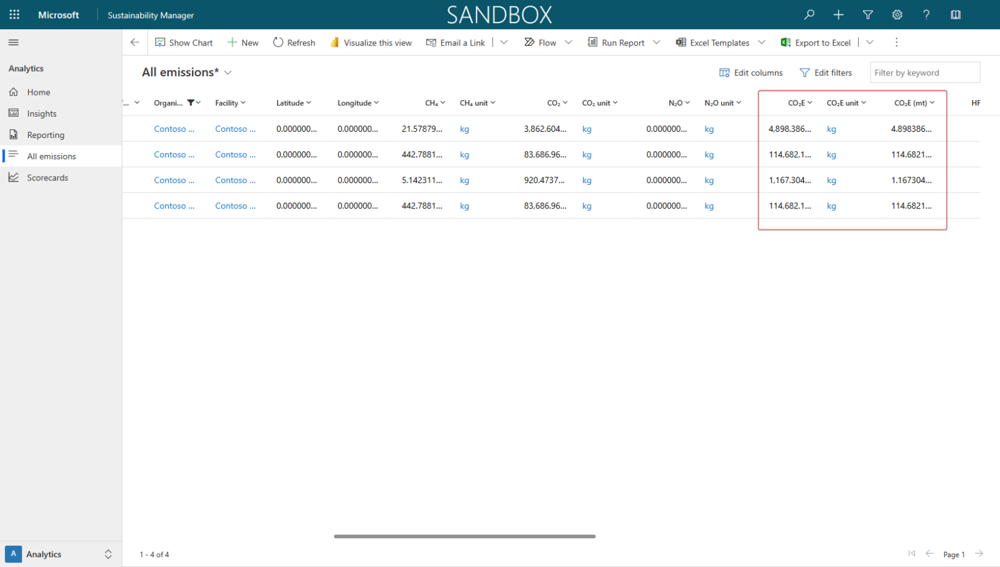](../media/carbon.png#lightbox)

Now, you've created and run calculation profiles. This step is the last in calculating and recording your carbon emissions in Sustainability Manager.

The following actions were completed in this exercise:

- Devon, the sustainability specialist, performed the data ingestion of the capital goods data that Remy, the emissions analyst, prepared.

- Devon reviewed the default calculation models and used the Capital Goods calculation model.

- Riley, the IT admin, built the calculation profile for the Contoso, Texas organizational unit by using the Capital Goods calculation model.

- Devon ran the calculation profile and validated the emissions data.
