In this exercise, you'll learn how to ingest Scope 3 Category 4 data and how to perform distance-based carbon emission calculations. This exercise builds on the knowledge that you learned in the [Set up a sustainability solution using Microsoft Sustainability Manager](/training/paths/create-sustainability-solution/?azure-portal=true) content. It serves as an introduction to distance-based calculation of Scope 3 Category 4 upstream transportation calculations. Additionally, you'll learn how to create a new data field that the organization requires to calculate their Scope 3 Category 4 carbon emissions.

Contoso Texas is using **Waterborne Craft** and **Heavy-Duty Truck - Shared Load** for transportation. Shared load transportation means that your shipment is transported along with shipments from other organizations. To reduce the potential of double or over-counting the carbon emissions for transportation, Contoso Texas includes the number of stops (*stop count*) that the shared load makes. That approach allows them to calculate the portion of carbon emissions that their shipment is responsible for more accurately.

## Task: Create a new field

In this task, Riley Ramirez will create a new field to support the extra data that's required from the spreadsheet. Devon will use this data field in the carbon emission calculation to ensure that Contoso Texas is accounting for the carbon emissions of their products and isn't accounting for extra emissions that are generated by using shared load transportation.

<br />

---

:::row:::
   :::column span="1":::
      > [!div class="is-text-right"]
      > :::image border="false" type="content" source="../media/remy.png" alt-text="Artwork showing a fictitious person named Remy Morris.":::<br /> Remy Morris
   :::column-end:::
   :::column span="3":::
      > [!div class="is-text-left"]
      > Hi Devon, due to our use of shared load transportation modes, we need to account for the number of stops that the transportation providers have made when transporting coffee beans. This step helps us calculate our Scope 3 Category 4 emissions more accurately.
   :::column-end:::
   :::column span="2":::
   :::column-end:::
:::row-end:::
:::row:::
   :::column span="1":::
      > [!div class="is-text-right"]
      > :::image border="false" type="content" source="../media/devon.png" alt-text="Artwork showing a fictitious person named Devon Torres.":::<br /> Devon Torres
   :::column-end:::
   :::column span="3":::
      > [!div class="is-text-left"]
      > Sure, Remy, I'll ask our IT admin, Riley, to extend the Sustainability Manager data model for this new requirement. <br /><br /> Hi Riley, could you please extend the Upstream Transportation and Distribution data model to track stop count? Note that this value should be numerical.
   :::column-end:::
   :::column span="2":::
   :::column-end:::
:::row-end:::
:::row:::
   :::column span="2":::
   :::column-end:::
   :::column span="3":::
      > [!div class="is-text-right"]
      > Sure thing, Devon, I'll create a new whole number field for stop count.
   :::column-end:::
   :::column span="1":::
      > [!div class="is-text-left"]
      > :::image border="false" type="content" source="../media/riley.png" alt-text="Artwork showing a fictitious person named Riley.":::<br /> Riley Ramirez
   :::column-end:::
:::row-end:::

<br />

---

1. While using an InPrivate or Incognito window, go to [Microsoft Power Apps](https://make.powerapps.com/?azure-portal=true).

1. Select the correct Sustainability environment from the **Environment** dropdown menu in the upper-right corner.

1. Select **Solutions > + New solution**. Solutions help developers write, package, and maintain units of software that extend Microsoft Power Platform. Every customization that you make to Microsoft Dataverse or to a 
usly installed solution is part of a solution. For more information, see [Introduction to solutions - Power Apps](/power-apps/developer/data-platform/introduction-solutions/?azure-portal=true).

1. Follow these steps on the **New solution** dialog to create a new solution:

   1. Name the solution **Contoso Texas**.

   1. From the **Publisher** dropdown menu, select **Default Publisher**. During an implementation, we suggest that you create or use another publisher that's specific to your organization. 

   1. Select **Create**.
         > [!div class="mx-imgBorder"]
         > [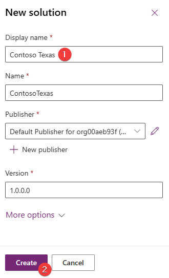](../media/solution.png#lightbox)

1. Select **+ Add existing > Table**.

1. To add an existing table, follow these steps:

   1. Search for **Transportation and distribution**.

   1. Select the **Transportation and distribution** table on the list.

   1. Select **Next**.

   1. We recommend that you only include the items in a solution that you intend to modify. To include only specific objects that are related to the table, select the **Select objects** option.
         > [!div class="mx-imgBorder"]
         > [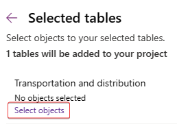](../media/objects.png#lightbox)
 
1. Only the main form is required. Follow these steps to select it:

   1. Select the **Forms** tab.

   1. Select the **Information** row where the form type is **Main**.

   1. Select **Add**.

         > [!div class="mx-imgBorder"]
         > [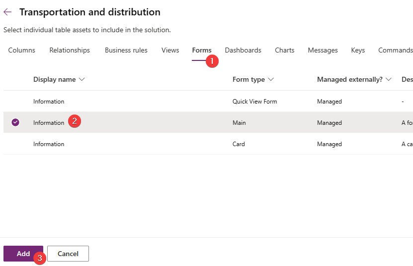](../media/information.png#lightbox)

1. On the **Selected tables** dialog, verify that one form has been selected and then select **Add**.
    
1. To modify the **Transportation and distribution** table, follow these steps:

   1. Select the **Transportation and distribution** table in the solution view on the left pane.

   1. Select **Edit**.

   1. On the table solution view, select **New > Column**.

   1. A new dialog will open, where you can create a new column. Enter the following information:

    - **Display name** - Stop count

    - **Data type** - Whole number

    - **Format** - None

    - **Required** - Optional

   > [!div class="mx-imgBorder"]
   > [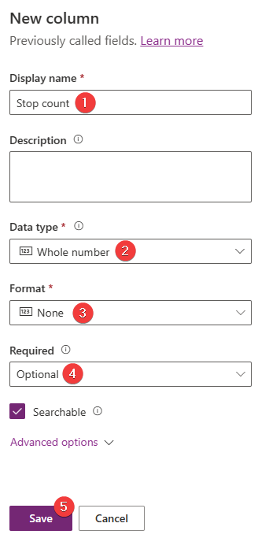](../media/column.png#lightbox)

1. Select **Save**.

1. Add the field to the existing **Information** form. To do so, locate the **Data Experiences** card on the table solution view and then select the **Forms** link.

1. On the **Forms** list, select the **Information** form and then select **Edit**.

   > [!div class="mx-imgBorder"]
   > [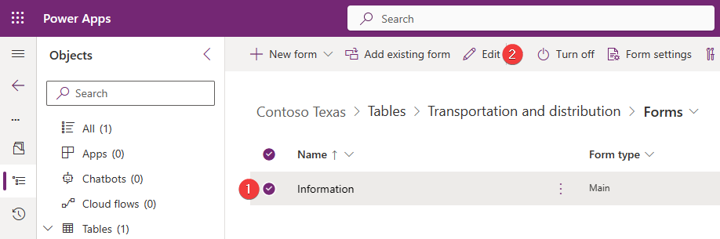](../media/edit.png#lightbox)

1. A form editor will open with the **Information** form loaded. In the **Table columns** section, locate the new **Stop count** field and then select the field name to add to the **Information** form. Alternatively, you can drag and drop the field to a specific location on the form; however, for simplicity of this exercise, you can leave it in the default location.

   > [!div class="mx-imgBorder"]
   > [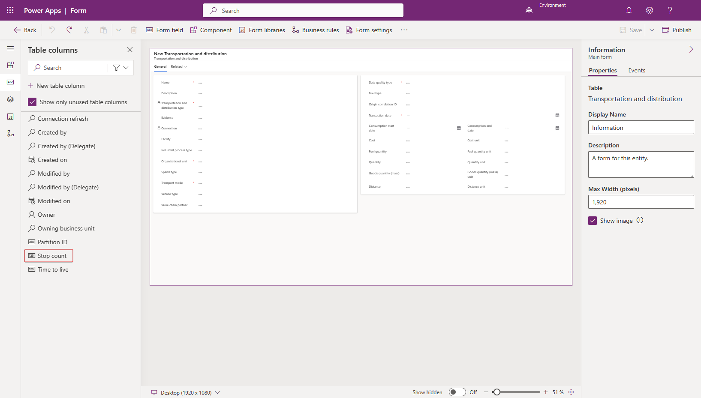](../media/stop.png#lightbox)

1. Select **Publish**.

Acting as Riley, you've completed the task of creating a new field called **Stop count** by using the previously created solution.

## Task: Ingest data

In this task, Devon will import a Microsoft Excel spreadsheet that contains the Scope 3 Upstream transportation data. This exercise brings in the Upstream transportation and distribution data for transporting the raw coffee beans through shipping routes from Rio De Janeiro to the Port of Houston in Texas, US. In addition, transport from the Port of Houston to the Houston and Fulshear facilities by shared truckload will fall into Scope 3 Category 2, Upstream transportation and distribution activity data.

> [!IMPORTANT]
> Ensure that you've completed the previous exercise to create reference data. The data import process requires all reference data to exist, and the process is case sensitive, so make sure that the reference data that was previously added has the exact case formatting as is found in the lab. Failure to do so will result in errors during the data import process.

<br />

---

:::row:::
   :::column span="1":::
      > [!div class="is-text-right"]
      > :::image border="false" type="content" source="../media/riley.png" alt-text="Artwork showing a fictitious person named Riley.":::<br /> Riley Ramirez
   :::column-end:::
   :::column span="3":::
      > [!div class="is-text-left"]
      > Hi Devon, I've created a new whole number field named Stop count on the Transportation and distribution table.
   :::column-end:::
   :::column span="2":::
   :::column-end:::
:::row-end:::
:::row:::
   :::column span="2":::
   :::column-end:::
   :::column span="3":::
      > [!div class="is-text-right"]
      > Thank you, Riley, I can start the data ingestion process now.
   :::column-end:::
   :::column span="1":::
      > [!div class="is-text-left"]
      > :::image border="false" type="content" source="../media/devon.png" alt-text="Artwork showing a fictitious person named Devon Torres.":::<br /> Devon Torres
   :::column-end:::
:::row-end:::

<br />

---

1. In the lower-left corner, change the **Area** to **Data**.

1. Go to **Data connections** on the left side of the page.

1. On the **Connections** view, select **+ New**.

1. On the **New data connection** wizard, complete these steps:

   1. Select **Activity data** from the data type screen.

   1. Select the **4. Upstream transportation and distribution** option from the **Activity data** dropdown list and then select **Next**.

   > [!div class="mx-imgBorder"]
   > [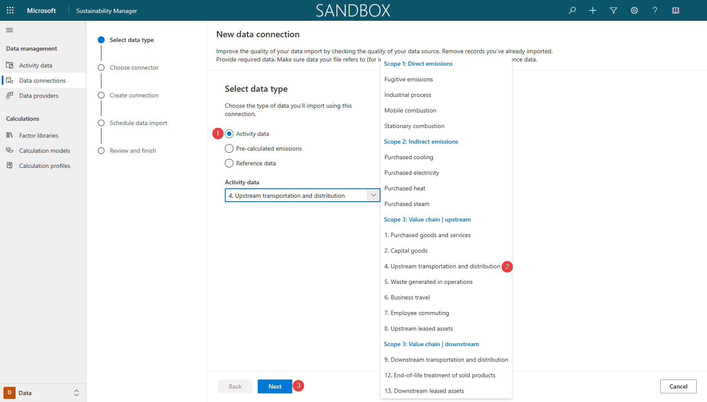](../media/upstream.png#lightbox)

1. On the **Choose connector** page, select **Excel** and then select **Next**.

1. A new dialog will open for Power Query. 

   1. Select **Upload file**.

   1. Select **Browse**.

1. On the file selection window, browse to the location of the downloaded Excel files. Select the **Scope 3 Upstream Transportation.xlsx** file and then select **Open**.

1. After the file has successfully uploaded, the existing connection will be selected automatically. Select **Next**.

   > [!NOTE]
   > If a connection isn't automatically selected, you'll need to sign in. You can find instructions on how to do so in the [Exercise - Average unit](/training/modules/sustainability-complex-calculations/exercise-average).

1. On the **Choose data** page of the Power Query wizard:

    1. Select the **Upstream transportation and distribution** Excel spreadsheet.

    1. Select **Transform data**.

   > [!div class="mx-imgBorder"]
   > [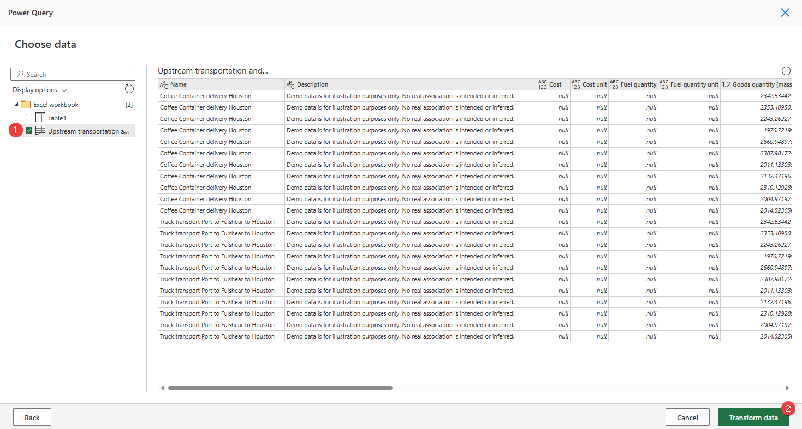](../media/transform.png#lightbox)

On the **Transform data** page of the Power Query wizard, you can complete various data and column transformations.

1. Select **Create** to start the data import process.

1. Turn on the **Replace previously imported data** toggle and then select **Next**.

1. On the **Review and finish** page, enter **Contoso Texas Scope 3 Upstream transportation** as the name for the new connection and then select **Connect**.

   > [!div class="mx-imgBorder"]
   > [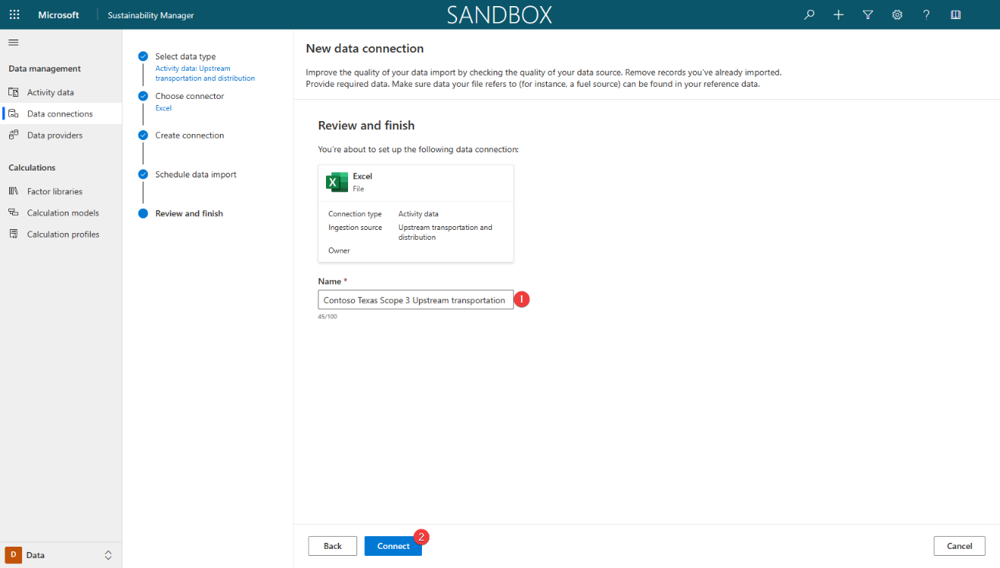](../media/connect.png#lightbox)

    The "Creating connection..." message will display in the lower part of the screen.

1. After the connection has been created, select **Done**.

1. Select **Refresh** to view the updated status, which shows as **Complete**.

1. Go to **Activity data** on the left side of the page.

1. Find the **4. Upstream transportation and distribution** option in the **Scope 3: Value chain | upstream** section and then select **View**.

   The view shows all upstream transportation and distribution data that has been imported.

1. Select the arrow next to **Organizational Unit** column and then select **Filter by**.

1. Select **Contoso Texas** from the **Filter By** dialog.

1. Select **Apply** to apply the filter to the column.

   The view will refresh, and the activity data records that were imported during this exercise will display.

   > [!div class="mx-imgBorder"]
   > [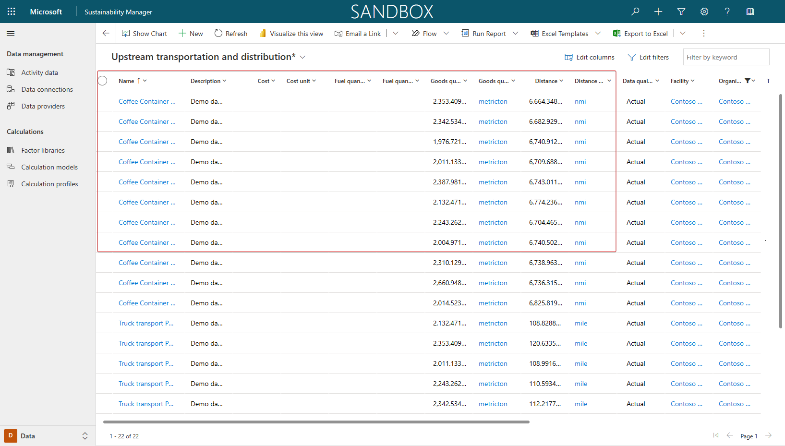](../media/imported.png#lightbox)

1. To review the new **Stop count** field, select the first record in the view and then select **Edit**.

   > [!div class="mx-imgBorder"]
   > [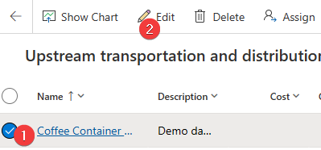](../media/select.png#lightbox)

The new **Stop count** field will display and will be populated with imported data. In this scenario, the field is at the bottom of the left section.

> [!div class="mx-imgBorder"]
> [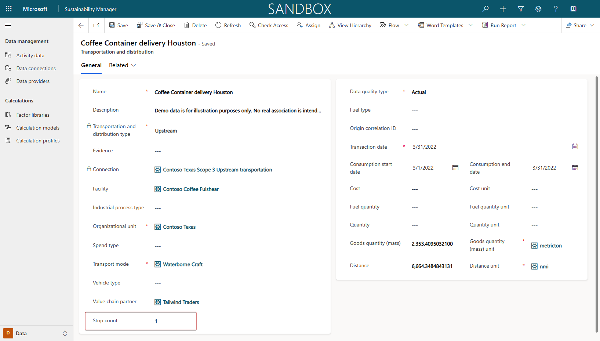](../media/count.png#lightbox)

Acting as the persona of Devon, you've completed the data import of Scope 3 Category 4 Upstream transportation and distribution. It's a crucial step to realizing the goal of recording, reporting, and reducing carbon emissions. Next, you'll create a calculation model for this data.

## Task: Create a calculation model

In this task, Devon will create a new calculation model to calculate carbon emissions for upstream transportation emissions. Devon will identify and use an existing calculation model as a template for your new calculation model.

<br />

---

:::row:::
   :::column span="1":::
      > [!div class="is-text-right"]
      > :::image border="false" type="content" source="../media/remy.png" alt-text="Artwork showing a fictitious person named Remy Morris.":::<br /> Remy Morris
   :::column-end:::
   :::column span="3":::
      > [!div class="is-text-left"]
      > Hi Devon, the ingested data looks great. We didn't receive the emissions data from our suppliers, but we have received detailed information like mass, distance, and stop count. We can use this information to perform a distance-based calculation.
   :::column-end:::
   :::column span="2":::
   :::column-end:::
:::row-end:::
:::row:::
   :::column span="2":::
   :::column-end:::
   :::column span="3":::
      > [!div class="is-text-right"]
      > Thank you for the information, Remy. I agree, a distance-based calculation would be a great fit with this data. I saw an existing calculation model in Sustainability Manager that's a close match. I'll copy it as a template for our new calculation model.
   :::column-end:::
   :::column span="1":::
      > [!div class="is-text-left"]
      > :::image border="false" type="content" source="../media/devon.png" alt-text="Artwork showing a fictitious person named Devon Torres.":::<br /> Devon Torres
   :::column-end:::
:::row-end:::

<br />

---

1. Go to **Calculation models** on the left side of the page.

1. Review the list of calculation models for an existing calculation model for Upstream transportation and distribution based on EPA guidance. During review, you notice that an existing calculation model doesn't meet all needs of Contoso, Texas. You decide to use the existing calculation model as a template to include stop count as a factor in the emission calculation.

1. Select the **Upstream transportation and distribution** calculation model.

   > [!NOTE]
   > You might need to scroll the list to find your selection.

1. Review the calculation model actions.

   The model starts by using activity data from **4. Upstream transportation and distribution**. Next, the data is passed through a conditional statement to determine if the transport mode in the activity data is a shared load. The system checks this condition by using a Power Fx expression. 

   > [!div class="mx-imgBorder"]
   > [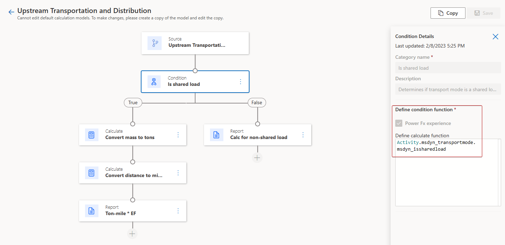](../media/condition.png#lightbox)

   When the transport mode isn't a shared load, the calculation is a straightforward distance multiplied by the respective transport mode emission factor. For more information, see [Calculation models](/industry/sustainability/calculate-calculation-models?azure-portal=true#add-a-calculation-model).

   > [!div class="mx-imgBorder"]
   > [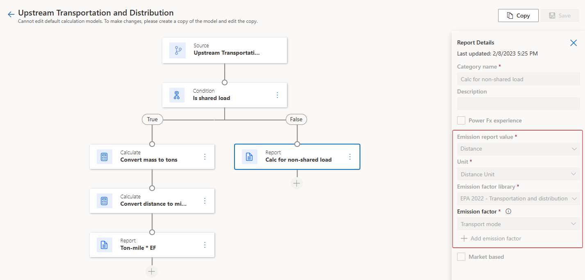](../media/emission-report.png#lightbox)

   When the transport mode is a shared load, the calculation is slightly more complex. First, the Goods quantity (mass) is converted to tons to reach a common unit.

   > [!div class="mx-imgBorder"]
   > [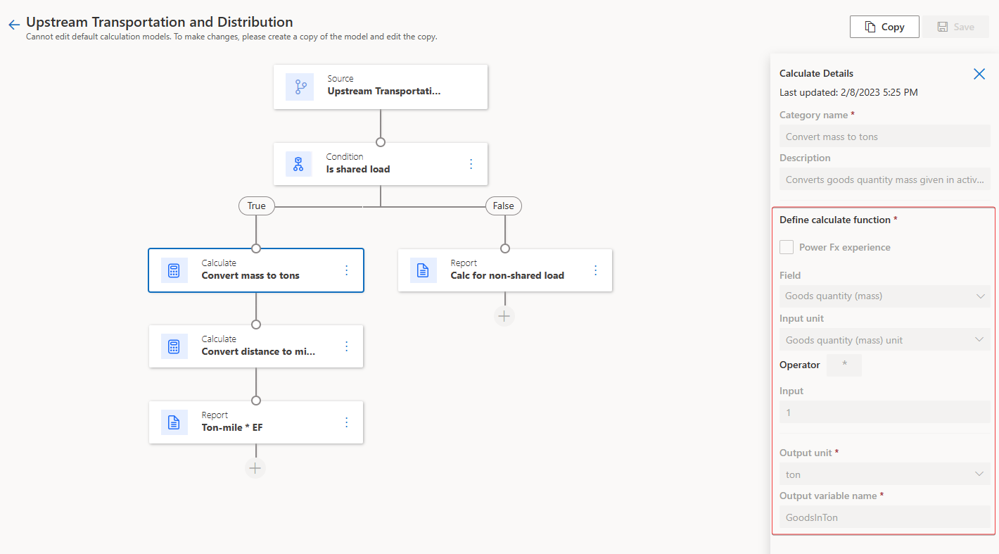](../media/define.png#lightbox)

   Second, the distance is converted to miles to reach a common unit.

   > [!div class="mx-imgBorder"]
   > [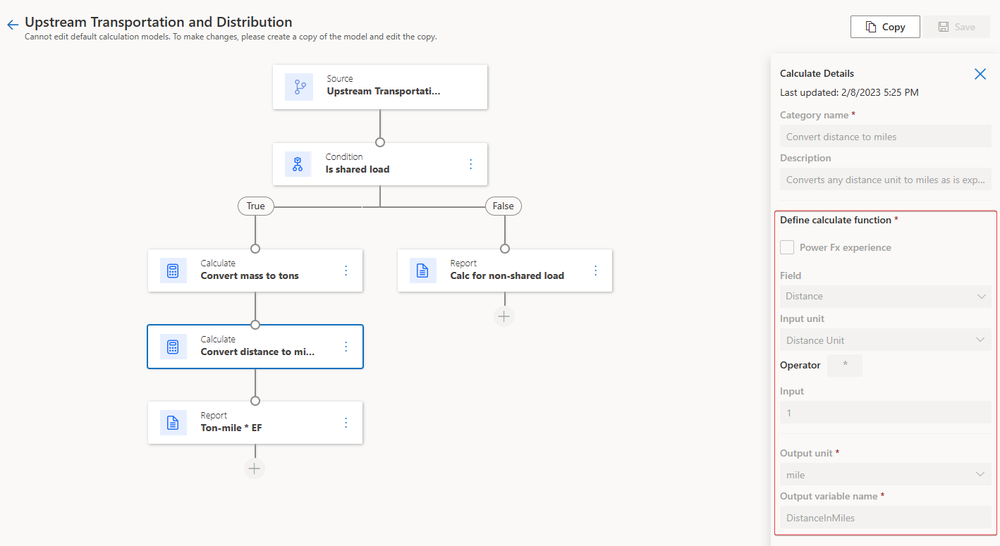](../media/miles.png#lightbox)

   Finally, the system calculates emissions by using a Power Fx expression to determine the quantity value. The calculated quantity is multiplied by the respective transport mode emission factor. For more information, see [Calculation models](/industry/sustainability/calculate-calculation-models?azure-portal=true#create-or-edit-a-calculation-model-by-using-power-fx).

   > [!div class="mx-imgBorder"]
   > [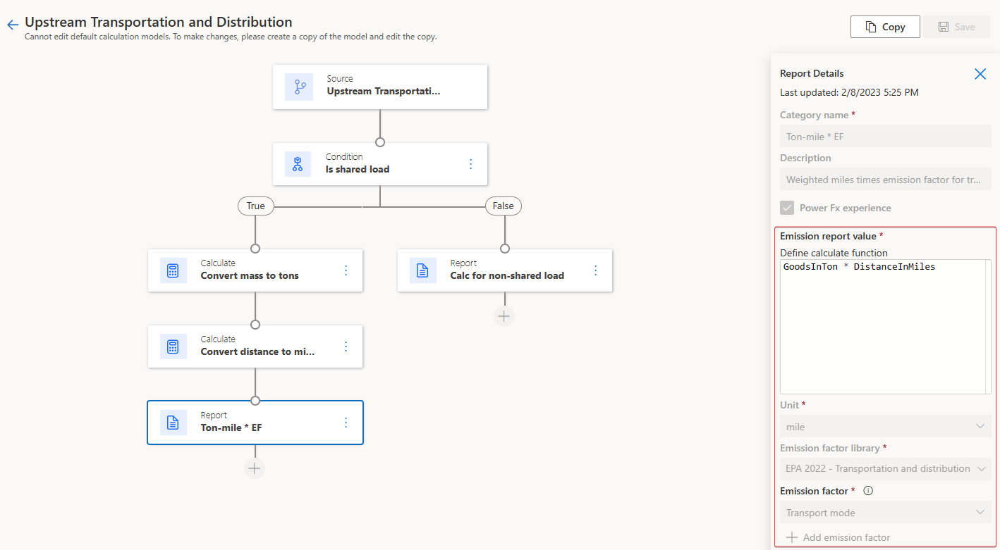](../media/weight-distance.png#lightbox)

   Contoso, Texas needs to factor the stop count into their shared load upstream transportation. To do so, you'll need to copy this **Upstream transportation and distribution** calculation model and then use it as a template, or starting point, for the new calculation model. 

   > [!NOTE]
   > You can copy any calculation model and use it as a template for a new calculation model. It is good practice, and potentially time-saving, to review your existing models to determine if any meet your requirements or if you can copy and adjust them to meet your requirements.

1. Select the **Source** action node and then select **Copy**.

   > [!div class="mx-imgBorder"]
   > [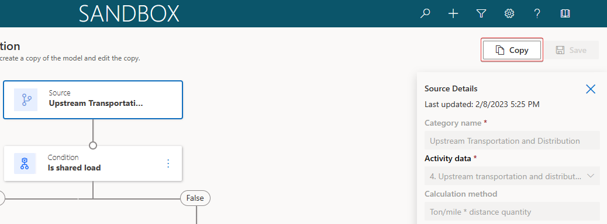](../media/copy.png#lightbox)

1. To avoid the possibility of multiple models having the same name, select the **Source** action node and update the source details with the following information:

    - **Category name** - Stop count Upstream Transportation and Distribution

    - **Calculation method** - (Ton/mile * distance quantity)/Stop count

1. Select **Save**.

   > [!div class="mx-imgBorder"]
   > [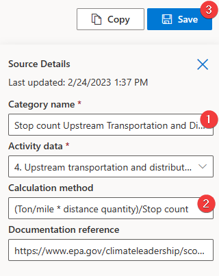](../media/details.png#lightbox)

1. Select the **Ton-mile * EF** report action.

1. To meet Contoso's requirements, you'll update the Power Fx expression that's used to calculate the quantity value with the following information:

    **Emission report value**:

      ```power-fx
      (GoodsInTon * (DistanceInMiles/Activity.new_stopcount))
      ```

      > [!NOTE]
      > If Power Fx can't find `Activity.new_stopcount`, your solution prefix might not be **new_**. You can use Power Fx intellisense and manually enter **Activity.stop**, and then you can select the correct option that appears in the list at the bottom of the editor.

1. Select **Save**.

   > [!div class="mx-imgBorder"]
   > [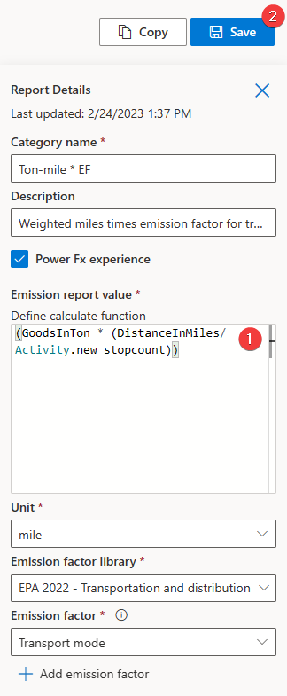](../media/ton-mile.png#lightbox)

Now, you've created a new calculation model. You played the role of Devon to use an identified calculation model as a template, and then you set up the template for the specific needs of distance-based calculation.

## Task: Create a calculation profile

In this task, Riley Ramirez will create a calculation profile by using the newly created **Stop count Upstream Transportation and Distribution** calculation model.

<br />

---

:::row:::
   :::column span="1":::
      > [!div class="is-text-right"]
      > :::image border="false" type="content" source="../media/devon.png" alt-text="Artwork showing a fictitious person named Devon Torres.":::<br /> Devon Torres
   :::column-end:::
   :::column span="3":::
      > [!div class="is-text-left"]
      > Hi Riley, could you please create a calculation profile for category 4 Upstream transportation with the Stop count Upstream Transportation and Distribution calculation model and filter the activity data to only Contoso, Texas data? Thank you!
   :::column-end:::
   :::column span="2":::
   :::column-end:::
:::row-end:::
:::row:::
   :::column span="2":::
   :::column-end:::
   :::column span="3":::
      > [!div class="is-text-right"]
      > Sure thing, Devon. I'll let you know when the profile is ready!
   :::column-end:::
   :::column span="1":::
      > [!div class="is-text-left"]
      > :::image border="false" type="content" source="../media/riley.png" alt-text="Artwork showing a fictitious person named Riley.":::<br /> Riley Ramirez
   :::column-end:::
:::row-end:::

<br />

---

1. Go to **Calculation profiles** on the left side of the page.

1. Select **+ New Calculation profile** to create a new calculation profile.

1. Populate the following information on the **New calculation profile** wizard.

   - **Calculation profile name** - Enter **Scope 3 Contoso Texas Upstream Transportation**

   - **Emission source** - Enter **4. Upstream transportation and distribution**

   - **Activity data to include in calculation** - Enter **Organizational Unit equals Contoso Texas**

   - **Calculation model** - Select **Stop Count Upstream Transportation and Distribution** from the dropdown list

   - **Schedule** - Select the **Automatically run this calculation when data is refreshed** checkbox to automatically trigger calculations when the matching activity data is refreshed

1. To create the filter, complete the following steps:

   a. Select **Add > Add row**.

   b. From the **Select a field** dropdown list, select **Organizational unit**.

   c. From the **Value** dropdown, select **Contoso Texas (Organizational unit)**.

   d. The form should resemble the following image. Select **Next**.

   > [!div class="mx-imgBorder"]
   > [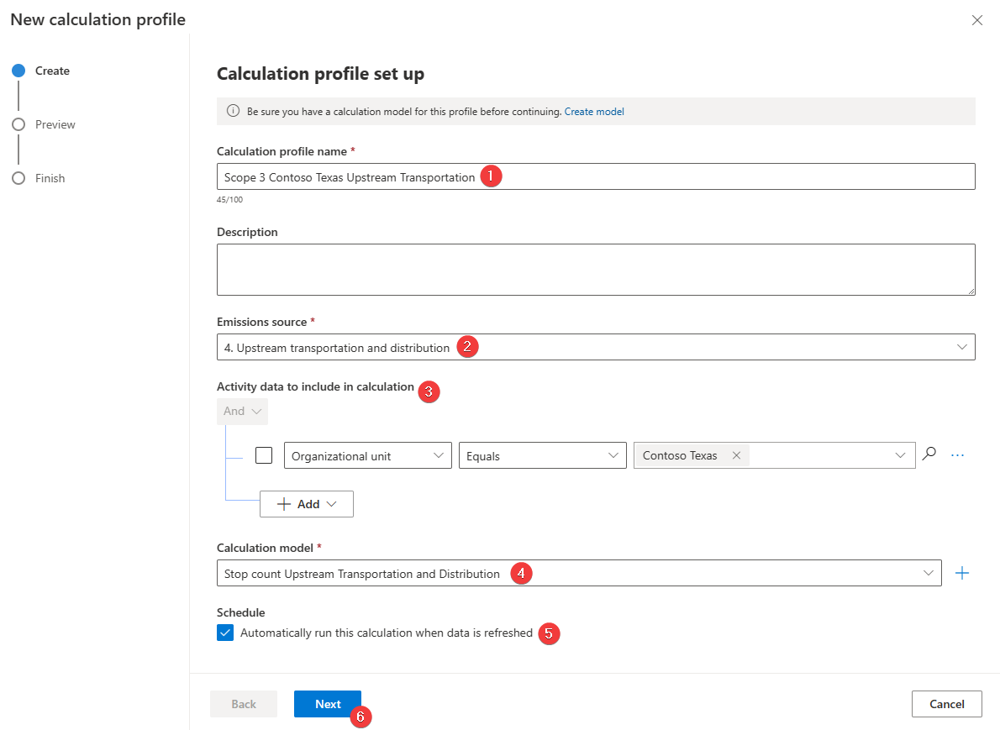](../media/calculation-profile.png#lightbox)

   On the **Preview** page of the **New calculation profile** wizard, the emissions are calculated for the first row of data that matches the **Activity data to include** filter. For more information, see [Exercise - Run calculations](/training/modules/sustainability-emissions-calculation/exercise-calculations/).

1. Select **Save** to save your calculation profile.

Acting as Riley, the IT admin, you've successfully created a calculation profile. Calculation profiles are the mechanisms by which calculation jobs are queued. You can set your calculation profiles to run automatically when matching activity data is added or updated, as in this scenario, or you can run them manually.

## Task: Perform the calculation and review the results

Devon runs the newly created calculation profile, which creates a calculation job that iterates over each activity data row that matches the calculation profile filter criteria. The calculation profile also uses the calculation model that you previously created to calculate the carbon emissions for each row. The results are stored in the **Emissions** table, which you can review after the calculations are complete.

<br />

---

:::row:::
   :::column span="1":::
      > [!div class="is-text-right"]
      > :::image border="false" type="content" source="../media/riley.png" alt-text="Artwork showing a fictitious person named Riley.":::<br /> Riley Ramirez
   :::column-end:::
   :::column span="3":::
      > [!div class="is-text-left"]
      > Hi Devon, I've created a new calculation profile named Scope 3 Contoso Texas Upstream Transportation.
   :::column-end:::
   :::column span="2":::
   :::column-end:::
:::row-end:::
:::row:::
   :::column span="2":::
   :::column-end:::
   :::column span="3":::
      > [!div class="is-text-right"]
      > Thank you, Riley! I'll run that profile to create a calculation job that iterates over each activity data row and calculates the carbon emissions for each row.
   :::column-end:::
   :::column span="1":::
      > [!div class="is-text-left"]
      > :::image border="false" type="content" source="../media/devon.png" alt-text="Artwork showing a fictitious person named Devon Torres.":::<br /> Devon Torres
   :::column-end:::
:::row-end:::

<br />

---

1. To run the calculation profile for Scope 3 Contoso Texas Upstream Transportation, follow these steps:

    1. Select **Scope 3 Contoso Texas Upstream Transportation** in the list.

    1. Select **Run calculation**.

   > [!div class="mx-imgBorder"]
   > [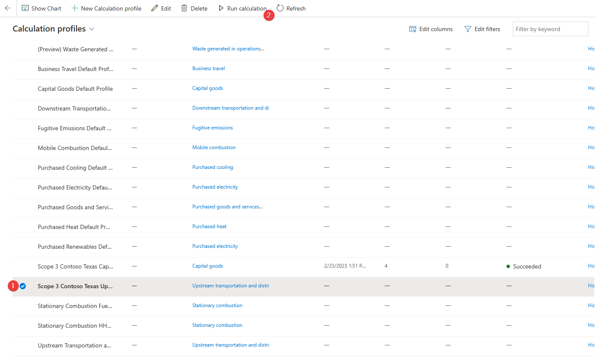](../media/run-calculation.png#lightbox)

1. After several minutes (approximately three), the calculation job should be completed. Select **Refresh** to check the status of the calculation job. The calculation profile should now have a status of **Succeeded**.

1. In the lower-left corner, change the **Area** to **Analytics**.

1. Go to **All emissions** on the left side of the page. The view shows all emissions that have been calculated or directly imported.

1. Select the arrow next to the **Organizational Unit** column and select **Filter by**.

1. Select **Contoso Texas** from the **Filter By** dialog.

1. Select **Apply** to apply the filter to the column.

1. After a few moments, the view will refresh, and the calculated emissions data for each activity data record that was imported in the previous tasks will display. Scroll right to view the CO<sub>2</sub>e carbon emission values.

You've now created and run calculation profiles. Calculation profiles are the last step in calculating and recording your carbon emissions in Sustainability Manager.

Acting as various personas, you completed the following tasks in this exercise:

- Riley, the IT admin, extended the **Transportation and distribution** table to accommodate the **Stop count** field.

- Devon, the sustainability specialist, performed the data ingestion of upstream transportation data that Remy, the emissions analyst, prepared.

- Devon reviewed the default calculation models and used the Upstream Transportation and Distribution calculation model as a template.

- Riley built the calculation profile for the Contoso, Texas organizational unit by using the calculation model that Devon set up.

- Devon ran the calculation profile and validated the emissions data.
