In this exercise, you'll ingest Scope 3 Category 1 data and you'll complete hybrid method carbon emission calculations. This exercise will build on the knowledge that you gained in the [Set up a sustainability solution using Microsoft Sustainability Manager](/training/paths/create-sustainability-solution/) module and will serve as an introduction to the hybrid method calculation of Scope 3 Category 1 purchased goods and services calculations. Additionally, you'll create a new data field that the organization requires to calculate their Scope 3 Category 1 carbon emissions. 

Contoso Texas has received a carbon emission study for Fourth Coffee’s consortium farms. This study is considered as supplier-specific data, allowing Contoso Texas to use the supplier-specific method for consortium farms. However, Fourth Coffee also sources coffee beans from non-consortium farms, where a carbon emission study hasn't been conducted. To calculate the emissions for these non-consortium farms, Contoso Texas needs to use the spend-based method. Contoso Texas will use the hybrid method, combining the supplier-specific and spend-based methods of calculation to calculate the carbon emissions more accurately for the coffee beans that they've purchased from Fourth Coffee.  

## Task: Create a new field

In this task, Riley creates a new field to support the extra data that's required from the purchased goods data spreadsheet. This data field will be used later in the carbon emission calculation. It ensures that Contoso Texas is accounting for the carbon emissions by differentiating between farms that belong to the consortium and the farms that don't belong to the consortium.

<br />

---

:::row:::
   :::column span="1":::
      > [!div class="is-text-right"]
      > :::image border="false" type="content" source="../media/remy.png" alt-text="Artwork showing a fictitious person named Remy Morris.":::<br /> Remy Morris
   :::column-end:::
   :::column span="3":::
      > [!div class="is-text-left"]
      > Hi Devon, our coffee bean supplier, Fourth Coffee, has conducted a study of their consortium farms, which practices sustainable farming methods. They've separated the purchase information for consortium farms and non-consortium farms on their invoice. We need to track which type of farm that each purchase information belongs to.
   :::column-end:::
   :::column span="2":::
   :::column-end:::
:::row-end:::
:::row:::
   :::column span="1":::
      > [!div class="is-text-right"]
      > :::image border="false" type="content" source="../media/devon.png" alt-text="Artwork showing a fictitious person named Devon Torres.":::<br /> Devon Torres
   :::column-end:::
   :::column span="3":::
      > [!div class="is-text-left"]
      > Sure, Remy, I'll ask Riley, our IT admin, to help us extend the Sustainability Manager data model for this new requirement. <br /><br /> Hi Riley, could you please extend the Purchased goods and services data model to track whether the data is for consortium farms or not?
   :::column-end:::
   :::column span="2":::
   :::column-end:::
:::row-end:::
:::row:::
   :::column span="2":::
   :::column-end:::
   :::column span="3":::
      > [!div class="is-text-right"]
      > Sure thing, Devon, I'll create a new yes/no field to identify consortium farms!
   :::column-end:::
   :::column span="1":::
      > [!div class="is-text-left"]
      > :::image border="false" type="content" source="../media/riley.png" alt-text="Artwork showing a fictitious person named Riley.":::<br /> Riley Ramirez
   :::column-end:::
:::row-end:::

<br />

---

1. While using an InPrivate or Incognito window, go to [Microsoft Power Apps](https://make.powerapps.com/?azure-portal=true).

1. Select the correct Sustainability environment from the **Environment** dropdown menu in the upper-right corner.

1. Select **Solutions** and then select the solution called Contoso Texas that you created in the previous exercise [**Task: Create a new field**](/training/modules/sustainability-complex-calculations/exercise-distance). The Solution editor should open.

   > [!div class="mx-imgBorder"]
   > [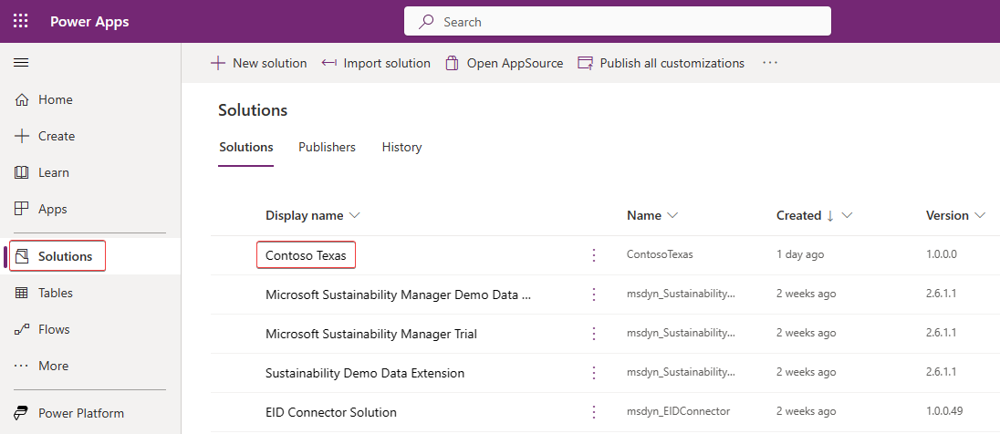](../media/contoso-texas.png#lightbox)

1. Select **+ Add existing** and then select **Table**.

1. To add an existing table, follow these steps:

   1. Search for **Purchased good and service**.

   1. Select the **Purchased good and service** table on the list.

   1. Select **Next**.

1. To include only specific objects that are related to the table, select the **Select objects** option.

   > [!div class="mx-imgBorder"]
   > [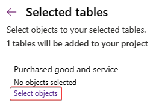](../media/select-objects.png#lightbox)

1. Because only the main form is required, complete the following steps:

   1. Select the **Forms** tab.

   1. Select the **Information** row where the **Form type** is **Main**.

   1. Select **Add**.

   > [!div class="mx-imgBorder"]
   > [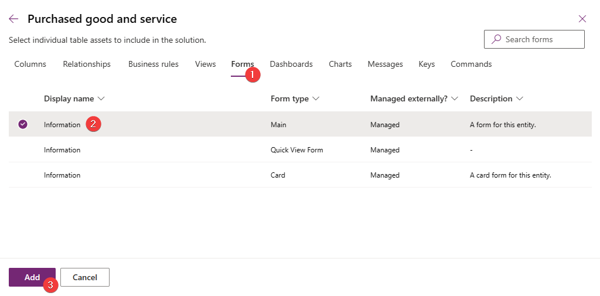](../media/form.png#lightbox)

1. View the **Selected tables** dialog to verify that one form is selected and then select **Add**.

1. To modify the **Transportation and distribution** table, follow these steps:

   1. Select the **Purchased good and service** table in the solution view.

   1. Select **Edit**.

1. On the table solution view, select **New > Column**.

1. A new dialog will open for you to create a new column. Enter the following information:

   - **Name** - Consortium farms

   - **Data type** - Choice > Yes/No

   - **Required** - Optional

   - **Default choice** - No

1. Select **Save**.

   > [!div class="mx-imgBorder"]
   > [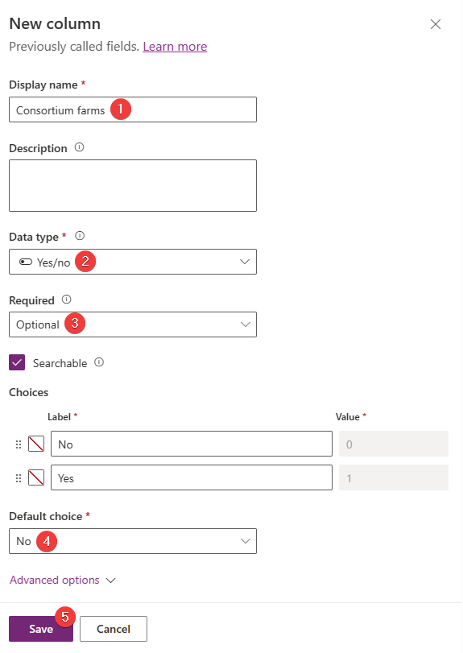](../media/new-column.png#lightbox)

1. Add the field to the existing **Information** form by locating the **Data Experiences** card on the table solution view and then selecting the **Forms** link.

1. On the **Forms** list, select the **Information** form and then select **Edit**.

1. A form editor will open with the **Information** form loaded. In the **Table columns** section, locate the new **Consortium farms** field and then select the field name to add to the **Information** form.

   > [!div class="mx-imgBorder"]
   > [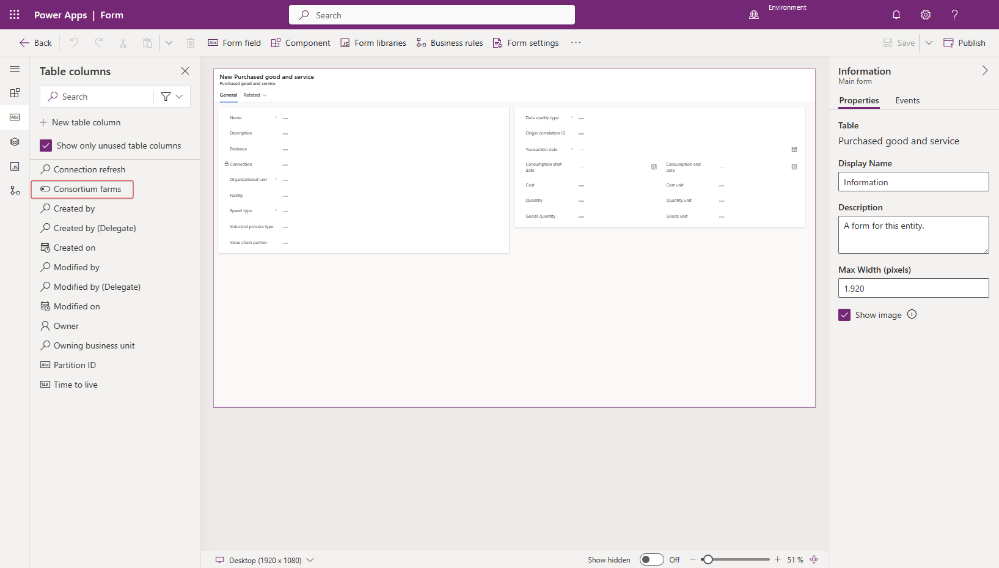](../media/consortium.png#lightbox)

   The **Consortium farms** field will be added to the form and highlighted.

1. Select **Publish**.

Acting as Riley, you've completed the task of creating a new field called **Consortium farms** by using the previously created solution.

## Task: Ingest data

In this task, Devon will import an Excel spreadsheet for Scope 3 Category 1 goods and services. This task brings in the coffee that was purchased from Fourth Coffee for the Houston and Fulshear facilities into the Scope 3 Category 1 goods and services activity data.

> [!IMPORTANT]
> Ensure that you've completed the previous exercise to create reference data. The data import process requires all reference data to exist, and the process is case sensitive. Additionally, make sure that the reference data that was previously added has the exact case formatting as is found in the exercise. Failure to do so will result in errors during the data import process.

<br />

---

:::row:::
   :::column span="1":::
      > [!div class="is-text-right"]
      > :::image border="false" type="content" source="../media/riley.png" alt-text="Artwork showing a fictitious person named Riley.":::<br /> Riley Ramirez
   :::column-end:::
   :::column span="3":::
      > [!div class="is-text-left"]
      > Hi Devon, I've created the new yes/no field named Consortium farms on the Purchased good and service table.
   :::column-end:::
   :::column span="2":::
   :::column-end:::
:::row-end:::
:::row:::
   :::column span="2":::
   :::column-end:::
   :::column span="3":::
      > [!div class="is-text-right"]
      > Thank you, Riley, I can start the data ingestion process now.
   :::column-end:::
   :::column span="1":::
      > [!div class="is-text-left"]
      > :::image border="false" type="content" source="../media/devon.png" alt-text="Artwork showing a fictitious person named Devon Torres.":::<br /> Devon Torres
   :::column-end:::
:::row-end:::

<br />

---

1. In the lower-left corner, change the **Area** to **Data**.

1. Go to **Data connections** on the left side of the page.

1. On the **Connections** view, select **+ New**.

1. On the **New data connection** wizard, complete these steps:

    1. Select **Activity data** from data type screen.

    1. Select the **1. Purchased goods and services** option from the **Activity data** dropdown list and then select **Next**.

   > [!div class="mx-imgBorder"]
   > [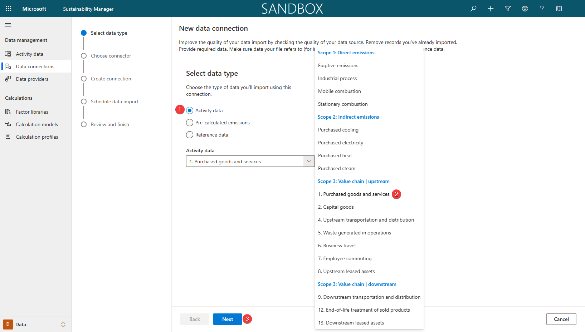](../media/activity.png#lightbox)

1. On the **Choose connector** page, select **Excel** and then select **Next**.

1. On the new dialog that opens for Power Query, follow these steps:

    1. Select **Upload file**.

    1. Select **Browse**.

    1. On the file selection window, browse to the location of the downloaded Excel files. Select the **Scope 3 Goods and Services.xlsx** file and then select **Open**.

1. After the file has successfully uploaded, the existing connection will be selected automatically. Select **Next**.

   > [!NOTE]
   > If a connection isn't automatically selected, you'll need to sign in. You can find instructions on how to do so in the [**Exercise - Average unit**](/training/modules/sustainability-complex-calculations/exercise-average).

1. Complete the following steps on the **Choose data** page of the Power Query wizard:

    1. Select the **All purchased goods and services** sheet.

    1. Select **Transform data**.

1. Select **Create** to start the data import process.

1. Turn on the **Replace previously imported data** toggle and then select **Next**.

1. On the **Review and finish** page, enter a name for the new connection, such as **Contoso Texas Scope 3 Purchased goods and services**, and then select **Connect**.

   > [!div class="mx-imgBorder"]
   > [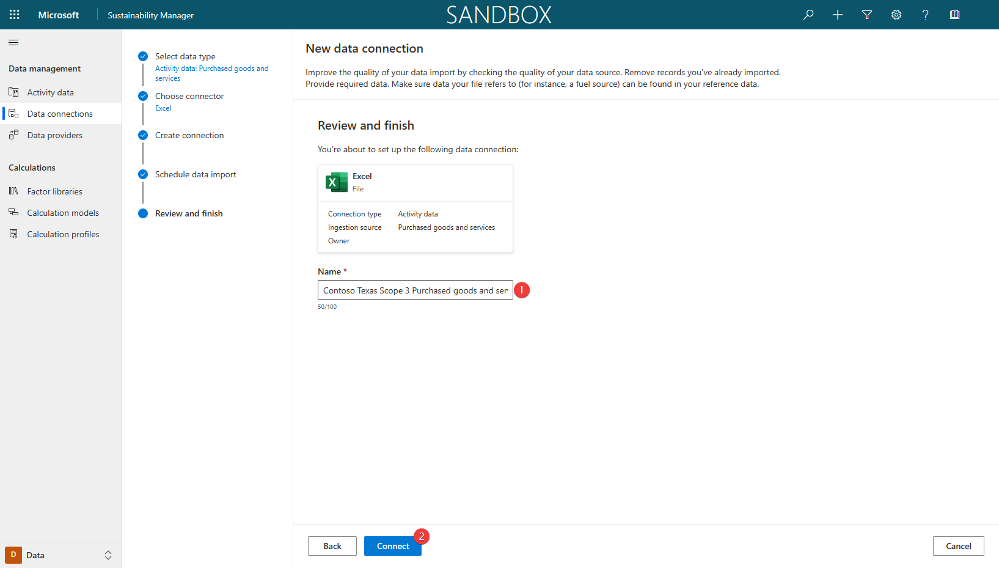](../media/schedule.png#lightbox)

    The "Creating connection..." message will display in the lower part of the window.

1. After the connection has been created, select **Done**.

1. Select **Refresh** to view the updated status, which should show as **Complete**.

1. Go to **Activity data** on the left side of the page.

1. Find the **1. Purchased goods and services** option in the **Scope 3: Value chain | upstream** section and then select **View**. The view shows all purchased goods and services data that's been imported.

1. Select the arrow next to the **Organizational Unit** column and then select **Filter by**.

   > [!NOTE]
   > You might need to scroll left or right to find the **Organizational unit** column.

1. Select **Contoso Texas** from the **Filter By** dialog.

1. Select **Apply** to apply the filter to the column.

   The view will refresh, and the activity data records that were imported during this exercise will display.

   > [!div class="mx-imgBorder"]
   > [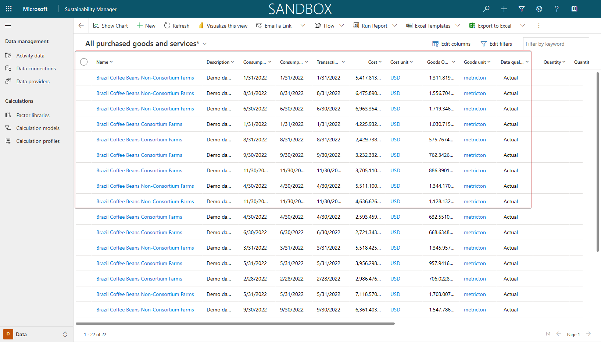](../media/imported-records.png#lightbox)

1. To review the new **Consortium farms** field, select the first record in the view and then select **Edit**.

   The new **Consortium farms** field will display and should be populated with imported data. In this scenario, the field appears at the bottom of the left section.

   > [!div class="mx-imgBorder"]
   > [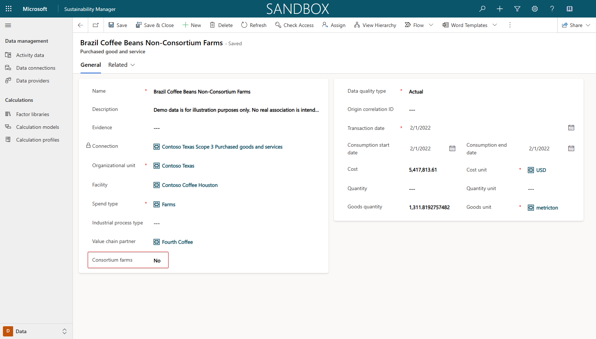](../media/no-consortium.png#lightbox)

Acting as the persona of Devon, you've completed the data import of Scope 3 Category 1 purchased goods and services. It's an important step to realizing the goal of recording, reporting, and reducing carbon emissions. Next, you'll create the factor library and a calculation model for this data.

## Task: Factor library and calculation model

In this task, Remy will create an emission factor library to define the emissions for the beans that have been purchased from the consortium farms. The consortium farms have paid for a study to be conducted to determine the average amount of CO<sub>2</sub>e that's generated for each metric ton of harvested coffee beans. Contoso Texas must rely on EEIO data to determine the carbon emissions for non-consortium farms because no study has been conducted on those farms.

<br />

---

:::row:::
   :::column span="1":::
      > [!div class="is-text-right"]
      > :::image border="false" type="content" source="../media/remy.png" alt-text="Artwork showing a fictitious person named Remy Morris.":::<br /> Remy Morris
   :::column-end:::
   :::column span="3":::
      > [!div class="is-text-left"]
      > Hi Devon, I've reviewed the study that our coffee bean supplier, Fourth Coffee, has conducted for the consortium farms. Fourth Coffee determined that the consortium farms, on average, emit 150 kg of CO<sub>2</sub>e per metric ton of coffee beans harvested. We need to account for it in our category 1 emissions.
   :::column-end:::
   :::column span="2":::
   :::column-end:::
:::row-end:::
:::row:::
   :::column span="2":::
   :::column-end:::
   :::column span="3":::
      > [!div class="is-text-right"]
      > Thank you for that information, Remy. I'll create a new factor library to account for the supplier data and use the hybrid calculation method to calculate supplier-driven data for consortium farms and spend-based data for non-consortium farms.
   :::column-end:::
   :::column span="1":::
      > [!div class="is-text-left"]
      > :::image border="false" type="content" source="../media/devon.png" alt-text="Artwork showing a fictitious person named Devon Torres.":::<br /> Devon Torres
   :::column-end:::
:::row-end:::

<br />

---

1. Go to **Factor libraries** on the left side of the page.

1. Select **Create new library**.

1. Use the following information to populate the fields on the new factor library:

   - **Name** - Use to identify the factor library in the list. Enter **Consortium farms emission library**.

   - **Description** - Use to provide more information about the factor library. Enter **Average data emissions from consortium farms**.

   - **Type** - Use to identify if this factor library is a Custom, Demo (sample), or Standard (preloaded based on EPA libraries). Enter **Custom**.

   - **Library type** - Use to switch the library type between **Emission** or **Estimation** library. You can use emission libraries to calculate emission gases, and you can use estimation libraries to create estimated conversions from one unit type to another, such as 100 miles driven to kWh. Select **Emission factor library**.

1. Select **Save** to save the record.

   > [!div class="mx-imgBorder"]
   > [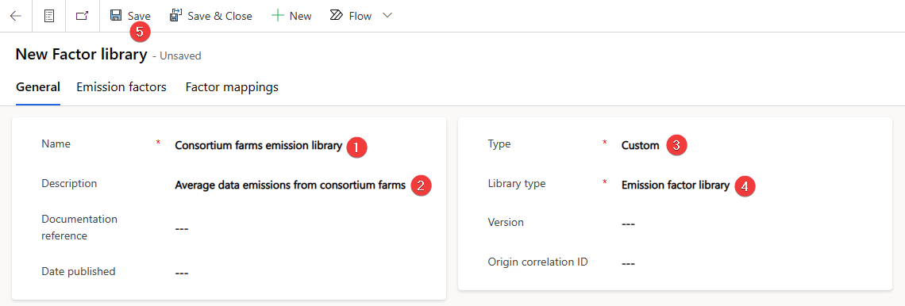](../media/factor-library.png#lightbox)

1. Select the **Emission factors** tab.

1. Select **+ New Emission factor**.

1. Review the Fourth Coffee Brazil Consortium Farms study and then populate the following information on the **New Emission factor** page:

   - **Factor library** - Use to link the emission factor to the factor library. It defaults if you select **New Emission factor** while you're in a factor library. Enter **Consortium Farms**.

   - **Name** - Use to identify the emission factor in the list. Enter **Fourth Coffee Brazil Consortium Farms**.

   - **Unit** - Use to identify the common unit of measure for this emission factor. Enter **metricton**.

   - **CO<sub>2</sub>E** - Use to determine the quantity of CO<sub>2</sub>e for each CO<sub>2</sub>e unit. Enter **150.00**.

   - **CO<sub>2</sub>E unit** - Use to specify the CO<sub>2</sub>e unit of measure for this emission factor. Enter **kg**.

1. Select **Save & Close** to save the record.

   > [!div class="mx-imgBorder"]
   > [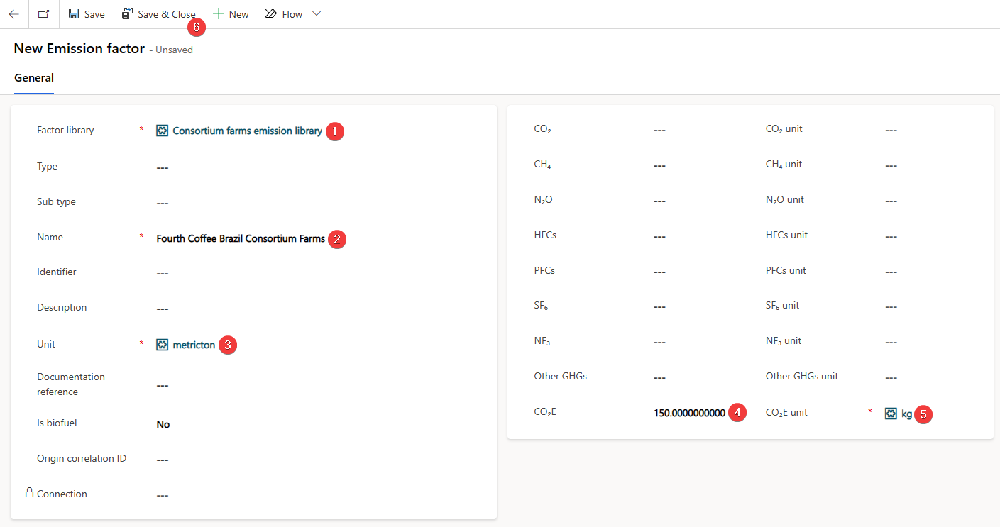](../media/emission-factor.png#lightbox)

   The new emission factor states that for every metric ton, 150 kg of CO<sub>2</sub>e is released.

   Devon creates a new calculation model to calculate carbon emissions for coffee that was purchased from their coffee bean supplier, Fourth Coffee. Devon has reviewed the existing calculation models and hasn't found a similar model. Therefore, Devon creates a new calculation model to calculate emissions that are generated by Scope 3 Category 1 purchased goods and services for consortium and non-consortium farms. Devon uses the factor library and emission factor that were recently created.

1. Go to **Calculation models** on the left side of the page.

1. Select **+ New** to create a new calculation model.

   The new calculation mode page opens. A source action is added by default.

1. Populate the **Source** action with the following data:

   - **Category name** - Use for identifying the calculation model in the list. Enter **Purchased Coffee Fourth Coffee Brazil**.

   - **Activity data** - Use to identify which type of activity data that the model processes. Enter **1. Purchased goods and services**.

1. Select **Save** to save the record.

   > [!div class="mx-imgBorder"]
   > [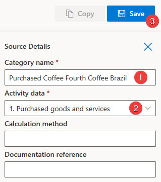](../media/goods.png#lightbox)

1. Select the plus (**+**) sign to add a new action to the calculation model.

   > [!div class="mx-imgBorder"]
   > [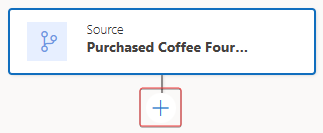](../media/plus.png#lightbox)

1. Select **Condition** on the list of available actions.

1. A new **Condition** action is added to the calculation model. Select and set up that action.

   You can use the **Condition** action to branch the emission calculation logic based on a condition.

1. Populate the **Condition** action with the following information:

   - **Category name** - Use for identifying the action in the calculation model. Enter **If Consortium farm**.

   - **Power Fx experience** - Use to enable or disable the Power Fx editor. Select the checkbox.

   - **Define condition function** - Use to define the condition to branch on; it must result in **True** or **False**. Use the following code block:
 
     ```power-fx
      Activity.new_consortiumfarms
      ```


   > [!NOTE]
   > You can't select **Save** until both sides of the **Condition** branch have actions populated.

   > [!div class="mx-imgBorder"]
   > [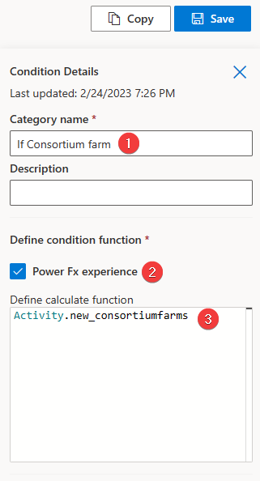](../media/condition-details.png#lightbox)

1. On the **True** side of the **Condition** branch, select the plus (**+**) sign to add a new action to the calculation model.

   > [!div class="mx-imgBorder"]
   > [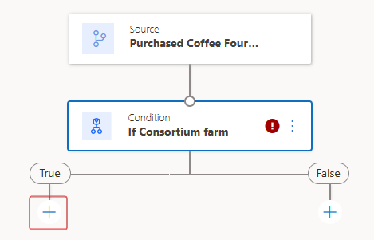](../media/true.png#lightbox)

1. Select **Report** on the list of available actions.

1. A new **Report** action is added to the calculation model. Select and set up that action.

1. Populate the **Report** action with the following data:

   - **Category name** - Use to identify the action in the calculation model. Enter **Goods Quantity * EF (Fourth Coffee Brazil Consortium Farms)**.

   - **Emission report value** - Use to identify which field from the activity data type should be used to retrieve the value that's used in the emission calculation. Select **Goods Quantity**.

   - **Unit** - Use to identify the field from the activity data type to be used to retrieve the unit type of the value. Alternatively, you can specify a unit to always be used in the action, regardless of which unit is specified on the activity date type. Select **Goods unit**.

   - **Emission factor library** - Use to identify which factor library is used to identify the emission factor. Select **Consortium farms emission library**.

   - **Emission factor** - Use to identify which emission factor or factor mapping is used to calculate the emissions. Select **Fourth Coffee Brazil Consortium Farms**.

   > [!div class="mx-imgBorder"]
   > [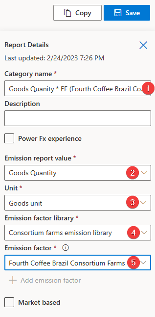](../media/quantity.png#lightbox)

1. On the **False** side of the **Condition** branch, select the plus (**+**) sign to add a new action to the calculation model.

1. Select **Report** on the list of available actions.

1. A new **Report** action is added to the calculation model. Select and set up that action.

1. Populate the **Report** action with the following data:

   - **Category name** - Enter **Cost * EF (Spend Type)**

   - **Emission report value** - Select **Cost**

   - **Unit** - Select **Cost unit**

   - **Emission factor library** - Select **EPA 2022 - Supply chain GHG emission factor - v1.1**

   - **Emission factor** - Select **Spend type**

   > [!div class="mx-imgBorder"]
   > [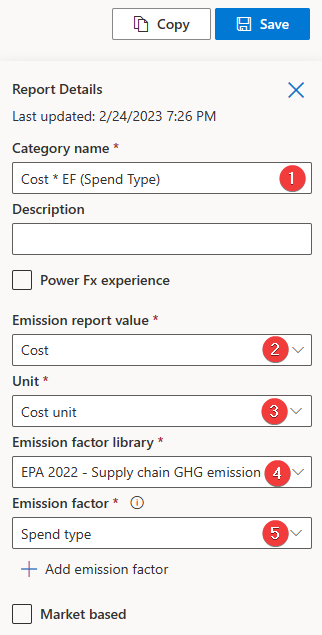](../media/spend-type.png#lightbox)

1. Select **Save** at the top of the calculation model when both sides of the condition have been populated.

Acting as Devon, you've successfully created a new calculation model. In this calculation model, you've used Power Fx expressions, an important differentiator for Microsoft Cloud for Sustainability. Power Fx expressions allow the calculation models to be more dynamic by using an Excel-like programming language directly in the calculation model.

## Task: Create a calculation profile

In this task, Riley will create a calculation profile for the Scope 3 Category 1 purchased goods and services for the year 2022. Riley will use the calculation model that was previously defined in this exercise and will filter the profile to only activity data for Contoso, Texas. These filters will ensure that only the goods and services that have been purchased by Contoso, Texas are included in the calculation job.

<br />

---

:::row:::
   :::column span="1":::
      > [!div class="is-text-right"]
      > :::image border="false" type="content" source="../media/devon.png" alt-text="Artwork showing a fictitious person named Devon Torres.":::<br /> Devon Torres
   :::column-end:::
   :::column span="3":::
      > [!div class="is-text-left"]
      > Hi Riley, could you please create a calculation profile for Category 1 purchased goods and services with the Purchased Coffee Fourth Coffee Brazil calculation model and filter the activity data to include only Contoso, Texas data? Thank you!
   :::column-end:::
   :::column span="2":::
   :::column-end:::
:::row-end:::
:::row:::
   :::column span="2":::
   :::column-end:::
   :::column span="3":::
      > [!div class="is-text-right"]
      > Sure thing, Devon. I'll let you know when the profile is ready!
   :::column-end:::
   :::column span="1":::
      > [!div class="is-text-left"]
      > :::image border="false" type="content" source="../media/riley.png" alt-text="Artwork showing a fictitious person named Riley.":::<br /> Riley Ramirez
   :::column-end:::
:::row-end:::

<br />

---

1. Go to **Calculation profiles** on the left side of the page.

1. Select **New Calculation profile** to create a new calculation profile.

1. Populate the following information on the **New calculation profile** wizard.

   - **Calculation profile name** - Enter **Scope 3 Contoso Texas Purchased Goods**

   - **Emission source** - Select **1. Purchased goods and services**

   - **Activity data to include in calculation** - Select **Organizational Unit Equals Contoso Texas**

   - **Calculation model** - Select **Purchased Coffee Fourth Coffee Brazil** from the dropdown list

   - **Schedule** - Select the **Automatically run this calculation when data is refreshed** checkbox

1. To create the filter, do the following:

   1. Select **Add > Add row**.

   1. In the **Select a field** dropdown list, select **Organizational unit**.

   1. In the **Value** dropdown list, select **Contoso Texas (Organizational unit)**.

1. Select **Next**.

   > [!div class="mx-imgBorder"]
   > [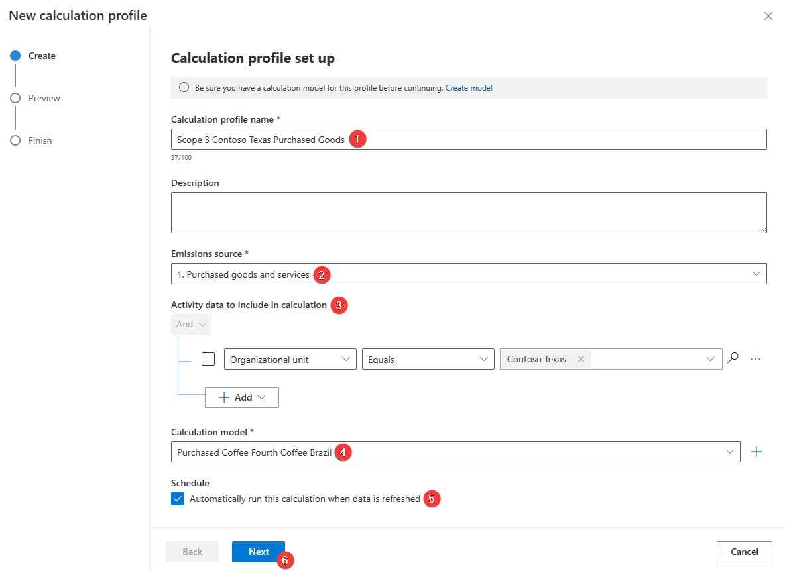](../media/calculation-model.png#lightbox)

   On the preview page of the **New calculation profile** wizard, the emissions are calculated for the first row of data that matches the **Activity data to include** filter. For more information, see [Exercise - Run calculations](/training/modules/sustainability-emissions-calculation/exercise-calculations).

1. Select **Save** to save your calculation profile.

As the persona of Riley, you've created a calculation profile. Calculation profiles are the mechanisms by which calculation jobs are queued. You can set your calculation profiles to run automatically when matching activity data is added or updated, as in this scenario, or you can run them manually.

## Task: Perform the calculation and review the results

Devon runs the newly created calculation profile for the purchased goods and services by Contoso, Texas. This calculation profile creates a calculation job that iterates over each activity data row that matches the calculation profile filter criteria. Additionally, the profile uses the calculation model that you previously created in this exercise to calculate the carbon emissions for each row. The results are stored in the **Emissions** table, which you can review after the calculations are complete.

<br />

---

:::row:::
   :::column span="1":::
      > [!div class="is-text-right"]
      > :::image border="false" type="content" source="../media/riley.png" alt-text="Artwork showing a fictitious person named Riley.":::<br /> Riley Ramirez
   :::column-end:::
   :::column span="3":::
      > [!div class="is-text-left"]
      > Hi Devon, I've created a new calculation profile named Scope 3 Contoso Texas Purchased Goods.
   :::column-end:::
   :::column span="2":::
   :::column-end:::
:::row-end:::
:::row:::
   :::column span="2":::
   :::column-end:::
   :::column span="3":::
      > [!div class="is-text-right"]
      > Thank you, Riley! I'll run that profile to create a calculation job that iterates over each activity data row and then calculate the carbon emissions for each row.
   :::column-end:::
   :::column span="1":::
      > [!div class="is-text-left"]
      > :::image border="false" type="content" source="../media/devon.png" alt-text="Artwork showing a fictitious person named Devon Torres.":::<br /> Devon Torres
   :::column-end:::
:::row-end:::

<br />

---

1. To run the calculation profile for Scope 3 Contoso Texas Purchased Goods, follow these steps:

   1. Select **Scope 3 Contoso Texas Purchased Goods** in the list.

   1. Select **Run calculation**.

1. After several minutes (approximately three), the calculation jobs should be completed. Select **Refresh** to check the status of the calculation jobs. The two calculation profiles should now have a status of **Succeeded**.

1. In the lower-left corner, change the **Area** to **Analytics**.

1. Go to **All emissions** on the left side of the page.

   The view shows all emissions that have been calculated or directly imported.

1. Select the arrow next to the **Organizational Unit** column and then select **Filter by**.

1. Select **Contoso Texas** from the **Filter By** dialog.

1. Select **Apply** to apply the filter to the column.

1. The view will refresh, and the calculated emissions data for each activity data record that was imported in the previous tasks are shown. Scroll to view the CO<sub>2</sub>E carbon emission values.

You've now created and run a calculation profile, acting as Devon. Running calculation profiles is the final step in calculating and recording your carbon emissions in Sustainability Manager. Now, you can report and reduce your carbon emissions, acting as Devon. It might take 30 minutes for your emissions to appear in the reporting areas.

Working as various personas, you completed the following tasks in this exercise:

- Riley, the IT admin, extended the **Purchased good and service** table to accommodate the consortium farms.

- Devon, the sustainability specialist, performed the data ingestion of purchased goods and services Excel spreadsheet that Remy, the emissions analyst, prepared.

- Devon created a new emission factor library for the consortium farms and created a hybrid calculation model.

- Riley built the calculation profile for the Contoso, Texas organizational unit by using the calculation model that Devon set up.

- Devon ran the calculation profile and validated the emissions data.
