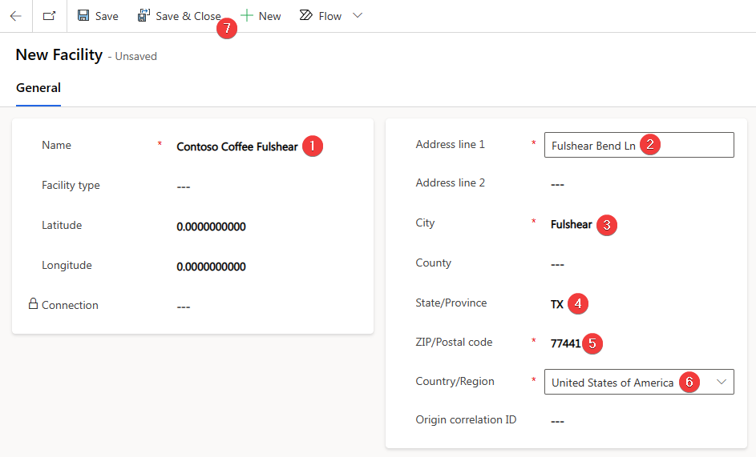

In this exercise, you'll set up the Contoso, Texas profile along with the Houston and Fulshear facilities. For more information, see [Set up a company profile](/industry/sustainability/setup-company-profile/?azure-portal=true).

## Prerequisite
To complete this exercise, you'll need to have the Microsoft Sustainability Manager environment set up with the [Set up your training environment](/training/paths/create-sustainability-solution/) fictional scenario demo data.

## Task: Access the Sustainability Manager application

In this task, Jessie will provide Devon and Remy the steps that they need to access the Sustainability Manager application.

 

---

:::row:::
   :::column span="1":::
      > [!div class="is-text-right"]
      > :::image border="false" type="content" source="../media/jessie.png" alt-text="Artwork showing a fictitious person named Jessie Irwin.":::  Jessie Irwin
   :::column-end:::
   :::column span="3":::
      > [!div class="is-text-left"]
      > Hi Devon and Remy, I'm Jessie.  I’ll walk you through the steps to access the Microsoft Sustainability Manager.
   :::column-end:::
   :::column span="2":::
   :::column-end:::
:::row-end:::

 

---

1. While using an InPrivate or Incognito window, go to [Microsoft Power Apps](https://make.powerapps.com/?azure-portal=true).

1. Select the correct sustainability environment from the **Environment** dropdown menu in the upper-right corner.

1. On the left side of the page, select **Apps**.

1. Open the **Sustainability Manager** application.

   > [!div class="mx-imgBorder"]
   > 

This selection will take you to the **Home** page for Microsoft Sustainability Manager, where you can find the area navigation menu in the lower-left corner of your screen.

> [!div class="mx-imgBorder"]
> 

Acting as Jessie's persona, you've now successfully provided instructions to Devon and Remy on how to access the Sustainability Manager application. 

## Task: Set up the company facilities

In this task, Devon sets up the Contoso, Texas organizational unit and the new Houston and Fulshear facilities for Contoso Coffee in Sustainability Manager.

 

---

:::row:::
   :::column span="1":::
      > [!div class="is-text-right"]
      > :::image border="false" type="content" source="../media/remy.png" alt-text="Artwork showing a fictitious person named Remy Morris.":::  Remy Morris
   :::column-end:::
   :::column span="3":::
      > [!div class="is-text-left"]
      > Hi Devon, we need to begin accounting for Scope 3 carbon emissions at Contoso, Texas. Please set up Contoso Texas as an organizational unit and set up the Houston and Fulshear facilities. Thank you!
   :::column-end:::
   :::column span="2":::
   :::column-end:::
:::row-end:::
:::row:::
   :::column span="2":::
   :::column-end:::
   :::column span="3":::
      > [!div class="is-text-right"]
      > Yes, Remy, I'll start setting up the organizational unit and the facilities!
   :::column-end:::
   :::column span="1":::
      > [!div class="is-text-left"]
      > :::image border="false" type="content" source="../media/devon.png" alt-text="Artwork showing a fictitious person named Devon Torres.":::  Devon Torres
   :::column-end:::
:::row-end:::

 

---

1. In the lower-left corner, change your area to **Settings**.

1. On the **Company profile** page, switch to the **Structure** tab.

1. Select **Contoso USA** and then select **Add** to add a new organizational unit underneath.

   > [!div class="mx-imgBorder"]
   > 

1. Enter the following data for organizational unit and then select **Save**.

   - **Name** - Contoso Texas

   - **Organizational unit type** - Department

   > [!div class="mx-imgBorder"]
   > 

1. When the **Organizational hierarchies** tab appears, select **+ New Organizational hierarchy**.

1. Set the following values and then select **Save & Close**.

   - **Parent** - Contoso USA

   - **Effective start date** - The first day of the current year (MM/DD/YYYY)

   > [!div class="mx-imgBorder"]
   > 

1. On the **Organizational unit** page, select **Save & Close** to return to the **Company profile**.

1. Go to the company **Organizational profile** page, open the **Facilities** tab page, and then select **Add facility**.

   > [!div class="mx-imgBorder"]
   > 

1. Create a new facility with the following details and then select **Save & Close**.

    - **Name** - Contoso Coffee Houston

    - **Address line 1** - Henry Rd.

    - **City** - Houston

    - **State** - TX

    - **Zip** - 77060

    - **Country** - United States of America

   > [!div class="mx-imgBorder"]
   > 

1. Repeat the previous steps to add another new facility and then select **Save & Close**.

    - **Name** - Contoso Coffee Fulshear

    - **Address line 1** - Fulshear Bend Ln

    - **City** - Fulshear

    - **State** - TX

    - **Zip** - 77441

    - **Country**: United States of America

   > [!div class="mx-imgBorder"]
   > 

Acting as Devon's persona, you've successfully created the Contoso, Texas organizational unit and two facilities in Houston and Fulshear. You'll complete the Scope 3 emission calculations for Category 2, Category 4, and Category 1 in the subsequent three exercises.

The following tasks were completed in this exercise:

- Jessie, the sustainability lead from Contoso Corp, explained how to access the Sustainability Manager app to colleagues from Contoso, Texas.

- Devon, the sustainability specialist, and Remy, the emissions analyst, collaborated to set up the organizational unit and facilities in Sustainability Manager.
