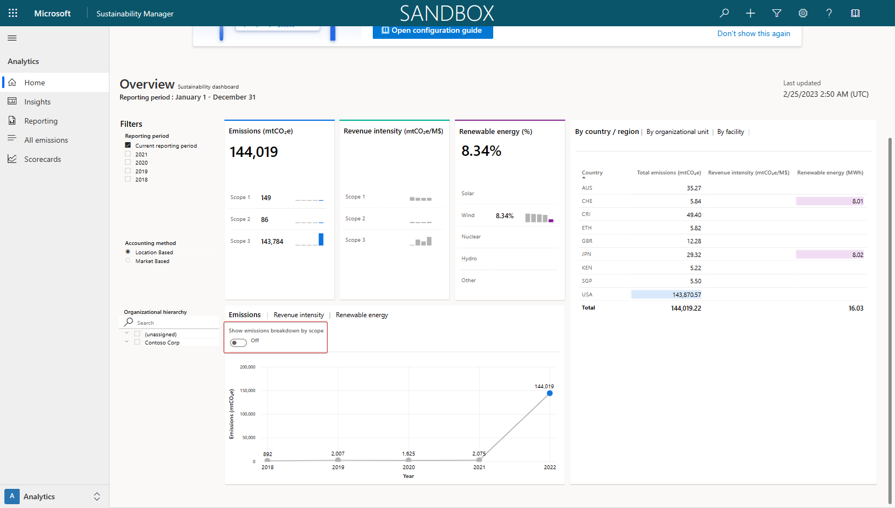
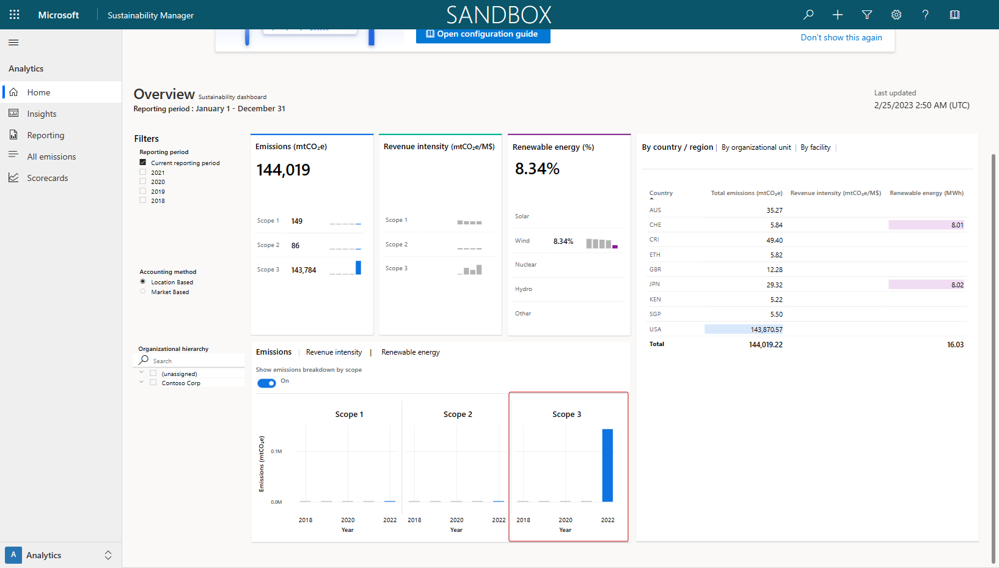
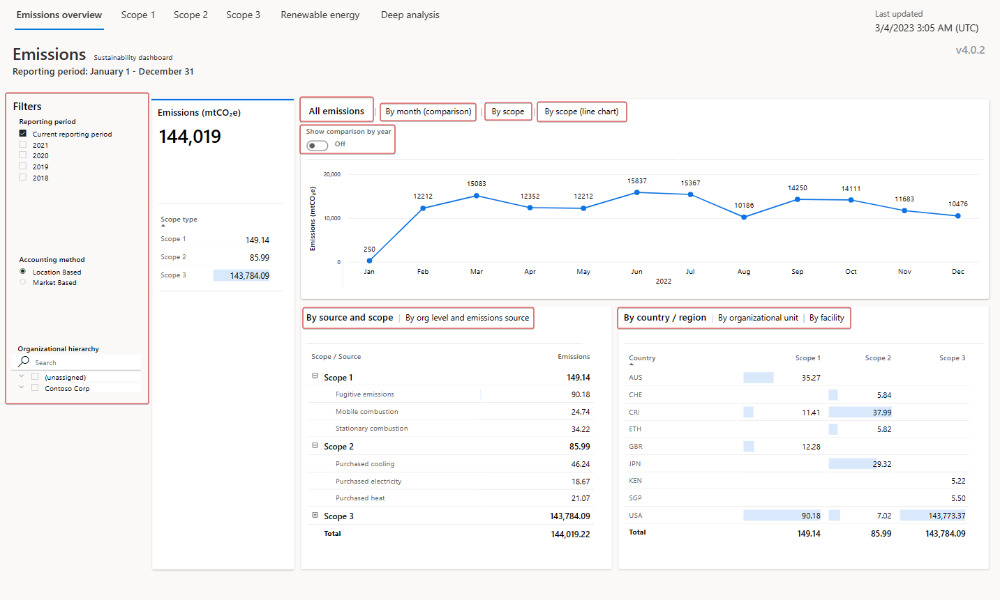
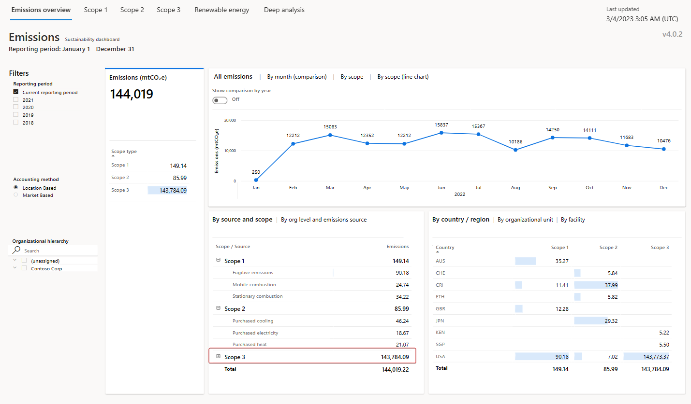
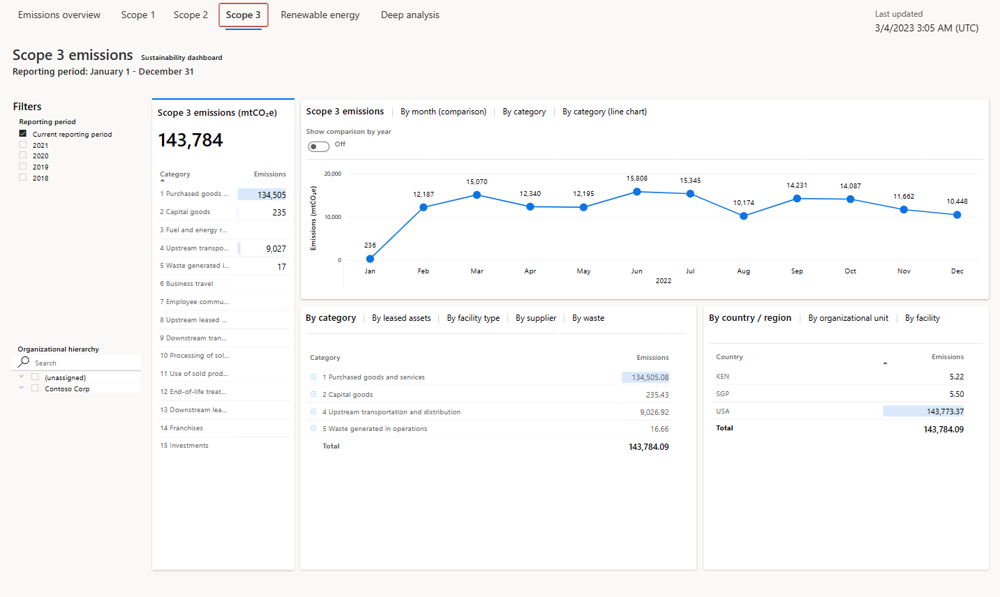
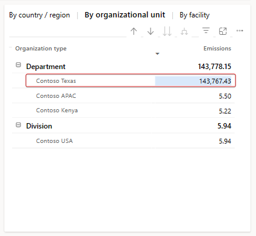
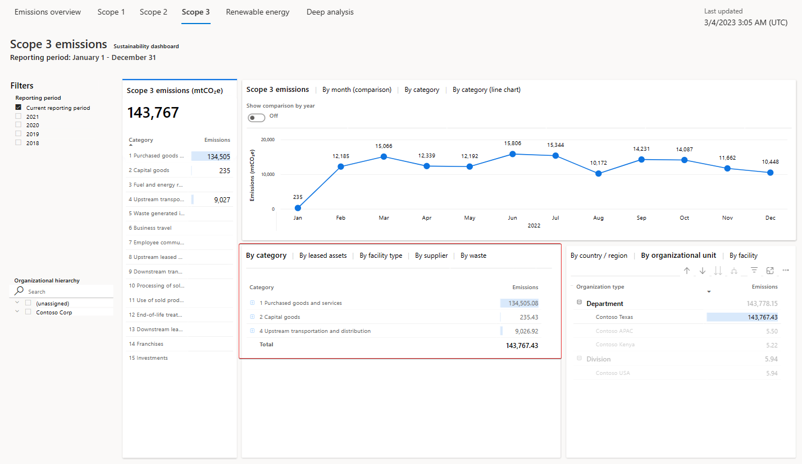
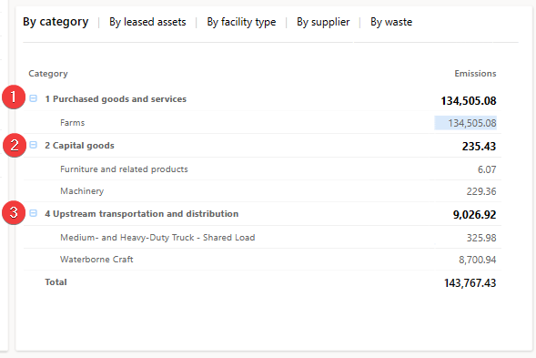

In this exercise you'll gain reporting insights on the emission activities for Contoso, Texas because of their supply chain activities across purchased capital goods, transportation and distribution, and purchased goods and services.

Analytic reports present calculated emissions in an organized way to detect trends and perform further exploration of data. These reports are updated soon after the calculations are run, within approximately 30 minutes, and they allow you to review the outcome of calculations in an aggregated format. Additionally, you can export data in predefined report formats that include groupings for emissions, activity, and other dimensions. You can use these formats to conduct deeper analysis and prepare different types of reports.

For more information about reports, analytics, and setting scorecards and goals to meet an organization's emission strategy, see: [Build reports and review insights](/training/modules/sustainability-insights-reporting/?azure-portal=true) and [Define carbon reduction goals and scorecards](/training/modules/sustainability-goals-scorecard/?azure-portal=true).

## Personas and scenarios

The subsequent exercise features the following personas:

:::row:::
   :::column span="":::
      > [!div class="centered"]
      > :::image border="false" type="content" source="../media/devon.png" alt-text="Artwork showing a fictitious person named Devon Torres.":::
   :::column-end:::
   :::column span="":::
      > [!div class="centered"]
      > :::image border="false" type="content" source="../media/remy.png" alt-text="Artwork showing a fictitious person named Remy Morris.":::
   :::column-end:::
:::row-end:::
:::row:::
   :::column span="":::
      **Devon Torres** - Sustainability specialist for Contoso, Texas
   :::column-end:::
   :::column span="":::
      **Remy Morris** – Sustainability emissions analyst for Contoso, Texas
   :::column-end:::
:::row-end:::
:::row:::
   :::column span="":::
      **Persona actions** - Works with Remy to review overall reporting and analytics capabilities.
   :::column-end:::
   :::column span="":::
      **Persona actions** - Reviews the Scope 3 dashboards and the overall Scope 3 emissions for Contoso Corp, filters down to Scope 3 Categories 1, 2, and 4, and prepares to send observations back to Devon.
   :::column-end:::
:::row-end:::

## Task: Review reporting and analytics

In this task, Remy and Devon will review the reporting and analytics capabilities of Sustainability Manager. Remy will identify the insights dashboards to investigate further. For more information, see: [Build reports and review insights](/training/modules/sustainability-insights-reporting/?azure-portal=true).

 

---

:::row:::
   :::column span="1":::
      > [!div class="is-text-right"]
      > :::image border="false" type="content" source="../media/devon.png" alt-text="Artwork showing a fictitious person named Devon Torres.":::  Devon Torres
   :::column-end:::
   :::column span="3":::
      > [!div class="is-text-left"]
      > Hi Remy, now that our 2022 Scope 3 carbon emissions have been calculated for Contoso, Texas, let's look at the overall reporting and analytics capabilities.
   :::column-end:::
   :::column span="2":::
   :::column-end:::
:::row-end:::
:::row:::
   :::column span="2":::
   :::column-end:::
   :::column span="3":::
      > [!div class="is-text-right"]
      > Sounds great, Devon. I want to see the results of our Scope 3 calculations!
   :::column-end:::
   :::column span="1":::
      > [!div class="is-text-left"]
      > :::image border="false" type="content" source="../media/remy.png" alt-text="Artwork showing a fictitious person named Remy Morris.":::  Remy Morris
   :::column-end:::
:::row-end:::

 

---

1. The **Home** page for Sustainability Manager includes an **Overview** dashboard. You might need to scroll down to view the entire dashboard. Select the **Show emissions breakdown by scope** slider to set it to **On**.

   > [!div class="mx-imgBorder"]
   > 

   While reviewing the information, you identify a large amount of emissions in Scope 3 for 2022.

   > [!div class="mx-imgBorder"]
   > 

1. Go to **Insights** on the left side of the page.

1. The page displays the **Emissions overview** dashboard, which you can filter by selecting a reporting period, accounting method, or organizational hierarchy. The top tile in the dashboard has four tabs: **All emissions**, **By month (comparison)**, **By scope**, and **By scope (line chart)**.

   Each tab has a toggle that you can use to show a comparison by year. When the **Show comparison by year** toggle is off, data for the selected reporting period is shown in a monthly view. When the toggle is on, all available years are shown on a trend chart. The details around each tab in the top tile are as follows:

   - **All emissions** - This tab shows the total emissions over time for the reporting period.

   - **By month (comparison)** - This tab shows a breakdown of emissions by month.

   - **By scope** - This tab shows a breakdown of emissions by Scope 1, Scope 2, and Scope 3. It includes a chart for each scope.

   - **By scope (line chart)** - This tab shows each scope as a separate line on one chart. Therefore, you can compare emissions by scope over time.

   The tile in the lower left has two tabs: **By source and scope** and **By org level and emissions source**. The **By source and scope** tile shows a further breakdown of data in each scope. It shows specific sources and their contribution to emissions overall. The **By org level and emissions source** tab shows specific org levels and their contributions to emissions.

   The tile in the lower right has the following three tabs:

    - **By country/region**
    
    - **By organizational unit**
    
    - **By facility** 
    
   Each tab shows a breakdown of emissions by Scope 1, Scope 2, and Scope 3.

   > [!div class="mx-imgBorder"]
   > 

1. The Scope 3 value is high, so you'll need to investigate further.

   > [!div class="mx-imgBorder"]
   > 

Acting as Remy, you've reviewed the reporting and analytics capabilities of Sustainability Manager. You can further use this information to identify the dashboard on the **Insights** page that should be reviewed.

## Task: Review Scope 3 Power BI dashboards

In this task, Remy reviews the Scope 3 dashboard.

 

---

:::row:::
   :::column span="1":::
      > [!div class="is-text-right"]
      > :::image border="false" type="content" source="../media/devon.png" alt-text="Artwork showing a fictitious person named Devon Torres.":::  Devon Torres
   :::column-end:::
   :::column span="3":::
      > [!div class="is-text-left"]
      > Hi Remy, our Scope 3 value was high. Could you please review the Scope 3 dashboard and let me know what you find?
   :::column-end:::
   :::column span="2":::
   :::column-end:::
:::row-end:::
:::row:::
   :::column span="2":::
   :::column-end:::
   :::column span="3":::
      > [!div class="is-text-right"]
      > Absolutely, Devon! I'll report back on my findings.
   :::column-end:::
   :::column span="1":::
      > [!div class="is-text-left"]
      > :::image border="false" type="content" source="../media/remy.png" alt-text="Artwork showing a fictitious person named Remy Morris.":::  Remy Morris
   :::column-end:::
:::row-end:::

 

---

1. Go to **Insights** on the left side of the page.

1. Select **Scope 3** on the top tab to view the Scope 3 emissions dashboard.

   Scope 3 emissions are the result of activities from assets that aren't owned or controlled by the reporting organization but that the organization indirectly impacts its value chain. Scope 3 emissions include all sources that aren't within an organization's Scope 1 and 2 boundary. You can view Scope 3 emissions by reporting period in the **Scope 3 emissions** dashboard in Microsoft Sustainability Manager.

   You can view the Summary statistics in the left tile. These statistics include the total Scope 3 emissions for the reporting period compared to the previous period. The tile also shows all categories of Scope 3 emissions classified as **upstream** or **downstream**. Scope 3 emissions have the following 15 categories.

   **Upstream**

   - Purchased goods and services

   - Capital goods

   - Fuel and energy related activities

   - Upstream transportation and distribution

   - Waste generated in operations

   - Business travel

   - Employee commuting

   - Upstream leased assets

   **Downstream**

   - Downstream transportation and distribution

   - Processing of sold products

   - Use of sold products

   - End-of-life treatment of sold products

   - Downstream leased assets

   - Franchises

   - Investments

   The top tile has three tabs: **Scope 3 emissions**, **Scope 3 emissions by category**, and **Scope 3 emissions by category (line chart)**. Each tab has a toggle that you can use to show a comparison by year. When the toggle is off, data for the selected reporting period is shown in a monthly view. When the toggle is on, the data that's shown represents all available reporting periods.

   The bottom-left tile has four tabs:

   - **By category** - This tab shows Scope 3 emissions by category and spend type.

   - **By leased assets** - This tab shows Scope 3 emissions by leased asset and category.

   - **By facility type** - This tab shows Scope 3 emissions by facility type and category.

   - **By supplier** - This tab shows Scope 3 emissions by supplier and category.

   - **By waste** - This tab shows Scope 3 emissions by waste category and type.

   The lower-right tile has three tabs: **By country/region**, **By organizational unit**, and **By facility**. Each tab shows Scope 3 emissions for the corresponding delineation of data.

   > [!div class="mx-imgBorder"]
   > 

1. Select **By organizational unit** on the lower-right tile to review the breakdown of Scope 3 emissions by organizational unit.

   > [!div class="mx-imgBorder"]
   > 

1. Contoso Texas is a large contributor to the Scope 3 emissions for Contoso Corp. Select **Contoso Texas** on the lower-right tile.

   > [!div class="mx-imgBorder"]
   > 

1. When you select a value in a Microsoft Power BI dashboard, the other tiles and visualizations will automatically filter to show values that are specific to the selected value. In this scenario, when you selected **Contoso Texas**, all visualizations changed to show only Scope 3 emissions that are related to Contoso Texas, such as the **By category** tile.

   > [!div class="mx-imgBorder"]
   > 

1. Explore the visualizations. Expand the **1 Purchased goods and services**, **2 Capital goods**, and **4 Upstream transportation and distribution** categories. It shows you the Scope 3 carbon emissions across the three categories that Contoso Texas has calculated in this scenario.

   > [!div class="mx-imgBorder"]
   > 

You've now reviewed the reporting and analytics capabilities and have reviewed the Scope 3 Power BI dashboard in Sustainability Manager. The Power BI dashboards that are built into Sustainability Manager give you a starting point to review your organization's carbon emissions. Additionally, you can bring your own Power BI dashboards and embed them into Sustainability Manager if you have dedicated Power BI Pro licenses (not included with the Cloud for Sustainability licensing).

In this exercise, you worked in various personas to complete the following tasks:

- Devon, the sustainability specialist and Remy, the sustainability emissions analyst, reviewed the reporting and analytics capabilities.

- Remy reviewed the Scope 3 Power BI dashboard and identified the emissions that were calculated during this scenario.
