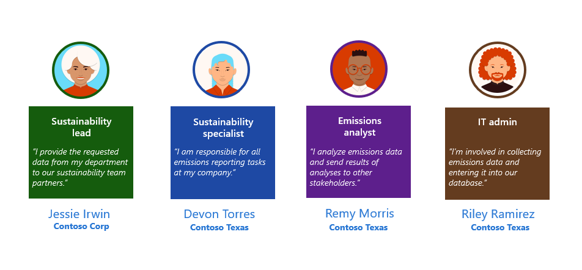

This unit introduces an example Scope 3 scenario, where you'll learn about the details of the scenario, the personas involved, and its challenges.

> [!NOTE]
> In this module, you'll build on top of the [Set up your training environment](/training/modules/sustainability-setup-environment/) fictional scenario demo data.

## Scenario

Contoso Corp (organization that's present in the demo data) is a specialty coffee manufacturing and distribution business with operations in APAC, US, Africa, and Europe. In 2021, Contoso Corp, USA detected a supply chain issue where the demand for its products exceeded the supply that was primarily located in the state of Texas and the Gulf Coast region of the United States. To meet this demand and optimize its operations and supply chain, Contoso Corp built a manufacturing facility in Houston, Texas and a warehouse in Fulshear, Texas. Fulshear is conveniently located on the outskirts of the Houston metro area. Contoso Corp, USA has designated these new facilities as its operating unit for the Gulf Coast region and calls it Contoso, Texas. 

Contoso, Texas has purchased two coffee roasting machines for its new manufacturing facility from Fabrikam, Inc. for a net cost of `$927,198.46`. Additionally, they′ve purchased office furniture from VanArsdel, Ltd. for a net cost of `$27,977.00`. Meanwhile, they've negotiated procurement with Fourth Coffee, a coffee beans supplier in Rio de Janeiro, Brazil. Based on the signed contract, Fourth Coffee will supply 2,000 metric tons of coffee beans at the beginning of each month for a cost of `$8,413,488.07`. 

In the contract between Contoso, Texas and Fourth Coffee is an important consideration of Fourth Coffee’s sourcing relationship with a consortium of environmentally friendly coffee farms. The consortium farms have paid for a study to be conducted to determine the average amount of CO2e that's generated for each metric ton of harvested coffee. On average, these farms generate 150 kg of CO2e for each metric ton of farmed coffee beans. However, to meet their demand, Fourth Coffee also sources from coffee farms that aren't part of the consortium.

Contoso, Texas uses Tailwind Traders to transport the procured coffee beans from Brazil to a port in Houston, Texas. Based on the demand, Contoso, Texas uses Northwind Traders to transport the goods from the port to the warehouse in Fulshear, Texas and the manufacturing plant in Houston, Texas. 

By January 2022, the coffee plant is in full production. As the year passes, and as Contoso Corp closes on its 2022 fiscal year, they direct Contoso, Texas to account for Scope 3 emissions. Due to the new supply chain activity, the focus for Scope 3 accounting will be Scope 3 categories 1, 2, and 4. 

## Contoso Texas Scope 3 challenges

The following table describes the detailed challenges that you'll solve for Contoso, Texas as they account for Scope 3 categories 1, 2, and 4 emissions.

| Challenge | Detail |
|-----------|--------|
| **Lack of reliable, accurate, and specific data** | Contoso, Texas must procure reliable and quality data from three main parties: the coffee equipment manufacturers, the coffee beans supplier, and the transportation provider. After receiving the data, Contoso, Texas must ensure that it fits the recommended methodologies for calculating Scope 3 categories 1, 2, and 4 emissions. |
| **Lack of clarity in reporting boundaries** | All Scope 3 categories come with minimum boundaries, and Contoso, Texas should ensure that these boundaries are navigated carefully. For example, Scope 3 Category 1 and Category 4 highlight transportation of goods and products that are purchased by the reporting company, and yet the boundaries lie in ownership of the vehicles that are used. |
| **Lack of resources** | The presented challenges reflect the needs for Contoso, Texas to have the appropriate skills, resources, and processes in place, including the appropriate skill set to source, process the data, and drive organizational consensus. |
| **Multiple methodologies** | Organizational alignment and leadership support are crucial for determining the calculation methodology across categories 1, 2, and 4 calculation methods. For example, a unique challenge for Contoso, Texas is that few consortium coffee farms can share expected datasets, whereas others can only share spend-based data. |

## Personas

This module features the following fictional personas:

- **Jessie Irwin** - Sustainability lead for Contoso Corp

- **Devon Torres** - Sustainability specialist for Contoso, Texas

- **Remy Morris** - Emissions analyst for Contoso, Texas

- **Riley Ramirez** - IT admin for Contoso, Texas

> [!div class="mx-imgBorder"]
> 
