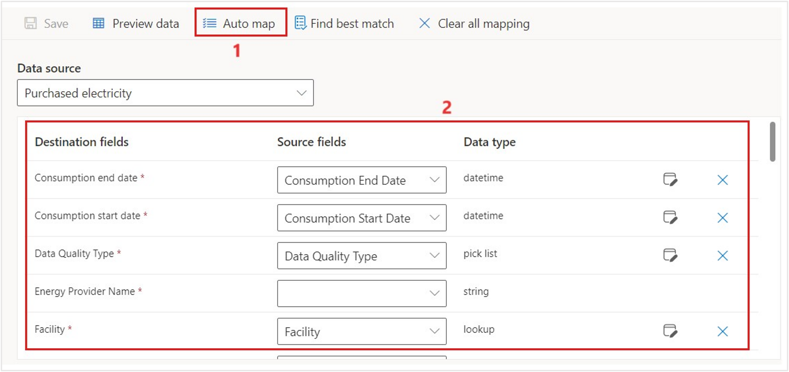
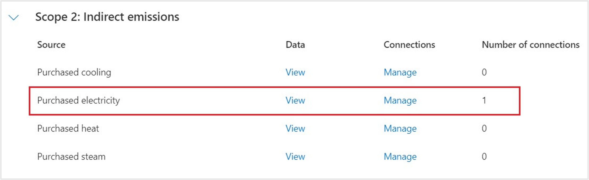
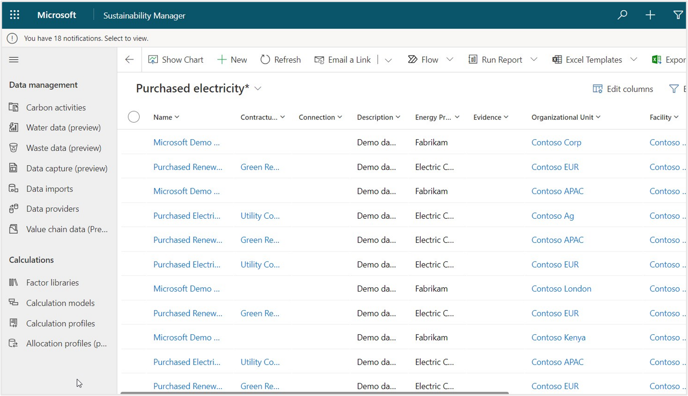
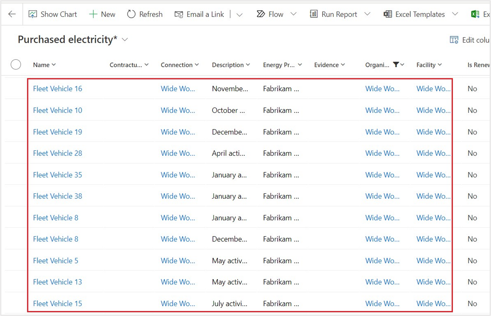

In this exercise, you'll learn about the steps that Reed takes to ingest the spreadsheets that Alex provided. Data import is a vital task to bring large volumes of data into Microsoft Sustainability Manager. Excel is used in this exercise; however, many prebuilt connectors are available, and partners can build custom connectors to integrate with more data sources. For more information, see [Overview of data connectors](/industry/sustainability/import-data-connectors/?azure-portal=true).

> [!IMPORTANT]
> Make sure that you've completed the [previous exercise](/training/modules/sustainability-setup-organization/exercise-profile-data) to create reference data. The data import process requires all reference data to exist. The process is case-sensitive, so ensure that the added reference data is an exact match to the case formatting that's found in the [exercise](/training/modules/sustainability-setup-organization/exercise-profile-data). Failure to do so will result in errors during the data import process.

> [!IMPORTANT]
> To download the sample Excel files that you'll ingest into Microsoft Sustainability Manager, go to [sample data](https://github.com/MicrosoftDocs/mslearn-developer-tools-power-platform/blob/master/sustainability-cloud/Getting%20Started%20with%20Cloud%20for%20Sustainability%20Sample%20Data.zip). In the **GitHub** page that appears, select the **Download** button. Extract the two Excel files to a folder on your local computer for use in this exercise.  

For this exercise, use an InPrivate or Incognito browsing session or a new browser profile.

1. Use an In-Private or Incognito window and go to [Microsoft Power Apps](https://make.powerapps.com/?azure-portal=true).

1. Select the correct environment from the **Environment** dropdown menu in the upper-right corner.

      > [!div class="mx-imgBorder"]
      > 

   For this exercise, you'll use OneDrive.

1. Ensure that your personal OneDrive is initialized by selecting the app selector button in the upper-left corner of the screen.

   > [!div class="mx-imgBorder"]
   > 

1. Select **OneDrive** from the **Apps** list.

   > [!div class="mx-imgBorder"]
   > 

1. A tab with your new OneDrive opens. Close this tab and return to [Power Apps](https://make.powerapps.com/?azure-portal=true).

   > [!div class="mx-imgBorder"]
   > 

1. In the Power Apps portal, open the **Sustainability Manager** application under Apps in the left navigation pane.

   > [!div class="mx-imgBorder"]
   > 

   You'll be directed to the **Home** page for Microsoft Sustainability Manager.

   > [!div class="mx-imgBorder"]
   > 

## Task: Add custom dimension metadata

In this task, Reed will add three custom dimensions metadata for the mapping before importing the data from the *Purchased electricity Wide World Importers 2022.xlsx* Excel spreadsheet.

1. In the left navigation pane, select **Data** > **Custom dimensions**.

1. Select **New** on the top right on the **Active Custom dimensions** page.

	> [!div class="mx-imgBorder"]
	> 

1. Enter the details as follows:

	- **Logical name** - Product

	- **Display name** - Product

	- **Description** - Product (This is optional)

1. Select **Save & Close**.

	> [!div class="mx-imgBorder"]
	> 

1. Repeat the previous steps to create two more new custom dimension metadata as follows:

	Custom dimension metadata for Model
	
	- **Logical name** - Model
   
   - **Display name** - Model
	
   Custom dimensions metadata for Device Size

	-   **Logical name** - Device Size
	
	-   **Display name** - Device Size

	> [!div class="mx-imgBorder"]
	> 

## Task: Import 2022 data for electricity purchased for facilities

In this task, Reed will import the first Excel spreadsheet that Alex provided: *Purchased electricity Wide World Importers 2022.xlsx*. This import brings in the electricity that was purchased by Wide World Importers facilities for 2022 into the purchased electricity activity data.

1. In the left navigation pane, select **Data** > **Imports**.

1. Select **+New**.

   > [!div class="mx-imgBorder"]
   > 

1. On the **Imports**, select **POWER QUERY GUIDED EXPERIENCE**.

   > [!div class="mx-imgBorder"]
   > 

1. Under **Carbon activities**, select **Add**, next to **Purchased electricity** under **Category name**.
  
   > [!div class="mx-imgBorder"]
   > 

1. Select **Next**.

1. Review the large list of connectors by selecting the **Excel workbook**, as the **Data Connector**.

   > [!div class="mx-imgBorder"]
   > 

1. A new dialog opens for Power Query. Select the **Upload file** option and then select **Browse**.

    > [!NOTE]
    > You can also choose to import an existing file that's located in OneDrive. For simplicity of this exercise, you'll use the **Upload file** functionality.

    > [!div class="mx-imgBorder"]
    > 

1. On the file selection window, browse to the location of the Excel files that were downloaded.

    1. Select the **Purchased electricity Wide World Importers 2022.xlsx** file.

    1. Select **Open**.

    > [!div class="mx-imgBorder"]
    > 

1. After the file is successfully uploaded, you might be required to select **Sign in** to create a new connection credential.

   > [!div class="mx-imgBorder"]
   > 

1. An **Office 365 Sign-in** dialog appears. Reed will select their user from the list. In this exercise, select your user account from the list.

1. After the sign-in process is complete, the new connection will be selected automatically. Select **Next**.

   > [!NOTE]
   > If you receive an error after uploading the Excel file, check your browser cookie settings.

1. On the **Choose data** page of the Power Query wizard:

    1. Select the **Purchased electricity** Excel spreadsheet.

    1. Select **Transform data**.

       > [!div class="mx-imgBorder"]
       > 

1. You can complete various data and column transformations on the **Transform data** page of the Power Query wizard. As a result, you can adjust data types, update column mappings, and perform advanced transformations that you're familiar with in Microsoft Power Platform dataflows or Microsoft Power BI datasets. In this exercise, don't apply any transformations, select **Create**.

   > [!NOTE]
   > Wait for the transformations to be applied properly, before you select **Create**, else you might get an error.  

      > [!div class="mx-imgBorder"]
      > 

1. The **New data connection** wizard is on the **Schedule data import** page, where you'll complete the following actions:

   - Turn on the **Import data automatically** toggle to allow the option to set a schedule for the data to be imported automatically. Selecting this option is beneficial if the connector will be used in a scenario where the data will change frequently, such as a web API or FTP server.

   - Turn on the **Replace previously imported data** toggle to remove all previously imported data and bring in the full dataset that was retrieved. Selecting this option is beneficial if the data source isn't providing data from only the last import or if it always includes a full set of data. For this scenario of importing historical data, leave both options turned off.

1. Select **Next** when finished.

   > [!div class="mx-imgBorder"]
   > 

1. On the **Review and finish** page, complete the following tasks:

    1. Enter a name for the new connection, such as **Wide World Importers Purchased Electricity 2022**.

    1. Select **Connect**.

       > [!div class="mx-imgBorder"]
       > 

1. Next, you'll need to map your source data to the data model. Data won't appear until this step is complete. Select **Map fields**.

   > [!div class="mx-imgBorder"]
   > 

1. Select the **Data source** to map, in this exercise that is **Purchased electricity** under **Carbon Activities**.

   > [!div class="mx-imgBorder"]
   > 

1. In this scenario, Reed needs to map the columns from the spreadsheet to the columns in Microsoft Sustainability Manager. Select **Auto Map** for the solution to automatically map the file’s source fields with the destination fields, for any field that isn't an exact match the best match is found and highlighted in blue, make sure to review them. Review the custom dimensions to ensure **Model**, **Product**, and **Device Size** are added as part of mapping. Remove the unnecessary custom dimensions if they're added when you're done with the mapping.

   > [!NOTE]
	> Please make sure that the below **Contractual Instrument Type** field is mapped to **Contracted firm**.

   > [!div class="mx-imgBorder"]
   > 

1. Select **Save**.

   > [!div class="mx-imgBorder"]
   > 

   > [!div class="mx-imgBorder"]
   > 

   > [!NOTE]
   > You can add a new custom dimension metadata or use existing custom dimension metadata that you added as mentioned in previous **Add custom dimension metadata** task. You must provide a name in the **Destination fields**, select the respective custom dimension metadata and enter the **Source fields** and **Data type** and select **Add**. The metadata will be added.

1. Now that we have reviewed our field mappings, toggle **Ready to Import** as **yes**. Select the **back arrow**. Select **Done**.

   > [!div class="mx-imgBorder"]
   > 

   > [!div class="mx-imgBorder"]
   > 

1. On **Data imports** page you can view the import you created.

1. The **Data Import** job will run and the status will display **Scheduled** and then in a moment it switches to **Processing**. You might need to refresh your page to view the change. 

1. After a minute or two select **Refresh** above the list to view the updated status, which should be **Complete**.

   > [!div class="mx-imgBorder"]
   > 

1. Go to **Carbon Activities** on the left navigation pane.

   > [!div class="mx-imgBorder"]
   > 

1. Find **Purchased electricity** in the **Scope 2: Indirect emissions** section and then select **View**.

   > [!div class="mx-imgBorder"]
   > 

   The **Purchased electricity** view shows all purchased electricity activity data that has been imported.

   > [!div class="mx-imgBorder"]
   > 

1. Filter the view by selecting the **Organizational Unit** dropdown menu and then selecting **Filter By**.

1. Select **Wide World Importers** from the **Filter By** dialog.

1. Select **Apply** to apply the filter to the column.

   > [!div class="mx-imgBorder"]
   > 

   After a few moments, the view will refresh and the activity data records that were imported during this exercise will be displayed.

   > [!div class="mx-imgBorder"]
   > 

You've now completed the data import of 2022 Purchased Electricity for Wide World Importers. This step is imperative in realizing the goal of recording, reporting, and reducing carbon emissions. Next, you'll import the 2022 Miles Driven for Wide World Importers fleet of electric vehicles.

## Task: Import 2022 Miles Driven data for electric trucks

In this task, Reed imports the second Excel spreadsheet that Alex provided: *Fleet Vehicles Miles Driven Wide World Importers 2022.xlsx*. While electric vehicles don't produce direct tailpipe emissions, they do produce **Scope 2: Purchased electricity from charging**. This import brings in the *Miles driven by Wide World Importers fleet of electric trucks for the year 2022* data into the *Purchased electricity carbon activity* data.

1. Select **Data ** > **Imports** on the left navigation pane, select **+ New**.

   > [!div class="mx-imgBorder"]
   > 

1. On the **Data imports**, select **POWER QUERY GUIDED EXPERIENCE**.

   > [!div class="mx-imgBorder"]
   > 

    1. Select **Add**, next to **Purchased Electricity**.
    
       > [!div class="mx-imgBorder"]
       > 
    
    1. Select **Next**.

1. On the list of connectors. select **Excel workbook**, as the **Data Connector**.
 
      > [!div class="mx-imgBorder"]
      > 

1. A new dialog opens for Power Query, where you'll select **Upload file > Browse**.

    > [!div class="mx-imgBorder"]
    > 

1. On the file selection window, browse to the location of the downloaded Excel files.

    1. Select the **Fleet Vehicles Miles Driven Wide World Importers 2022.xlsx** file.

    1. Select **Open**.

       > [!div class="mx-imgBorder"]
       > 

1. Once the file is successfully uploaded, you might be required to select the sign in button to create a new Connection credential, this is done by selecting **Sign in**.

   > [!div class="mx-imgBorder"]
   > 

1. An Office 365 Sign in dialog appears. Reed selects their user from the list. For the purposes of this exercise, select your user account from the list.

1. If signed in, the new connection is automatically selected. Select **Next**.
 
1. On the **Choose data** page of the Power Query wizard, select the **Miles Driven** spreadsheet and then select **Transform data**.

   > [!div class="mx-imgBorder"]
   > 

1. On the **Transform data** page of the Power Query wizard, you can complete various data and column transformations. These transformations allow you to adjust data types, column mappings updates, and perform advanced transformations that you're familiar with in Microsoft Power Platform dataflows or Power BI datasets. For this exercise, you don't need to apply any transformations, select **Create**. 

   > [!NOTE]
   > Wait for the transformations to be applied properly, before you click **Create**, else you might get an error.

   > [!div class="mx-imgBorder"]
   > 

1. The **New data connection** wizard is on the **Schedule data import** page, where you'll complete the following tasks:

   - Turn on the **Import data automatically** toggle to allow the option to set a schedule for the data to be imported automatically. Selecting this option is beneficial if the connector will be used in a scenario where the data changes frequently, such as a web API or FTP server.

   - Turn on the **Replace previously imported data** toggle to remove all previously imported data and to bring in the full dataset that was retrieved. Selecting this option is beneficial if the data source isn't providing data from only the last import or if it always includes a full set of data. 

   For this scenario of importing historical data, leave both options turned off.

1. Select **Next** when you're finished.

     > [!div class="mx-imgBorder"]
     > 

1. On the **Review and finish** page, complete the following tasks:

    1. Enter a name for the new connection, such as **Wide World Importers Electric Vehicle Miles Driven 2022**.

    1. Select **Connect**.

       > [!div class="mx-imgBorder"]
       > 

1. Next, you'll map your source data to the data model. Data won't appear until this step is complete. Select **Map fields**.

   > [!div class="mx-imgBorder"]
   > 

1. Select the data source to map. In this exercise, it's **Purchased electricity** under **Carbon Activities**.

   > [!div class="mx-imgBorder"]
   >  

1. In this scenario, Reed needs to map the columns from the spreadsheet to the columns in Microsoft Sustainability Manager. To do so, you'll select  **Auto Map** for the solution to automatically map the file’s source fields with the destination fields, for any field that isn't an exact match the best match will be found and highlighted in blue. Add the custom dimensions metadata namely **Vehicle size**. Delete if any other dimensions are added.

   > [!div class="mx-imgBorder"]
   > 

   > [!div class="mx-imgBorder"]
   > 

	> [!NOTE]
	> Please make sure that the below Contractual Instrument Type field is mapped to Contracted firm.

   > [!div class="mx-imgBorder"]
   > 

1. Review and select **Save**.

1. Select the toggle as **Yes** for **Ready to import**. Select the **back arrow**.

   > [!div class="mx-imgBorder"]
   > 

1. Select **Done**. The **Data Import** job will run and you can view the status as **Scheduled** and then in a moment it will switch to **Processing**. Refresh the page to see the change.  

   > [!div class="mx-imgBorder"]
   > 

1. After a minute or two, select the **Refresh** button above the list to view the updated status, which should be **Completed**. Ensure you have the correct number of records and the status of the data connections is **Complete** before you go to the next steps.

   > [!div class="mx-imgBorder"]
   > 

1. Go to **Carbon activities data** on the left side of the page.

   > [!div class="mx-imgBorder"]
   > 

1. Find **Purchased electricity** in the **Scope 2: Indirect emissions** section and then select **View**.

   > [!div class="mx-imgBorder"]
   > 

   The **Purchased electricity** view shows all purchased electricity activity data that has been imported.

   > [!div class="mx-imgBorder"]
   > 

1. Filter the view by selecting the **Organizational Unit** dropdown menu and then selecting **Filter By**.

   > [!div class="mx-imgBorder"]
   > 

1. After a few moments, the view will refresh. You should be able to view the activity data records that were imported during this exercise. 

   > [!div class="mx-imgBorder"]
   > 

You've completed the data import for 2022 Miles Driven for Wide World Importers. This step is important for realizing the goal of recording, reporting, and reducing carbon emissions. In the following exercises, you calculate emissions, review insights and reporting, and define your reduction scorecards and goals.
