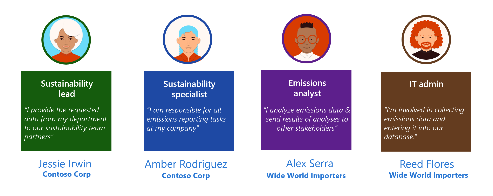

In this module, the focus is on the data ingestion aspect of the solution focus area. It follows the organization and reference data setup and it forms the basis for the emission calculations and the reporting thereafter. Microsoft Sustainability Manager is flexible, with multiple automated options to ingest data, such as connectors and manual inputs for calculations. For scenarios that might require complex data transformation and/or the extract, transform, and load (ETL) process, we recommend that you use tools such as Microsoft Azure Data Factory. For more information, see [Overview of Microsoft Cloud for Sustainability Data Import](/industry/sustainability/import-data/?azure-portal=true).

> [!div class="mx-imgBorder"]
> 

## Personas and scenarios

In this exercise, Reed Flores, IT admin for Wide World Importers, uses the carbon activity data Microsoft Excel spreadsheets that are sourced by Alex Serra, emissions analyst. The spreadsheets contain data for the electricity that was purchased in 2022 and miles that were driven by the fleet of Fabrikam Electric trucks in year 2022. Reed observes that associated information such as product, model and Vehicle size needs to be added as custom dimension meta data before importing which are required to run the emission calculation and gather the Emission insights reports for monitoring.  After adding this information, Reed uses Microsoft Sustainability Manager's connector functionality to import from the Excel spreadsheets and then reviews other connectors that are available for future purposes. Reed uses the built-in Power Query functionality to transform the data to match Microsoft Sustainability Manager's data schema and then looks for other potential issues, such as case-sensitive data fields.

> [!div class="mx-imgBorder"]
> 

In this exercise, you'll focus on the scenario that's illustrated in the following image. 

> [!NOTE]
> Make sure that you note the newly ingested activity data during this exercise because it will be used in the remaining scenarios (calculations and reporting) in the upcoming exercises.

> [!div class="mx-imgBorder"]
> 
