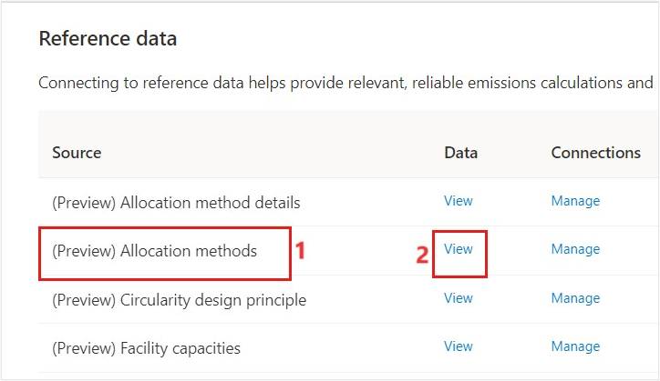
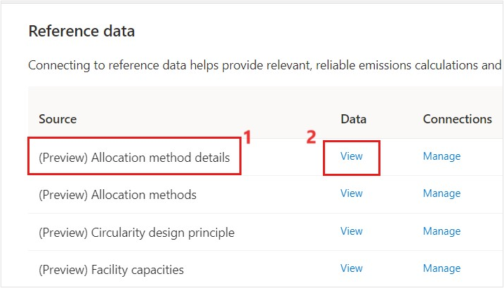
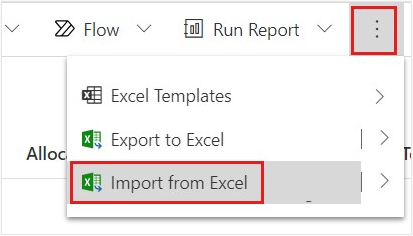
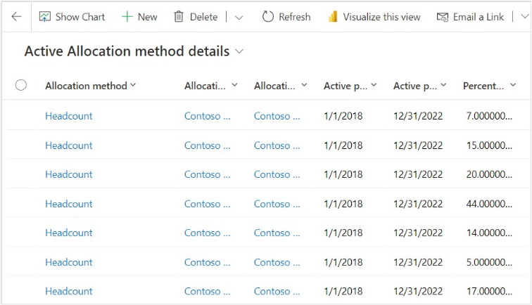
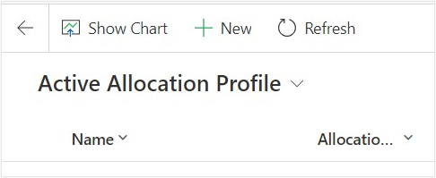
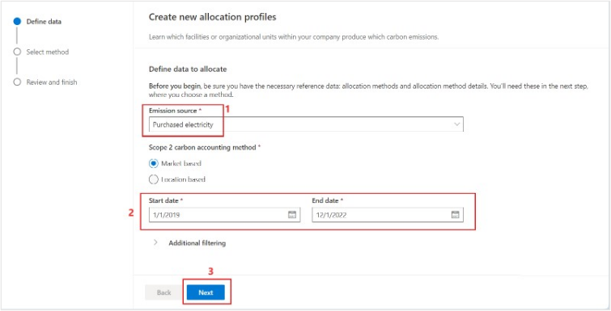
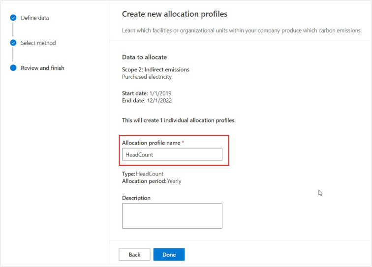
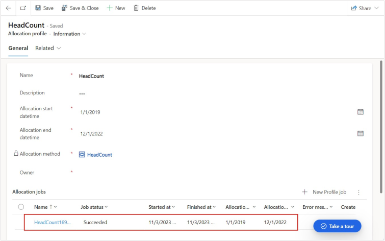

In this exercise, you learn about the steps that Alex takes to create the allocation method, method details and an allocations profile. For more information on allocation profile, see [Configure allocations profile](/industry/sustainability/calculate-allocation-profiles). Allocations help visualize how your emissions are generated in multiple methods without impacting the default emissions reporting. With allocations, you can visualize how your emissions are distributed based on a parameter.

## Task: Create allocation methods

In this task, Alex creates an allocation method called Headcount to understand the emissions distributed based on the purchased electricity.

1. Select **Data** on the left navigation pane.

1. Select **Reference data**.  

1. Select **View** for **(Preview) Allocation methods**.

   > [!div class="mx-imgBorder"]
   > 

1. Select **New** under **Active Allocation methods**.

1. Enter the **Name** as **Headcount** and select **Save & Close**. The allocation method is created. 

## Task: Create the allocation method details  

In this task, Alex creates the allocation method details by importing an excel file with the details. You must download the [sample data - Allocation Method Details.zip](https://github.com/MicrosoftDocs/mslearn-developer-tools-power-platform/blob/master/sustainability-cloud/Allocation%20Method%20Details.zip) for this task.

1. Select **Reference data** on the left navigation pane.

1. Select **View** for **(Preview) Allocation method details**.

   > [!div class="mx-imgBorder"]
   > 

1. Select **New**.

1. Select the three horizontal dots and select **Import from Excel**.

   > [!div class="mx-imgBorder"]
   > 

1. Select **Choose File** and then upload the allocation method details sample data. 

1. Select the allocation method details sample data.
 
1. Select **Next**.

1. Select **Finish Import**.

1. Select **Done**. The data is imported successfully. 

   > [!div class="mx-imgBorder"]
   > 
 
## Task: Create an allocation profile

1. Select **Calculations** from the left navigation pane.

1. Select **Allocation profile(preview)**.

1. Select **New**. 

   > [!div class="mx-imgBorder"]
   > 

1. Enter the following details. 

   - **Emission source** – Purchased Electricity
   
   - **Start and End date** – Provide the start date and end date of the year of your choice. 
   
   > [!div class="mx-imgBorder"]
   > 

1. Select **Next**.

1. Select the **Profile method** as **Headcount** that you created in the previous task and **Profile period** as **Yearly**.

1. Select **Next**.

1. Enter the **Allocation profile name** as **Headcount** and select **Done**.  

   > [!div class="mx-imgBorder"]
   > 

1. Select **Continue**. 

1. Select **OK**. The allocation profile is created successfully.

1. In the **Active Allocation Profile** page, select the profile and select **Run allocation** for the profile created. 

   > [!div class="mx-imgBorder"]
   > 

1. Refresh the page and select the **Allocation profile** to view the status of the calculation. 

You created the allocation methods and set up the allocation profile with this method. Now, you'll be able to visualize how your emissions are generated using these methods without impacting the default emissions reporting.
