In this exercise, you learn about the steps that Alex takes to define calculation models that Microsoft Sustainability Manager uses to calculate emissions. Calculation models are the instruction sets, or recipes, that define the steps and values to use during the emission calculations. Microsoft Sustainability Manager provides several calculation models.

Take the opportunity to review some prebuilt models. They're excellent sources of information when you're creating new calculation models. You can also use calculation models as a template for new models. This exercise and the next discuss the algorithm that's used to calculate emissions. For more information, see [Overview of Calculation models](/industry/sustainability/calculate-calculation-models/?azure-portal=true).

## Task: Create a purchased electricity model

In this task, Alex creates a new calculation model to calculate carbon emissions for purchased electricity based on the contractual instrument type. This exercise uses the factor mappings that were created in the previous exercise to make the calculation model dynamically find the emission factor to be used for each line of activity data.

1. Select **Calculations** > **Models** on the left navigation pane.

1. Select **+ New** to create a new calculation model.

   > [!div class="mx-imgBorder"]
   > [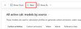](../media/new-button.svg#lightbox)

    A new page opens, where you can set up the new calculation model. A **Source** action is added by default.

   > [!div class="mx-imgBorder"]
   > [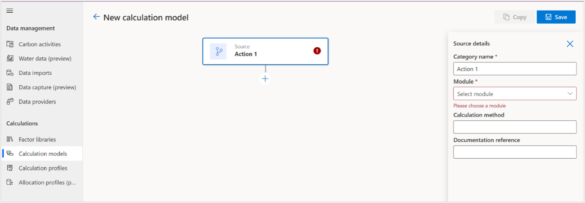](../media/source-action.svg#lightbox)

1. Populate the **Source Details** pane with the following data:

   - **Category name** - Purchased Electricity: Contractual Instrument Based - 2022

   - **Module** - Carbon Activities

   - **Activity data** - Purchased electricity

   - **Calculation method** - EPA Equation 1: Electricity (MWh) \* EF

   - **Documentation reference** - `https://www.epa.gov/sites/default/files/2020-12/documents/electricityemissions.pdf`

    The fields and their values are defined as follows (numbers corresponding to numerals in the ensuing screenshot):

    1. The **Category name** identifies the calculation model in the list.

    1. The **Module** is used to identify which data types should appear in the Activity data field.

    1. The **Activity data** identifies which type of activity data that the model processes.

    1. Use the **Calculation method** to roughly estimate what the calculation does.

    1. The **Documentation reference** identifies the documentation that's used to create the calculation model.

    1. You can select **Save** to save the record.

   > [!div class="mx-imgBorder"]
   > [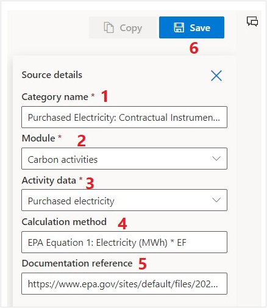](../media/source-details.svg#lightbox)

1. Select the plus (**+**) icon to add a new action to the calculation model.

   > [!div class="mx-imgBorder"]
   > [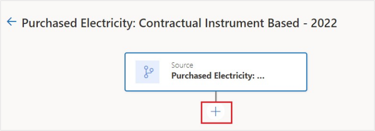](../media/new-action.svg#lightbox)

1. Select **Report** on the **Available actions** screen.

   > [!NOTE]
   > Only Source, Report, and Estimation actions are covered in this exercise. For more information about each available action, see [Add a calculation model](/industry/sustainability/calculate-calculation-models?azure-portal=true#add-a-calculation-model).

   > [!div class="mx-imgBorder"]
   > [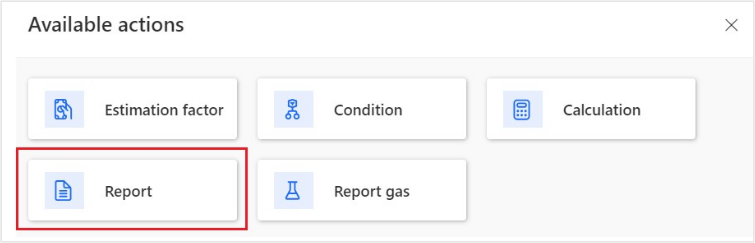](../media/report.svg#lightbox)

1. A new **Report** action is added to the calculation model. Select that action to edit it.

   > [!div class="mx-imgBorder"]
   > [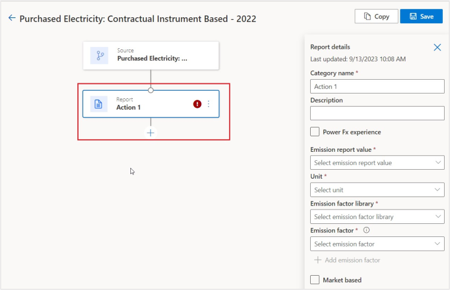](../media/report-action.svg#lightbox)

   You can use the **Report** action to calculate and report carbon emissions to the emissions table. This action uses the emission factor or factor mapping to identify the emission factor to be used based on the **Emission factor** dropdown list. In this exercise, the action uses a contractual instrument type field to identify the factor mapping and emission factor to use in the calculation.

   After you've determined the emission factor for the activity data line, the activity data quantity and quantity unit will be converted to the same unit type as the emission factor. In this exercise, the kilowatt-hours (kWh) from the activity data are converted to megawatt-hours (MWh).

   After the quantity has been converted, the converted value will be multiplied against each gas that's listed in the emission factor, determining the volume of gases produced.

   To determine the CO2E (carbon dioxide equivalency), the gases produced are multiplied against their Global Warming Potential (GWP) factor, which is stored in the **Greenhouse Gases** Dataverse table and are added together.

   The **Report** action stores the gases produced values, CO2E value, and other identifying information about the activity data row in the emissions table.

1. Populate the **Report** action with the following data:

   - **Category name** - Electricity \* EF (Contractual Instrument Type)

   - **Description** - EPA Equation 1: Electricity (MWh) \* EF

   - **Emission report value** - Quantity

   - **Unit** - Quantity unit

   - **Emission factor library** - EPA 2022 - eGRID

   - **Emission factor** - Contractual Instrument Type

    The fields and their values are defined as follows (numbers corresponding to numerals in the ensuing screenshot):

    > [!NOTE]
    > This value can also be determined by a Power Fx expression if a more complex value is needed instead of a specific field.

    1. The **Category name** identifies the action in the calculation model.

    2. Use the **Description** to roughly note what the calculation does.

    3. The **Emission report value** identifies which field from the activity data type should be used to retrieve the value that's used in the emission calculation.

    4. The **Unit** identifies the field from the activity data type to be used to retrieve the unit type of the value. Alternatively, you can specify a unit to always be used in the action, regardless of which unit is specified on the activity date type.

    5. The **Emission factor library** identifies which factor library is used to identify the emission factor.

    6. The **Emission factor** identifies which emission factor or factor mapping to use to calculate the emissions. Choosing a factor mapping allows multiple reference data values to map to an emission factor, allowing for a calculation model to not be bound to a single emission factor.

    7. You can select **Save** to save the record.

    > [!div class="mx-imgBorder"]
    > [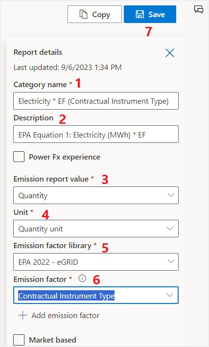](../media/report-details.svg#lightbox)

1. Select the back arrow on the record to return to the list of calculation models.

   The new calculation model should appear in the list.

   > [!div class="mx-imgBorder"]
   > [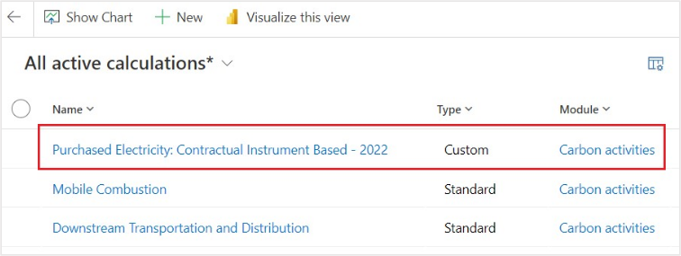](../media/new-calculation-model.svg#lightbox)

Now, you've created a new calculation model. In this calculation model you've used factor mappings, an important differentiator for Microsoft Cloud for Sustainability. Factor mappings allow the calculation models to be more dynamic by mapping reference data to emission factors, allowing you to have one model that can calculate multiple emission factors. Calculation models are the instruction sets that Microsoft Cloud for Sustainability uses to calculate emissions. Several calculation models are included with Microsoft Cloud for Sustainability based on EPA calculations. Occasionally, these included models might not match your unique customer needs, so you need to create new models to provide custom calculations. Make sure that you review the included models to view other types of complex calculation models.

## Task: Create an electric vehicle miles driven model

In this task, Alex creates a new calculation model to calculate carbon emissions for miles driven by electric vehicles. This exercise uses the estimation factor library that was created in the previous exercise to estimate the kilowatt-hours (kWh) that are used by an electric vehicle and then calculate the carbon emissions for that electricity based on the US Average emission factor.

1. Select **+ New** again to create another new calculation model. A new page opens, where you can set up the calculation model. A **Source** action is added by default.

1. Populate the **Source Details** pane with the following data:

   - **Category name** - Electric Vehicle Miles Driven - 2022

   - **Module** - Carbon Activities

   - **Activity data** - Purchased electricity

   - **Calculation method** - Miles Driven to kWh \* EF

   - **Documentation reference** - `https://fueleconomy.gov/feg/byfuel/EV2022.shtml`

    The fields and their values are defined as follows (numbers corresponding to numerals in the ensuing screenshot):

    1. The **Category name** identifies the calculation model in the list.

    2. The **Module** is used to identify which data types should appear in the Activity data field.

    3. The **Activity data** identifies which type of activity data that the model processes.

    4. Use the **Calculation method** to roughly note what the calculation is doing.

    5. The **Documentation reference** identifies the documentation that's used to create the calculation model.

    6. You can select **Save** to save the record.

    > [!div class="mx-imgBorder"]
    > [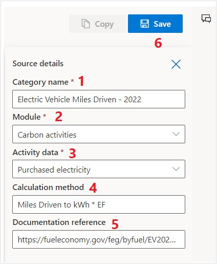](../media/source-values.svg#lightbox)

1. Select the plus (**+**) icon to add a new action to the calculation model.

   > [!div class="mx-imgBorder"]
   > [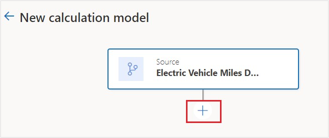](../media/new-calculation-model-action.svg#lightbox)

1. Select **Estimation factor** on the list of **Available actions**.

   > [!div class="mx-imgBorder"]
   > [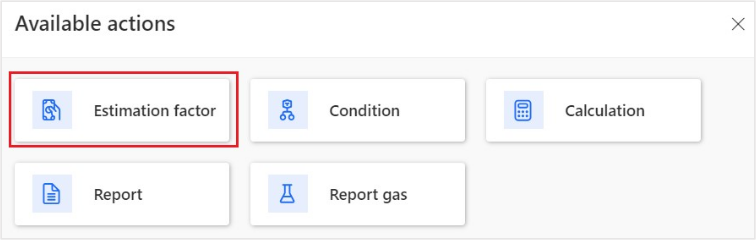](../media/estimation-factor.svg#lightbox)

1. A new action is added to the calculation model. Select that action to edit it.

   > [!div class="mx-imgBorder"]
   > [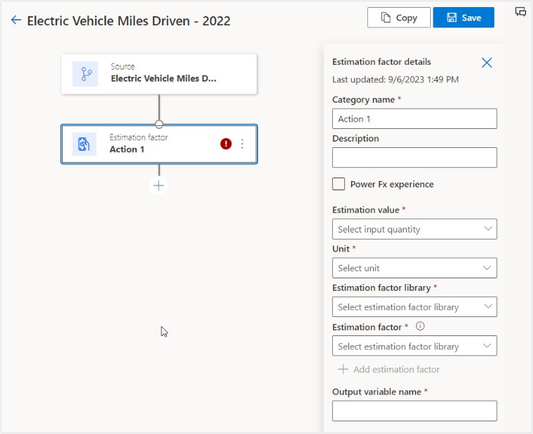](../media/estimation-factor-action.svg#lightbox)

   You can use the **Estimation factor** action to create an estimated value for converting one unit type to another in a different unit group, such as converting night stays to kilowatt-hours (kWh) used. This action is beneficial when it might be difficult to determine the exact amount of a given emission source that's used. In this exercise, the action is used to convert miles driven by the fleet of electric vehicles to kWh used. This approach helps Wide World Importers estimate the carbon emissions for their fleet of electric vehicles that are driving across the US and might be charging various amounts and on different grids and energy sources.

   The activity data quantity and quantity unit are converted to the same unit type as the estimation factor. In this exercise, the mile unit from the activity data is converted to 100-mile units.

   After the quantity has been converted, the converted value will be multiplied against the Factor quantity and stored in the output variable. The output variable is only accessible within the calculation model, available for use by actions further down the chain. The estimated value isn't stored in a table.

1. Populate the **Estimation factor Details** pane with the following data:

   - **Category name** - Estimate kWh/100 Mile

   - **Estimation value** - Quantity

   - **Unit** - Quantity unit

   - **Estimation factor library** - Electric Vehicle Estimation Library

   - **Estimation factor** - Fabrikam Electric Truck - EPA Estimate

   - **Output variable name** - kWhQuantity

    The fields and their values are defined as follows (numbers corresponding to numerals in the ensuing screenshot):

    1. The **Category name** identifies the action in the calculation model.

    2. The **Estimation value** identifies which field from the activity data type should be used to retrieve the value that's used in the estimation calculation.

       > [!NOTE]
       > This value can also be determined by a Power Fx expression if a more complex value is needed instead of a specific field.

    3. The **Unit** identifies the field from the activity data type that should be used to retrieve the unit type of the value. Alternatively, you can specify a unit to always be used in the action, regardless of which unit is specified on the activity date type.

    4. The **Estimation factor library** identifies which factor library is used to identify the estimation factor.

    5. The **Estimation factor** identifies which estimation factor or factor mapping is used calculate the estimation. In this scenario, only one estimation factor has been created, so it doesn't make sense to select a factor mapping currently.

    6. Use the **Output variable name** to name the output of the estimation factor calculation for use in actions further down the chain.

    7. You can select **Save** to save the record.

    > [!div class="mx-imgBorder"]
    > [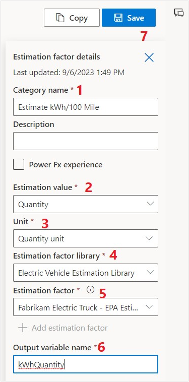](../media/estimation-factor-details.svg#lightbox)

1. Select the plus (**+**) icon to add a new action to the calculation model.

   > [!div class="mx-imgBorder"]
   > [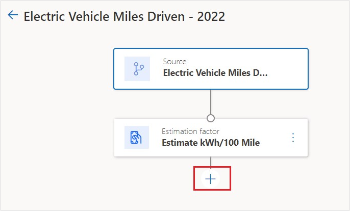](../media/new-estimation.svg#lightbox)

1. Select **Report** on the **Available actions** list.

   > [!div class="mx-imgBorder"]
   > 

1. A new action is added to the calculation model. Select that action to edit it.

   > [!div class="mx-imgBorder"]
   > [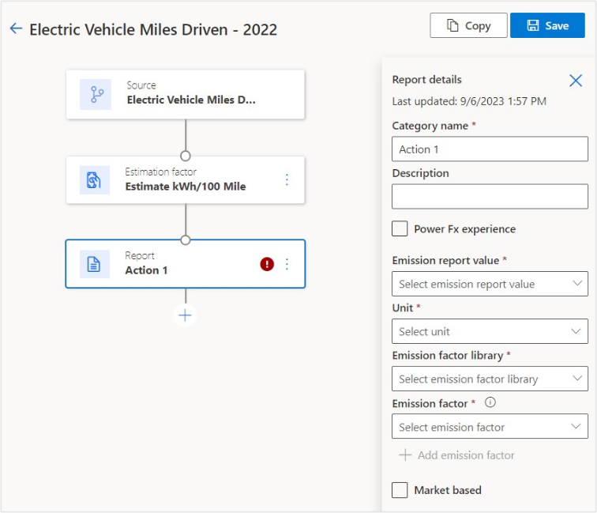](../media/new-report-action.svg#lightbox)

1. Populate the **Report Details** pane with the following data:

   - **Category name** - kWh \* EF

   - **Emission report value** - kWhQuantity

   - **Unit** - kWh

   - **Emission factor library** - EPA 2022 - eGrid

   - **Emission factor** - US Average

   The fields and their values are defined as follows (numbers corresponding to numerals in the ensuing screenshot):

   1. The **Category name** identifies the action in the calculation model.

   2. The **Emission report value** identifies which field should be used to retrieve the value that's used in the emission calculation. In this scenario, the **Output variable** from the **Estimation factor** action is used.

      > [!NOTE]
      > In this scenario, the **Unit** is automatically selected based on the **Unit type** of the **Output variable** from the **Estimation factor** node.

   3. The **Emission factor library** identifies which factor library is used to identify the emission factor.

   4. The **Emission factor** identifies which emission factor or factor mapping is used to calculate the emissions. In this scenario, Alex and Wide World Importers might not know which electric grid that a vehicle was charged on or the energy source, so Alex chooses the **US Average** emission factor to provide the estimated emissions.

   5. You can select **Save** to save the record.

   > [!div class="mx-imgBorder"]
   > [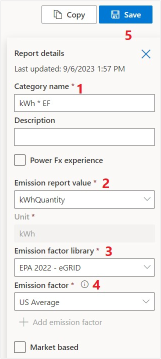](../media/report-fields-values.svg#lightbox)

1. Select the back arrow on the record to return to the list of calculation models.

   The new calculation model should now appear in the list.

   > [!div class="mx-imgBorder"]
   > [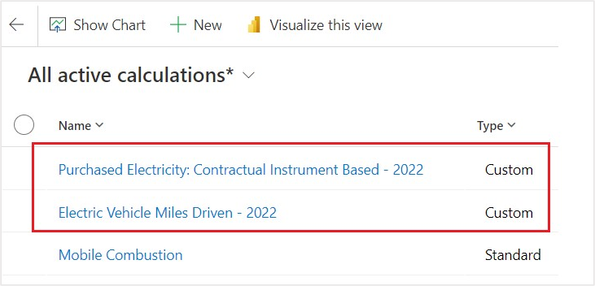](../media/calculation-model-added.svg#lightbox)

You've now created a new calculation model. This calculation model includes an estimation factor, which allows you to calculate emissions in areas where you might not know the exact quantity of an emission source but still need to account for the carbon emissions. Calculation models are the instruction sets that Microsoft Cloud for Sustainability uses to calculate emissions. Several calculation models are included with Microsoft Cloud for Sustainability based on EPA calculations. Occasionally, these included models might not match your unique customer needs, so you need to create new models to provide custom calculations. Make sure that you review the included models to view other types of complex calculation models.
