In this exercise, you learn about the steps that Alex takes to define and run calculation profiles. Microsoft Sustainability Manager uses calculation profiles to define the parameters and scheduling of calculation jobs. Calculation profiles allow an organization to define what activity data to calculate emissions for, the filters on that data, which calculation model to use, and if the calculation should be redone whenever the chosen activity data changes. Calculation profiles use the parameters to create calculation jobs. These calculation jobs are the background worker jobs that iterate over an organization's activity data. The calculations determine the carbon emissions based on the calculation model that's defined in the calculation profile. For more information, see [Overview of calculation profiles](/industry/sustainability/calculate-calculation-models?azure-portal=true#calculation-profile).

## Task: Create a purchased electricity calculation profile

In this task, Alex creates a calculation profile for the electricity that Wide World Importers purchased for their facilities in 2022. Alex uses the calculation model that was previously defined in this exercise. Alex filters the profile to only activity data for the Wide World Importers organizational unit and where the unit type is kilowatt-hours (kWh). These filters ensure that only the purchased electricity for Wide World Importers is included in the calculation job. This task excludes the miles driven by the fleet of electric vehicles, which is covered in the next task.

1. Go to **Calculation profiles** on the left navigation pane.

   > [!div class="mx-imgBorder"]
   > [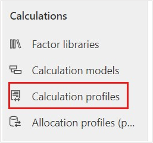](../media/calculation-profiles.svg#lightbox)

1. Select **+ New Calculation profile** to create a new calculation profile.

   > [!div class="mx-imgBorder"]
   > [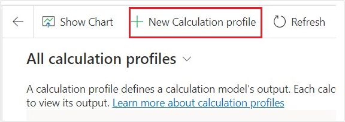](../media/new-calculation-profile.svg#lightbox)

1. Populate the following information on the **New calculation profile** wizard.

   - **Calculation profile name** - Purchased Electricity: Contractual Instrument Based 2022 Wide World Importers

   - **Module** - Select **Carbon activities**

   - **Emissions source** - Purchased electricity

   - **Activity data to include in calculation** - Select **add** > **add row** and select **Organizational Unit** equals **Wide World Importers** and **Quantity unit** equals **kWh**

   - **Calculation model** - Select **Purchased Electricity: Contractual Instrument Based - 2022** from the dropdown list

   - **Schedule** - Select the **Automatically run this calculation when data is refreshed** checkbox

   The fields and their values are defined as follows (numbers corresponding to numerals in the ensuing screenshot):

   - The **Calculation profile** identifies the calculation profile in the list.

   - The **Module** is used to identify which data types should appear in the Activity data field.

   - The **Emissions source** identifies which activity data type should be used in the calculation.

   - Use **Activity data to include in calculation** to filter activity data to a specific subset of the activity data type.

   - The **Calculation model** identifies which calculation model should be used for the calculation. Be sure to choose the calculation model from the dropdown list.

   - Use the **Automatically run this calculation when data is refreshed** filter to automatically trigger calculations when the matching activity data is refreshed.

   - The form should resemble the following image. Select **Next**.

     > [!NOTE]
     > Make sure that you select the calculation model from the dropdown list.

   > [!div class="mx-imgBorder"]
   > [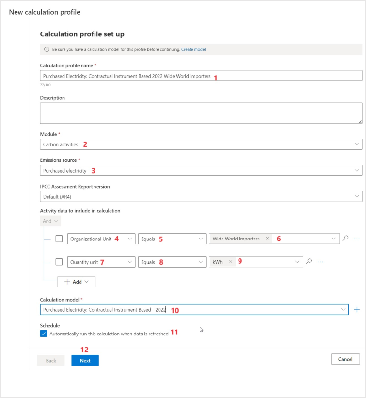](../media/calculation-profile-setup.svg#lightbox)

   On the **Preview** page of the **New calculation profile** wizard, the emissions are calculated for the first row of data that matches the **Activity data to include** filter. In this scenario, the values that are shown in the preview might differ from the following image.

   These values were determined by converting the consumed kilowatt-hours (kWh) to megawatt-hours (MWh): 3519.038/1000 = 3.519038 MWh

   You determine the values of emissions gasses by multiplying the converted consumption by each greenhouse gas factor from the emission factor (FRCC) that's determined in the factor mapping:

   - CO2: 3.519038 \* 861 = 3,029.892 lb

   - CH4: 3.519038 \* .055 = 0.194 lb

   - N20: 3.519038 \* .007 = 0.025 lb

   Then, the greenhouse gases are multiplied by their Global Warming Potential (GWP) factor that's found in the Greenhouse gases table and then the values are added.

   - CO2: 3,029.892 \* 1 = 3,029.892 lb

   - CH4: 0.194 \* 25 = 4.85 lb

   - N20: 0.025 \* 298 = 7.45 lb

   - CO2E: 3,029.892 + 4.85 + 7.45 = 3,042.19 lb

   > [!NOTE]
   > The values in this demonstration have been rounded to three decimal points, resulting in a slightly different value. Microsoft Sustainability Manager computes up to 10 decimal points.

1. Select **Save** to save your calculation profile.

   > [!div class="mx-imgBorder"]
   > [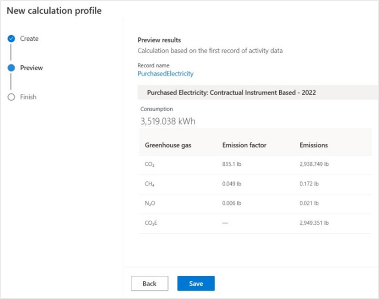](../media/save-profile.svg#lightbox)

1. Select **Done**.

    > [!div class="mx-imgBorder"]
    > [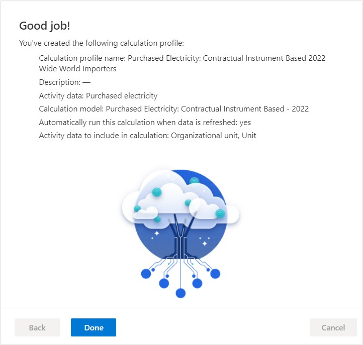](../media/done-profile.svg#lightbox)

Now you've created a calculation profile, which is the mechanism by which calculation jobs are queued. You can set your calculation profiles to run automatically when matching activity data is added or updated, as shown in this scenario. Alternatively, you can run the calculation profiles manually, which is discussed later in this exercise.

## Task: Create an electric vehicle miles driven calculation profile

In this task, Alex creates a calculation profile for the miles driven by Wide World Importers' fleet of electric vehicles for 2022. Alex uses the calculation model that was previously defined in this exercise. Additionally, Alex filters the profile to only activity data for the Wide World Importers organizational unit and where the unit type is mile. These filters ensure that only the miles driven for Wide World Importers' fleet of electric vehicles are included in the calculation job. This task excludes the purchased electricity, which was covered in the previous task.

1. Select **+ New Calculation profile** to create a new calculation profile.

1. Populate the following information on the **New calculation profile** wizard.

   - **Calculation profile name** - Electric Vehicle Miles Driven 2022

   - **Module** - Carbon activities

   - **Emissions source** - Purchased electricity

   - **Activity data to include in calculation** - Select **add** > **add row** and select **Organizational Unit** equals **Wide World Importers** and **Quantity unit** equals **mile**

   - **Calculation model** - Select **Electric Vehicle Miles Driven - 2022** from the dropdown list

   - **Schedule** - Select the **Automatically run this calculation when data is refreshed** checkbox

    The fields and their values are defined as follows (numbers corresponding to numerals in the ensuing screenshot):

   - The **Calculation profile name** identifies the calculation profile in the list.

   - The **Module** is used to identify which data types should appear in the Activity data field.

   - The **Emissions source** identifies which activity data type should be used in the calculation.

   - Use **Activity data to include in calculation** to filter activity data to a specific subset of the activity data type.

   - The **Calculation model** identifies which calculation model should be used for the calculation. Be sure to choose the calculation model from the dropdown list.

   - Use **Automatically run this calculation when data is refreshed** to automatically trigger calculations when the matching activity data is refreshed.

   - The form should resemble the following image. Select **Next**.

   > [!div class="mx-imgBorder"]
   > [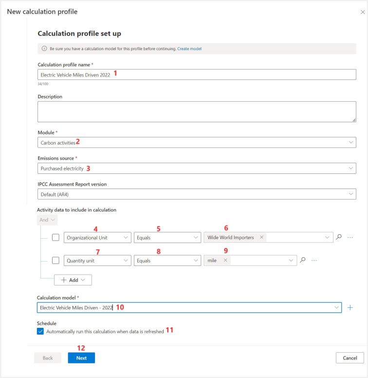](../media/profile.svg#lightbox)

   > [!NOTE]
   > Make sure that you select the calculation model from the dropdown list.

   The **Preview** page of the **New calculation profile** wizard shows the emissions that were calculated for the first row of data that matches your **Activity data to include** filter. In this scenario, the values that are shown in the preview might differ from the following image.

   These values were determined by converting the miles driven to kWh: (7484.724 / 100) \* 49 = 3667.515 kWh

   The consumed kWh converted to MWh: 3667.515/1000 = 3.667515 MWh

   Multiply the converted consumption by each greenhouse gas factor from the emission factor (FRCC) that was determined in the factor mapping:

   - CO2: 3.667515 \* 861 = 3,001.127 lb

   - CH4: 3.667515 \* .055 = 0.238 lb

   - N20: 3.667515 \* .007 = 0.033 lb

   Multiply the greenhouse gases by their GWP factor that's found in the Greenhouse gases table and then add the values:

   - CO2: 3,001.127 \* 1 = 3,001.127 lb

   - CH4: 0.238 \* 25 = 5.95 lb

   - N20: 0.033 \* 298 = 9.834 lb

   - CO2E: 3,001.127 + 5.95 + 9.834 = 3,016.911 lb

   > [!NOTE]
   > The values in this demonstration have been rounded to three decimal points, resulting in a slightly different value. Microsoft Sustainability Manager computes up to 10 decimal points.

1. Select **Save** to save your calculation profile.

    > [!div class="mx-imgBorder"]
    > [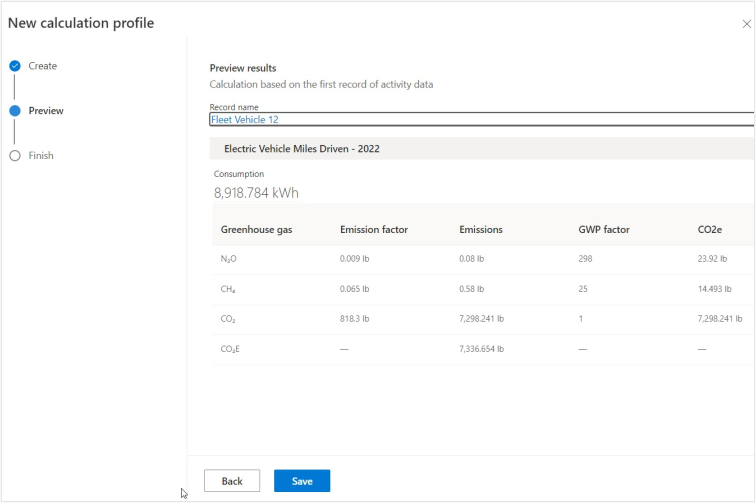](../media/save-calculation-profile.svg#lightbox)

1. Select **Done**.

    > [!div class="mx-imgBorder"]
    > [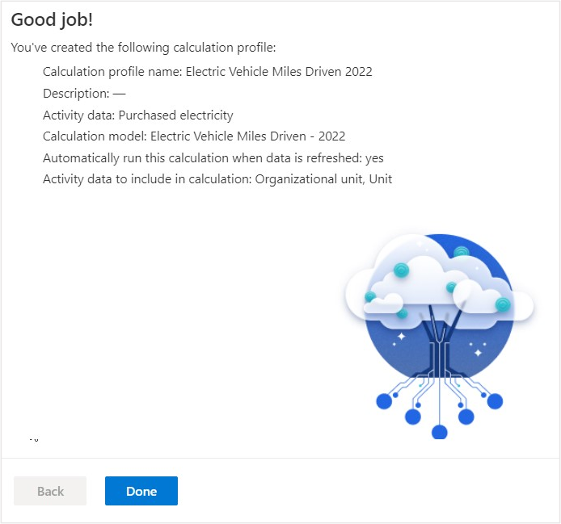](../media/done-calculation-profile.svg#lightbox)

Now, you've created a calculation profile, which is the mechanism by which calculation jobs are queued. You can set your calculation profiles to run automatically when matching activity data is added or updated, as shown in this scenario. Alternatively, you can run the calculation profiles manually, which is discussed later in this exercise.

## Task: Run calculation profiles

In this task, Alex runs the newly created calculation profiles for the electricity that Wide World Importers purchased and for miles that Wide World Importers' fleet of electric vehicles drove. This task creates a calculation job that iterates over each activity data row that matches the calculation profile filter criteria. Additionally, it uses the calculation models that you created previously in this exercise to calculate the carbon emissions for each row. The results are placed in the emissions table, which Alex will review after the calculations are complete.

1. To run the calculation profile for Purchased Electricity: Contractual Instrument Type 2022, complete the following steps:

    1. Select **Purchased Electricity: Contractual Instrument Type 2022** in the list.

    1. Select **Run calculation** on the command bar.

   > [!div class="mx-imgBorder"]
   > [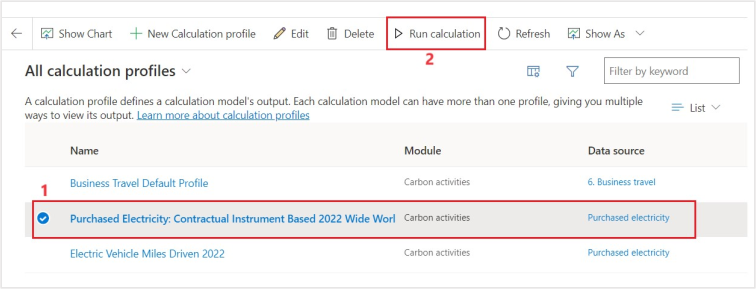](../media/run-calculation.svg#lightbox)

1. To run the calculation profile for Electric Vehicle Miles Driven 2022, follow these steps:

    1. Select **Electric Vehicle Miles Driven 2022** in the list.

    1. Select **Run calculation** on the command bar.

   > [!div class="mx-imgBorder"]
   > [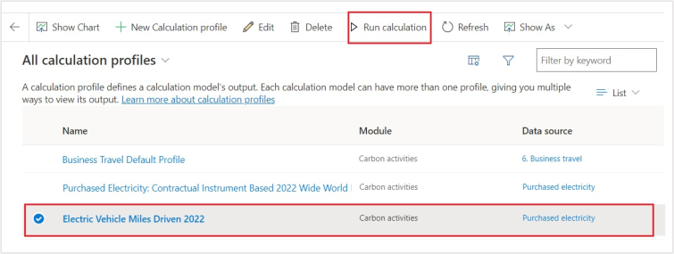](../media/run-calculation-command.svg#lightbox)

1. After several minutes (approximately six minutes), both calculation jobs should be completed. Select the **Refresh** button on the command bar to check the status of the calculation jobs. The two calculation profiles should now have a **Status** of **Succeeded**.

   > [!div class="mx-imgBorder"]
   > [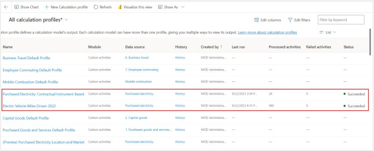](../media/succeeded.svg#lightbox)

1. In the lower-left corner, change the area to **Analytics**.

   > [!div class="mx-imgBorder"]
   > [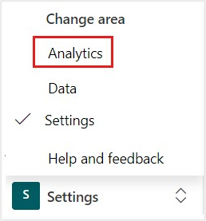](../media/analytics.svg#lightbox)

1. Go to **All emissions** on the left side of the page.

   > [!div class="mx-imgBorder"]
   > [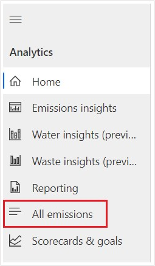](../media/all-emissions.svg#lightbox)

    The **All emissions** view shows all emissions that have been calculated or directly imported.

   > [!div class="mx-imgBorder"]
   > [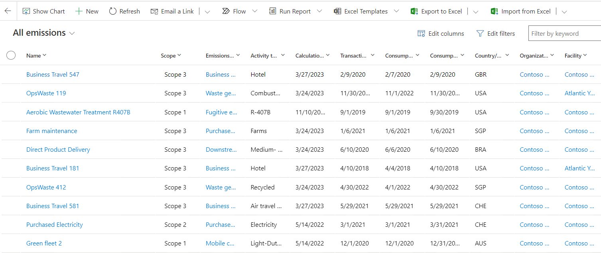](../media/all-emissions-view.png#lightbox)

1. Filter the view by selecting the down arrow next to the **Organizational Unit** column. Select **Filter By**. Select **Wide World Importers**. Select **Apply**.

   > [!div class="mx-imgBorder"]
   > [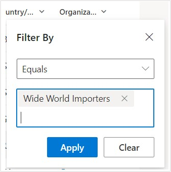](../media/apply.svg#lightbox)

1. After a few moments, the view refreshes. The calculated emissions data for each activity data record that was imported in previous exercises is shown. Scroll to the right to view the CO2E carbon emission values.

   > [!div class="mx-imgBorder"]
   > [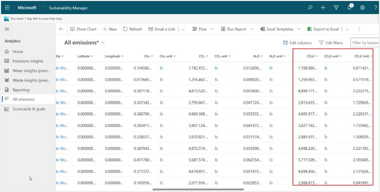](../media/emissions-values.svg#lightbox)

You've now created and run calculation profiles. Calculation profiles are the final step in calculating and recording your carbon emissions in Microsoft Cloud for Sustainability. Now, you'll be able to report and reduce your carbon emissions, which are discussed in the next exercises. It might take 30 minutes for your emissions to appear in the reporting areas.
