In this exercise, you'll learn about the steps that Alex takes to define the factor mappings for purchased electricity. Additionally, you'll review how Alex creates an estimation factor library for estimating the amount of electricity that's purchased based on the miles that were driven by the Wide World Importers fleet of electric trucks. While electric vehicles don't have Scope 1, direct tailpipe emissions, they do need to be charged while transporting goods. In this case, because the electric trucks need to be charged while transporting across the United States, it has resulted in Scope 2 purchased electricity.

Wide World Importers might not know the exact amount of electricity that was purchased for charging the electric trucks, which grids that the electricity came from, or the energy source. However, they can estimate the amount of electricity that was purchased by identifying how many kilowatt hours (kWh) are used every 100 miles based on EPA vehicle efficiency data. For more information, see [Overview of Emission factors](/industry/sustainability/calculate-emission-factors/?azure-portal=true).

1. Use an In-Private or Incognito window and go to [Microsoft Power Apps](https://make.powerapps.com/).

1. Select the correct environment from the **Environment** dropdown menu in the upper-right corner.

   > [!div class="mx-imgBorder"]
   > [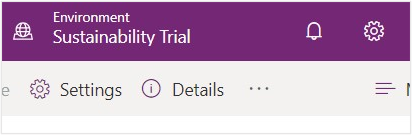](../media/environment.svg#lightbox)

1. Open the **Sustainability Manager** application.

    > [!div class="mx-imgBorder"]
    > [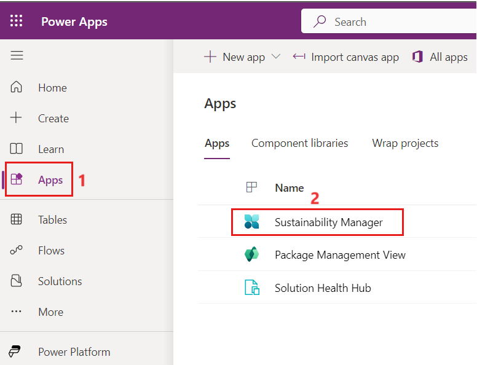](../media/sustainability-manager.png#lightbox)

   You'll be directed to the Home page for Microsoft Sustainability Manager.

> [!IMPORTANT]
> Make sure that you've completed the [previous exercise](/training/modules/sustainability-data-ingestion/exercise) to create activity data. The emissions calculations require that all data ingestion processes from the [previous exercise](/training/modules/sustainability-data-ingestion/exercise) are completed. Failure to do so will result in errors or incorrect values during the calculations.

## Task: Add eGRID factor mappings

In this task, Alex will create factor mappings to map the contractual instrument types for Wide World Importers that Reed previously added to the respective electric grid emission factor. This process allows Microsoft Sustainability Manager to find the correct electric grid for a given contractual instrument type. This type can be expanded to map other reference data to specific emission factors, avoiding the need to create calculation models that are for specific emission factors.

1. In the left navigation pane, select **Calculations** > **Factor libraries**.

1. Select the **EPA 2022 - eGRID** factor library to open it.

   > [!div class="mx-imgBorder"]
   > [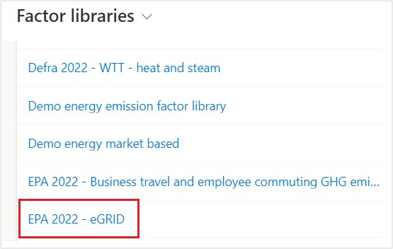](../media/factor-library.svg#lightbox)

   > [!NOTE]
   > Microsoft Sustainability Manager includes Environmental Protection Agency (EPA) and Intergovernmental Panel on Climate Change (IPCC)-based factor libraries for emissions and estimations. Additional libraries are on the roadmap. Make sure that you take time to review the existing factor libraries.

1. Explore the **EPA 2022 - eGRID** factor library. The **General** tab includes the following identifying information about the factor library:

   - **Name** - Identifies the factor library in the list.

   - **Description** - Provides more information about the factor library.

   - **Documentation reference** - Identifies the documentation that's used to generate the factor library.

   - **Type of factor library** - Identifies if this factor library type is **Custom**, **Demo** (sample), or **Standard** (preloaded based on EPA libraries). For more information, see [Emission factors](/industry/sustainability/calculate-emission-factors).

   - **Library type** - This functionally switches the library type between **Emission** or **Estimation** library. Emission libraries calculate emission gases. Estimation libraries create estimated conversions from one unit type to another, such as night stays at a hotel to kWh used.

   > [!div class="mx-imgBorder"]
   > [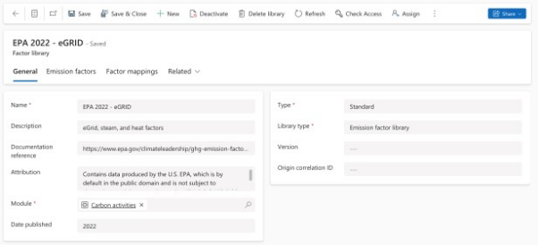](../media/general.svg#lightbox)

1. Select the **Emission factors** tab to view a list of emission factors in the factor library.

   > [!div class="mx-imgBorder"]
   > [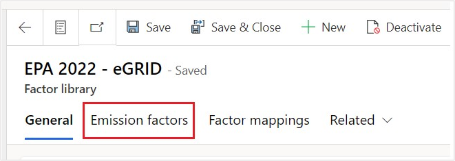](../media/emission-factors.svg#lightbox)

1. The **Emission factors** list displays the name of the emission factor, the unit type, sub type, documentation reference, and gases generated. Because Wide World Importers is a Florida-based business and is connected to the FRCC electrical grid, select **FRCC (FRCC All)** from the list of emission factors.

   > [!div class="mx-imgBorder"]
   > [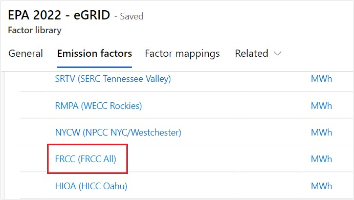](../media/factor.svg#lightbox)

    The **FRCC (FRCC All)** emission factor shows the carbon emissions that have been produced, 861 lb of CO2, 0.055 lb of CH4, and 0.007 lb of N2O, for each megawatt-hour (MWh) of energy consumed.

   This information is important to understand how the final CO2E (carbon dioxide equivalent) will be calculated later. When creating a new emission factor, you'll want to define how much of each gas is produced for a given unit. Several other gas types can be tracked, as shown on the screen, depending on the scenario. Some or all gas types might be used.

   > [!div class="mx-imgBorder"]
   > [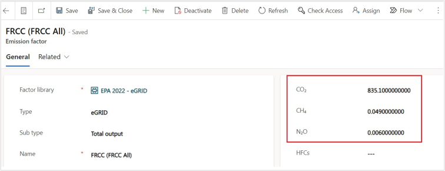](../media/emissions.svg#lightbox)

1. Return to **EPA 2022 - eGRID** by selecting the back arrow. Select the **Factors mapping** tab.

   > [!div class="mx-imgBorder"]
   > [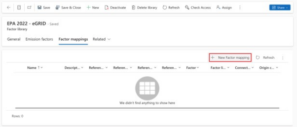](../media/factors-mapping.svg#lightbox)

   > [!NOTE]
   > Factor mappings help map emission factors to reference data. Microsoft Sustainability Manager will use the factor mappings to find the correct emission factor to be used in an emission calculation for a given activity data. This factor is based on the reference data that's linked on the activity data, such as vehicle type or contractual instrument type.

1. Create factor mappings for the two contractual instrument types that were created in [previous exercise](/training/modules/sustainability-setup-organization/exercise-profile-data/?azure-portal=true) and then associate them with the **FRCC (FRCC All)** emission factor. Each contractual instrument is a local power provider in Florida, and they're part of the FRCC electric grid. Select **+ New Factor mapping**.

   > [!div class="mx-imgBorder"]
   > [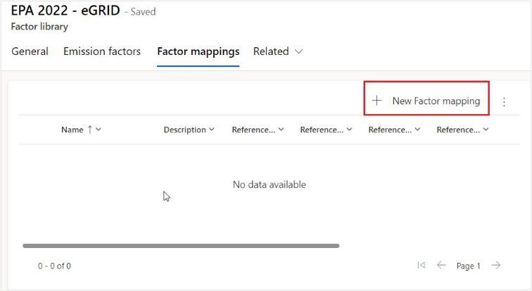](../media/new.svg#lightbox)

1. Use the following information to populate the fields on the **New Factor mapping** screen:

   - **Name** - FRCC - Purchased Electricity - VanArsdel Ltd

   - **Reference data** - VanArsdel Ltd

   - **Factor** - FRCC (FRCC All)

   The fields and their values are defined as follows (numbers corresponding to numerals in the ensuing screenshot):

   1. The **Name** of the factor mapping identifies the factor mapping in the list.

   2. The **Reference data** maps the contractual instrument type.

   3. The **Factor** maps the emission factor.

   4. You can select the **Save & Close** button to save the record.

   > [!div class="mx-imgBorder"]
   > [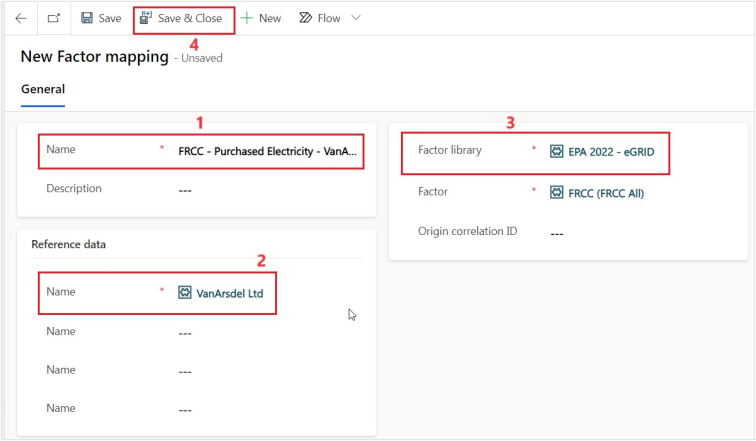](../media/fields.svg#lightbox)

1. Select **+ New Factor mapping**.

   > [!div class="mx-imgBorder"]
   > [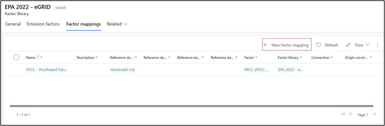](../media/new-factor-mapping.svg#lightbox)

1. Use the following information to populate the fields on the **New Factor mapping** screen:

   - **Name** - FRCC - Purchased Electricity - Adatum Corp

   - **Reference data** - Adatum Corp

   - **Factor** - FRCC (FRCC All)

   The fields and their values are defined as follows (numbers corresponding to numerals in the ensuing screenshot):

   - The **Name** of the factor mapping identifies the factor mapping in the list.

   - The **Reference data** maps the contractual instrument type.

   - The **Factor** maps the emission factor.

   - You can select **Save & Close** to save the record.

   > [!div class="mx-imgBorder"]
   > [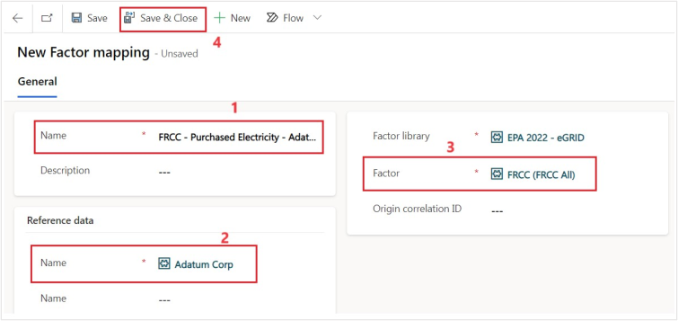](../media/values.svg#lightbox)

Now, you have two additional factor mappings, one for each contractual instrument that was added during the [previous exercise](/training/modules/sustainability-setup-organization/exercise-profile-data).

> [!div class="mx-imgBorder"]
> [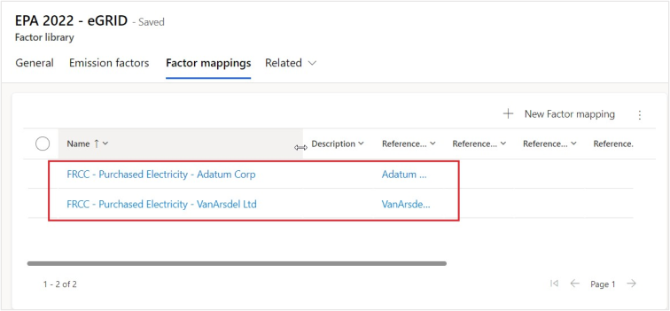](../media/mapping.svg#lightbox)

You've completed adding the factor mappings for your purchased electricity activity data. This step is important toward the creation of calculation models that will calculate emissions for multiple emission factors based on reference data, such as contractual instrument types or facilities.

By creating these factor mappings, you can choose contractual instrument types as emission factors during your calculation model creation. This information tells Microsoft Sustainability Manager to map the contractual instrument type on an activity data record to the emission factor that's listed in the factor mapping. Now, you can create more dynamic calculations rather than calculations that are specific to a given emission factor.

## Task: Create an estimation factor library

In this task, Alex will create an estimation factor library to define the estimation factor for estimating the kilowatt-hours (kWh) that are used for each mile driven. While electric vehicles don't have Scope 1, direct tailpipe emissions, they do need to be charged while transporting goods across the US, resulting in Scope 2 purchased electricity. Wide World Importers don't know the exact amount of electricity purchased, what grid the electricity came from, or the energy source; however, they can estimate the amount of purchased electricity by identifying the number of kilowatt-hours (kWh) that are used every 100 miles based on EPA vehicle efficiency.

1. Go to **Factor libraries** on the left navigation pane and select **New** to create a new library.

1. Use the following information to populate the fields on the **New Factor library** page:

   - **Name** - Electric Vehicle Estimation Library

   - **Description** - Scope 2 Emissions from Electric Vehicles

   - **Module** - Select **Carbon activities**

   - **Documentation reference** - `https://fueleconomy.gov/feg/byfuel/EV2022.shtml`

   - **Type** - Custom

   - **Library Type** - Estimation factor library

    The fields and their values are defined as follows (numbers corresponding to numerals in the ensuing screenshot):

    1. The **Name** of the factor library identifies the factor library in the list.

    1. The **Description** of the factor library provides more information about the factor library for others.

    1. The **Module** is the data type that should appear in the Activity data.
     
    1. The **Documentation reference** for the factor library identifies the documentation that's used to generate the factor library.

    1. The **Type** of factor library identifies if it's a **Custom**, **Demo** (sample), or **Standard** (preloaded based on EPA libraries) type. For more information, see [Emission factors](/industry/sustainability/calculate-emission-factors).  

    1. The **Library Type** of the factor library switches the library type between Emission or Estimation library. Emission libraries calculate emission gases. Estimation libraries create estimated conversions from one unit type to another, such as 100 miles driven to kWh.
   
    1. You can select **Save & Close** to save the record.

> [!div class="mx-imgBorder"]
> [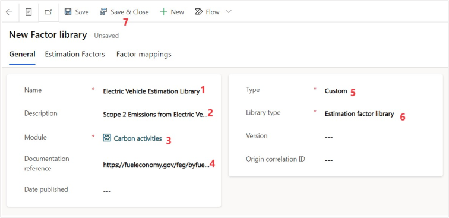](../media/factor-library-fields.svg#lightbox)

You've now created an estimation library, which is the first step to using estimations for emissions where you might not be able to determine the exact emissions. Some examples of estimations include estimating the amount of natural gas and electricity for each hotel night stay during business travel or vehicle fuel consumption by distance traveled.

## Task: Create an estimation factor

In this task, Alex will create the estimation factor for estimating the kilowatt-hours (kWh) that are used for every mile driven. The EPA estimates electric vehicle efficiency in kilowatt-hours (kWh) for every 100 miles. Alex will use this same metric in the estimation factor to ensure that the estimation factor is consistent with the EPA.

1. Scroll down on the Factor library view and select **Electric Vehicle Estimation Library** (it will be near the bottom of your page) under **Estimation factors**.

   > [!div class="mx-imgBorder"]
   > [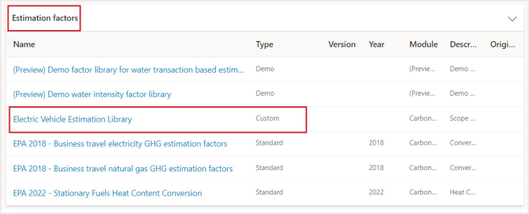](../media/electric-vehicle-estimation-library.svg#lightbox)

1. Select the **Estimation Factors** tab.

   > [!NOTE]
   > For example purposes only, this exercise uses the largest electric vehicle that's available on the EPA fueleconomy.gov website at the time of writing.

   > [!div class="mx-imgBorder"]
   > [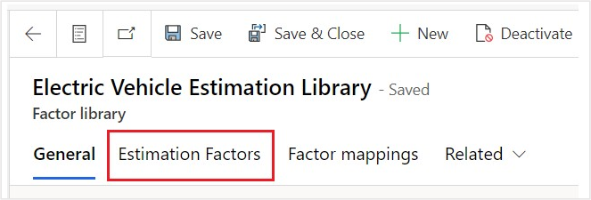](../media/estimation-factors.svg#lightbox)

1. Select **+ New Estimation factor**.

   > [!div class="mx-imgBorder"]
   > [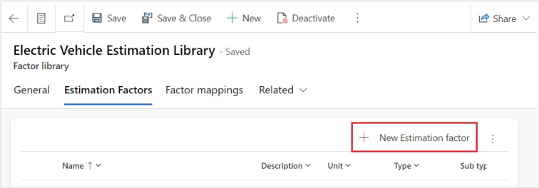](../media/new-estimation-factor.svg#lightbox)

1. Review the Fabrikam Electric truck details on the EPA website and then enter the following information on the **New Estimation factor** screen:

   - **Name** - Fabrikam Electric Truck - EPA Estimate

   - **Documentation reference** - `https://fueleconomy.gov/feg/noframes/45318.shtml`

   - **Factor Library** - Electric Vehicle Estimation Library

   - **Unit** - 100 Mile

   - **Factor value** - 49.00

   - **Factor value unit** - kWh

    The fields and their values are defined as follows (numbers corresponding to numerals in the ensuing screenshot):

   1. The **Name** identifies the emission factor in the list.

   2. The **Documentation reference** identifies the documentation that's used to generate the estimation factor.

   3. The **Factor library** links the estimation factor to the factor library. This value will default if you select **New Estimation factor** while you're in a factor library.

   4. The **Unit** identifies what unit will be converted.

   5. The **Factor value** determines the amount to be estimated according to the **Factor value** unit.

   6. The **Factor value unit** specifies the unit type to be converted to.

   7. You can select **Save & Close** to save the record.

   > [!div class="mx-imgBorder"]
   > [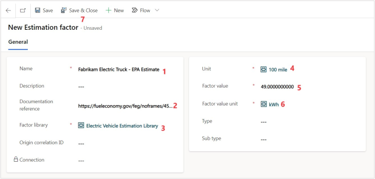](../media/new-estimation-factor-fields.svg#lightbox)

The new emission factor is estimating that every 100 miles is equivalent to 49 kWh.

> [!div class="mx-imgBorder"]
> [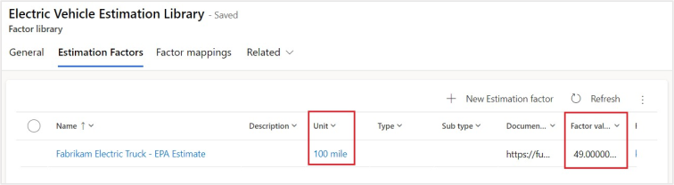](../media/unit-factor-value.svg#lightbox)

You've now created an estimation factor. Estimation factors are important to be able to convert from one unit type to another when an estimate is appropriate, such as estimated fuel or battery economy of vehicles or when estimating gas and electric usage during hotel stays.
