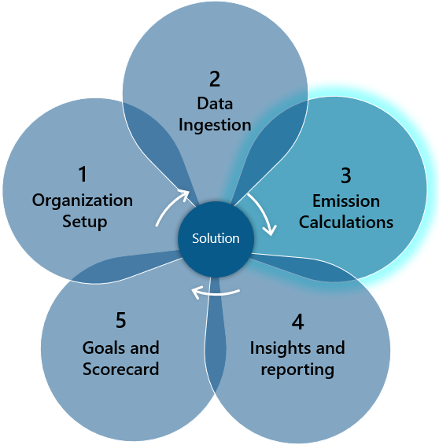
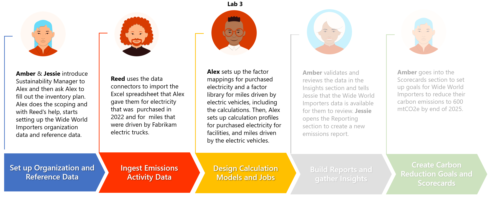

The previous two exercises provided the foundation for emission calculations by setting up the organization and reference data, such as contractual instrument types, and by ingesting the activity data. This exercise focuses on performing the emission calculations by using a combination of factor libraries, emission factors, estimation factors, and calculation profiles. After you've completed the calculations, you'll review the emission calculations output.

The emissions that you calculate during this exercise are used in the remaining scenarios (reporting and goals) in the upcoming exercises.

## Prerequisites

Make sure that you meet the following prerequisites before starting this exercise:

- Microsoft Sustainability manager environment is set up with sample data

- Exercise 01 organization and reference data are entered

- Exercise 02 activity data is ingested

## Solution focus area

In the emission calculations, focus area calculation models are designed to calculate the emissions that the ingested activity data produced. The calculations setup is divided into two concepts: factor mappings and calculation models. Currently, Microsoft Sustainability Manager has been verified with EPA default calculations and factor sets only. More factor sets are available eventually. Organizations can add or create any factor set based on their own business needs and regional requirements.

These terminologies are used throughout the setup of emission calculations:

- **Estimation factor** - Provides a way to convert from one unit type to another, such as night stays to kilowatt hour (kWh) used.

- **Emission factor** - Defines the amount of greenhouse gas that's emitted by a given unit type, including defining gas emissions such as carbon dioxide (CO2), methane (CH4), and nitrous oxide (N20).

- **Factor mapping** - Provides a way to map reference data to a specific emission factor, simplifying calculation models by allowing customers to choose a reference data type and allowing the system to find the appropriate emission factor.

- **Factor library** - A collection/grouping of emission or estimation factors and factor mappings that calculation models use.

- **Calculation model** - Considered the instruction set that the application uses to perform the emission calculations, the calculation model uses factor libraries, factor mappings, and emission/estimation factors to perform the emission calculations.

- **Calculation profile** - Provides the scheduling for calculation jobs to define activity data filter and the calculation model (instruction set) to use.

- **Allocation Profile** – An allocation profile configures methods to distribute emissions from a source (like a facility) to specific entities based on chosen parameters. It allows visualization of emissions distribution without altering default reporting, offering insights into how emissions are divided.

- **Custom dimensions** - Custom dimensions can be used in emission calculation models, for example, in condition, calculation, and reporting actions.

## Personas and scenarios

In this exercise, Alex Serra, the emissions analyst for Wide World Importers, sets up factor mappings for purchased electricity for facilities, mapping contractual instrument types to the Florida electric grid (FRCC).

Alex also creates a new estimation factor library for estimating miles driven to kilowatt hours (kWh) for Fabrikam Electric trucks. Then, Alex creates calculation models for calculating the carbon emissions that are produced in accordance with the facility's purchased electricity. Thereafter, Alex creates a calculation model for estimated carbon emissions that are produced by the purchased electricity for charging Fabrikam Electric trucks (based on the kWh for each mile driven estimate).

Finally, Alex creates and runs calculation profiles, filtering to Wide World Importers activity data. After running the calculation profile, Alex will review the calculated emissions data before notifying Amber Rodriguez, the sustainability specialist, that the emission calculations are complete.

Alex then creates an allocation profile called Headcount to understand the emissions distributed based on purchased electricity. Alex creates a profile with allocation method Headcount and allocation method details, by importing the file with source and destination with their active period in the organization.

In this exercise, you focus on the scenarios that are illustrated in the following diagram.

