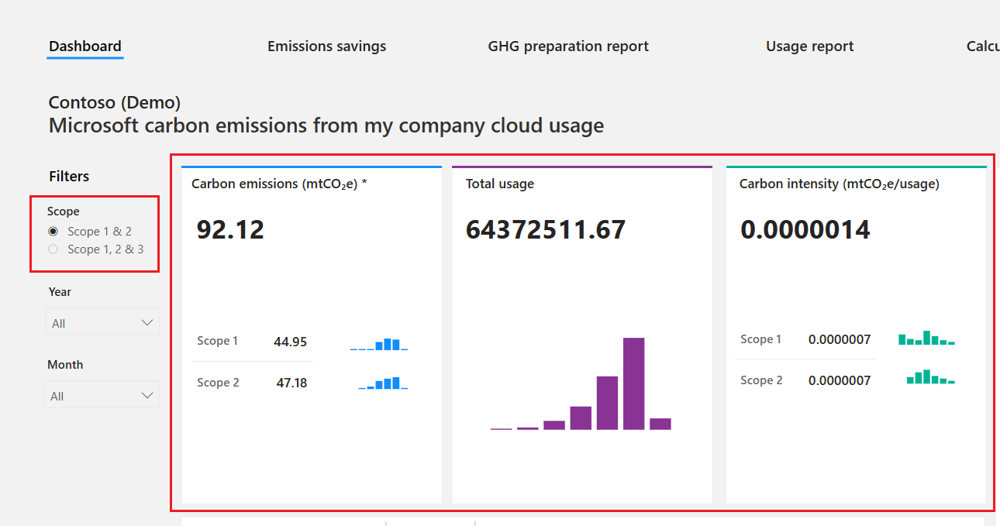
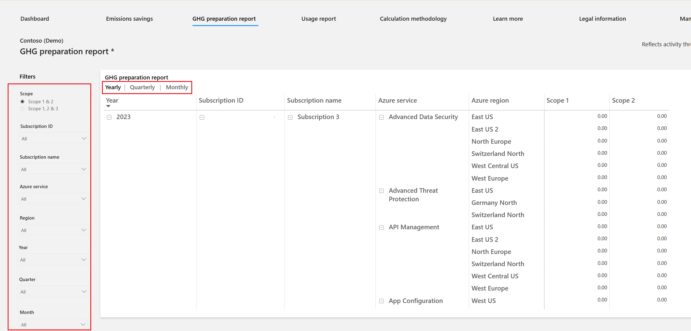
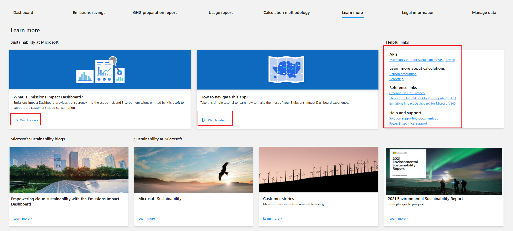

Watch the following video to learn more about the metrics and how to generate usage reports in the Emissions Impact Dashboard for Azure.

> [!VIDEO https://www.microsoft.com/videoplayer/embed/RWWSMp]

The Emissions Impact Dashboard for Azure has multiple tabs that detail a range of metrics.

The dashboard provides insight into emissions that are generated based on an organization's use of Microsoft Cloud services. Key fact boxes across the upper left of the page provide visibility into carbon emissions, total cloud usage, and carbon intensity, which is a measure of efficiency.

While most cloud services only provide a view into scope 1 and 2 emission types, Microsoft takes emissions analysis one step further by also providing visibility to scope 3 emissions.

> [!div class="mx-imgBorder"]
> 

**Emissions savings** lets organizations view the carbon emissions savings from running on Microsoft Cloud versus an on-premises alternative. On the efficiency scale, organizations can select their level of efficiency to be low, medium, or high by using the criteria on the right side of the page's guidance.

**GHG preparation report** helps organizations prepare internal or external sustainability reports. You can filter by time horizon, yearly, monthly, and quarterly, in addition to subscription name and ID, Azure service, Azure region, and scope type. You can export this report to Microsoft Excel for further analysis and reporting.

> [!div class="mx-imgBorder"]
> 

**Usage report** helps organizations know the usage hours of Azure services across all available subscriptions. The usage hours are based on the sum of the organization’s compute, storage, and data transfer in Microsoft Cloud. You can filter and export a usage report.  

You can export data from the **GHG preparation report**, **Usage report**, and dashboard page on a per-visualization level. You can't export the overall report's data from the **Export** button on the page header.

> [!NOTE]
> Export to Excel is limited to 150,000 rows, and export to CSV is limited to 30,000 rows.

The **Calculation methodology** page provides insights into how Microsoft calculates emissions and usage for the Emissions Impact Dashboard.

The **Learn more** page contains information and tutorials on how to use the Emissions Impact Dashboard. It also provides insights into Microsoft sustainable energy initiatives and investments.

> [!div class="mx-imgBorder"]
> 

The **Manage data** page provides organizations the ability to delete their emissions data from the Emissions Impact Dashboard.

The following video is a demonstration of the Emissions Impact Dashboard for Microsoft 365.

> [!VIDEO https://www.microsoft.com/videoplayer/embed/RWWDuq]

To learn more on how to interpret and act on Microsoft emission insights, see the [Microsoft 365 Sustainability whitepaper](https://aka.ms/m365-emissions-whitepaper/?azure-portal=true).
