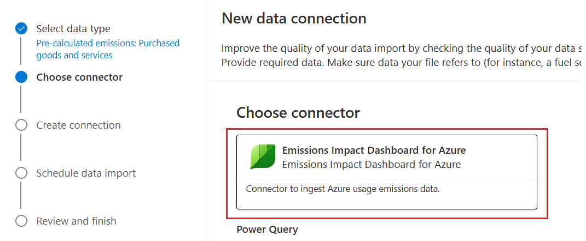

Microsoft Sustainability Manager integrates with the Emissions Impact dashboard through its connector framework. Organizations can use the Emissions Impact Dashboard for Azure connector to obtain the emissions data generated from their Microsoft Azure services into Microsoft Sustainability Manager. This data provides a unified view of the emissions from their operations and IT infrastructure.

## Prerequisites

Azure emissions are directly related to Azure costs. As a result, the service principal that's used to read Azure emissions and the user who's creating the connection in Microsoft Sustainability Manager must have permission to read billing account data.

Before you can connect to the Emissions Impact Dashboard, you should complete the following steps:

1.  Set up a service principal.

    -   [Create a new service principal in the same tenant](/azure/active-directory/develop/howto-create-service-principal-portal?azure-portal=true#register-an-application-with-azure-ad-and-create-a-service-principal) as Microsoft Sustainability Manager.

    -   Assign the Billing Account Reader role to the new service principal (or EnrollmentReader, if you're using an Enterprise Agreement account).

1. Ensure that the user who's creating the connection in Microsoft Sustainability Manager also has the Billing Account Reader role (or EnrollmentReader, if you're using an Enterprise Agreement account).

For more information, see [Assign roles to Azure Enterprise Agreement service principal names](/azure/cost-management-billing/manage/assign-roles-azure-service-principals/?azure-portal=true).

## Exercise: Ingest data from Emissions Impact Dashboard for Azure into Sustainability Manager

In this exercise, you'll ingest data from the Emissions Impact Dashboard for Azure into Sustainability Manager.

### Task: Create a connection for Emissions Impact Dashboard for Azure connector

Your task is to create a connection for the Emissions Impact Dashboard for Azure connector by following these steps:

1.  Sign in to the Sustainability Manager application and change the area to **Data**. Select **Data connections** and then select **Connect to data**.

	> [!div class="mx-imgBorder"]
	> 

	> [!div class="mx-imgBorder"]
	> 

1.  Select **Pre-calculated emissions** from the **Select data type** list, select **Scope 3: Value chain | upstream 1. Purchased goods and services**, and then select **Next**.

	> [!div class="mx-imgBorder"]
	> 

1.  Select **Emissions Impact Dashboard for Azure** from the connectors list. Select **Next**.

	> [!div class="mx-imgBorder"]
	> 

1.  In the **Create connection** screen, select the **Select credential** dropdown menu and then select **+ Add credential**. Select **Next**.

	> [!div class="mx-imgBorder"]
	> 

1.  In the **Add credentials** dialog, provide the details for all fields and then select **Add**.

	> [!div class="mx-imgBorder"]
	> 

|      Field                    |      Information                                                                                                             |
|-------------------------------|------------------------------------------------------------------------------------------------------------------------------|
|     Credentials   nickname    |     User-friendly nickname                                                                                                   |
|     Client   ID               |     Client ID of the service principal                                                                                       |
|     Client   secret           |     Client secret of the service principal                                                                                   |
|     Billing   ID              |     Billing ID of the billing account, which you can find in the Azure portal under **Cost Management & Billing**      |
|     Organizational unit       |     Select the organizational unit that Azure emissions should be associated with                                           |

6.  Wait until the connection creation has completed. Then, you can add more credentials, or you can move on to the next step by selecting **Next**.

	> [!div class="mx-imgBorder"]
	> 

	> [!div class="mx-imgBorder"]
	> 

7.  Schedule the data refresh. The refresh can be automatic at a defined frequency or on a defined schedule.

8.  Enter a name and then select **Connect**.

9.  Select **Done**.
