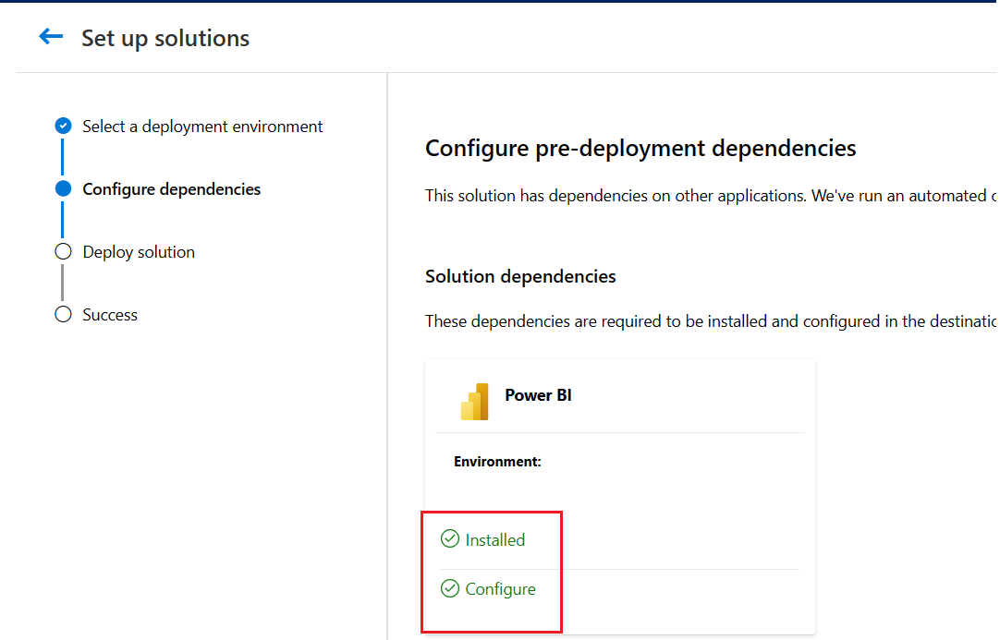

Before installing the dashboards, you need to ensure that you have the Power BI Pro license assigned to you.

## Exercise: Install the Emissions Impact dashboards

In this exercise, you'll install the Emissions Impact dashboards and connect to your data.

### Task: Deploy the dashboards from the Solution Center

In this task, you'll sign in to the Microsoft Cloud Solution Center and deploy the Microsoft Cloud for Sustainability dashboard solutions.

1.  Open a browser in InPrivate or Incognito mode and then go to [https://solutions.microsoft.com](https://solutions.microsoft.com/?azure-portal=true).

1.  Use the credentials with your Power BI Pro license to install.

1.  After sign-in is complete, select **Microsoft Cloud for Sustainability** on the **Solutions** page.

	> [!div class="mx-imgBorder"]
	> 

1.  From the available capabilities, select **Reporting, disclosure and automated insights**.

	> [!div class="mx-imgBorder"]
	> 

1.  From the available solutions list, select **Emissions Impact Dashboard for Azure** and **Emissions Impact Dashboard for Microsoft 365** with the **Added** checkbox and then select **Deploy**.

	> [!div class="mx-imgBorder"]
	> 

1.  Provide the name for your deployment and then select **Next**.

	> [!div class="mx-imgBorder"]
	> 

1.  Verify that the pre-deployment dependencies are installed and set up. Select **Deploy**.

	> [!div class="mx-imgBorder"]
	> 

1.  Wait for the deployment to show as successful. You'll be notified about the deployment start and success through email. Select to view the Power BI reports. Also, these reports are available in the organization's Power BI Online.

	> [!div class="mx-imgBorder"]
	> 

	> [!div class="mx-imgBorder"]
	> 

You've successfully installed the **Emissions Impact Dashboard for Azure** and **Emissions Impact Dashboard for Microsoft 365** applications.

### Task: Connect to Data

In this task, you'll connect your organization's data into the Emissions Impact dashboards for Azure and Microsoft 365.

#### Prerequisites 

The prerequisites are different for the Azure dashboard and the Microsoft 365 dashboard.

##### Azure

The prerequisites for the Emissions Impact Dashboard for Azure are:

-  You should have an admin role with read/write permissions on the organization's Azure tenant. If you don't have these permissions, contact your Microsoft Entra ID admin who has read/write permissions.

-  The Emissions Impact Dashboard for Azure is supported for EA Direct, MCA, and MPA accounts with direct billing relationships with Microsoft.

    - For an EA Direct account, you need a Billing Account Administrator (formerly known as an Enrollment Administrator) account with read or write permissions. You also need to have the company's [billing account ID](/power-bi/connect-data/service-connect-to-emissions-impact-dashboard?azure-portal=true#finding-your-companys-billing-account-id) (formerly known as the enrollment number).

    - For an MCA or MPA and direct billing relationship with Microsoft, you need a Billing Account Administrator account with a role as Billing Account Reader/Contributor/Owner, and you need to have your company's [billing account ID](/power-bi/connect-data/service-connect-to-emissions-impact-dashboard?azure-portal=true#finding-your-companys-billing-account-id).

##### Microsoft 365

The prerequisites for the Emissions Impact Dashboard for Microsoft 365 are:

- You need to have the [tenant ID](/sharepoint/find-your-office-365-tenant-id/?azure-portal=true) of your organization, which has a business, enterprise, or education subscription for Microsoft 365 or Microsoft Office 365. Your Microsoft Entra ID administrator can provide the tenant ID.

- You need to have one of the following Microsoft 365 admin roles:

    -   Global admin

    -   Exchange admin

    -   Skype for Business admin

    -   SharePoint admin

    -   Global reader

    -   Report reader

#### Connect your data for Azure

To connect your data for Azure, follow these steps:

1.  In the Emissions Impact Dashboard for Azure, select the **Connect your data** option.

	> [!div class="mx-imgBorder"]
	> 

1.  In the **Connect to Emissions Impact Dashboard** dialog, under **EnrollmentID or BillingAccountID**, enter your billing account ID (formerly known as the enrollment number) for EA Direct customers, or enter the billing account ID for MCA/MPA. In the **Advanced** options, you can enable automatic refresh of data for this report. When you're done, select **Next**.

	> [!div class="mx-imgBorder"]
	> 

1.  Connect your account to the dashboard by using the following settings:

	-   For **Authentication method**, select **OAuth2**.

	-   For **Privacy level setting for this data source**, select **Organizational**.

	-   Select **Sign in and connect**.

	> [!div class="mx-imgBorder"]
	> 

1.  During sign-in, use the credentials that have access to the EnrollmentID/BillingAccountID and the required admin role to the Billing account/Enrollment based on the Azure account type.

Now, you've successfully connected your Microsoft Azure billing account to the Emissions Impact Dashboard. Wait for 24 hours to view your Microsoft Azure services emissions data in the report.

#### Connect your data for Microsoft 365

To connect your data for Microsoft 365, follow these steps:

1.  In the Emissions Impact Dashboard for Microsoft 365, select **Connect your data**.

	> [!div class="mx-imgBorder"]
	> 

1.  In the **Connect to Emissions Impact Dashboard for Microsoft 365** dialog, enter your Microsoft 365 tenant ID. In **Advanced** options, you can enable automatic refresh of data for this report. When you're done, select **Next**.

	> [!div class="mx-imgBorder"]
	> 

1.  Connect your account to the dashboard by using the following settings:

	-   For **Authentication method**, select **OAuth2**.

	-   For **Privacy level setting for this data source**, select **Organizational**.

	-   Select **Sign in and connect**.

	> [!div class="mx-imgBorder"]
	> 

1.  During sign-in, use the credentials that have the appropriate admin access to your Microsoft 365 tenant, as mentioned in the prerequisites.

 You've successfully connected your Microsoft 365 tenant to the Emissions Impact Dashboard for Microsoft 365. Wait for 24 hours to view your tenant emissions data in the report.
