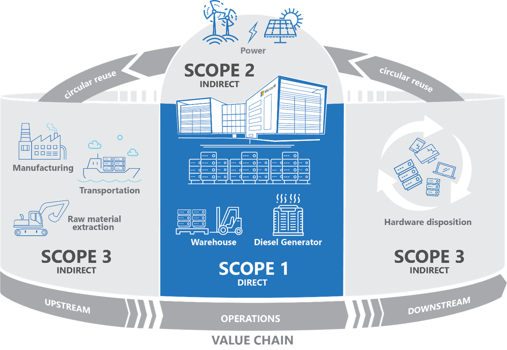
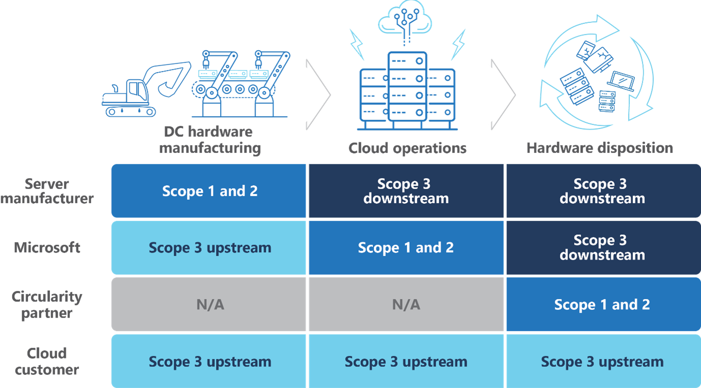
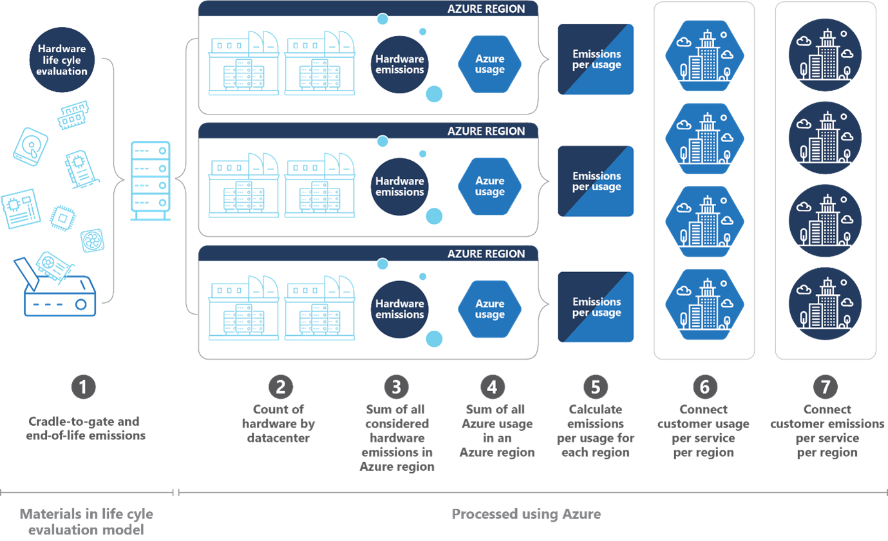

Emissions Impact dashboards provide consistent and accurate carbon accounting to quantify an organization's carbon footprint that's associated with using Microsoft Azure and Microsoft 365. They enable organizations to quantify emissions across scopes 1, 2, and 3 by using Microsoft's methodology. This methodology helps to quantify the aggregated life cycle carbon impacts of individual IT asset components across the Microsoft Cloud value chain and it allocates them to specific usage for each Azure service and for Microsoft 365 customers. For more information, see [A new approach for carbon emissions](https://go.microsoft.com/fwlink/p/?LinkID=2161861&clcid=0x409&culture=en-us&country=US). 

Microsoft Cloud for Sustainability provides two Microsoft Power BI dashboards to calculate your organization's carbon emissions from your Microsoft Cloud-hosted IT infrastructure.

- **Emissions Impact Dashboard for Azure**

- **Emissions Impact Dashboard for Microsoft 365**

The Emissions Impact Dashboard for Azure displays data for emissions that are associated with usage of Microsoft Azure services. The Emissions Impact Dashboard for Microsoft 365 displays data for emissions that are associated with Microsoft Exchange Online, SharePoint, OneDrive, and Microsoft Teams, Word, Excel, PowerPoint, and Outlook. The data represents an estimate of the datacenter emissions that Microsoft services generate on behalf of your organization, which provides Microsoft Azure and Microsoft 365 services to their customers.

These dashboards cover scopes 1, 2, and 3 carbon emissions as calculated from the manufacturing, packaging, transportation, use, and end-of-life phases of datacenter hardware in all Microsoft-owned and leased datacenters.

## Definitions and key concepts

The following sections provide the definitions and key concepts for working with the Emissions Impact dashboards.

### Standards for calculation

At Microsoft, Greenhouse gas (GHG) emissions are segmented into three categories:

-   **Scope 1** - Emissions that **directly result from business activities**, such as stationary combustion of fuels for backup power generation in cloud datacenters.

-   **Scope 2** - Emissions that **indirectly result from producing energy**, such as exhaust from an electric power plant. This calculation is market-based, meaning that it takes into account Microsoft's renewable energy power purchases. Carbon offsets aren't accounted for in this scope.

-   **Scope 3** - Emissions that **indirectly result from all other business activities**, such as those that are associated with upstream (Manufacturing, Supply chain) and downstream (Usage and recycling servers) activities.  

> [!div class="mx-imgBorder"]
> 

A critical aspect to understanding emissions accounting is that the same emissions that's Scope 1 or 2 for one organization can be Scope 3 for another. For example, Microsoft Cloud services result in Scope 1, 2, and 3 emissions for Microsoft, but the allocated share of these emissions counts as Scope 3 emissions for Microsoft Cloud customers who purchase those services.

> [!div class="mx-imgBorder"]
> 

While Emissions Impact dashboards calculate the emissions from cloud IT infrastructure, some notable infrastructure and datacenter operation variables include:

-   Lifetime of equipment defaults to six years.

-   Emissions due to transportation are calculated as an average across shipments; however, default data can be replaced with actual transportation emissions data where available.

-   Critical infrastructure, such as the datacenter facility, isn't included in the methodology at this time.

The Emissions Impact dashboards for Azure and Microsoft 365 have metrics that organizations can use to estimate the emissions that are being saved by using Microsoft Azure services.

Some key metrics and their definitions are explained in the following table.

|     Metric                                               |     Definition                                                                                                                                                                                                                  |
|----------------------------------------------------------|---------------------------------------------------------------------------------------------------------------------------------------------------------------------------------------------------------------------------------|
|     Carbon   emissions (MTCO2e)                          |     Allocation of Microsoft Cloud services carbon emissions, based on their cloud usage. This value includes Microsoft scopes (1, 2, and/or 3) as indicated and filtered.                                            |
|     Change   in carbon emissions                         |     Change of emissions over the period selected.                                                                                                                                                                        |
|     Carbon   intensity (MTCO2e/usage)                    |     Allocation of Microsoft Cloud services carbon emissions, divided by the organization’s cloud usage hours during the selected period.                                                                                  |
|     Projected end-of-year carbon emissions (MTCO2e)    |     Projected allocation of Microsoft Cloud services cumulative end-of-year carbon emissions based on an organization’s year-to-date cloud usage trajectory and previous year trends.                                                    |
|     My company Microsoft cloud usage                   |     Usage hours based on a sum of the organization’s compute, storage, and data transfer in Microsoft Cloud. Usage for emissions calculations might or might not equal their Microsoft usage for billing purposes.         |
|     Carbon emissions by Azure service                  |     Carbon emissions are shown by segmented Microsoft Cloud service.                                                                                                                                                          |
|     Emissions savings                                  |     Estimated emissions that an organization is saving by using Microsoft Cloud instead of an on-premises solution. Estimates are based on an organization’s total cloud usage and the data that's provided on the **Emissions Savings** page.              |
|     Preparation report                                 |     Provides calculations in an exportable format, such as Microsoft Excel, for ease of use.                                                                                                                                               |

### Calculation methodology

Microsoft bases its calculation methodology on principles from the Greenhouse Gas Protocol and uses of widely accepted ISO standards.  

#### Scopes 1 and 2

Power usage for Scope 1 and Scope 2 emissions is categorized by Storage, Compute, or Network. Usage time in these categories helps in attribution of scope 1 and 2 emissions. 

The full methodology for Scopes 1 and 2 is based on a life cycle evaluation that's been conducted for the 2018 Microsoft study: [The Carbon Benefits of Cloud Computing: A Study on the Microsoft Cloud](https://download.microsoft.com/download/7/3/9/739BC4AD-A855-436E-961D-9C95EB51DAF9/Microsoft_Cloud_Carbon_Study_2018.pdf).

The Scope 2 methodology calculates the energy and carbon impacts for each datacenter over time, taking into consideration various factors, such as datacenter and server efficiency, grid emission factors, renewable energy purchases, and infrastructure power usage.  

### Scope 3

The calculation of Scope 3 emissions starts with the life cycle evaluation of materials that are used in Microsoft datacenter infrastructure and carbon emissions by datacenter. Microsoft segments this sum based on customer usage of each datacenter.  

This methodology for Scope 3 emissions calculates the energy and carbon impacts for each datacenter over time by using the following criteria: 

- Most common materials that are used to manufacture the IT infrastructure that's used in Microsoft datacenters 

- Most common parts that make up cloud infrastructure (hard disks, FPGA, steel racks) 

- Complete inventory of all assets (as categorized by Microsoft bill of materials) in Microsoft datacenters by region

- Carbon factors for cloud infrastructure across life stages (raw material extraction, component aggregation, usage, and end-of-life disposal)  

> [!div class="mx-imgBorder"]
> 
