In this exercise, you'll learn about the steps that Amber takes to create scorecards and goals to help Wide World Importers track carbon reduction progress. Based on the results of the previous module, Amber has determined that Wide World Importers needs to reduce their Scope 2: Purchased electricity carbon emissions. Scorecards and goals allow organizations to set carbon reduction targets and track their progress to those goals. For more information, see [Overview of scorecards and goals](/industry/sustainability/reports-scorecards-goals/?azure-portal=true).

1. Use an In-Private or Incognito window and go to [Microsoft Power Apps](https://make.powerapps.com/?azure-portal=true).

1. Select the correct environment from the **Environment** dropdown menu in the upper-right corner.

    > [!div class="mx-imgBorder"]
    > [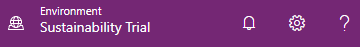](../media/environment.png#lightbox)

1. Open the **Sustainability Manager** application.

    > [!div class="mx-imgBorder"]
    > [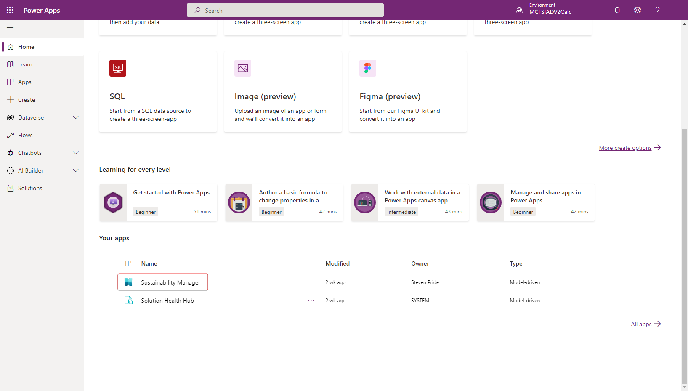](../media/sustainability.png#lightbox)

    You'll be directed to the Home page for Microsoft Sustainability Manager.

> [!IMPORTANT]
> Make sure that you've completed the previous modules to [set up organization and reference data](/training/modules/sustainability-setup-organization), [ingest activity data](/training/modules/sustainability-data-ingestion), [define emission calculations](/training/modules/sustainability-emissions-calculation) and [build reports and review insights](/training/modules/sustainability-insights-reporting) to ensure that the scorecard and goals show meaningful data.

## Task: Create a new scorecard

In this task, Amber will create a new scorecard to track the goals for Wide World Importers. Microsoft Sustainability Manager uses scorecards to group goals together.

1. Go to **Analytics** > **Scorecards & goals** on the left navigation pane.

1. On the **Scorecards** view, select **Add Scorecard**.

    > [!div class="mx-imgBorder"]
    > [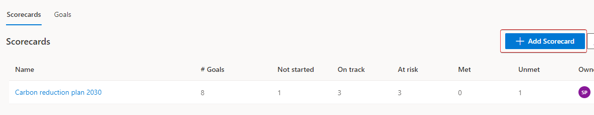](../media/add-scorecard.png#lightbox)

1. On the new scorecard, in the **Name** field, enter **Wide World Importers Reduction Plan - 2025**. You'll use this name to identify the scorecard in the list.

1. Select **Save**.

    > [!div class="mx-imgBorder"]
    > 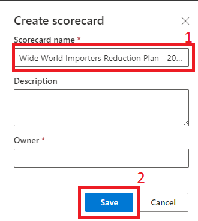

Your new Scorecard will open automatically.

   > [!div class="mx-imgBorder"]
   > [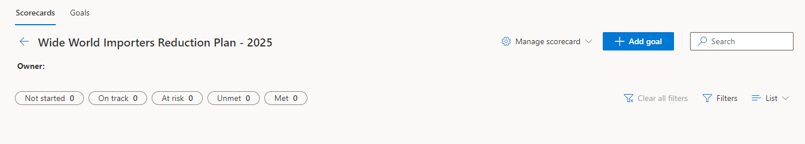](../media/scorecard.png#lightbox)

You've now created a new scorecard. You can use scorecards to track progress toward an organization's sustainability goals by providing a logical grouping of those goals. In the next tasks, you'll learn how to create goals and goal check-ins. 

## Task: Create a goal

In this task, Amber will create a new goal that instructs Wide World Importers to reduce their carbon emissions from 900 mtCO2E to 600 mtCO2E. Amber will enable automatic check-ins and status rules to ensure that the goal is automatically kept up to date. These automatic check-ins will occur once every 24 hours. Microsoft Sustainability Manager uses goals to help organizations, such as Contoso Corp and Wide World Importers, track their carbon reduction goals.

1. Select the **Add goal** button to create a new goal.

    > [!div class="mx-imgBorder"]
    > 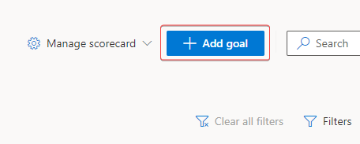

1. Use the following information to populate the fields on the **New goal** page:

    - **Goal name** - Reduce Scope 2 Emissions - 2023

    - **Owner** - Allen Contoso 

    - **Scorecard** - Wide World Importers Reduction Plan - 2025

    - **Organizational unit** - Wide World Importers

    - **Start date** - 12/31/2022

    - **End date** - 12/31/2023

       > [!NOTE]
       > The automatic check-in process will not perform a check-in if the current date is outside the **Start date** and **End date** range. Wide World Importers chose 12/31/2022 to include the final calculation of 2022 as the first, or base, check-in value for the new goal.

    - **Unit of measure** - mtCO2e

    - **Starting value** - 900

    - **Source of current value** - Connect to data

        - **Data source** - Emission

        - **Value** - CO2E

        - **Filter** - **Organizational unit** equals **Wide World Importers** and Consumption end date Last x years 1

    - **Source of target value** - Enter manually

    - **Target value** - 600

    - **Status update method** - Automatic

        - **Value** - is greater than 600

        - **Change status to** - At risk

        - **Otherwise** - On track
        
	    > [!div class="mx-imgBorder"]
	    > [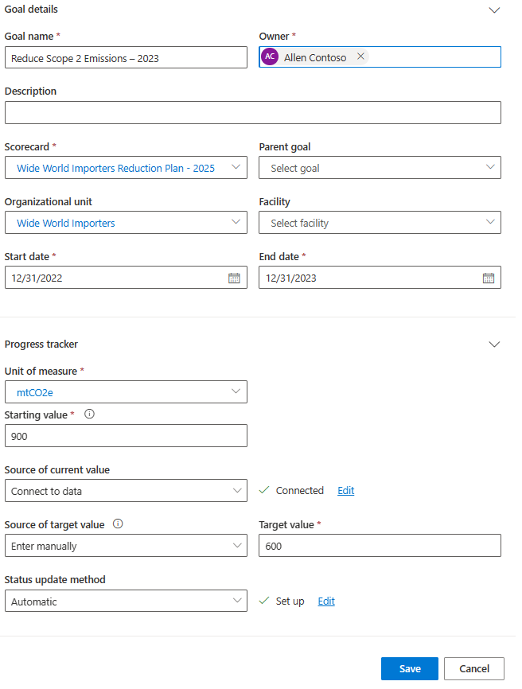](../media/goal-details.png#lightbox)

   The following list provides descriptions of the data that you're entering:

    - **Name** - Use to identify the goal in the list.

    - **Owner** - Use to identify the primary person who's responsible for monitoring and tracking goal progress.

    - **Scorecard** - Use to specify which scorecard to associate the goal with. In this scenario, because the goal was created on the **Scorecard** page, the **Scorecard** field is automatically filled out.

    - **Organizational unit** - Use to identify which organizational unit the goal is associated with.

    - **Start date** - Use to identify the starting time frame of the goal.

    - **End date** - Use to identify the ending time frame of the goal.

    - **Unit** - Use to specify which unit you want to measure in this goal.

    - **Starting value** - Use to specify your starting point for the goal.

    - **Source of current value** - Use to specify the source of the current value, if it's set to **Enter manually**, or where to retrieve the current value from each day. The **Source of current value** can be a rollup from other child goals. Alternatively, for this scenario, you'll select **Connect to data** and then select **Set up connection**.

       > [!div class="mx-imgBorder"]
       > 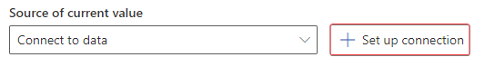

        1. Select **Emission** as the **Data source**. This table is where the data will come from. Set **CO2E** as the **Value**, which is the field where the data will come from.

            > [!div class="mx-imgBorder"]
            > 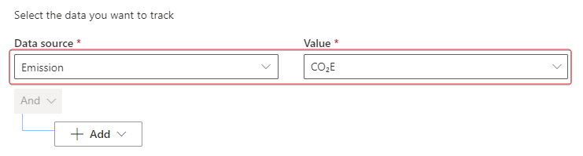

        1. Select **Add > Add row**.

            > [!div class="mx-imgBorder"]
            > 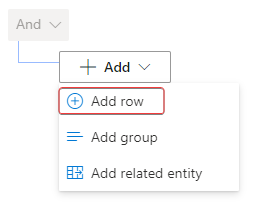

        1. In the **Select a field** dropdown menu, select **Organizational unit**.

            > [!div class="mx-imgBorder"]
            > 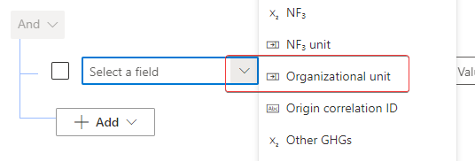

        1. In the **Value** dropdown menu, select **Wide World Importers (Organizational unit)**.

            > [!div class="mx-imgBorder"]
            > 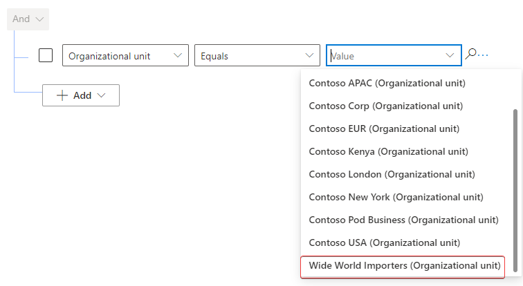

        1. Select **Add > Add row** again.

            > [!div class="mx-imgBorder"]
            > 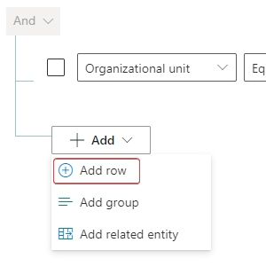

        1. In the **Select a field** dropdown menu, select **Consumption end date**.

            > [!div class="mx-imgBorder"]
            > 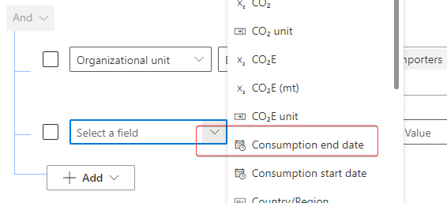

        1. In the **Operator** dropdown menu, which currently shows **Equals**, select **Last x years**.

            > [!div class="mx-imgBorder"]
            > 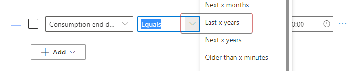
        
        1. In the **Value** field, enter the number **1**.

            > [!div class="mx-imgBorder"]
            > 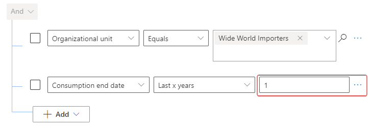

        1. At the top of the form, select **Calculate** for a preview of the data that would be used for the current value check-in. Copy this value. The value that's calculated might differ from what's shown in the following image.

            > [!div class="mx-imgBorder"]
            > 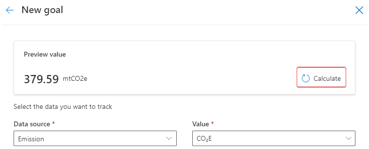

        1. The current value data connection should resemble the following image. Select **Confirm** when you're finished.

            > [!div class="mx-imgBorder"]
            > 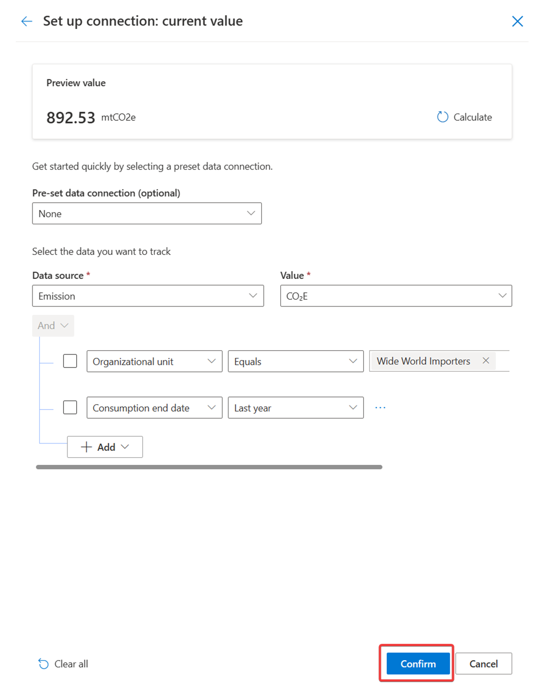

1. Use **Source of target value** to specify what the source of the target value is. You can connect the **Source of target value** to data or, in this scenario, you can enter it manually. Select **Enter manually** and then enter **600** to set your target of reducing annual emissions to 600 mtCO2E.

1. Use **Status update method** to specify how the status of the goal check-ins will be set. You can enter the **Status update method** manually or set it to update automatically. In this scenario, you'll set the status for goal check-ins automatically based on a set of rules. Select **Automatic** and then select **+Set up status rules**.

    1. Select **+Add Rule** to start a new rule for the **Status**.

        > [!div class="mx-imgBorder"]
        > 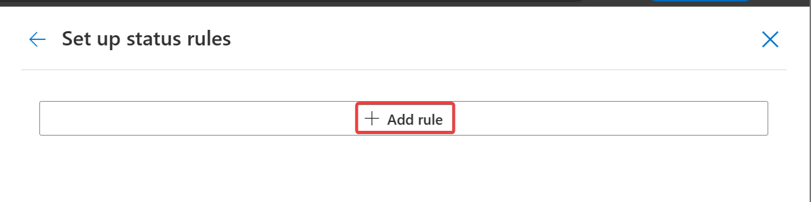

    1. In the **Operator** dropdown menu, select **is greater than**.

        > [!div class="mx-imgBorder"]
        > 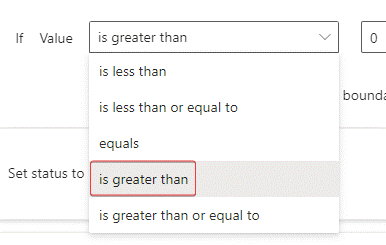

    1. In the **Value** field, which currently shows **0**, enter **600**. Select **At risk** from the **Set status to** dropdown menu.

        > [!div class="mx-imgBorder"]
        > 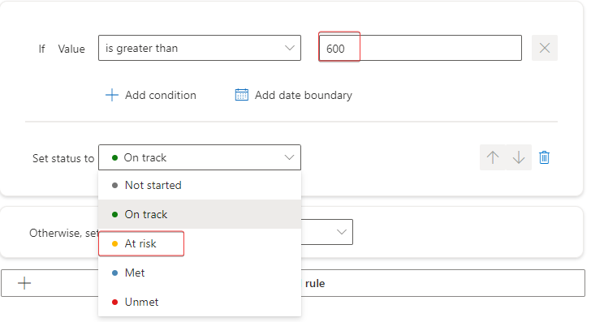

        This option specifies that if the check-in value is greater than 600 (the target value), then the organization is at risk and so the check-in will have a status of **At risk**.

    1. In the **Otherwise, set status to** dropdown menu, select **On track**.

        > [!div class="mx-imgBorder"]
        > 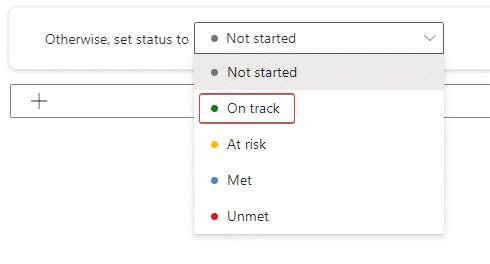

        This option specifies that if the condition isn't met during a check-in, then you're on track to meeting the goal and so the check-in will have a status of **On track**.

    1. The status rules should resemble the following image. Select **Confirm**.

        > [!div class="mx-imgBorder"]
        > 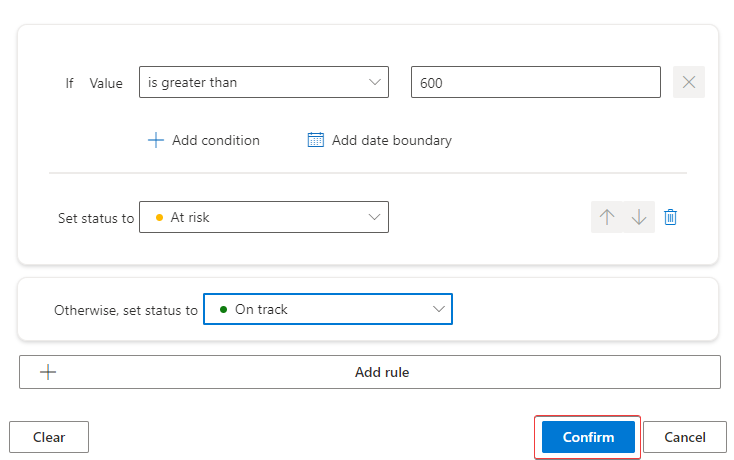

1. Select **Save**.

    > [!div class="mx-imgBorder"]
    > 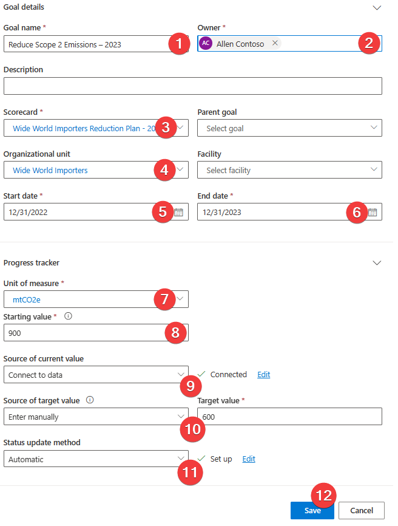

The new goal should be visible in the list of goals for the scorecard.

   > [!div class="mx-imgBorder"]
   > [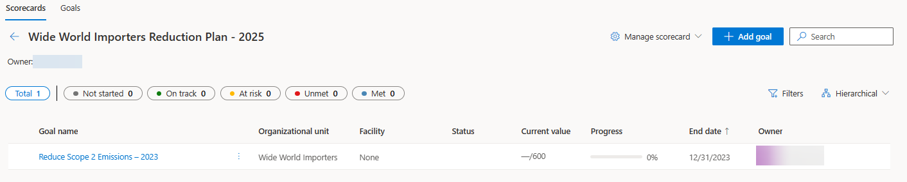](../media/goals.png#lightbox)

You've now created a goal for your scorecard. Goals are beneficial for keeping track of an organization's progress toward reducing their carbon footprint. Any goals that you have with a current value that's connected to data will have check-ins created approximately every 24 hours. Next, you'll create your first check-in manually so that you're familiar with the check-in data. 

## Task: Create a goal check-in

In this task, Amber will create a manual goal check-in for Wide World Importers’ Scope 2 reduction goal. The check-in is the first, so waiting 24 hours for the first check-in to occur isn’t necessary.

Occasionally, you might have goals that are set to use manual check-ins if you're unable to connect data to them. Sometimes, even after you've created a goal with connected data, you need to wait approximately 24 hours for the first check-in to occur. In either situation, you might find it useful to create and review a check-in. This task will take you through the process of creating a goal check-in.

1. Open the goal that was created in the previous task by selecting the goal name from the list in the scorecard.

    > [!div class="mx-imgBorder"]
    > 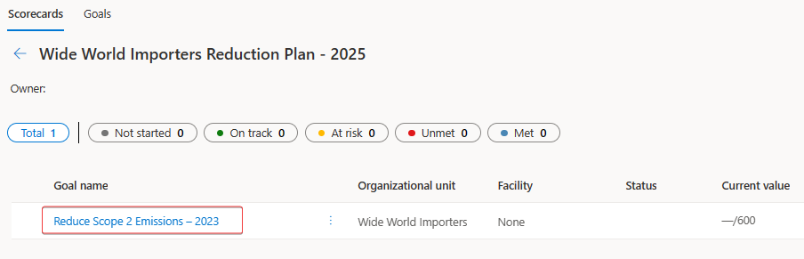

1. Review the following information for the goal:

    - **Progress** toward the Reduce Scope 2 Emissions - 2023 goal

    - The goal check-in **History**

    - The **Goal details**

        > [!div class="mx-imgBorder"]
        > [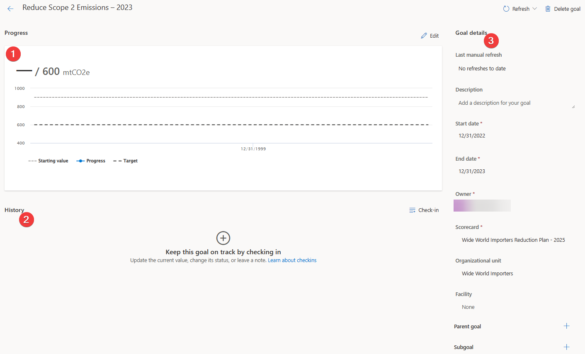](../media/goal.png#lightbox)

1. In the **History** section, select the plus (**+**) icon or the **Check-in** button to create a new goal check-in for the first check-in.

    > [!div class="mx-imgBorder"]
    > [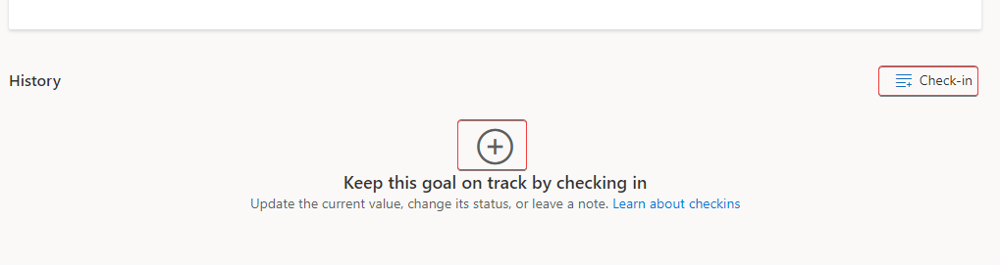](../media/check-in.png#lightbox)

1. A **New check-in** dialog will appear.

    > [!div class="mx-imgBorder"]
    > 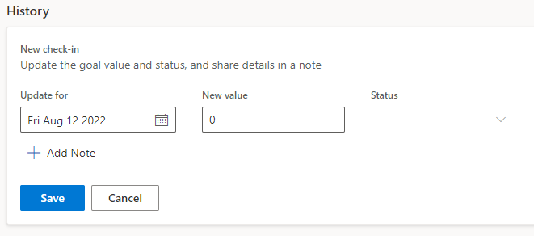

1. Populate the **New check-in** dialog with the following data:

    - **Update for** - Use today's date.

    - **New value** - The preview value that you copied from the **Source of current value** connection screen. In this scenario, that value is **379.59**.

    - **Add note** - Enter **First check-in** in the field.

   The following list provides descriptions of the data that you're entering:

    - Use **Update for** to identify what date the check-in was for. This date might be the current date or a date in the past.

    - Use **New value** to specify the current value of the goal check-in. This value will be used on the Progress chart.

    > [!NOTE]
    >  In this scenario, the **Status** will be set automatically based on the status rules that you've set on the goal.

    - Using the **Note** box is optional if you want to provide more information or context about the check-in, such as a heatwave or increased heating that resulted in an abnormally high carbon emission value for this check-in.

1. Select **Save**.

    > [!div class="mx-imgBorder"]
    > 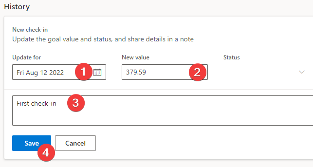

Now, the **Progress** section should show as updated with the latest check-in value and status, as well its plot on the graph. Additionally, the **History** section should show the recently created check-in with the status automatically set based on the goal rules. Check-ins will be shown in the order of newest to oldest.

   > [!div class="mx-imgBorder"]
   > [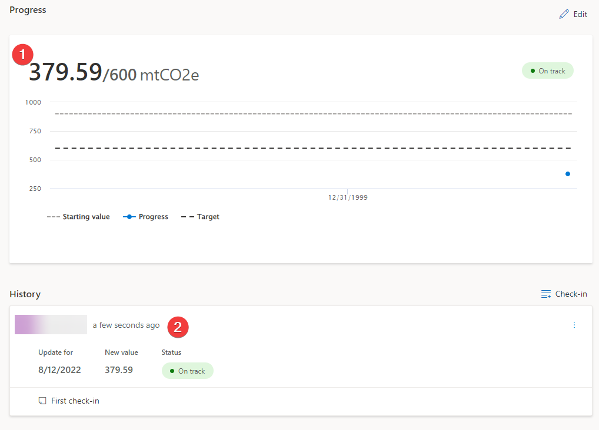](../media/progress.png#lightbox)

You've completed the task of defining sustainability goals. These tasks are critical in helping an organization realize their sustainability and carbon reduction goals. Key takeaways from this exercise:

- Automated goal check-ins run approximately every 24 hours, based on the time of day when Microsoft Cloud for Sustainability was installed.

- As of the current release, a way to change the timing for automated goal check-ins isn't available.

- You can create a manual check-in anytime.

- You can import historical goal check-ins by using the native Microsoft Power Platform data import wizard. The goal check-in table is called **Check-ins**.
