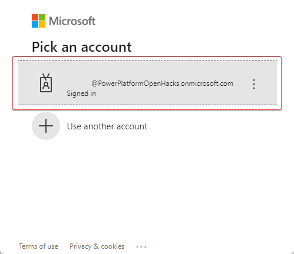

In this exercise, Reed Flores, IT admin for Wide World Importers, will set up integration with Microsoft Teams for Microsoft Sustainability Manager. Microsoft Teams offers several useful features for organizations. By integrating Microsoft Cloud for Sustainability with Microsoft Teams, you can improve the collaboration between your sustainability team and improve the performance of your carbon reduction goals. You can quickly collaborate with colleagues by using Microsoft Teams Chat embedded in Dynamics 365.

> [!NOTE]
> The following task, **Enable enhanced Teams Integration and turn on Microsoft Teams chats inside Dynamics 365**, requires Global Administrator rights in your tenant.

## Task: Enable enhanced Teams integration and turn on Microsoft Teams chats inside Dynamics 365 

By default, the Basic and Enhanced Microsoft Teams integration is disabled in Microsoft Sustainability Manager. In this task, Reed will enable Microsoft Teams in Dynamics 365.

1. Select **Settings** > **Teams chat** on the left navigation pane. 

1. On the **Microsoft Teams collaboration and chat** page, set the **Turn on the linking of Dynamics 365 records to Microsoft Teams channels** toggle to **Yes**.

    > [!div class="mx-imgBorder"]
    > 

1. Select the **Save** button in the lower-left corner.

    > [!div class="mx-imgBorder"]
    > 

1. After the page finishes saving, set the **Turn on Enhanced Microsoft Teams Integration** toggle to **Yes**.

    > [!div class="mx-imgBorder"]
    > 

1. Another pop-up window will open to grant permissions. Select the user account that you're signed in as currently (this account must be a global administrator).

    > [!div class="mx-imgBorder"]
    > 

1. Select **Accept** for requested permissions. It might take several minutes to set up. Ensure that you don't have pop-ups blocked that might interfere with the communication. If so, turn off blockers for this website, cancel, and then try connecting again.

    > [!div class="mx-imgBorder"]
    > 

1. When the dialog disappears, select the **Save** button in the lower-left corner.

    > [!div class="mx-imgBorder"]
    > 

   Both Microsoft Teams Integration settings are now set to **Yes**.

    > [!div class="mx-imgBorder"]
    > 

You've now enabled Microsoft Teams integration for Dynamics 365. **Continue to the next task.**

1. On the **Microsoft Teams collaboration and chat** page, set the **Turn on Microsoft Teams chats inside Dynamics 365** toggle to **Yes**.

    > [!div class="mx-imgBorder"]
    > 

1. Select the **Save** button in the lower-left corner.

    > [!div class="mx-imgBorder"]
    > 

   Microsoft Teams chats inside Dynamics 365 is now set to **Yes**, and a new section will appear at the bottom of the screen called **Link chats to Dynamics 365 records**.

    > [!div class="mx-imgBorder"]
    > 

You've now enabled Microsoft Teams integration for Dynamics 365 and turned on Microsoft Teams chats inside Dynamics 365. 

## Task: Add link chats to Dynamics 365 records

In this task, Reed will add a new Dynamics 365 record type, **Factor library**, to the Link chats configuration. This feature allows other record types to be linked to Teams chats directly within Microsoft Sustainability Manager.

1. Go to **Teams chat** on the left side of the page.

1. On the **Microsoft Teams collaboration and chat** page, set the **Turn on Microsoft Teams chats inside Dynamics 365** toggle to **Yes**.

1. Select **Add Record Types** to add a Link chat configuration.

    > [!div class="mx-imgBorder"]
    > 

1. On the **Link chat to record type** form, select **Factor library** in the **Choose record type lookup** (you can scroll or type).

    > [!div class="mx-imgBorder"]
    > 

1. Set the **Join chat** and **Introduction message** toggles to **Yes**. Select **Factor libraries** from the **Message view** dropdown menu.

    > [!div class="mx-imgBorder"]
    > 

1. Hover your mouse cursor over a view while the **Message view** list is open for a preview of the message. The first four to five fields from the view are included in the message.

    > [!div class="mx-imgBorder"]
    > 

1. Select **Save**.

    > [!div class="mx-imgBorder"]
    > 

1. Factor library is now visible in the list of linked record types.

    > [!div class="mx-imgBorder"]
    > 

You've now turned on and set up a new entity for Microsoft Teams chats inside Dynamics 365. This step will allow you to create linked Microsoft Teams chats directly inside of Cloud for Sustainability to discuss specific records. Next, you'll test the Microsoft Teams integration. 

## Task: Create a Microsoft Teams linked chat

In this task, Amber will create a linked chat to collaborate with Allen Contoso to discuss the EPA 2022 - eGRID in preparation for 2022 reporting needs.

1. Select **Calcultaions** > **Factor libraries** on the left navigation pane. 

    > [!div class="mx-imgBorder"]
    > 

1. Select the **EPA 2022 - eGRID** factor library.

    > [!div class="mx-imgBorder"]
    > 

1. Select the **chat icon** in the upper-right corner of the screen to open the Microsoft Teams chats inside of Cloud for Sustainability.

    > [!div class="mx-imgBorder"]
    > 

1. Select **New linked chat** to create a new chat window with another user, **Allen Contoso**, to discuss changes to the Factor mappings on the EPA 2022 - eGRID Factor library.

    > [!NOTE]
    > You might need to wait a few minutes or perform a hard refresh (**CTRL + F5**) for the **New linked chat** button to appear the first time.
    
    > [!div class="mx-imgBorder"]
    > 

1. On the **New linked chat**, complete the following tasks:

    1. Search for chat participants. In this scenario, we used the fictitious **Allen Contoso** account.

       > [!IMPORTANT]
       > Allen Contoso may not be present in your environment, please select any available user or look up a newly added user.

    1. Enter a name for the Chat.

    1. Add a note to provide context for the chat to the participants.

    1. When finished, select **Start chat**.

        > [!div class="mx-imgBorder"]
        > 

1. In a few moments, an embedded chat window with all participants will appear, and a message will be displayed with the note that was included, some record data, and a link to the record.

    > [!div class="mx-imgBorder"]
    > 

You've started a Microsoft Teams linked chat inside of Cloud for Sustainability. You can use linked chats to help teams and organizations collaborate and improve efficiency by having the record context directly in the chat. You can set up many entities to have linked chats and use custom system views to tailor the displayed fields to an organization's needs.
