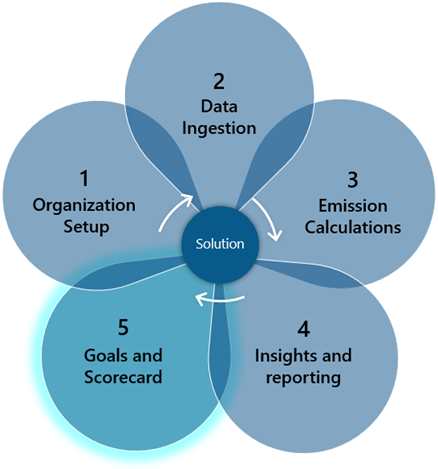
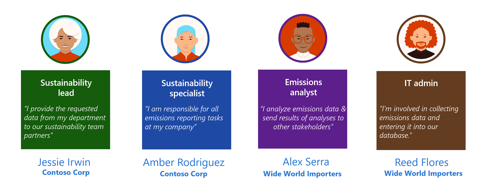
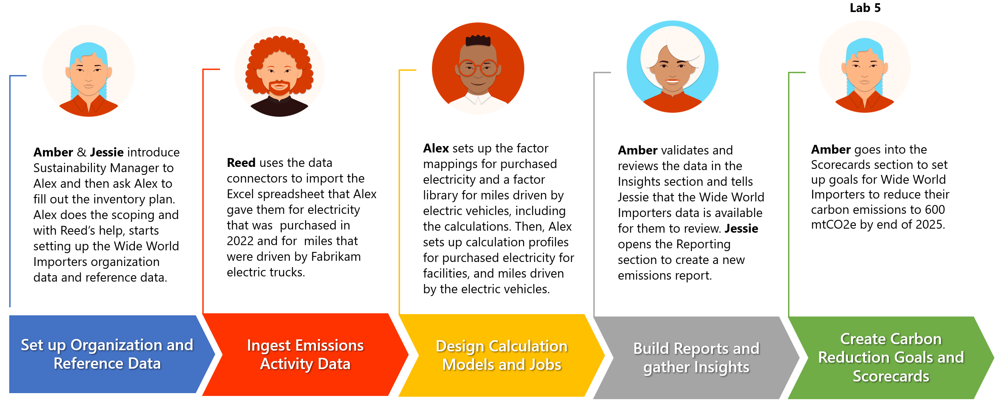

Scorecards and goals can help curate sustainability metrics and track them against an organization's key business objectives. After you've created the scorecard, and when it includes goals, you can check the scorecard progression periodically and make required adjustments.

Occasionally, you might need to share and discuss data, reports, analytics, or goals across many stakeholders in the organization. To help make those conversations contextual and collaborative, you can use the Chat functionality from Microsoft Teams, which is available directly in Microsoft Sustainability Manager.

> [!div class="mx-imgBorder"]
> 

## Personas and scenarios

In this module, Amber Rodrigues, sustainability specialist for Contoso Corp, creates and monitors carbon reduction goals. Based on the insights from the **Deep analysis** dashboard, Amber creates a new scorecard for Wide World Importers and creates a goal to reduce their carbon emissions from the previous year. Amber sets up automatic goal check-ins to track the ongoing status of the goal.

With the help of Reed Flores, IT admin for Wide World Importers, Amber sets up Microsoft Teams collaboration. After finishing the setup, Amber opens a chat with a colleague to discuss changes to a factor library. This approach helps continue Amber's excellent work in recording, reporting, and reducing carbon emissions across Wide World Importers and the entirety of Contoso Corp.

> [!div class="mx-imgBorder"]
> 

This module exercise focuses on the scenarios that are illustrated in the following diagram.

> [!div class="mx-imgBorder"]
> 
