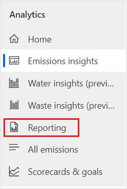
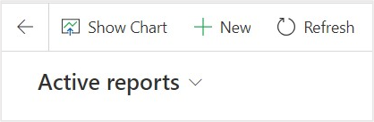
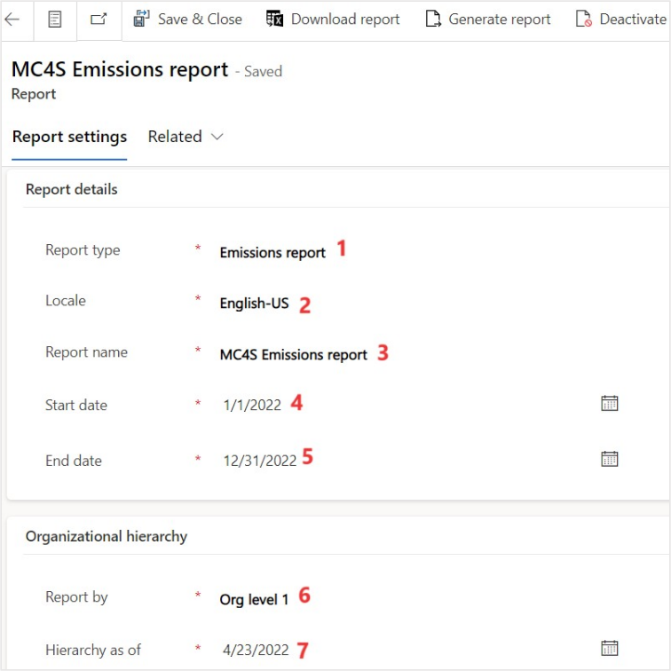
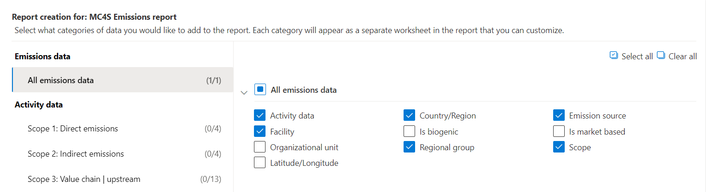
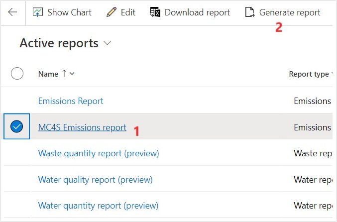
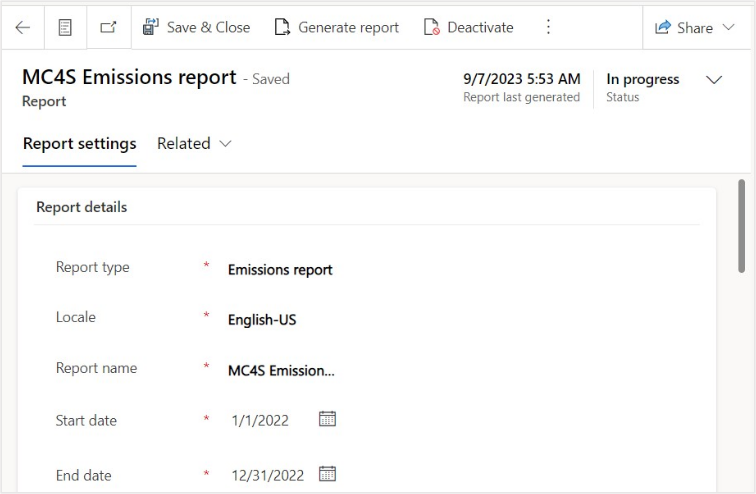
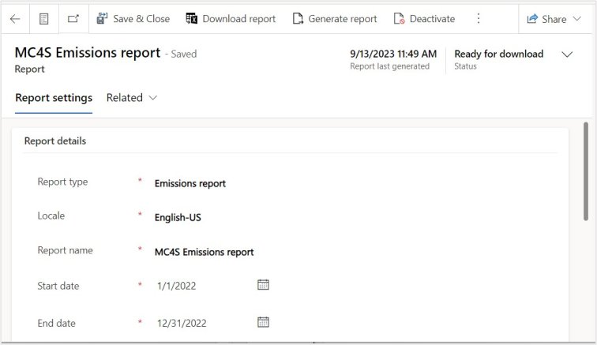
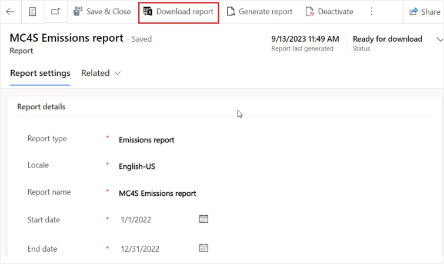
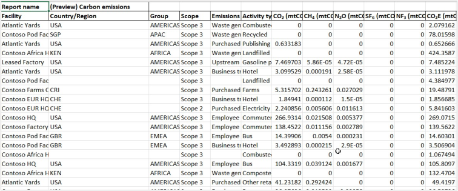

In this exercise, Amber Rodriguez informs Jessie Irwin, sustainability lead for Contoso Corp, that the activity and emission reports are available for review. Jessie generates quantitative preparation reports that extract emission and activity data from Microsoft Sustainability Manager. The reports are in a Microsoft Excel format that they can use to submit the data for public disclosure.

## Task: Generate the emissions report

To generate the **Emissions** report, follow these steps:

1. In the left navigation pane, select **Analytics** > **Reporting**.

   > [!div class="mx-imgBorder"]
   > 

1. Select **New**.

   > [!div class="mx-imgBorder"]
   > 

1. Set the following fields:
   - **Name** – Enter the name of the report, such as **MC4S Emissions report**

   - **Report type** – Select **Emissions report**

   - **Start date** – 01/01/2022

   - **End date** – 12/31/2022
   
   - **Report by** – Org level 1
   
   - **Hierarchy as of** – 04/23/2022

   You can select fields to group data by or column headers for the report. The available fields for the **Emissions** report are:

   - **Activity data**
   - **Country/Region**
   - **Latitude/Longitude**
   - **Organizational unit**
   - **Facility**
   - **Is market-based**
   - **Is biogenic**
   - **Scope**
   - **Emission source**

   The **Organization hierarchy** section in the page is visible for inputs if user selects the Report type as Emissions report. The information entered in this section is used to report the data based on the org hierarchy and the **Hierarchy as of** date field for data in the org hierarchy.

   > [!NOTE]
   > The **Report by** field represents the org hierarchies in the company and based on the selected level, the emissions data is aggregated to that level related facilities. Currently the report supports aggregation up to 6 levels.

   For this task, set the **Country/Region**, **Regional group**, **Facility**, **Scope**, **Emissions source**, and **Activity data** fields for use in Contoso Corp’s carbon emissions reporting for public disclosure.

   After you've selected the fields, select **Save & Close** on the top command bar.

   > [!div class="mx-imgBorder"]
   > 

   > [!div class="mx-imgBorder"]
   > 

1. After you've saved the report, select **MC4S Emission report** from the list and the **Generate report** button becomes visible on the command bar. Select the **Generate report** button, and then the report is queued to be generated.

   > [!div class="mx-imgBorder"]
   > 

1. Select the **Refresh** button on the command bar until the **Report generation status** is changed from **Pending** to **Ready for download**. This process might take a few minutes to generate.

   > [!div class="mx-imgBorder"]
   > 

   > [!div class="mx-imgBorder"]
   > 

1. After the status has changed, the **Download report** button is visible in the command bar. Select that button to download the generated report. An Excel report begins to download. Open the report.

   > [!div class="mx-imgBorder"]
   > 

The reports contain the following information:

- The **Group by** column headers that were selected. In this case, it's grouped by **Country/Region**, **Regional group**, **Facility**, **Scope**, **Emissions source**, and **Activity type**.
- The following emission metrics: **CO2**, **CH4**, **N2O**, **SF6**, **NF3**, **CO2E**, **HFCs**, **PFCs**, and **Other GHGs**.

  > [!div class="mx-imgBorder"]
  > 

You've now successfully generated an emission report. Emissions reports are useful for providing information in public disclosures. Microsoft Sustainability provides this information in a tabular format to allow you to adapt it to meet the rapidly changing regulatory requirements. Partners can help in the generation of the disclosure documents by setting up an emission report to export data in a consistent and familiar format, for ingestion into a partner solution.

