In this exercise, you assume the persona of Amber Rodriguez, sustainability specialist for Contoso Corp, and use the various **Sustainability** dashboards to gain insights into the organization.

1. Use an In-Private or Incognito window and go to [Microsoft Power Apps](https://make.powerapps.com/?azure-portal=true).

1. Select the correct environment from the **Environment** dropdown menu in the upper-right corner.

   > [!div class="mx-imgBorder"]
   > 

1. Open the **Sustainability Manager** application under **Apps**.

   > [!div class="mx-imgBorder"]
   > [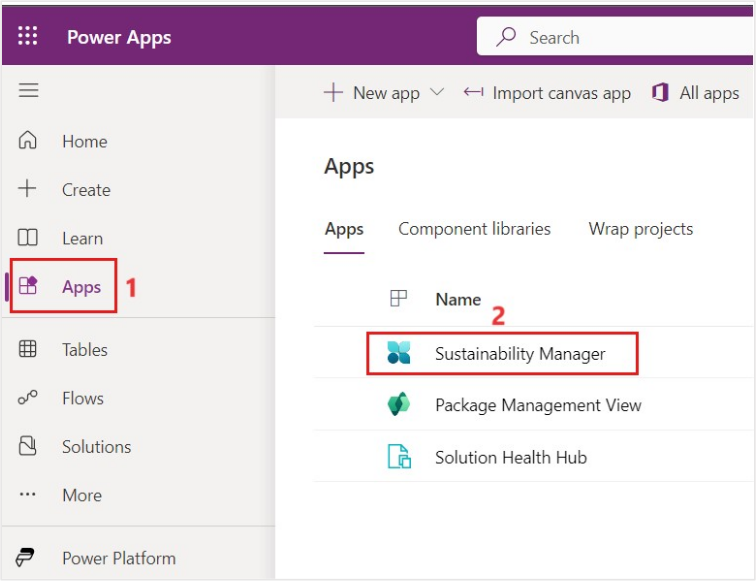](../media/sustainability-manager.svg#lightbox)

   You'll be directed to the Home page for Microsoft Sustainability Manager.

    > [!IMPORTANT]
    > Make sure that you've completed the previous modules to [set up organization and reference data](/training/modules/sustainability-setup-organization/?azure-portal=true), [ingest activity data](/training/modules/sustainability-data-ingestion/?azure-portal=true) and [define emission calculations](/training/modules/sustainability-emissions-calculation/?azure-portal=true) to ensure that the dashboards and reports show meaningful data.  

## Task: Explore Sustainability dashboards

In this task, Amber explores the various **Sustainability** dashboards, which provide an overview of total emissions, revenue intensity, and renewable energy broken down by scope, geography, organizational unit, and facility.

1. Select **Analytics** > **Emissions insights** on the left navigation pane.

   > [!div class="mx-imgBorder"]
   > [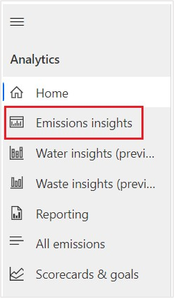](../media/insights.svg#lightbox)

1. The page displays the **Emissions overview** dashboard. To filter this dashboard, select a reporting period and accounting method. The top tile in the dashboard has four tabs: **All Emissions**, **By month (comparison)**, **By scope**, and **By scope (line chart)**.  Apart from the **By month (comparison)** tab, all other tabs has a toggle that is used to **show a comparison by year**. When the toggle is off, data for the selected reporting period are shown in a monthly view. When the toggle is turned on, all available years are shown on a trend chart. The details around each tab in the top tile are as follows:

   - **All Emissions** – This tab shows total emissions over time.
   - **By month (comparison)** – This tab shows the emissions breakdown by each month to compare.
   - **By scope** – This tab shows a breakdown of emissions by scope 1, scope 2, and scope 3. It includes a chart for each scope.
   - **By scope (line chart)** – This tab shows each scope as a separate line on one chart. Therefore, you can compare emissions by scope over time.

   The **By source and scope** tile shows a further breakdown of data in each scope. It shows specific sources and their contribution to emissions overall.

   The **By org level and emissions source** tab shows the breakdown of the emissions based on the organization level and emission source.

   The tile in the lower right has three tabs: **By country/region**, **By organizational unit**, and **By facility**. Each tab shows a breakdown of emissions by scope 1, scope 2, and scope 3.

   > [!div class="mx-imgBorder"]
   > [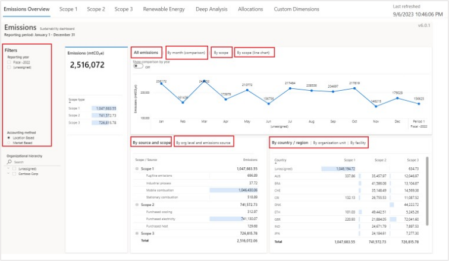](../media/emission-source-scope.svg#lightbox)

1. Select **Scope 1** on the top tab to view the **Scope 1 emissions** dashboard. Scope 1 emissions are owned or directly controlled by the organization. Similar to the **Emissions overview** dashboard, the **Scope 1 emissions** dashboard lets users view scope 1 emissions by reporting period.

   You can view summary statistics in the left tile. These statistics include the total scope 1 emissions for the current reporting period compared to the previous period. They also include emissions by source type and emissions that are broken down by greenhouse emissions. Greenhouse emissions include the following gases:

   - **CO2** – Carbon dioxide
   - **CH4** – Methane
   - **N2O** – Nitrous oxide
   - **HFCs** – Hydrofluorocarbons (manufactured compounds that contain hydrogen and fluorine atoms)
   - **PFCs** – Perfluorocarbons (manufactured compounds that contain carbon and fluorine atoms)
   - **NF3** – Nitrogen trifluoride
   - **SF6** – Sulfur hexafluoride

   The top tile has four tabs: **Scope 1 emissions**, **By month (comparison)**, **By source**, **and By source (line chart)**. Apart from the **By month (comparison)** tab, all other tabs has a toggle that you can use to show a comparison by year. When the toggle is off, data for the selected reporting period is shown in a monthly view. When the toggle is on, data for all reporting periods is shown on a trend chart.

   The lower-left tile provides a deeper description of the source of the scope 1 emissions by category. It has a tab for each category of scope 1 emissions:

   - **Stationary combustion** – This category includes emissions from electricity, heat, steam, or energy to power industrial or commercial uses. The tab shows emissions by fuel type.
   - **Mobile combustion** – This category includes emissions from cars, trucks, and other motor vehicles, boats and other water vessels, locomotives, and aircraft. The tab shows emissions by vehicle type.
   - **Industrial processes** – This category includes emissions from various non energy-related industrial events or manufacturing activities or emissions from consumers. The tab shows emissions by process type.
   - **Fugitive emissions** – This category includes emissions that were accidentally released into the atmosphere. These emissions include gases and vapors. The tab shows emissions by activity type.

   The lower-right tile has three tabs: **By country/region**, **By organizational unit**, and **By facility**. Each tab shows scope 1 emissions for the corresponding delineation of data.

   > [!div class="mx-imgBorder"]
   > [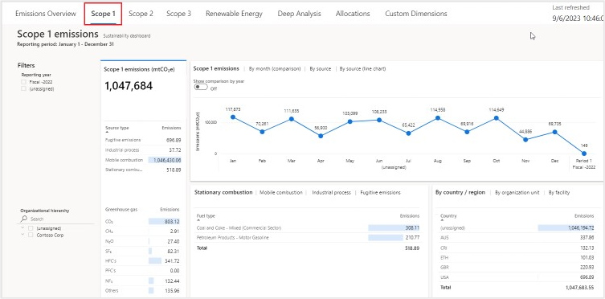](../media/first-scope-emission.svg#lightbox)

1. Select **Scope 2** on the top tab to view the **Scope 2 emissions** dashboard. Scope 2 emissions are emissions that a company causes indirectly from the energy that it purchases and uses. For example, for Wide World electric fleet vehicles, the emissions from the generation of the electricity that they're powered by would fall into this category. As with other dashboards, the **Scope 2 emissions** dashboard lets users view scope 2 emissions by reporting period and accounting method.

   You can view the summary statistics in the left tile. These statistics include the total scope 2 emissions for the selected reporting period compared to the previous period. They also include scope 2 emissions by source. Scope 2 emissions have the following sources:

   - Purchased heat
   - Purchased cooling
   - Purchased electricity
   - Purchased steam

   The top tile has four tabs: **Scope 2 emissions**, **By month (comparison)**, **By source** and **By source (line chart)**. Apart from the **By month (comparison)** tab, all other tabs has a toggle that you can use to show a comparison by year. When the toggle is off, data for the selected reporting period is shown in a monthly view. When the toggle is on, data for all reporting periods is shown on a trend chart.

   The bottom tile has three tabs: **By country/region**, **By organizational unit**, and **By facility**. Each tab shows scope 2 emissions for the corresponding delineation of data.

   > [!div class="mx-imgBorder"]
   > [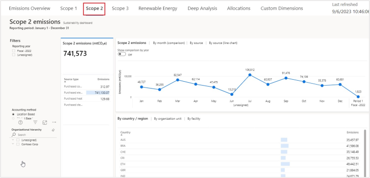](../media/second-scope-emission.svg#lightbox)

1. Select **Scope 3** on the top tab to view the **Scope 3 emissions** dashboard. Scope 3 emissions are the result of activities from assets that the reporting organization doesn't own or control, but that the organization indirectly impacts in its value chain. Scope 3 emissions include all sources that aren't within an organization's scope 1 and 2 boundary. The **Scope 3 emissions** dashboard in Microsoft Sustainability Manager lets you view scope 3 emissions by reporting period.

   You can view summary statistics in the left tile. These statistics include the total scope 3 emissions for the reporting period compared to the previous period. The tile also shows all categories of scope 3 emissions that are classified as upstream or downstream.

   The **upstream** categories are:

   - Purchased goods and services
   - Capital goods
   - Fuel and energy related activities
   - Upstream transportation and distribution
   - Waste generated in operations
   - Business travel
   - Employee commuting
   - Upstream leased assets

   The **downstream** categories are:

   - Downstream transportation and distribution
   - Processing of sold products
   - Use of sold products
   - End-of-life treatment of sold products
   - Downstream leased assets
   - Franchises
   - Investments

    The top tile has four tabs: **Scope 3 emissions**, **By month (comparison)**, **By category** and **By category (line chart)**. Apart from the **By month (comparison)** tab, all other tabs has a toggle that you can use to show a comparison by year. When the toggle is off, data for the selected reporting period is shown in a monthly view. When the toggle is on, data for all reporting periods is shown on a trend chart. 

   The lower-left tile has five tabs:

   - **By category** – This tab shows scope 3 emissions by category and type.
   - **By leased assets** – This tab shows the scope 3 emissions by the leased assets and type.
   - **By facility type** – This tab shows the emissions by the facility type and category.
   - **By supplier** – This tab shows the number of records and emissions by supplier.
   - **By waste** – This tab shows the emissions due to the waste generated in operations.

   The lower-right tile has three tabs: **By country/region**, **By organizational unit**, and **By facility**. Each tab shows scope 3 emissions for the corresponding delineation of data.

   > [!div class="mx-imgBorder"]
   > [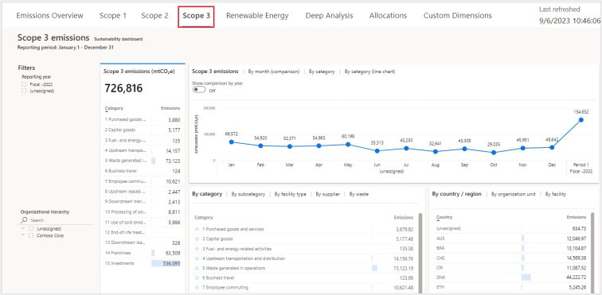](../media/third-scope-emission.svg#lightbox)

1. Select **Renewable energy** on the top tab to view the summary view of renewable energy, its sources, and the contract type.

   You can view the summary statistics in the left tile. These statistics include renewable energy as a total percentage of energy that was used for the selected reporting period compared to the previous period. The tile also shows the percentage of renewable energy by source type, such as solar, wind, and water.

   This tile has three tabs: **Renewable energy**, **By source**, and **By source (line chart)**. Each tab includes the **Show comparison by year** toggle. When the toggle is turned off, data for the selected reporting period is shown in a monthly view. When the toggle is turned on, data is shown for all reporting periods.

   The lower-left tile shows  **By contract type**. It indicates the renewable energy in the appropriate measure, such as kilowatt-hour (kWh), and the percentage of renewable energy.

   The lower-right tile has three tabs: **By country/region**, **By organizational unit**, and **By facility**. Each tab shows renewable energy for the corresponding delineation of data.

   > [!div class="mx-imgBorder"]
   > [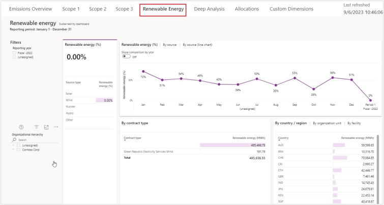](../media/renewable-energy.svg#lightbox)

1. Select **Deep analysis** on the top tab for an in-depth assessment of the data and to uncover insights that might not be available from other reports. You can filter the dashboard by selecting a reporting period and accounting method.

   You can use the **Decomposition tree** to drill down from the company level to more granular levels of the organization. Additionally, you can use it to access other insights, such as:

   - High value
   - Low value
   - Emission source
   - Country/region
   - Organization
   - Different levels of scope 1, scope 2, and scope 3 emissions
   - Facility

      > [!div class="mx-imgBorder"]
      > [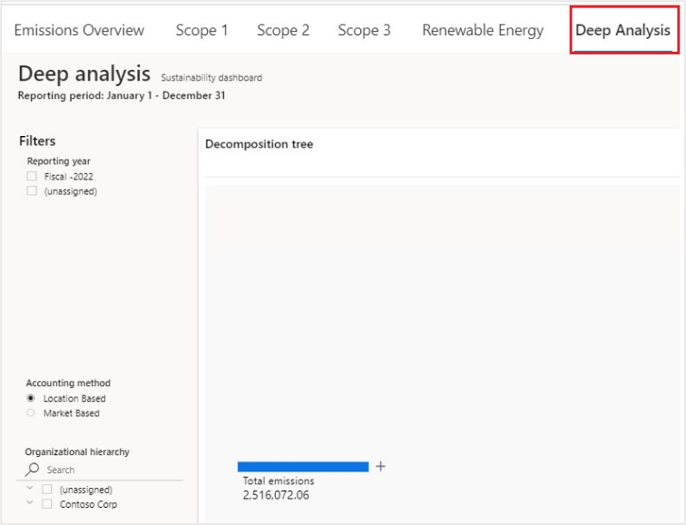](../media/deep-analysis.svg#lightbox)

1. Drill into the decomposition tree to identify where high sources of emissions are. Select the plus (**+**) icon next to **Total emissions** and then select **Scope**.

   > [!div class="mx-imgBorder"]
   > [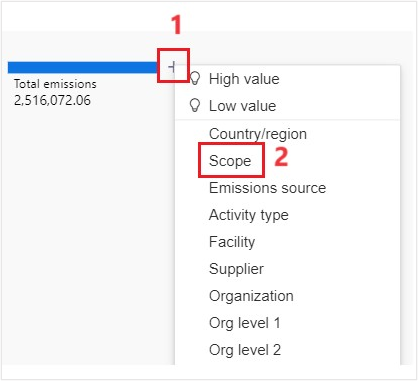](../media/emission-scope.svg#lightbox)

1. Scope 2 shows as having the largest volume of emissions. Select the plus (**+**) icon next to Scope 2 and then select **Emission source** to identify which Scope 2 emission source is the biggest contributor.

   > [!div class="mx-imgBorder"]
   > [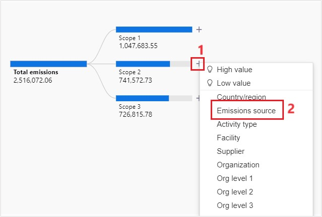](../media/emission-source.svg#lightbox)

1. Purchased electricity shows as the biggest contributor of emissions. Select the plus (**+**) icon next to **Purchased electricity** and then select **Country/region** to identify which regions were contributing to the large amount of purchased electricity emissions.

   > [!div class="mx-imgBorder"]
   > [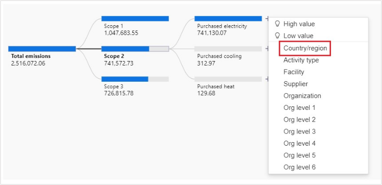](../media/purchased-country.svg#lightbox)

1. The US shows as having contributed the most to the purchased electricity emissions. The **Country/region** selection is driven by the country/region mapping table in the **Settings** area. Select the plus (**+**) icon next to **USA** and then select **Organization** to view which organizations contributed to this factor.

   > [!div class="mx-imgBorder"]
   > [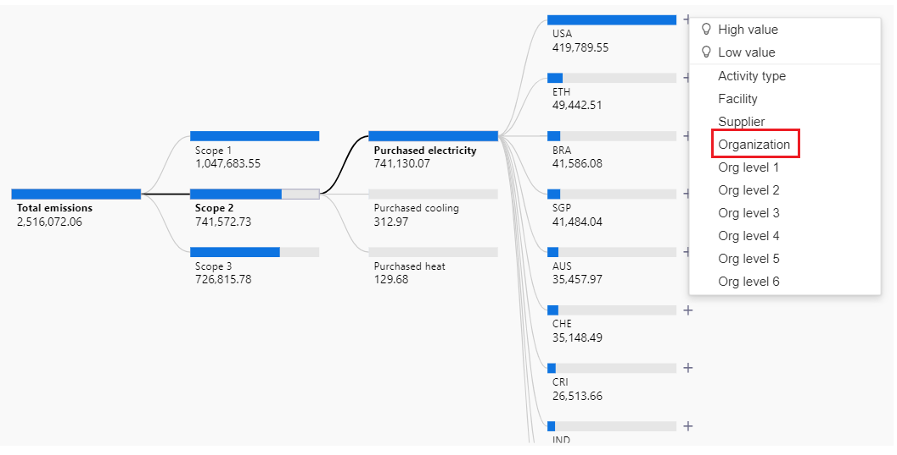](../media/organization.png#lightbox)

1. You can see the organizations with the largest to lowest contributor to Contoso Corp’s carbon emissions.

   > [!div class="mx-imgBorder"]
   > [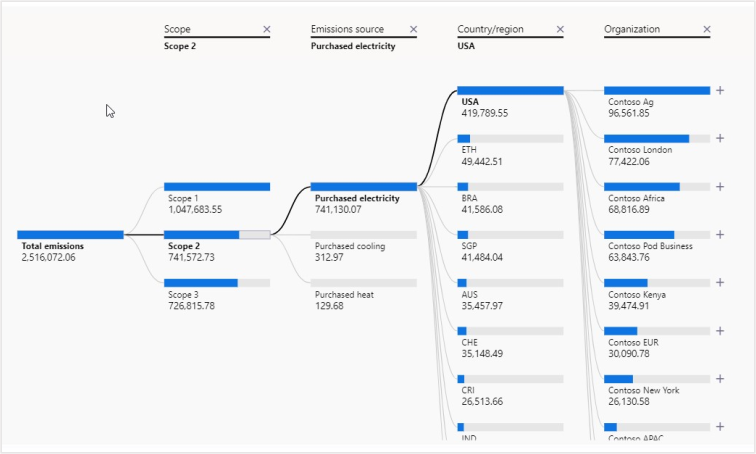](../media/organizations.svg#lightbox)

1. On further filtering, we see the Wide World Importers under Org level 3 was the largest contributor to Contoso Corp’s carbon emissions. Use this information to create a goal for Wide World Importers to reduce their Purchased electricity emissions by 300 mtCO2E (you'll complete this task in the next exercise).

   > [!div class="mx-imgBorder"]
   > [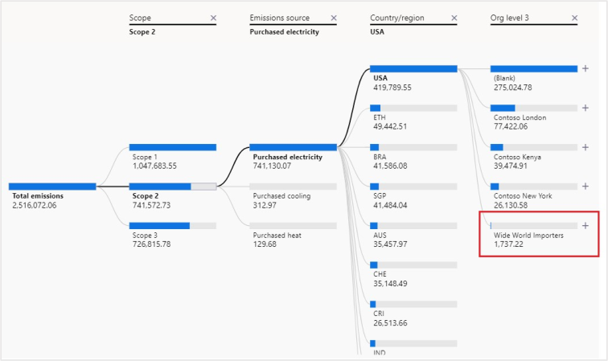](../media/decomposition-tree.svg#lightbox)

1. Select the **Allocations** tab to view the Allocations dashboard. You must create the allocation profile before viewing this dashboard. For more information on creating the allocation profile, see Create an allocation profile and run calculations task. You can view the allocation Headcount and filtered by scope and by Emission source – Purchased electricity as follows:

   > [!div class="mx-imgBorder"]
   > [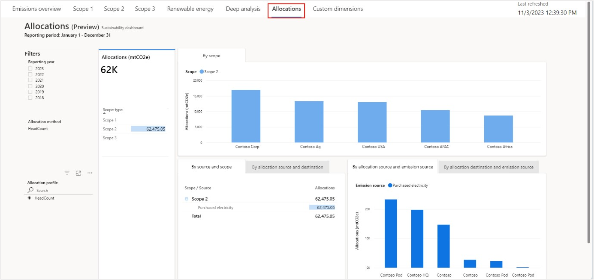](../media/allocations-dashboard.svg#lightbox)

1. Select the **Custom Dimensions** tab to view the emission analytics.

   > [!div class="mx-imgBorder"]
   > [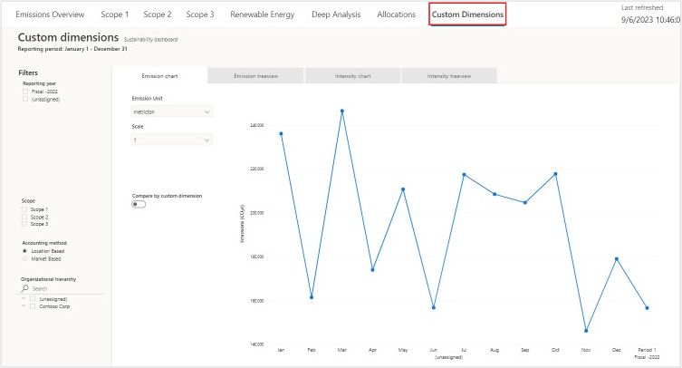](../media/custom-dimensions.svg#lightbox)

   - You can view a time chart of CO2E emissions broken by the custom dimension strings. For example, compare emissions by Device size where Device size is a custom dimension metadata with string value.

     > [!div class="mx-imgBorder"]
     > [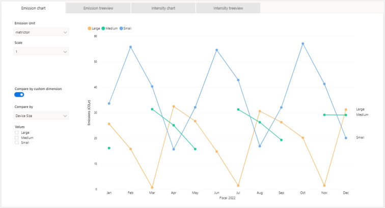](../media/emission-chart.svg#lightbox)

   - Expand the tree view of total CO2E emissions and drill into each custom dimension string present in the data and view CO2E emissions by the value. For example, drill into custom dimensions namely Product, Model or Device size.

     > [!div class="mx-imgBorder"]
     > [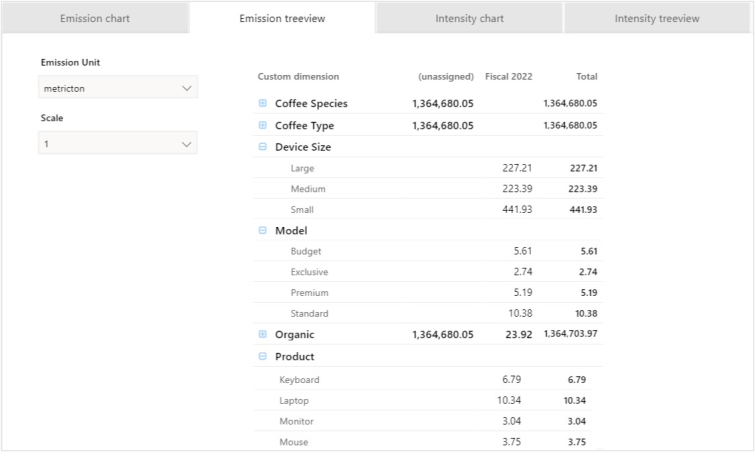](../media/emission-tree-view.svg#lightbox)

   - Expand the tree view of the total CO2E emission intensity, where the product amplifier denominator is a numeric custom dimension. You can drill into each custom dimension string namely Product, Model and Device Size and view the CO2E emission intensity.

     > [!div class="mx-imgBorder"]
     > [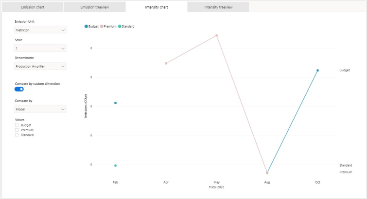](../media/intensity-chart.svg#lightbox)

   - Expand the tree view of total CO2E emission intensity, where the intensity denominator is a numeric custom dimension, you select. You can drill into each string custom dimension in the data and view CO2E emission intensity associated with each unique string value.

     > [!div class="mx-imgBorder"]
     > [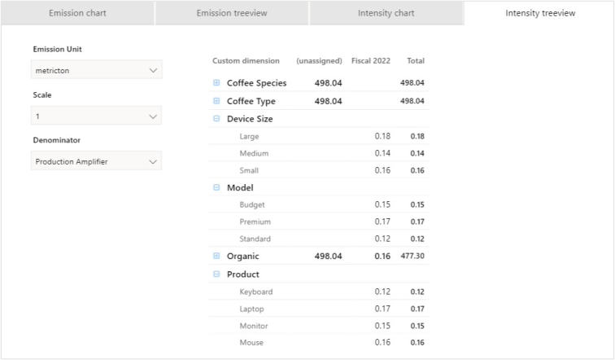](../media/intensity.svg#lightbox)

You've successfully explored various **Sustainability** dashboards. You can use these dashboards to gain insights into your emissions data. Additionally, as you drilled down from total emissions to the organization level, you were able to determine that Wide World Importers needs to reduce the carbon emissions from purchased electricity. This goal could be achieved in various ways, such as switching to renewable energy sources or using more energy-efficient devices and vehicles. You can use these insights to drive business decisions and then use the information to create scorecards and goals to track your progress.
