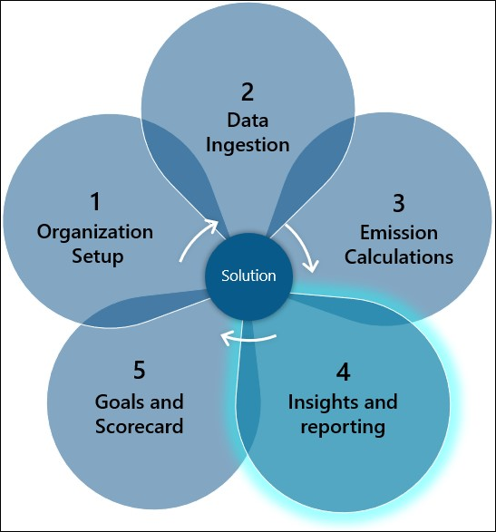
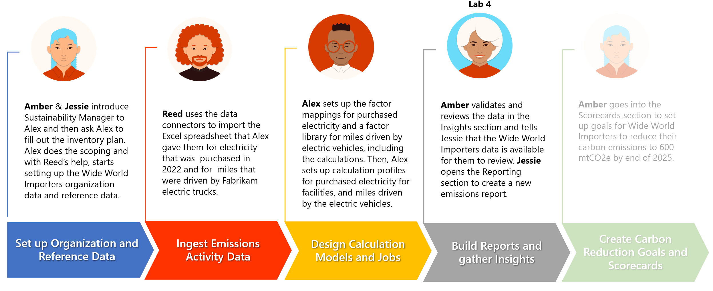

In the previous exercise, you used calculation models to take the ingested activity data through calculation designs. Additionally, you reviewed the output in terms of the CO2E unit. In this exercise, you complete activities to generate emissions reports and activity reports, and review Microsoft Power BI dashboards.

This exercise provides insights into the emission activity trends, and it identifies the opportunities for you to set scorecards and carbon reduction goals in the next exercise.

## Solution focus area

Analytics reports present calculated emissions in an organized way to detect trends and perform further exploration of data. These reports are updated soon after (within approximately 30 minutes) the calculations are run and they allow people to review the outcome of calculations in an aggregated format. Additionally, you can export data in predefined report formats that include groupings for emissions, activity, and other dimensions. You can use these formats to conduct deeper analysis and prepare many different types of reports.

> [!div class="mx-imgBorder"]
> 

## Personas and scenarios

In this exercise, Amber Rodriguez, the sustainability specialist for Contoso Corp, reviews the data in the **Insights** section of Microsoft Sustainability Manager. During the process, Amber notices that Wide World Importers was a large contributor to Scope 2 emissions in 2022. Then, Amber informs Jessie Irwin, the sustainability lead for Contoso Corp, that the activity and emission reports are available for review. Jessie opens the reporting section and creates a new activity report and a new emissions report. Jessie reviews the generated report and includes the report in the sustainability reporting procedures for Contoso Corp.

> [!div class="mx-imgBorder"]
> 

This exercise focuses on the scenarios that are illustrated in the following diagram.

> [!div class="mx-imgBorder"]
> 
