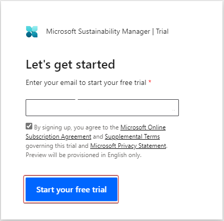
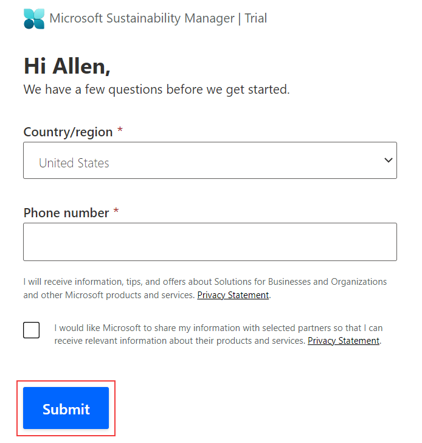
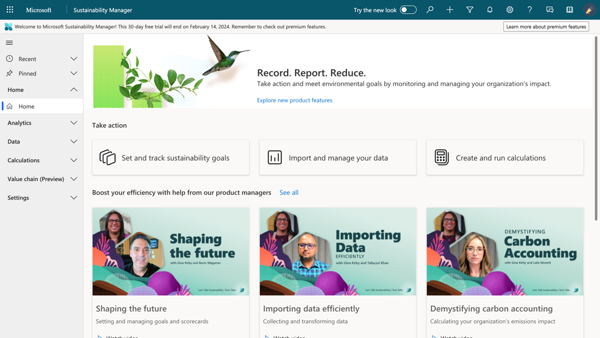

In this exercise, you'll set up a new trial for Microsoft Cloud for Sustainability in your tenant.

## Task: Obtain a Microsoft Cloud for Sustainability trial

In this task, you make a request for a Microsoft Cloud for Sustainability trial environment to be added to your tenant.

1. With your ***existing or newly created*** credentials from the Exercise - Set up the Microsoft 365 trial unit, go to [Free Trial | Microsoft Sustainability Manager](https://dynamics.microsoft.com/sustainability/sustainability/free-trial/?azure-portal=true), enter your ***existing or newly created*** account in the email address box, and then select **Start your free trial**.

    > [!div class="mx-imgBorder"]
    > 

1. Enter your phone number and then select **Submit**.

    > [!div class="mx-imgBorder"]
    > 

   A new trial instance of Microsoft Cloud for Sustainability is created for you.

    > [!div class="mx-imgBorder"]
    > 

By completing these steps, you've created a new trial instance of Microsoft Cloud for Sustainability.
