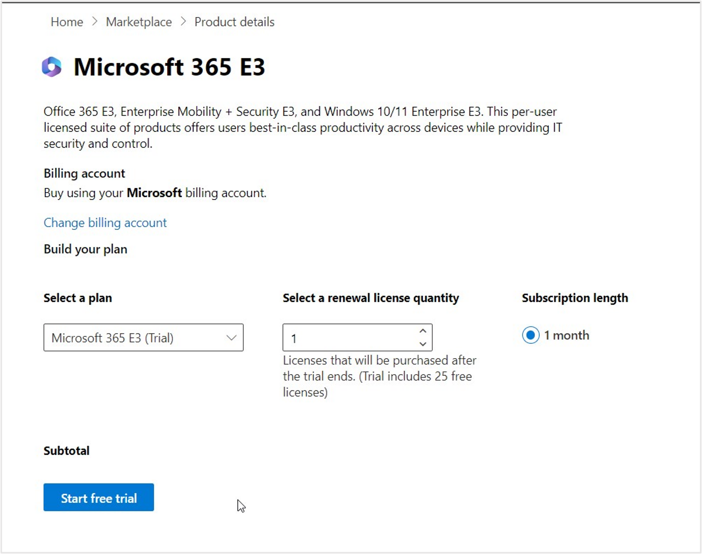

In this exercise, you'll set up a new trial for Microsoft 365 in a new tenant.

## Task: Create a Microsoft 365 tenant

   > [!NOTE]
   > If you have an existing tenant, you can skip this exercise and add the Microsoft Cloud for Sustainability trial as mentioned in
     [Obtain a Microsoft Cloud for Sustainability trial](/training/modules/sustainability-setup-environment/exercise-trial). However, we recommend you create a new tenant with Dynamics 365 trial and Microsoft 365 trial as these would be required for connectors to import data.

In this task, you'll create a trial tenant along with the required Microsoft Dynamics 365 and Microsoft 365 trial licenses.

1. Open an **InPrivate or Incognito** browsing session and then go to [https://trials.dynamics.com](https://trials.dynamics.com/).

   > [!IMPORTANT]
   >You need to open a browser in InPrivate or Incognito mode to create the new tenant so the trial is not added to your or your company’s tenant.
   >
   >**To open an InPrivate window in Microsoft Edge**
   >
   >1. Open the Edge browser.
   >
   >1. On the upper-right corner, select the **Settings & more** (…) ellipsis and select **New InPrivate window**.  
   >**To open an Incognito window in Google Chrome**
   >
   >1. Open the Chrome browser.
   >
   >1. On the upper-right corner, select the vertical ellipsis (…) and select **New Incognito window**.

1. Scroll down and then select **Try for free** in the **Dynamics 365 Customer Service** card.

    > [!div class="mx-imgBorder"]
    > 

1. A pop-up window will appear, asking you to enter your email address to start your free trial. Select **Start your free trial** to finish your free trial sign-up process.

    > [!div class="mx-imgBorder"]
    > 

1. Enter the **Country/region** and **Phone number**. Select **Submit**.

	> [!div class="mx-imgBorder"]
	> 

	> [!div class="mx-imgBorder"]
	> 

1. Select **Launch Trial**. You'll be redirected to Customer Service Workspace Home page.

	> [!div class="mx-imgBorder"]
	> 

	> [!div class="mx-imgBorder"]
	> 

## Task: Obtain a Microsoft 365 E3 trial

In this task, you'll add the necessary Microsoft 365 E3 trial to use OneDrive for data ingestion in Microsoft Cloud for Sustainability.

1. With your newly created credentials from the previous task, go to [Microsoft 365 admin center](https://admin.microsoft.com/?azure-portal=true).

1. Go to **Billing > Billing accounts** and then select the **Billing account** record.

    > [!div class="mx-imgBorder"]
    > 

1. Select **Edit** to edit the billing account details and then provide a valid address and phone number. This step is important for the address validations kickoff. Select **Save**.

    > [!div class="mx-imgBorder"]
    > 

1. Go to **Billing > Purchase services/Marketplace**. Enter **Microsoft 365 E3**, scroll down to **Microsoft 365 E3**, and then select **Details**. Select **Start Free trial**.

    > [!div class="mx-imgBorder"]
    > 

1. Enter your contact details and perform the authentication and enable the license.

1. Select **Continue** to return to the admin center.

By completing these steps, you've created a new trial tenant.
