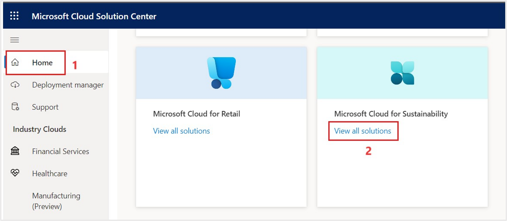
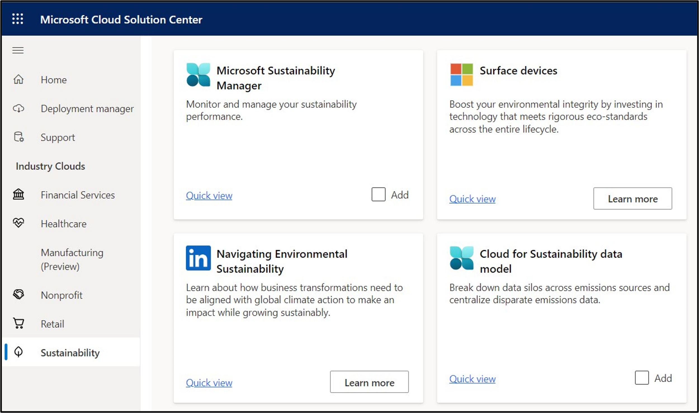
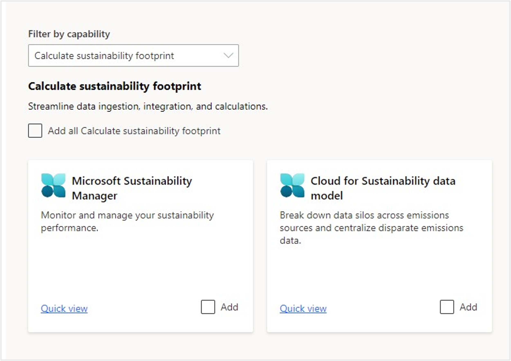
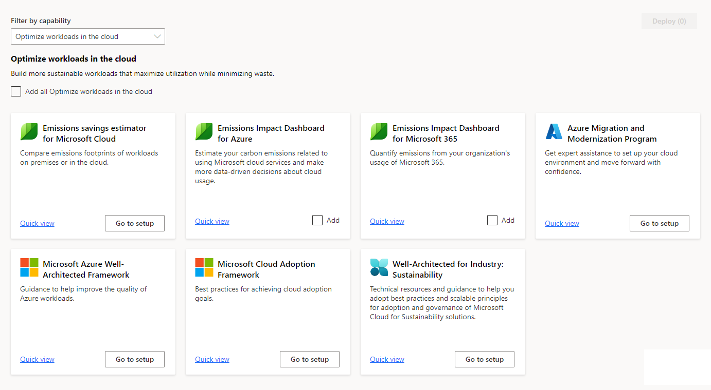
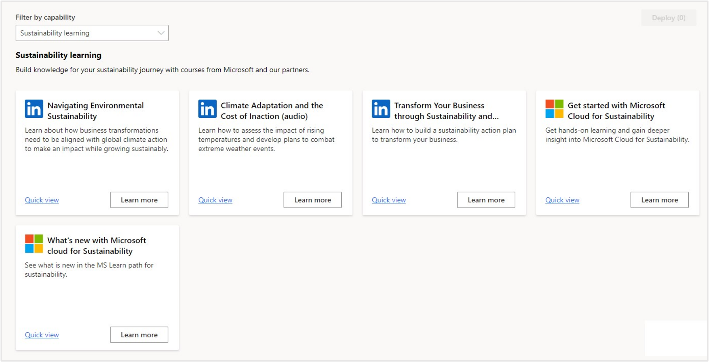

In this module, you'll:

- Discuss Microsoft Solution Center

- Create a trial tenant along with the Microsoft Dynamics 365 and Microsoft 365 trial licenses.

- Add the Microsoft Cloud for Sustainability trial to your tenant.

## Microsoft Solution Center

In a typical implementation of Microsoft Cloud for Sustainability, you'll go to the [Microsoft Cloud Solution Center](https://solutions.microsoft.com/) for installation, and select **View all solutions** under **Microsoft Cloud for Sustainability** on the **Home** page. 

   > [!div class="mx-imgBorder"]
   > 

On the solutions page, you view the capability tiles. Each tile takes you to another page where you can select specific components to install. You can learn about the component using the links to learning and documentation.

   > [!div class="mx-imgBorder"]
   > 

Following are a few examples:

- **Calculate sustainability footprint**: Selection for integration and calculation components of Microsoft Cloud for Sustainability, such as Microsoft Sustainability Manager, Cloud for Sustainability data model, etc.

    > [!div class="mx-imgBorder"]
    > 

- **Optimize workloads in cloud**: Selection of reporting components such as the Emissions Impact Dashboards, Well Architected Framework information, and Cloud Adoption Framework information.

    > [!div class="mx-imgBorder"]
    > 

- **Sustainability learning**: Links to other learning opportunities related to Sustainability concepts and Microsoft Cloud for Sustainability.

    > [!div class="mx-imgBorder"]
    > 
