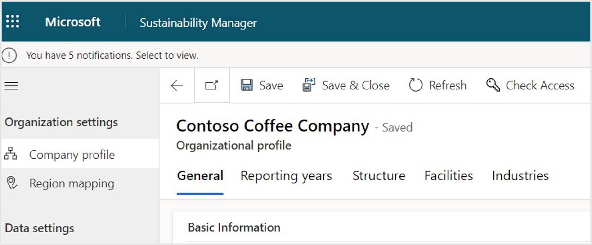
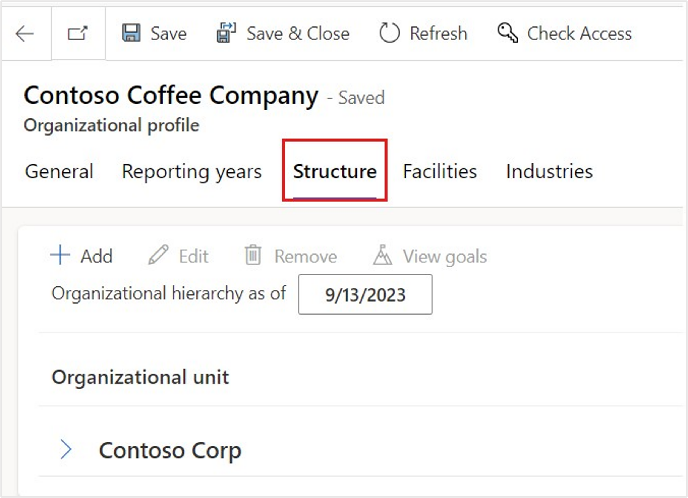
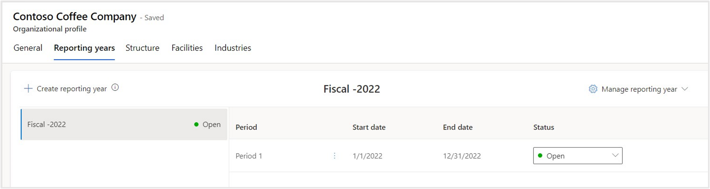
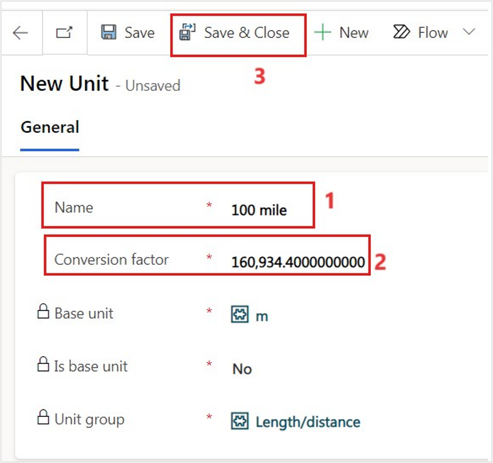

In this exercise, you'll learn the steps that Alex and Reed will take to set up the Wide World Importers company profile, organizational data, reporting years, and reference data. For more information, see [Set up a company profile](/industry/sustainability/setup-company-profile/?azure-portal=true).

1. Use an In-Private or Incognito window and go to [Microsoft Power Apps](https://make.powerapps.com/?azure-portal=true).

1. Select the correct environment from the **Environment** dropdown menu in the upper-right corner.

	> [!div class="mx-imgBorder"]
	> 

1. Open the **Sustainability Manager** application under Apps from the left navigation pane.

	> [!div class="mx-imgBorder"]
	> 

You'll be directed to the **Home** page for Microsoft Sustainability Manager.

> [!div class="mx-imgBorder"]
> 

> [!NOTE]
> You can dismiss the product tour by scrolling down and selecting the **Dismiss tours** button.

> [!div class="mx-imgBorder"]
> 

## Task: Set up the company profile, hierarchy, and facilities

In this task, Alex will set up the company profile, hierarchy, and facilities for Wide World Importers in Microsoft Sustainability Manager.

1.  In the left navigation pane, select **Settings** > **Company profile**.

	> [!div class="mx-imgBorder"]
	> 

    The **Company profile** page includes basic information about the organization, such as name, address, company logo, the annual reporting period, and relevant industries. Additionally, the top of the page includes tabs for setting up the organization structure and facilities.

	> [!div class="mx-imgBorder"]
	> 

1.  On the **Company profile** page, select on the **Industries** tab. Microsoft Sustainability Manager includes a selection of predefined industries and subverticals based on Nomenclature of Economic Activities (NACE) standards. For more information, see [NACE Code](https://nacev2.com/en/?azure-portal=true). Select **+ Add**.

	> [!div class="mx-imgBorder"]
	> 

	> [!div class="mx-imgBorder"]
	> 

1.  Select **Transportation and storage**.

	> [!div class="mx-imgBorder"]
	> 

1.  On the next screen, select **Land transport and transport via pipelines** and then select **Add**.

	> [!div class="mx-imgBorder"]
	> 

1.  View **Land transport and transport via pipelines** in the **Industries** tab of the **Company profile** page.

	> [!div class="mx-imgBorder"]
	> 

1.  On the **Company profile** page, select the **Structure** tab.

	> [!div class="mx-imgBorder"]
	> 

1.  Select **Contoso USA** and then select **+ Add** to add a new organizational unit under it.

	> [!div class="mx-imgBorder"]
	> 

1. Enter the following data for the organizational unit and then select **Save**.

	-   **Name** - Wide World Importers
	
	-   **Organizational unit type** - Department

	> [!div class="mx-imgBorder"]
	> 

1. In the **Organizational hierarchies** section, select **+ New Organizational hierarchy**.

	> [!div class="mx-imgBorder"]
	> 

1. Set the following values and then select **Save & Close**.

	-   **Parent** - Contoso USA
	
	-   **Effective start date** - The first day of the current month, for example 8/1/2022

	> [!div class="mx-imgBorder"]
	> 

1. After you're returned to the Organizational unit, select **Save & Close** to return to the **Company profile**.

	> [!div class="mx-imgBorder"]
	> 

1. Go to **Company profile > Facilities** tab and then select **Add facility**.

	> [!div class="mx-imgBorder"]
	> 

1. Create a new facility with the following details. After you've entered the values, select **Save & Close**.

	> [!NOTE]
	> Pay close attention to the data that's used in this exercise. The subsequent exercises will reference this data, and it will need to be an exact match to the data in this exercise.

    -   **Name** - Wide World Importers - Miami Office

    -   **Address line 1** - Brickell Avenue

    -   **City** - Miami

    -   **State/Province** - Florida

    -   **Zip/Postal Code** - 33132

    -   **Country/Region** - United States of America

    -   **Latitude** - 25.774320

    -   **Longitude** - -80.187720

	> [!NOTE]
	> **Latitude** and **Longitude** aren't required but are used to display a pin on the Facilities map. You can add those values automatically by selecting an address from the autocomplete options in **Address line 1**, or you can enter the values manually.

	> [!div class="mx-imgBorder"]
	> 

1. Using the same steps, add another new facility. After you've entered the values, select **Save & Close**.

	> [!NOTE]
	> Pay close attention to the data that's used in this exercise. The subsequent exercises will reference this data, and it will need to be an exact match to the data in this exercise.

    - **Name** - Wide World Importers - Tampa Office

    - **Address line 1** - Lois Avenue

    - **City** - Tampa

    - **State/Province** - Florida

    - **Zip/Postal Code** - 33609

    - **Country/Region** - United states of America

    - **Latitude** - 27.944830

    - **Longitude** - -82.514050

	> [!NOTE]
	> **Latitude** and **Longitude** aren't required but are used to display a pin on the Facilities map. You can add the values automatically by selecting an address from the autocomplete options in **Address line 1**, or you can enter the values manually.

	> [!div class="mx-imgBorder"]
	> 

Now, you've completed the organizational setup.

Organizational structure and facility management are linked to activity and emission data to group emissions by organization, facility, and regions. This setup is an important part of carbon emission reporting and organization disclosures.

## Task: Set up reference data

In this task, Reed will set up the reference data for contractual instrument types in Microsoft Sustainability Manager. Contractual instrument types are different types of contractual agreements that a firm has with their providers and suppliers.

1.  In the left navigation pane, select **Data** > **Reference data**.

1.  Select **Contractual instrument types** and then select **View**.

	> [!div class="mx-imgBorder"]
	> 

1.  Under **Active contractual instrument types**, select **+ New** to create new contractual types.

	> [!div class="mx-imgBorder"]
	> 

1.  Create a new contractual instrument with the following details and then select **Save & Close**.

	- **Name** - VanArsdel Ltd

	- **Energy source** - Nuclear

	> [!NOTE]
	> Pay close attention to the data that's used in this exercise. The subsequent exercises will reference this data, and it will need to be an exact match to the data in this exercise.

	> [!div class="mx-imgBorder"]
	> 

1.  In the same way, create a new contractual instrument with the following details and then select **Save & Close**.

	- **Name** - Adatum Corp

	- **Energy source** - Other

	> [!NOTE]
	> Pay close attention to the data that's used in this exercise. The subsequent exercises will reference this data, and it will need to be an exact match to the data in this exercise.

	> [!div class="mx-imgBorder"]
	> 

By completing these steps, you've added contractual instrument types.

Many types of reference data are available. You can explore the other reference data types, which will be used throughout Microsoft Cloud for Sustainability and Microsoft Sustainability Manager.

## Task: Set up unit conversion factor

In this task, Reed will set up a unit conversion factor in Microsoft Sustainability Manager. While Alex is reviewing the inventory management plan, Alex identifies a missing unit of distance that's needed to calculate emissions for the fleet of electric vehicles. Alex asks Reed to add a new unit to the **Length/Distance** unit group.

You can use unit groups to group units together and define a base unit that you can use to convert unit types. For example, the **Length/Distance** unit group contains units for length and distance, with a base unit of meter (m). The units within the **Length/Distance** unit group have conversions between the unit type and meter, such as miles convert to 1,609.344 meters. For more information, see [Set up unit groups](/industry/sustainability/setup-unit-groups/?azure-portal=true).

1. Select **Settings** > **Application**.  

1. Select **Unit groups**. 

1.  Under **Active unit groups**, select **Length/distance** and then open it.

	> [!div class="mx-imgBorder"]
	> 

1.  Scroll down and select **+ New Unit** to create a new unit.

	> [!div class="mx-imgBorder"]
	> 

1.  Enter the following details for the new unit and then select **Save & Close**.

	- **Name** - 100 mile

	- **Conversion factor** - 160934.40

	> [!NOTE]
	> The EPA calculates electric vehicle efficiency by the number of kilowatt hours (kWh) that are used every 100 miles. For consistency, it's best practice to use the same calculation.

	> [!div class="mx-imgBorder"]
	> 

By completing these steps, you've finished the organizational and reference data setup.

Organization and reference data is the foundation for Microsoft Cloud for Sustainability and Microsoft Sustainability Manager. This data is used throughout the tools, so make sure that your organization and reference data is set up correctly.

## Task: Create a reporting year

Alex and Reed will set up the reporting years in Microsoft Sustainability Manager. Alex will name the reporting year, set up the start date and use a template to create more than one period.

> [!NOTE]
> The Reporting years you set up will override the configuration in [General settings](/industry/sustainability/setup-company-profile?azure-portal=true#configure-general-settings).

Alex proceeds to create a reporting year in Sustainability Manager. For detailed information, see [Configure reporting years](/industry/sustainability/setup-reporting-years/?azure-portal=true).

1.  In the left navigation pane, select the **Settings** > **Company profile**.

1.  Select the **Reporting years** tab.

	> [!div class="mx-imgBorder"]
	> 

1.  Select **Create reporting year**.

	> [!div class="mx-imgBorder"]
	> 

1.  Enter the following details. After you've entered the values, select **Save**.

    1.  **Name** - Enter **Fiscal - 2022**.

		This name appears on the **Insights** page in Microsoft Sustainability Manager.

	1.  **Start date:** 01/01/2022.

	1.  **Year template** - Annual.

	> [!div class="mx-imgBorder"]
	> 

1. Select **Close**. The reporting year will generate with the first period starting on the **Start date** and the last period ending one year from the **Start date**.

	> [!div class="mx-imgBorder"]
	> 
