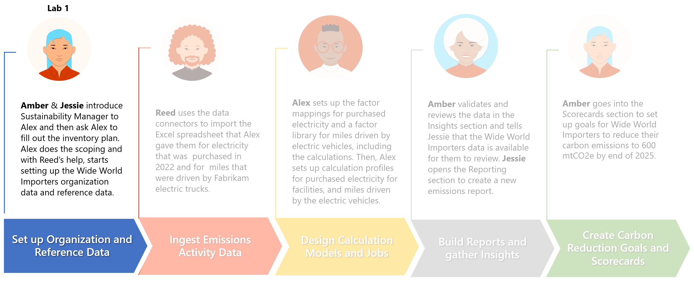

In this exercise for Microsoft Cloud for Sustainability, you use demo data to set up the "Set up organization and reference data" scenario. Contoso Corp is a specialty coffee distribution business with operations in APAC, US, Africa, and Europe.

Contoso Corp is experiencing supply chain challenges when transporting its finished goods across the United States. Additionally, it wants to augment its transportation and logistics capacities. To overcome this challenge, Contoso Corp acquires a transportation business called Wide World Importers, which is based in Florida, US. Wide World Importers has two office facilities with 100 employees that coordinate a fleet of 40 electric trucks that will be used for transportation of finished goods across the US.

The newly created data in this exercise forms the foundation for the rest of the scenarios (data ingestion, calculations, and reporting) in the subsequent exercises.

## Prerequisite

The prerequisite for completing this exercise is to have a Microsoft Sustainability manager environment set up with [sample data](https://github.com/MicrosoftDocs/mslearn-developer-tools-power-platform/blob/master/sustainability-cloud/Getting%20Started%20with%20Cloud%20for%20Sustainability%20Sample%20Data.zip).

## Solution focus area

Organization setup focuses on the foundational steps that are required to set up the Microsoft Sustainability Manager application. These foundational steps include creating the company profile, setting up organizational structure and hierarchy, configuring reporting years, and setting up corresponding facilities. After you've set up the organization, you'll set up the reference data, which includes important information such as fuel types, vehicle types, contractual instrument types, and units. Some reference data is unique to an organization, while some will come from standard or industry sources.

## Personas and scenarios

This exercise features the following personas:

- **Jessie Irwin** - Sustainability lead for Contoso Corp

- **Amber Rodriguez** - Sustainability specialist for Contoso Corp

- **Alex Serra** - Emissions analyst from Wide World Importers

- **Reed Flores** – IT admin from Wide World Importers

These personas will participate in the following sequential scenarios:

- Amber will educate Alex on the tools and processes that are used for Contoso's sustainability reporting.

- Jessie will guide Alex on building an inventory management plan by listing the operating boundaries, facilities, and emission sources.

- Jessie and Amber will demonstrate Microsoft Sustainability Manager and will share the inventory plan template with Alex and Reed.

- After completing the inventory plan template, Alex and Reed will set up the company profile, organization data, reporting years, and reference data based on the data that Amber provided in the inventory plan.

> [!div class="mx-imgBorder"]
> 

In this exercise, you'll focus on the scenarios that are illustrated in the following diagram.

> [!div class="mx-imgBorder"]
> 
