In this exercise, you'll learn about the steps that Reed takes to ingest the spreadsheets that Alex provided. Data import is a vital task for bringing large volumes of data into Microsoft Sustainability Manager. This exercise uses Excel; however, many prebuilt connectors are available, and partners can build custom connectors to integrate with more data sources. 

> [!IMPORTANT]
> To download the sample Excel files that you'll ingest into Microsoft Sustainability Manager, go to sample data. In the GitHub page that appears, select the **Download** button. Extract the two Excel files to a folder on your local computer for use in this exercise.

1.  Open a browser in an InPrivate or Incognito window and then go to [Microsoft Power Apps](https://make.powerapps.com/?azure-portal=true).

1.  Select the environment from the **Environment** dropdown menu in the upper-right corner.

1.  In the Power Apps portal, under **Apps** on the left navigation pane, open the **Sustainability Manager** application by selecting the play button.  

	You're directed to the **Home** page for Microsoft Sustainability Manager.

    Area navigation is a common first step in each exercise. The area navigation menu is in the lower-left corner of your screen.

	> [!div class="mx-imgBorder"]
	> [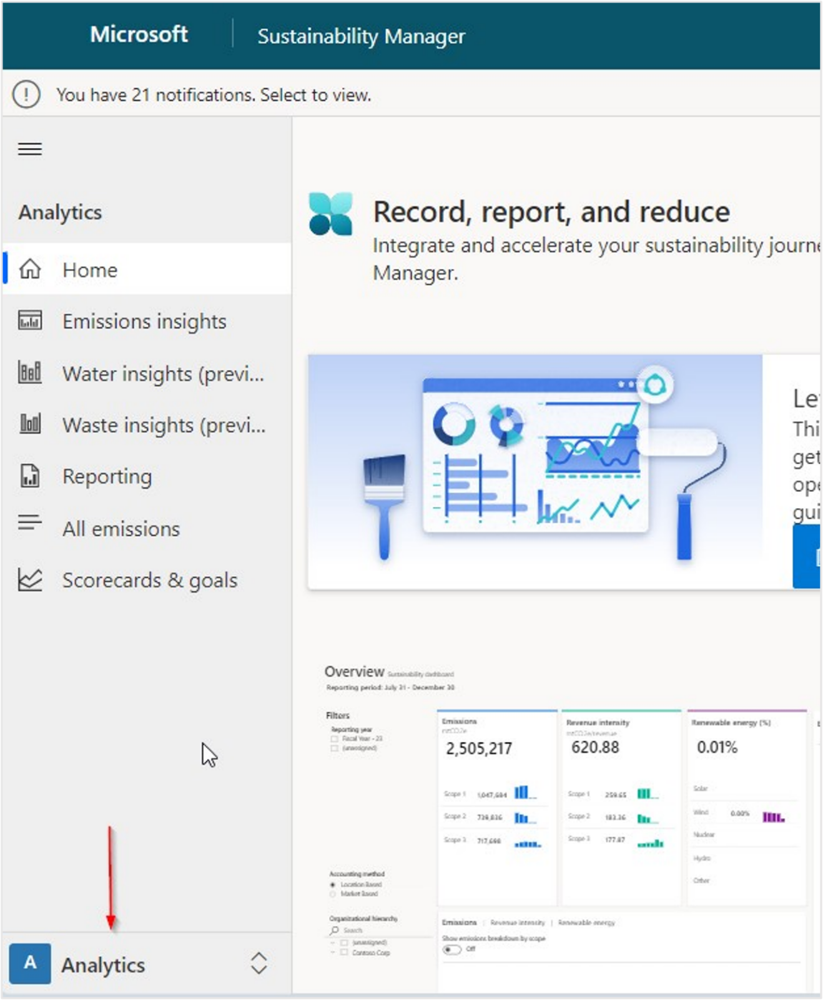](../media/navigation.png#lightbox)

## Import waste quantity data

Follow these steps to import waste quality data:

1.  In the change area, select **Data**.

1.  Select **Data imports** from the left navigation pane.

1.  Select **New**.

1.  Select **Power Query Guided Experience**.  

1.  Select **Sources > Waste**. Select **Add** next to **Waste quantities**.

	> [!div class="mx-imgBorder"]
	> [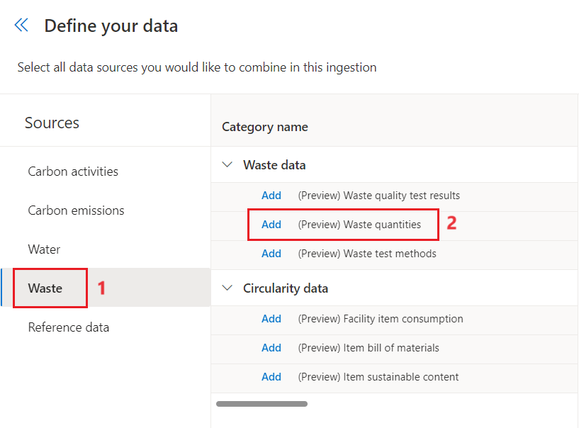](../media/waste.png#lightbox)

1.  Select **Next** after you add the data.

1.  Select **Excel workbook**.

	> [!div class="mx-imgBorder"]
	> [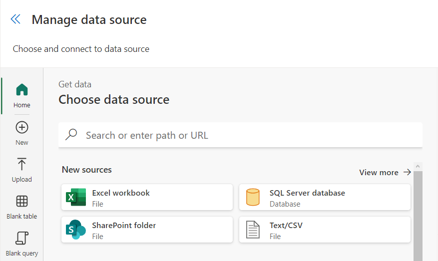](../media/data-source.png#lightbox)

1.  Select **Upload file**. Browse to the **Waste Quantity Data Wide World Importers 2022.xls** file that's saved on your system. Select **Open**.

1.  Select **Sign in** to sign in your admin credentials.

1. After you upload the file and the connection is complete, select **Next**.

1. Select the **Waste Quantity** sheet and then select **Transform data**.

	> [!div class="mx-imgBorder"]
	> [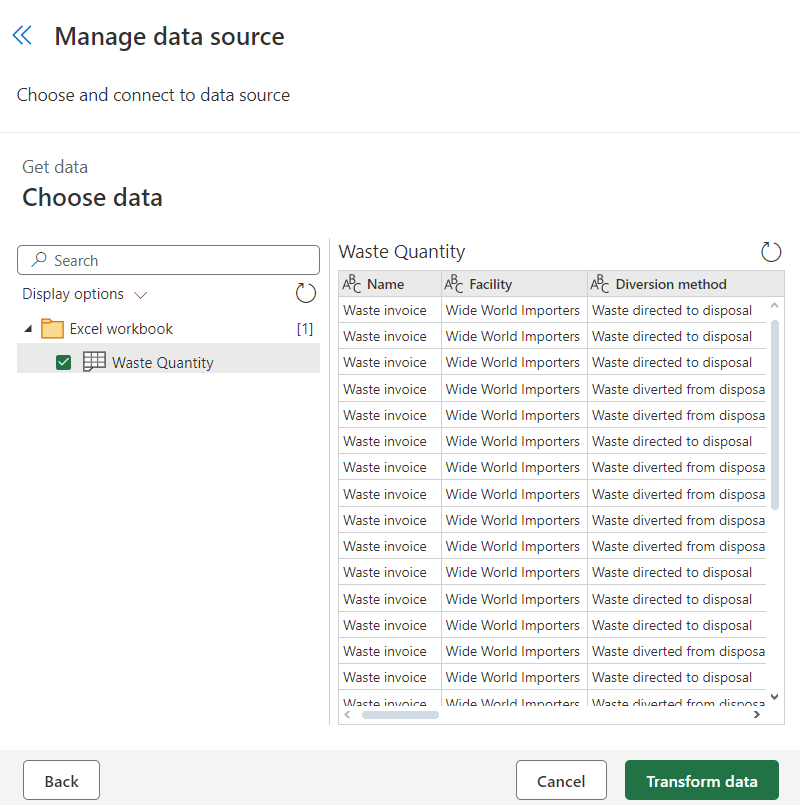](../media/waste-quantity.png#lightbox) 

1.  You can complete various data and column transformations on the **Transform data** page of the Power Query wizard. As a result, you can adjust data types, update column mappings, and perform advanced transformations that you're familiar with in Microsoft Power Platform dataflows or Microsoft Power BI datasets. In this exercise, don't apply any transformations; instead, select **Create**.

	> [!div class="mx-imgBorder"]
	> [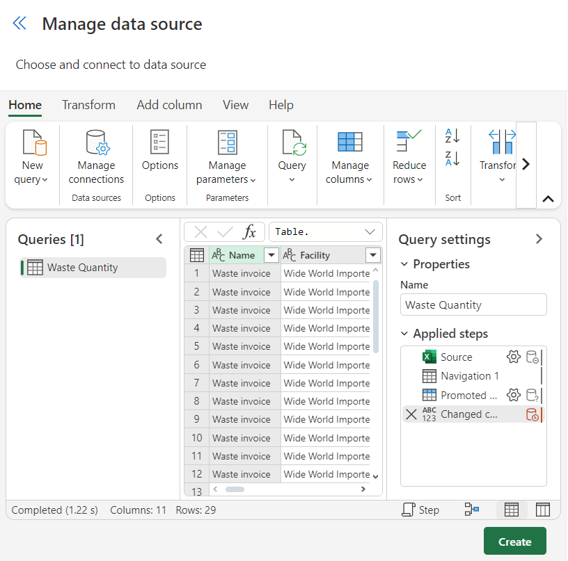](../media/transform-data.png#lightbox)

1. The **New data connection** wizard is on the **Schedule data import** page, where you can complete the following actions: 

	1.  Turn on the **Import data automatically** toggle to allow the option to set a schedule for the data to be imported automatically. Selecting this option is beneficial if you use the connector in a scenario where the data changes frequently, such as a web API or FTP server.
	
	1.  Turn on the **Replace previously imported data** toggle to remove all previously imported data and bring in the full dataset that was retrieved. Selecting this option is beneficial if the data source isn't providing data from only the last import or if it always includes a full set of data. For this scenario of importing historical data, leave both options turned off.

1. Select **Next** when you're finished.

	> [!div class="mx-imgBorder"]
	> [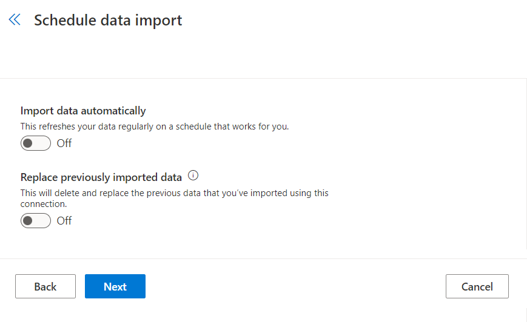](../media/import.png#lightbox)

1. On the **Review and name** page, complete the following tasks:

	1.  Enter a name for the new connection, such as **Waste Sample Data**.
	
	1.  Select **Connect**.

	> [!div class="mx-imgBorder"]
	> [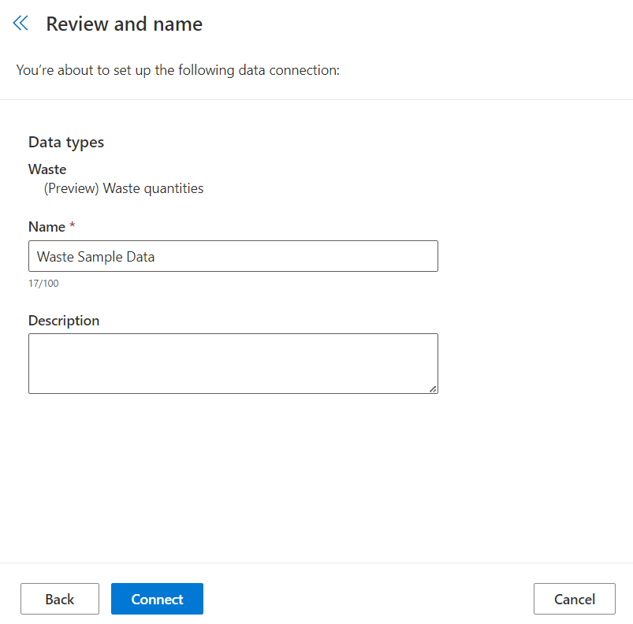](../media/review-name.png#lightbox)

1. Map your source data to the data model. Data doesn't appear until this step is complete. Select **Map fields**.

	> [!div class="mx-imgBorder"]
	> [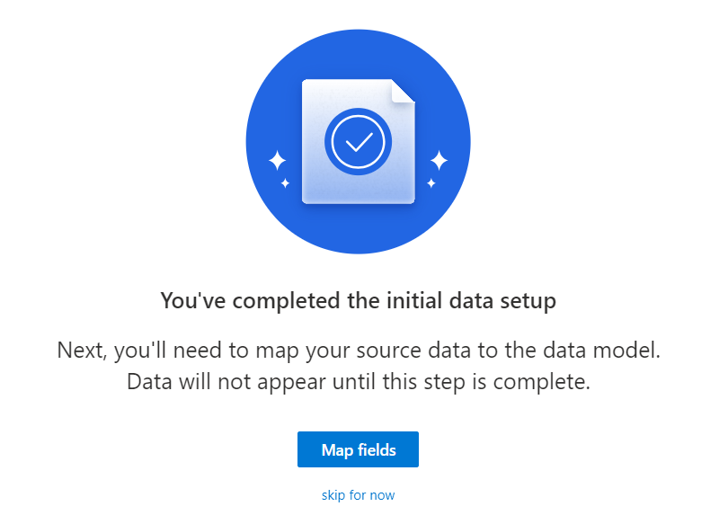](../media/map-fields.png#lightbox)

1. Select **Waste quantities** under **Data source**. Select **Auto map**.

	> [!div class="mx-imgBorder"]
	> [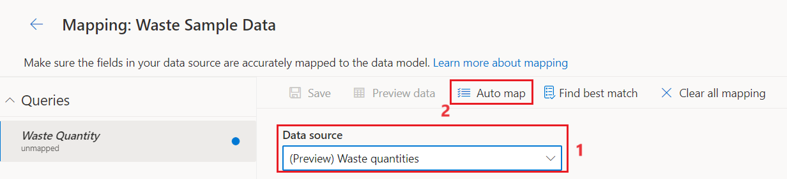](../media/auto-map.png#lightbox) 

1. Double-check if the **Destination fields** and **Source fields** are mapped correctly. Now that you reviewed your field mappings, set the **Ready to import** toggle to **yes**. Select the **back arrow** and then select **Done**.

	> [!div class="mx-imgBorder"]
	> [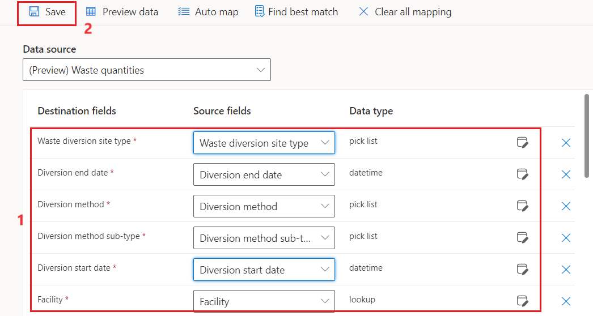](../media/destination-source.png#lightbox)

	> [!div class="mx-imgBorder"]
	> 

1. On the **Data imports**  page, view the import that you created.

   The **Data Import** job runs. The status displays **Scheduled** and then, in a moment, switches to **Processing**. You might need to refresh your page to view the change.

1. After a minute or two, select **Refresh** above the list to view the updated status, which should be **Complete**.

	> [!div class="mx-imgBorder"]
	> [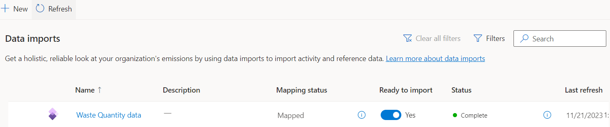](../media/status.png#lightbox)

1. Select **Waste data** from the left navigation pane.

	> [!div class="mx-imgBorder"]
	> [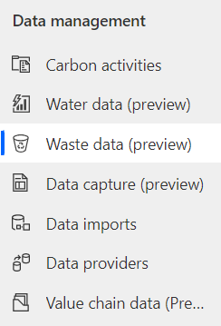](../media/waste-data-preview.png#lightbox)

1. Select **Waste quantities** under **Waste data**.

	> [!div class="mx-imgBorder"]
	> [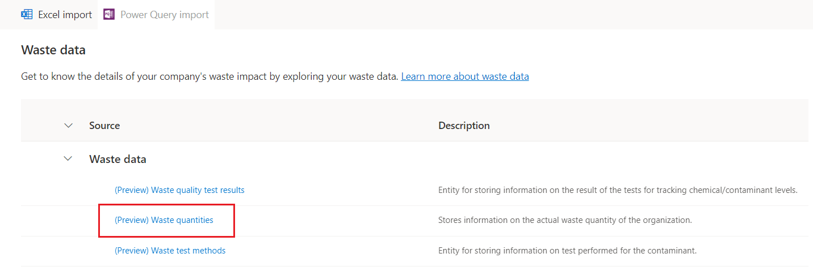](../media/waste-quantities.png#lightbox)

1. Under **Organizational**, filter by **Wide World Importers**.

	> [!div class="mx-imgBorder"]
	> [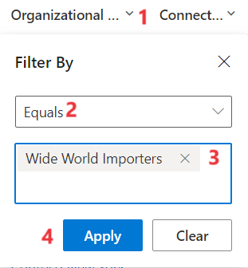](../media/organization-filter.png#lightbox)

1. After a few moments, the view refreshes and the activity data records that were imported during this exercise display.

	> [!div class="mx-imgBorder"]
	> [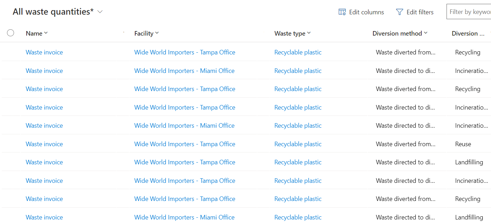](../media/data-records.png#lightbox)
